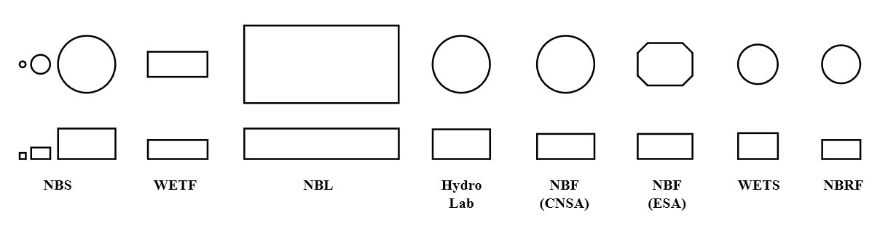
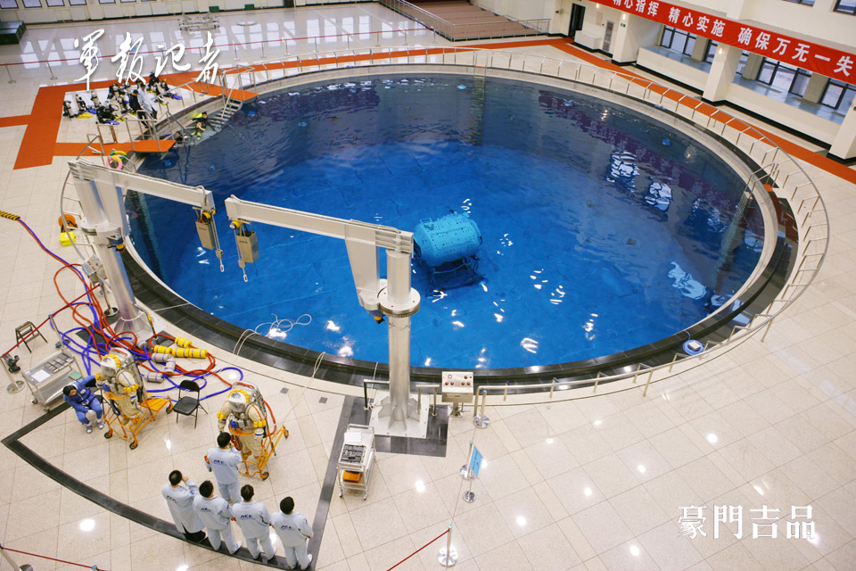

    W emocji tej zawarta jest chyba, a może przede wszystkim, świadomość ogromnej odpowiedzialności, jaka spoczywa na mnie przed moimi rodakami, a także to, że lot ten wykonujemy dla dobra całej ludzkości. Robimy to w imię rozwoju nauki i postępu. Lot nasz to nie tylko wielka przygoda, ale trudna złożona praca w nowym, nierozpoznanym jeszcze środowisku pełnym niewiadomych i niebezpieczeństw. To także okazja uczestniczenia w czymś nowatorskim i niezwykłym, to możliwość uczestniczenia w realizacji eksperymentów naukowych, nad przygotowaniem których trudziły się znane w świecie autorytety. Nie mogę zawieść oczekiwań uczonych i moich rodaków zawieść nie mogę.

    -- gen. Mirosław Hermaszewski, Ciężar Nieważkości :cite:`Hermaszewski2013`

*****
Wstęp
*****

Eksploracja leży w naturze człowieka. Podbój nowych lądów na Ziemi pozwolił na znaczne przyspieszenie rozwoju cywilizacji i technologii. Dzięki postępom w nauce, inżynierii i medycynie wydłużyła się średnia długość życia oraz zwiększyła się jego jakość. Załogowe loty kosmiczne to nieunikniona przyszłość ludzkości. Obecnie prowadzone są badania weryfikujące studium wykonalności, a także trwają prace nad opracowywaniem technologii dla misji człowieka na Księżyc i Marsa planowanych odpowiednio na 2028 i 2035 rok.

Długotrwałe kosmiczne loty załogowe wymagają rozwiązania wielu problemów inżynieryjnych oraz stworzenia technologii, których aplikacja znajduje się również w innych dziedzinach. Przez inwestycję w sektor kosmiczny państwo rozwija gospodarkę i stymuluje rozwój naukowy. Bezpośrednim przykładem wykorzystania technologii opracowanych w ramach rozwoju programów kosmicznych jest m.in. nawigacja satelitarna, telekomunikacja, telemedycyna i robotyka. Urządzenia i aparaty matematyczne tj. filtr Kalmana stworzony na potrzeby programu Apollo znajdują zastosowanie w każdym aspekcie życia i są szeroko używane a ich wpływ jest niewymierny. Na każde €1 zainwestowane w segment kosmiczny szacowany jest zwrot na poziomie €6 w postaci dochodów bezpośrednich, pośrednich i indukowanych :cite:`ESASpaceSolidInvestment2012`.

Poza kwestiami ekonomicznymi programy kosmiczne pozwalają również na wykształcenie kadry, stworzenie infrastruktury oraz zagospodarowanie przyszłych inżynierów i naukowców edukowanych na uczelniach w kraju. Polska ze względu na brak programu astronautycznego nie posiada obecnie kompetencji w tym temacie. Od czasu przystąpienia do Europejskiej Agencji Kosmicznej 19 listopada 2012 roku kraj jest stale niedoreprezentowany w kwestii zatrudnienia kadry. Wg. danych działu kadr ESA w roku 2018 było 12 pracowników pochodzenia polskiego.

Sektor prywatny przyspiesza eksplorację kosmosu. Można to zaobserwować na przykładzie rynku amerykańskiego gdzie firmy tzw. "new space" m.in. SpaceX, Blue Origin, Virgin Galactic oraz "old space", tj.: United Launch Alliance, Orbital ATK, Boeing, Lockheed Martin bardzo intensywnie inwestują w rozwój technologii kosmicznych oraz w załogowe loty. Ten trend można obserwować również w Polsce gdzie od czasu przystąpienia Polski do ESA stale powstają i rozwijają się nowe organizacje prywatne. Na koniec roku 2018 mamy już 300 podmiotów gospodarczych w ramach tej branży.

Dzięki komercjalizacji dostępu do przestrzeni kosmicznej i powierzeniu transportu towarów oraz osób na niską orbitę ziemską (ang. *LEO - Low Earth Orbit*) agencje kosmiczne będą w stanie zainwestować czas i pieniądze w eksplorację głębokiej przestrzeni kosmicznej (ang. *deep space*) oraz badania planetarne i R&D (badania i rozwój) materiałów, konstrukcji i technologii, które dla sektora prywatnego nie są źródłem dochodów.

Cel pracy
=========

Celem niniejszej pracy jest przedstawienie propozycji koncepcji Polskiego Programu Astronautycznego, który powstał na podstawie analizy procesu selekcji, przygotowania do misji oraz treningu EVA w wybranych agencjach kosmicznych jak również analizy opinii i zapotrzebowania społeczeństwa Polskiego zbadanej w przeprowadzonej ankiecie.

Praca ma również na celu zaproponowanie rozwiązań tj. wskazanie miejsc udziału Polski w procesie szkolenia obecnych i przyszłych astronautów ESA jak również zaproponowanie programu szkolenia Polskiego astronauty.

W ramach pracy został przedstawiony proces, który jest wdrożony w agencjach NASA, ESA, CSA, Roskosmos, JAXA i CNSA wraz z analizą infrastruktury szkoleniowej. Przedstawiono propozycję programu, oszacowano budżet oraz zakres zasobów koniecznych do realizacji przedsięwzięcia. Zestawiono również obecną w Polsce infrastrukturę mogącą posłużyć w tym celu.

Metoda, techniki badawcze oraz procedura badań
==============================================
Praca jest próbą analizy jakościowej procesów szkolenia astronautów w wybranych agencjach kosmicznych, tj. NASA, ESA, CSA, JAXA, Roskosmos i CNSA wraz z przeglądem infrastruktury szkoleniowej. Praca ma na celu zaproponowanie rozwiązań tj. wskazanie miejsc udziału Polski w procesie szkolenia obecnych i przyszłych astronautów ESA jak również zaproponowanie programu szkolenia Polskiego astronauty.

W trakcie opracowywania materiałów niniejszej publikacji autor, korzystając z faktu, iż był etatowym pracownikiem Europejskiej Agencji Kosmicznej miał możliwość dokładnej analizy procesów oraz przeprowadzenia rozmów z astronautami, dyrektorem ds. lotów załogowych i eksploracji robotycznej (ang. *HRE - Human Spaceflight and Robotic Exploration*), kontrolerami lotów jak również z trenerami astronautów.

Procesowi analizy poddany jest każdy etap selekcji, szkolenia do długotrwałych lotów kosmicznych oraz EVA jak również infrastruktura naziemna i kosmiczna. Na podstawie porównania z literaturą naukową, rozmów z ww. osobami oraz próbie odtworzenia procesu szkolenia astronautów w ramach zalążka programów załogowych w Polsce wybrano kluczowe elementy w procesie. Ponadto korzystając z empirycznego poznania procesu od środka w ramach dwóch symulacji Księżycowych i jednej Marsjańskiej i uczestniczeniu w części szkolenia astronautycznego autor może przekazać subiektywne odczucia w doborze parametrów jakościowych.

W ramach badań poddano analizie wiodące agencje kosmiczne wraz z ich obecnym oraz historycznym programem selekcji i szkolenia. Przeanalizowano również profile wszystkich 556 osób, które przekroczyły umowną granicę kosmosu tzw. linię Kármána. Wzięto pod uwagę dane z lotów krótkich, długotrwałych oraz księżycowych jak również dane z EVA. Ponadto zestawiono informacje dotyczące infrastruktury naziemnej oraz lotniczej.

Zebrano i przeanalizowano również opinię dotyczącą załogowych lotów kosmicznych. Na podstawie udzielonych odpowiedzi określono zapotrzebowanie zarówno osób zajmujących się profesjonalnie branżą kosmiczną jak również niezwiązanych zawodowo z tym tematem.

Definicje
=========
Agencje kosmiczne nazywają osoby wysyłane w kosmos w odmienny sposób. W większości przypadków jest to tłumaczenie lub analogia do frazy "osoba nawigująca w kosmosie" lub "osoba nawigująca w między gwiazdami". :numref:`table-spaceman-names` prezentuje konwencje przyjęte przez poszczególne agencje. W celu uproszczenia w poniższej pracy przyjmuje stosowanie nazewnictwa w języku polskim dla wszystkich nazw profesji. Ponadto słowo astronauta będzie wykorzystane jako zamiennik pozostałych.

.. csv-table:: Konwencje nazewnicze stanowiska osoby lecącej w kosmos w wybranych agencjach kosmicznych
    :name: table-spaceman-names
    :file: ../data/spaceman-names.csv
    :header-rows: 1

Problematyczna jest kwestia nazwy "kosmicznych nawigatorów" przyjętej przez Chińską Agencję Kosmiczną. W języku angielskim popularnie wykorzystywana stała się nazwa "taikonaut", która jest zbitką słów oznaczających w języku chińskim przestrzeń kosmiczną z dodanym sufixem *naut* (gr. żeglarz). Nazwa ta stanowi analogię do nazewnictwa kosmonautów, astronautów itp. Podobnie przyjęło się używać terminu "vyomanaut" w stosunku do Indyjskiego personelu. W chińskich oficjalnych dokumentach i prasie stosowane jest słowo "yǔ háng yuán" lub "háng tiān yuán" nie stanowiące połączenia dwóch języków.

********************************************
Rys historyczny załogowych lotów kosmicznych
********************************************

Programy kosmiczne były dotychczas prowadzone głównie przez dwa państwa USA i Federację Rosyjską (wcześniej Związek Socjalistycznych Republik Radzieckich). ZSRR był inicjatorem współpracy międzynarodowej. W ramach programu Interkosmos polecieli pierwsi kosmonauci niebędący obywatelami wyżej wymienionych mocarstw, a generał Hermaszewski został pierwszym Polakiem, który tego dokonał.

Podczas selekcji kosmonauci i astronauci wybierani byli głównie ze względu na doświadczenie w pilotażu samolotów naddźwiękowych, chociaż pojawiały się również grupy osób z innych specjalności tj. inżynieria, nauka, medycyna jak również nauczyciele. Wraz z rozwojem technologicznym pozwalającym na autonomiczne prowadzenie statków kosmicznych i ich dokowanie oraz wraz ze zwiększającą się liczbą startów, stabilizacją i bezpieczeństwem lotów jak i pobytu w kosmosie nacisk na doświadczenie pilotażowe kandydata maleje. Chociaż piloci to wciąż wysoko cenieni specjaliści, to ilość badań, ich złożoność oraz specyfika promuje profil kandydatów z wykształceniem naukowym lub inżynieryjnym. Jednocześnie na uwagę zasługuje fakt, iż w większości przydziałów do misji, osoby które udawały się w kosmos były szkolone do prowadzenia badań wychodzących poza zakres swojej specjalizacji, co silnie promuje osoby wszechstronne.

Na podstawie dominujących cech wśród astronautów analizowanych programów w ramach proponowanego celu pracy kandydaci powinni cechować się multidyscyplinarnością, umiejętnością pracy w grupie oraz prowadzenia badań wychodzących z poza zakresu specjalizacji, gdyż to właśnie te elementy dominowały przy wyborze, szkoleniu i odbywaniu misji.

Wyścig kosmiczny i krótki rys historyczny załogowych lotów kosmicznych
======================================================================
Po drugiej wojnie światowej wyścig zbrojeń przerodził się w tzw. zimną wojnę pomiędzy Stanami Zjednoczonymi Ameryki i Związkiem Socjalistycznych Republik Radzieckich. Za oficjalną datę rozpoczęcia wyścigu kosmicznego (ang. *Space Race*) przyjmuje się dzień 2 sierpnia 1955 roku. Tego dnia Związek Radziecki odpowiedział na ogłoszoną przez rząd USA cztery dni wcześniej deklarację zamiaru wystrzelenia sztucznego satelity z okazji międzynarodowego roku geofizyki :cite:`Space-Race`.

Wystrzelony 4 października 1957 należący do ZSRR Sputnik został pierwszym sztucznym satelitą Ziemi. To wydarzenie zapoczątkowało serię sukcesów Związku Socjalistycznych Republik Radzieckich w kosmosie, do których należały:

- pierwsze wystrzelenie zwierzęcia (pies Łajka, 3 październik 1957),
- pierwsze bezzałogowe lądowanie na Księżycu (Luna 2, 13 września 1959) :cite:`Shelton1969`,
- wystrzelenie oraz orbitowanie pierwszego człowieka (J. Gagarin, 12 kwietnia 1961),
- pierwsza lot orbitalny trwający ponad dobę (G. Titow, 6 sierpnia 1961),
- pierwsza kobieta w kosmosie (W. Tierieszkowa, 16 Czerwiec 1963),
- pierwszy spacer kosmiczny (A. Leonow, 18 marzec 1965),
- pierwsze zwierzęta orbitujące Księżyc, które powróciły na Ziemię (Zond 5, 15 września 1968) :cite:`Siddiqi2000`.

Pierwszym zwierzęciem, które przekroczyło linię graniczną kosmosu był pies Łajka wystrzelony za pomocą rakiety Sputnik 8K71PS w kapsule Sputnik-2 :cite:`Siddiqi2000`. Ze względu na wysoką temperaturę spowodowaną uszkodzeniem i niepełnym rozczepieniem członu rakiety od satelity zwierzę zdechło po kilku godzinach od startu. Pies planowo miał żyć na orbicie 10 dni. Po 162-óch dniach (około 2000 orbit) kapsuła z martwym ciałem weszła w atmosferę i spłonęła :cite:`Harford1997`.

Pierwszym człowiekiem w kosmosie był major Jurij Gagarin (awansowany później na pułkownika). Gagarin był jednym z 20 osób, które zostały wybrane wśród pilotów wojskowych Związku Radzieckiego  :cite:`Siddiqi2000`. Wg. podań świadków major wyróżniał się wytrzymałością, duchem oraz doświadczeniem. Gagarin został wystrzelony przez Związek Radziecki 12 kwietnia 1961 w 108 minutowy lot orbitalny wokół Ziemi na pokładzie Vostok-1. Po okrążeniu Ziemi wszedł ponownie w atmosferę wg. tzw. krzywej balistycznej a następnie wylądował na terytorium ZSRR :cite:`Why-Yuri-Gagarin-Remains-the-First-Man-in-Space`.

Amerykańską odpowiedzią na plan wysłania człowieka w kosmos był program Mercury. W trakcie selekcji do programu wybrano siedmiu astronautów. 5 maja 1961 Alan Shepard jako pierwszy amerykanin poleciał w kosmos. 12 września 1962. Pół roku po locie Sheparda, prezydent Stanów Zjednoczonych Ameryki J. F. Kennedy wygłosił mowę na Uniwersytecie Rice, w której zmobilizował naród i postawił cel, aby "do końca dekady człowiek postawił nogę na Księżycu i bezpiecznie wrócił na Ziemię" :cite:`Kennedy1962`. Cel ten udało się zrealizować w 1969 roku, gdy amerykański astronauta Neil Armstrong stanął na naturalnym satelicie Ziemi. Do najważniejszych amerykańskich programów należą:
- project Mercury,
- project Gemini,
- project Apollo,
- project Skylab (Apollo Application),
- program Space Shuttle,
- uczestnictwo w programie ISS.
Związek Socjalistycznych Republik Radzieckich wiódł prym w tematach kosmicznych i do czasu pierwszych kroków Neila Armstronga technologia radziecka była uważana za dominującą. Programy załogowe ZSRR charakteryzowały się dużą złożonością i zróżnicowaniem. Wśród najważniejszych programów ZSRR i późniejszej Federacji Rosyjskiej można wymienić:
- program Wostok,
- program Woschod,
- program Sojuz i Progress,
- program Księżycowy (N1-L3),
- program Salut,
- program Interkosmos,
- program Buran,
- stacja kosmiczna Mir,
- uczestnictwo w programie ISS.

2.2. Programy księżycowe Apollo oraz N1-L3

Ze względu na obecny plan powrotu człowieka na Księżyc warto w szczegółach przyjrzeć się programowi Apollo oraz N1-L3. W ramach tych misji i całego cyklu przygotowania do lotów stworzone zostały mechanizmy, procedury oraz infrastruktura szkoleniowo-badawcza. Część technologii i opracowań, które w 1969 roku pozwoliły człowiekowi stanąć na powierzchni Księżyca wciąż są aktualne i mogą być wykorzystane przy szkoleniu astronautów do przyszłych misji na inne ciała niebieskie.

Najbardziej ambitnym programem w historii astronautyki był program Apollo. W ciągu niespełna dekady udało się opracować technologię oraz procedury pozwalające człowiekowi stanąć na powierzchni Księżyca i bezpiecznie powrócić na Ziemię. Program Apollo był próbą realizacji oświadczenia prezydenta USA J. F. Kennedy'ego z 12 września 1962 roku :cite:`Kennedy1962`. Każda z misji programu Apollo cechowała się innym zadaniem w zależności od kategorii do której była przydzielona :cite:`ApolloChronology2007`. :numref:`table-apollo-mission-types` przedstawia typy misji oraz opis każdej z kategorii.

Krótka charakterystyka misji Apollo:

- Apollo 1 - pożar przy rutynowym teście, załoga poniosła śmierć,
- Apollo 7 - pierwszy start rakiety Saturn V z astronautami w module dowodzenia (ang. *Command Module*) :cite:`Eisele2017`, :cite:`Cunningham2010`,
- Apollo 8 - pierwsze orbitowanie Księżyca, ikoniczne zdjęcie wschodu Ziemi (ang. *Lunar Earthrise*),
- Apollo 10 - pełny test do misji typu *G*, zbliżenie się na 8.4 NM (15.6 km) do Księżyca,
- Apollo 11 - pierwsze lądowanie na Księżycu,
- Apollo 12 - najbardziej dokładne lądowanie w programie Apollo, przejęcie kamery lądownika Surveyor 3, który lądował dwa lata wcześniej (20 kwietnia 1967),
- Apollo 13 - wybuch zbiornika z tlenem i dramatyczna walka z czasem aby sprowadzić załogę na Ziemię,
- Apollo 14 - najstarszy astronauta na Księżycu, pierwsza gra w golfa,
- Apollo 15 - pierwsze wykorzystanie pojazdu na powierzchni Księżyca,
- Apollo 16 - pierwsza misja trzydniowa na Księżycu (typ *J*)
- Apollo 17 - ostatnie lądowanie na Księżycu (pierwsza misja w której brał udział naukowiec - geolog), ikoniczne zdjęcie Ziemi z daleka (ang. *Blue Marble*) :cite:`Cernan2000`,
- Apollo-Soyuz Test Project - ostatnia misja programu, podczas której doszło do dokowania na orbicie statków Apollo oraz Sojuz i historycznego uścisku dłoni między reprezentantami dwóch mocarstw.

.. csv-table:: Typy misji w ramach programu Apollo :cite:`ApolloChronology2007`
    :name: table-apollo-mission-types
    :file: ../data/apollo-mission-types.csv
    :header-rows: 1

ZSRR konkurował ze Stanami Zjednoczonymi w ramach wyścigu kosmicznego. Punktem kulminacyjnym całego Space Race miał być załogowy lot na Księżyc. W tym celu Główny Konstruktor Siergiej Pawłowicz Korolew (SP, Główny Konstruktor) rozpoczął pracę nad rakietą N1. W ramach programu stworzony został również moduł orbitujący (ros. *LOK - Lunnyj Orbitalny Korabl*) oraz lądownik (ros. *LK - Lunnyj Korabl*) przedstawiony na obrazku :numref:`figure-spacecraft-lk-models`.

W 1966 roku zaczęto symulacje lądowania a kosmonauci zostali przydzieleni do treningów księżycowych (:numref:`table-selection-n1-l3`). Stworzono grupy, których celami były:

- Soyuz 7K-OK - kwalifikacja statków Soyuz do lotów orbitalnych (lider Gagarin)
- L1/Zond - lotów księżycowych na rakiecie Proton (lider Komarow),
- L3 - opracowanie procedur i metodyki lądowania na Księżycu (lider Leonow).

W ramach programu N1-L3 zaplanowano 18 misji. Ze względu na przewodzenie grupie opracowujących lądowanie Leonow miał największą szansę być nominowany do bycia pierwszym kosmonautą na Księżycu :cite:`LeonovScott2006`.

Po czwartym nieudanym starcie rakiety N1 oraz zmianie geopolitycznej i przegraniu wyścigu kosmicznego Komitet Centralny Partii postanowił zamknąć program.

.. csv-table:: Lista kosmonautów przypisanych do grup szkoleniowych w ramach programu księżycowego :cite:`Kamanin-Diaries`
    :name: table-selection-n1-l3
    :file: ../data/selection-n1-l3.csv
    :header-rows: 1
    :widths: 10, 90

.. figure:: ../img/spacecraft-lk-models.jpg
    :name: figure-spacecraft-lk-models
    :scale: 100%
    :align: center

    Różne prototypy lądowników księżycowych w ramach programu załogowego ZSRR. Źródło: Astronautics/Mark Wade :cite:`SovietMannedLunarProjects`

Program Interkosmos i lot generała Hermaszewskiego
==================================================
W trakcie zjazdu przedstawicieli krajów socjalistycznych w Moskwie 5-13 kwietnia 1967 roku przyjęto program współpracy w zakresie eksploracji kosmosu - Interkosmos. W ramach programu odbywały się loty zarówno bezzałogowe jak i załogowe, które umożliwiły kosmonautom spoza ZSRR oraz USA lot w kosmos. Głównym założeniem współpracy było korzystanie z infrastruktury naziemnej oraz rakiet radzieckich. W późniejszym czasie w ramach programu Interkosmos powstała stacja Mir. Głównym celem programu Interkosmos były badania naukowe w obszarach:

- fizyki kosmicznej,
- meteorologii,
- łączności,
- biologii,
- medycyny kosmicznej.

Kosmonautów w ramach programu Interkosmos wybierano z najlepszych pilotów wśród państw, które ratyfikowały porozumienie. Pierwszym kosmonautą nie będącym obywatelem USA i ZSRR był czech Vladimír Remek, który poleciał 2 marca 1978 roku. Drugą osobą był generał Mirosław Hermaszewski (27 czerwca 1978).

Lot Sojuz-30 miał miejsce w dniach 27 czerwca – 5 lipca 1978. Skład głównej załogi stanowił zespół: Mirosław Hermaszewski oraz Piotr Iljicz Klimuk (Rys. 2.1.). W zespole rezerwowym byli Walerij Nikołajewicz Kubasow oraz Zenon Jankowski.

Głównym zadaniem Sojuz-30 było dokowanie do stacji Salut-6 oraz wykonanie badań naukowych i biomedycznych zestawionych w Tab. 2.1. dla jednostek badawczych, tj. :cite:`Hermaszewski2013`:
- Wojskowy Instytut Medycyny Lotniczej (WIML),
- Instytut Fizyki PAN,
- Instytut Geodezji i Kartografii (IGiK),
- Centrum Badań Kosmicznych PAN (CBK),
- dla zagranicznych jednostek badawczych w ramach porozumienia Interkosmos.

Misja zakończyła się sukcesem a zadania założone zostały wykonane. Tab. 2.2. przedstawia listę najważniejszych wydarzeń w trakcie lotu Sojuz-30.

W ramach treningu do misji kosmonauci odbyli szkolenia, m.in.:

- ratownictwo morskie i lądowanie w środowisku wodnym,
- zapoznanie się ze środowiskiem mikrograwitacji podczas lotu parabolicznego samolotem TU-104A,
- badania psychologiczne i kondycyjne,
- szkolenie z nawigacji i dynamiki lotu orbitalnego,
- trening aparatu błędnikowego na krześle Baraniego,
- badania wydolnościowe organizmu na cykloergometrze,
- symulacje lotu i manewrów dokowania oraz deorbitacji statku Sojuz-30 (Rys. 2.2.),
- badania medyczne i sprawnościowe.

Za wyjątkiem treningu EVA oraz systemów robotycznych i specjalnych ISS proces przygotowania kosmonautów do lotu Sojuz-30 był podobny do procesu szkolenia do długotrwałych lotów kosmicznych na Międzynarodową Stację Kosmiczną.

Dla upamiętnienia lotu pierwszego Polaka załoga zabrała na pokład flagę i godło państwowe (Rys. 2.3.). Generał Hermaszewski na chwilę obecną pozostaje jedynym Polakiem w kosmosie. Trening do misji, szczegóły lotu, zakres badań prowadzonych na orbicie jak również wydarzenia po powrocie z misji można przeczytać w opracowaniu generała Hermaszewskiego pt. "Ciężar Nieważkości" :cite:`Hermaszewski2013`.

Tab. 2.1. Lista badań w ramach misji Sojuz-30/Salut-6
Nazwa eksperymentu
	Jednostka zlecająca
	Zakres badania
	Syrena
	Instytut Fizyki PAN
	badanie procesu narastania kryształów Hg, Cd, Te w warunkach braku ciążenia
	Smak
	WIML
	badanie odczuć smakowych w warunkach nieważkości
	Relaks
	WIML
	badanie efektywności różnego rodzaju rozrywek w warunkach lotu kosmicznego
	Kardiolider
	WIML
	badanie funkcjonowania serca w czasie pracy kosmonauty na statku kosmicznym
	Zdrowie
	WIML
	określenie za pomocą aparatury «Fizjotest» wydolności fizycznej kosmonauty bezpośrednio przed startem i po wylądowaniu
	Test
	WIML
	badanie aspektów psychologicznych adaptacji załogi do warunków lotu kosmicznego
	Ciepło
	WIML
	badanie procesu wymiany ciepła organizmu z otoczeniem w warunkach braku ciążenia
	Ziemia
	IGiK
	fotografowanie powierzchni Ziemi (lądów i wód) w celu badania jej zasobów
	Zorza
	CBK
	obserwacja zórz polarnych
	Czajka
	b/d
	badanie neutralizacji wpływu braku ciążenia na układ krwionośny przez zastosowanie specjalnego kombinezonu, przygotowanego przez specjalistów radzieckich
	Tlen
	b/d
	badanie przemian tlenu w organizmie w warunkach lotu kosmicznego

Tab. 2.2. Zestawienie najważniejszych wydarzeń w trakcie lotu Sojuz-30/Salut-6
Data
	Czas (UTC)
	Perygeum orbity [km]
	Apogeum orbity [km]
	Inklinacja orbity
	Okres orbitalny [min]
	Wydarzenie
	1978-06-27
	15:27
	197,6
	261,3
	51.66°
	88,83
	Start statku Sojuz-30 z kosmodromu Bajkonur na rakiecie Sojuz
	1978-06-28
	17:07
	337,6
	363
	51.66°
	91,31
	Dokowanie Sojuz-30 do portu rufowego stacji Salut-6
	1978-07-05
	10:15
	337,6
	363
	51.66°
	91,31
	Odłączenie Sojuz-30 od Salyut-6
	1978-07-05
	13:30
	n/d
	n/d
	n/d
	n/d
	Lądowanie Sojuz-30 - 328 km zachód od Celinogradu (obecnie Astana)

Rys. 2.1.[d] Załoga Sojuz-30 (od lewej): Piotr Iljicz Klimuk oraz Mirosław Hermaszewski

Rys. 2.[e]2. Załoga Sojuz-30 (od lewej): Piotr Iljicz Klimuk oraz Mirosław Hermaszewski w trakcie szkolenia na symulatorze statku Sojuz

Rys. 2.3.[f] Załoga Salut-6 (od lewej): Piotr Klimuk, Mirosław Hermaszewski, Aleksandr Ivanchenkov oraz Vladimir Kovalyonok

Międzynarodowa Stacja Kosmiczna
===============================
Program Międzynarodowej Stacji Kosmicznej rozpoczął się od połączenia konceptów projektów Freedom (ang. wolność) oraz Mir-2 (DOS-8). Następnie przekształcił się w pierwszą międzynarodową platformę badawczą o nazwie International Space Station. Program jest tworzony wspólnie przez pięć największych agencji kosmicznych: NASA, Roskosmos, JAXA, ESA, i CSA. Budowa rozpoczęła się od umieszczenia rosyjskich modułów w 1998 roku. Pierwsza załoga przyleciała 2 listopada 2000 roku. Od tego czasu stacja jest stale zamieszkiwana przez załogi 3 lub 6 osobowe w ramach tzw. ekspedycji. Temat ISS szczegółowo przedstawiono w części dotyczącej :ref:`przygotowania załóg do lotów na jej pokład <Robotyka i systemy Międzynarodowej Stacji Kosmicznej>`.

Na chwilę obecną najbardziej czasochłonną częścią procesu szkolenia astronautów jest ich przygotowanie do pracy na Międzynarodowej Stacji Kosmicznej. Jednakże należy zwrócić uwagę na fakt, iż planowo w 2024 ISS zostanie zdeorbitowana.

**************************
Infrastruktura szkoleniowa
**************************

Centra szkolenia astronautów
============================
Szkolenie astronautów odbywa się m.in. w wyspecjalizowanych ośrodkach treningowych. Skala i złożoność procesu szkolenia wymaga współpracy wielu agencji. Na chwilę obecną astronauci szkoleni są w ramach programów wymiany we wszystkich ośrodkach szkoleniowych. Ze względu na amerykańską regulację ITAR (International Traffic in Arms Regulations) określającą przemysł kosmiczny i rakietowy jako broń i zakazujący współpracy z Chinami, astronauci NASA nie odbywają szkolenia w ośrodkach ACC. Pozostałe kraje kooperują i wzajemnie szkolą astronautów w zakresie swojej specjalizacji. :numref:`table-infrastructure-training-centers` przedstawia listę centrów szkoleniowych.

Tab. 3.1. Lista ośrodków szkoleniowych astronautów.
Agencja
	Lokacja
	Nazwa ośrodka
	Skrót
	Szerokość geograficzna
	Długość geograficzna
	Roscosmos
	Moskwa, Rosja
	Centrum Przygotowania Kosmonautów, Gwiezdne Miasteczko
	CPK
	55.880585°N
	38.110542°E
	NASA
	Houston, TX, USA
	Johnson Space Center
	JSC
	29.563°N
	-95.091°W
	ESA
	Kolonia, Niemcy
	European Astronaut Centre
	EAC
	50.851944°N
	7.131111°E
	JAXA
	Tsukuba, Ibaraki, Japonia
	Tsukuba Space Center
	TKSC
	36.065778°N
	140.129806°E
	CNSA
	Beijing, China
	Astronaut Centre of China
	ACC
	40.071989°N
	116.257092°E
	CSA
	Longueuil, Québec, Canada
	John H. Chapman Space Centre

	45.52239°N
	-73.39582°W

Centrum Przygotowania Kosmonautów, Gwiezdne Miasteczko, Moskwa, Rosja
---------------------------------------------------------------------
Jednym z najstarszych miejsc w którym szkoli się astronautów i kosmonautów jest Centrum Przygotowania Kosmonautów im. Jurija Gagarina (CPK) znajdujące się na terenie Gwiezdnego Miasteczka 20 km na północny wschód od Moskwy. W obiekcie tym trenują obecnie wszyscy astronauci, którzy są przydzieleni do lotów na ISS. Ośrodek posiada basen neutralnej pływalności Hydro Lab oraz zestaw symulatorów rosyjskich segmentów ISS i statku kosmicznego Sojuz, który jest obecnie jedynym środkiem transportu z i na ISS. CPK jest ostatnim ośrodkiem szkoleniowym. Bezpośrednio z tego miejsca astronauci są transportowani na kosmodrom Bajkonur (również nazywany Gwiezdnym Miasteczkiem) gdzie przechodzą ostatnie badania i przygotowania do startu rakietą Sojuz.

Johnson Space Center, Houston, TX, USA
--------------------------------------
Historycznie centrum kosmiczne Johnsona (JSC) było kolebką amerykańskiego programu astronautycznego. W tym miejscu mieści się również Astronauts Office (budynek 4-S) oraz Neutral Buoyancy Laboratory (budynek Sonny Carter Training Facility) i symulator amerykańskiej części ISS (budynek 29). Podobnie jak w Gwiezdnym Miasteczku, tak w centrum JSC trenują obecnie wszyscy astronauci, którzy są przydzieleni do lotów na ISS.

European Astronaut Centre, Kolonia, Niemcy
------------------------------------------
Europejskie Centrum Astronautów (EAC) jest miejscem gdzie astronauci przygotowujący się do lotu na ISS odbywają szkolenie z zakresu obsługi modułu Columbus Europejskiej Agencji Kosmicznej. Budynek ten jest również siedzibą europejskich astronautów i miejscem ich szkolenia. W EAC znajduje się także basen Neutral Buoyancy Facility, w którym astronauci zapoznają się z procedurami oraz strojem do spacerów kosmicznych. Więcej w rozdziale :ref:`dotyczącym szkolenia EVA <Szkolenie przygotowujące do spacerów kosmicznych>`.

Tsukuba Space Center, Tsukuba, Ibaraki, Japonia
-----------------------------------------------
Tsukuba Space Center jest miejscem gdzie astronauci lecący na ISS odbywają szkolenie z japońskiej części stacji, tj. modułu Kibo oraz japońskich robotycznych systemów. Budynek ten jest również siedzibą astronautów JAXA.

Astronaut Centre of China, Pekin, Chiny
---------------------------------------
Ośrodek szkolenia Chińskich Astronautów (ACC) usytuowany jest w północno wschodniej części Pekinu :cite:`CNSAAstronautSelectionAndTraining`. Jest siedzibą chińskich astronautów i jako, że Chiny nie są państwem kontrybuującym do ISS nie odbywają się tutaj treningi przygotowujące do lotów na stację. W tym miejscu Chiński korpus astronautów szkoli się i przygotowuje do załogowych misji na stacje orbitalne w ramach programu Tiangong.

John H. Chapman Space Centre, Longueuil, QC, Kanada
---------------------------------------------------
John H. Chapman Space Centre jest siedzibą Kanadyjskiej Agencji Kosmicznej oraz kanadyjskich astronautów. W tym ośrodku astronauci przydzieleni do ekspedycji ISS odbywają szkolenie z manipulatora robotycznego Canadarm 2 (SRMS - Shuttle Remote Manipulator System) oraz kanadyjskich eksperymentów.

Baseny neutralnej pływalności
=============================
Od czasów przygotowania do lotu w ramach misji Gemini 12, gdy amerykański astronauta Buzz Aldrin jako pierwszy wykorzystał techniki nurkowania w celu symulacji EVA agencje kosmiczne zaczęły wykorzystywać ośrodki neutralnej pływalności (ang. *Neutral Buoyancy*) do szkolenia astronautów.

Ponadto baseny neutralnej pływalności wykorzystywane są również w szkoleniu awaryjnego opuszczania statku kosmicznego. Przykładem tego typu urządzeń jest symulator H.U.E.T. (Helicopter Underwater Egress Trainer) oraz M.E.T.S. (Modular Egress Training Simulator). W tego typu urządzenia wyposażone jest jedynie laboratorium NBL należące do NASA. Astronauci innych agencji w celu odbycia szkolenia z ratownictwa morskiego wykorzystują infrastrukturę należącą do firm prywatnych.

Tab. 3.2. Lista basenów neutralnej pływalności
Właściciel
	Nazwa pełna
	Skrót
	Lokacja
	Plan
	Średnica / Wymiary
	Głębokość [m]
	Okres operacji
	Komentarz
	NASA
	Neutral Buoyancy Laboratory
	NBL
	Johnson Space Center, Houston, TX, USA
	prostokąt
	62 x 31 m
	12 m
	od 1997
	Certyfikacja EMU
	NASA
	Neutral Buoyancy Simulator Tank 1
	NBS 1
	Marshall Space Flight Center, Alabama, USA
	koło
	2,4m
	2,4m
	1967 - 1997

	NASA
	Neutral Buoyancy Simulator Tank 2
	NBS 2
	Marshall Space Flight Center, Alabama, USA
	koło
	7,6m
	4,6m
	1967 - 1997

	NASA
	Neutral Buoyancy Simulator Tank 3
	NBS 3
	Marshall Space Flight Center, Alabama, USA
	koło
	23m
	12m
	1967 - 1997

	NASA
	Water Immersion Facility
	WIF
	Building 5, Johnson Space Center, Houston, TX, USA
	koło
	7,6m
	4,9 m
	Używany podczas Apollo i Gemini

	NASA
	Weightless Environment Training Facility
	WETF
	Building 29, Johnson Space Center, Houston, TX, USA
	prostokąt
	29 x 10 m
	7,6 m
	1980 - 1998

	ESA
	Neutral Buoyancy Facility
	NBF
	European Astronaut Center, Kolonia, Niemcy
	ośmiokąt
	22 x 17 m
	10 m
	od 2007
	EVA pre-familiarization
	Roscosmos
	Hydro Lab
	Hydro Lab
	Gagarin Cosmonaut Training Center, Zvyozdny gorodok, Moskwa, Rosja
	koło
	23 m
	12 m
	od 1980
	Certyfikacja Orlan
	CNSA
	Neutral Buoyancy Facility
	ACC
	China Astronaut Research and Training Center, Pekin, Chiny
	koło
	23 m
	10 m
	b/d
	Certyfikacja Feitian
	JAXA
	Weightlessness Environment Test System
	WETS
	Tsukuba Space Center, Ibaraki, Japan
	koło
	16 m
	10.5 m
	1997 - 2011

	University of Maryland
	Neutral Buoyancy Research Facility
	NBRF
	University of Maryland, USA
	koło
	15 m
	7,6 m
	od 1992

    Porównanie skali oraz kształtów basenów neutralnej pływalności. Górny rząd pokazuje rzut z góry, dolny rzut z boku Źródło: Wikipedia

NASA - Neutral Buoyancy Laboratory
----------------------------------
Największym ośrodkiem szkoleniowym neutralnej pływalności jest NBL (Neutral Buoyancy Laboratory), który znajduje się w budynku Sonny Carter Training Facility niedaleko Johnson Space Center w Houston, Texas. Jest to jednocześnie największy basen na świecie. Na jego dnie znajduje się szkielet (ang. *mock-up*) amerykańskiego segmentu Międzynarodowej Stacji Kosmicznej. Astronauci w trakcie szkolenia podstawowego oraz późniejszego szkolenia specyficznego przygotowują się do przeprowadzania najbardziej krytycznych zadań utrzymaniowych ISS, tj. serwisowanie oraz wymiana elementów na zewnątrz stacji i procedury awaryjne.

Obecnie gdy ISS jest w pełni operacyjny w basenie NBL odbywa się bardzo dużo symulacji związanych z przygotowaniem do misji. Kalendarz symulacji jest wypełniony w 100% a treningi odbywają się w trzech zmianach ośmiogodzinnych na dobę. Pozostawia to niewielki margines na opracowywanie planów oraz testów dla technologii związanych z przyszłą eksploracją Księżyca, Marsa i asteroid. Z tego powodu astronauci innych agencji szkolą się w swoich centrach w ramach "EVA pre-familiarisation", a następnie udają się do Houston w celu finalnego szkolenia i certyfikacji w wykorzystaniu skafandra EMU.

.. figure:: ../img/infrastructure-neutral-buoyancy-nbl.jpg
    :name: figure-infrastructure-neutral-buoyancy-nbl
    :scale: 25%
    :align: center

    Basen neutralnej pływalności NBL znajdujący się w Houston, TX, USA. Źródło: NASA/JSC

ESA - Neutral Buoyancy Facility
-------------------------------
Basen neutralnej pływalności (NBF) znajduje się w ośrodku EAC w Kolonii. Służy astronautom ESA do tzw. "EVA pre-familiarisation", czyli do szkolenia zapoznawczego z procedurami spacerów kosmicznych. Ze względu na stałe obłożenie basenu NBL w Stanach Zjednoczonych i brak możliwości swobodnego treningu zdecydowano się na wybudowanie ośrodka w Europie. Kurs przygotowawczy ma na celu wstępne wyszkolenie europejskich astronautów do treningów i certyfikacji, które będą odbywali w ośrodku NBL w Houston.
Najbardziej istotnymi elementami szkolenia w NBF są:
- procedury operacyjne EVA,
- zapoznanie się z protokołem bezpieczeństwa zaczepów do stacji,
- praktyka transferów między modułami,
- trening używania specjalistycznych narzędzi,
- rozwój umiejętności komunikacji z pozostałymi członkami załogi (IVA oraz EVA),
- umiejętność pracy w środowisku neutralnej pływalności,
- szkolenie scenariuszy awaryjnych,
- utrzymywanie świadomości sytuacyjnej w złożonym i zmieniającym się środowisku.
Symulowane wyjścia EVA dzielą się na tzw. jednostki treningowe. Podczas każdego zanurzenia wszystkie jednostki muszą zostać ukończone. Każde nurkowanie trwa około 5 godzin. Obecnie standardem jest 5-7 krotny trening każdej czynności certyfikowanej w NBL. Ilość zależy od stopnia skomplikowania jednostki szkoleniowej oraz poziomu umiejętności szkolonego astronauty.
Późniejszy przydział do spacerów kosmicznych podczas misji na ISS bazuje na ewaluacji umiejętności EVA, która jest robiona na wczesnym etapie szkolenia w ośrodku NBL w USA. Ci astronauci, którzy zaprezentują najwyższy poziom umiejętności zostaną skierowani na dodatkowe szkolenie. Późniejszy przydział uwarunkowany jest również ze względu na zapotrzebowanie lub/i sytuacje awaryjne.
Ponadto ośrodek wykorzystywany jest również jako miejsce testowania narzędzi i procedur opracowywanych dla przyszłych misji Księżycowych.

.. figure:: ../img/infrastructure-neutral-buoyancy-nbf.jpg
    :name: figure-infrastructure-neutral-buoyancy-nbf
    :scale: 25%
    :align: center

    Basen neutralnej pływalności NBF znajdujący się w European Astronaut Center w Kolonii w Niemczech. Źródło: ESA/S. Corvaja

Roskosmos - Hydro Lab
---------------------
W celu certyfikacji do korzystania z rosyjskiego skafandra Orlan astronauci muszą przejść kurs w Centrum Przygotowania Kosmonautów w Gwiezdnym Miasteczku. Ośrodek ten wyposażony jest w basen Hydro Lab znajdujący się w budynku numer 30 oraz 32 :cite:`RoscosmosHydroLab`. W basenie znajduje się rzeczywistych rozmiarów szkielet rosyjskiej części ISS. Kosmonauci ćwiczą poruszanie się pomiędzy modułami jak również operowanie specyficznym mechanizmem rosyjskiej śluzy powietrznej.

    Basen neutralnej pływalności Hydro Lab znajdujący się w Centrum Przygotowania Kosmonautów w Gwiezdnym Miasteczku w Rosji. Źródło: Roskosmos/CPK

CNSA - Neutral Buoyancy Facility
--------------------------------
Chińska Państwowa Agencja Kosmiczna otworzyła ośrodek do szkolenia taikonautów CNSA w Centrum Astronautycznym w Pekinie w Chinach. Ośrodek ten jednocześnie służy do certyfikacji z użytkowania skafandrów Feitan. Na chwilę obecną jedynie chińscy astronauci trenują w tym obiekcie. Stan ten może się zmienić, gdyż Chiny rozpoczęły wzmożoną współpracę z ESA oraz Roskosmos w ramach konceptu Moon Village i wspólnej eksploracji Księżyca.

    Basen neutralnej pływalności ACC znajdujący się w Centrum Astronautycznym w Pekinie. Źródło: China Space Report

JAXA - Weightlessness Environment Test System
---------------------------------------------
Basen neutralnej pływalności agencji JAXA mieścił się Tsukuba Space Center w Ibaraki, Japonia. Od czasu silnego trzęsienia ziemi w 2011 roku ośrodek ten jest zamknięty. Japońscy astronauci trenują głównie w amerykańskim NBL.

University of Maryland - Neutral Buoyancy Research Facility
-----------------------------------------------------------
Ośrodek badawczy neutralnej pływalności (NBRF) został wybudowany w ramach grantu NASA, w którym udział wziął wydział Space Systems Laboratory uczelni Massachusetts Institute of Technology (MIT). Ze względu na brak miejsca na kampusie zdecydowano się na konstrukcję basenu na uniwersytecie stanu Maryland. W ośrodku tym nie odbywają się szkolenia astronautów. Basen jest aktywnie wykorzystywany w ramach badań nad przyszłymi misjami oraz testem innowacyjnego sprzętu do EVA.

.. figure:: ../img/infrastructure-neutral-buoyancy-nbrf.jpg
    :name: figure-infrastructure-neutral-buoyancy-nbrf
    :scale: 50%
    :align: center

    Basen neutralnej pływalności NBRF znajdujący się na Uniwersytecie Maryland w USA. Źródło: Diamondback/Julia Reed

Wirówki przeciążeniowe
======================
Wirówki przeciążeniowe są urządzeniami zdolnymi zwiększyć siłę odśrodkową i odczuwalne przyspieszenie grawitacyjne (ang. *g-load*). Dzięki odpowiedniej konstrukcji i zwiększaniu prędkości obrotowej można dostosować prędkość obrotową i symulowane przeciążenie. Dzięki wirówkom możliwe jest testowanie oraz trenowanie tolerancji organizmu na przeciążenia. W zależności od kierunku działania wektora przyspieszenia, czasu trwania i jego intensywności pojawiają się efekty:

- utraty kolorów wizji (ang. *grey-out*),
- widzenie tunelowe (ang. *tunnel vision*),
- utraty widzenia (ang. *blackout*),
- utraty świadomości (ang. *G-LOC - Gravity Induced Loss of Consciousness*),
- czerwone widzenia (ang. *redout*) - działanie przyspieszenia ze zwrotem ujemnym (ang. *negative g*).

Na zwiększenie czynnika przyspieszenia grawitacyjnego mają wpływ gwałtowne manewrowanie pojazdem, start rakiety, wejście w atmosferę, awaryjna trajektoria lotu w atmosferze tzw. krzywa balistyczna oraz lądowanie. Skuteczność treningu w wirówce przeciążeniowej pozwala astronautom na tolerowanie przyspieszeń o 1.5-2g większych niż niewytrenowanej osoby. Należy nadmienić, że trening wymaga odnawiania, gdyż tolerancja ulega "zapomnieniu" przez organizm.

Dla poprawy tolerancji stosuje się również uciskowe spodnie przeciążeniowe. Nacisk na naczynia powoduje spowolnienie odpływu krwi z nóg i mniejszą ilość krwi uderzającej do mózgu. Nacisk uzyskuje się statycznie (silne związanie) lub dynamicznie przez nadmuchiwanie wszytych komór z powietrzem wraz ze wzrostem przeciążenia. Astronauci zakładają taki ubiór pod skafander Sokol przygotowując się do powrotu na Ziemię :cite:`Peake2017`. Ponadto tolerancję można zwiększyć stosując manewr AGSM (ang. *Anti-G Straining Maneuver*). Odpowiedni trening oddychania pozwala na zwiększenie tolerancji przeciążeń i dłuższe utrzymanie świadomości w przypadku ich wystąpienia.

Do najważniejszych wirówek przeciążeniowych wykorzystywanych w załogowych lotach kosmicznych można zaliczyć:
- CF-7, Roskosmos,
- CF-18, Roskosmos,
- 20-G Centrifuge, NASA,
- Human Performance Centrifuge, NASA,
- Short Radius Centrifuge, NASA.

Tab. 3.3. Lista wirówek przeciążeniowych używanych do przygotowania astronautów w załogowych lotach
Właściciel
	Lokacja
	Nazwa
	Certyfikacja do badań na człowieku
	Używana w programie szkolenia astronautów
	Promień [m]
	Przysp. maks. [g]
	Maks. prędkość obrotowa [RPM]
	Udźwig maks. [kg]
	NASA
	Ames Research Center, CA, USA
	20-G Centrifuge
	tak
	tak
	8.84
	20 (człowiek 12.5)
	50
	544.31
	Roscosmos
	CPK, Gwiezdne Miasteczko, Rosja
	CF-7
	tak
	tak
	7
	20
	50.7
	b/d
	Roscosmos
	CPK, Gwiezdne Miasteczko, Rosja
	CF-18
	tak
	tak
	18
	30
	b/d
	b/d
	NASA
	Ames Research Center, CA, USA
	Human Performance Centrifuge
	tak
	tak
	1.98
	5
	50
	226.8
	NASA
	University of Texas Medical Branch, Galveston, TX, USA
	Short Radius Centrifuge
	tak
	tak
	3
	2.5
	30
	b/d

CPK - CF-7
----------
Wirówka przeciążeniowa CF-7 została uruchomiona w 1973 roku. Wybrane parametry techniczne przedstawia :numref:`table-infrastructure-centrifuge-human`. Zakres badań prowadzonych w urządzeniu :cite:`CPKCentrifuge`:

- test tolerancji przyspieszenia podczas szkolenia i selekcji pilotów i kosmonautów,
- badanie wpływu ekstremalnych warunków lotów kosmicznych na organizm człowieka,
- badanie nad metodami poprawy tolerancji przeciążeń i obniżenie negatywnych efektów,
- umiejętność przewidywania wpływu wysokich przeciążeń na organizm człowieka,
- stworzenie symulatora przyszłych pojazdów kosmicznych i samolotów,
- testowanie lotniczych i kosmicznych modeli.

.. figure:: ../img/infrastructure-centrifuge-cf-7.jpg
    :name: figure-infrastructure-centrifuge-cf-7
    :scale: 75%
    :align: center

    Wirówka przeciążeniowa CF-7 znajdująca się w Centrum Przygotowania Kosmonautów w Gwiezdnym Miasteczku w Rosji. Źródło: Roskosmos/CPK

CPK - CF-18
-----------
W 1980 roku w Centrum Przygotowania Kosmonautów otworzono drugą wirówkę przeciążeniową, która umożliwia wymianę wnętrza kabiny, oraz parametrów wewnątrz kabiny tj.: temperatura, skład powietrza, wilgotność i ciśnienie. Wirówka CF-18 ma większy gradient przyspieszenia oraz maksymalną prędkość obrotową dającą symulowane przeciążenie rzędu 30g :cite:`CPKCentrifuge`. Wybrane parametry techniczne przedstawia :numref:`table-infrastructure-centrifuge-human`.

Rys. 3.8. Wirówka przeciążeniowa CF-18 znajdująca się w Centrum Przygotowania Kosmonautów w Gwiezdnym Miasteczku w Rosji. Źródło: Roskosmos/CPK

NASA - Ames Research Center 20-G Centrifuge
-------------------------------------------
Amerykańska wirówka przeciążeniowa 20-G Centrifuge znajduje się w ośrodku Ames Research Center, Moffett Field, CA w USA przedstawiona jest na :numref:`figure-infrastructure-centrifuge-20g`. Urządzenie służy do szkolenia personelu latającego Air Force, US Navy oraz dla astronautów NASA :cite:`NASACentrifuge`. Wybrane parametry techniczne przedstawia :numref:`table-infrastructure-centrifuge-human`. Niezależnie przed lotem statkiem Sojuz astronauci NASA i ESA przechodzą szkolenie w Rosyjskich wirówkach CF-7 i CF-18.

    Wirówka przeciążeniowa 20g znajdująca się w Ames Research Center, Moffett Field, CA w USA. Źródło: NASA/Ames

Wirówki przeciążeniowe do badań naukowych na ludziach
-----------------------------------------------------
Istnieje wiele obiektów przeznaczonych do badań nad wpływem wysokich przeciążeń na organizm człowieka. Część z nich nie jest bezpośrednio wykorzystywana w procesie szkolenia astronautów, ale może uczestniczyć w eksperymentach przeprowadzanych na ich organizmie. Do najważniejszych ośrodków można zaliczyć:

- Short Radius Centrifuge, University of Texas Medical Branch, Galveston, TX, USA,
- Short Arm Human Centrifuge, DLR, Niemcy,
- Dynamic Flight Simulator, Flight Physiological Center, Szwecja,
- Wirówka przeciążeniowa - symulator szkoleniowy, WIML, Polska.

Wirówki przeciążeniowe do badań naukowych
-----------------------------------------
Do badań naukowych wykorzystujących zwiększone przyspieszenie grawitacyjne i siłę odśrodkową, lecz nie certyfikowanych do wykorzystania przy badaniach na ludziach można zaliczyć wybrane wirówki przeciążeniowe:

- Large Diameter Centrifuge, ESA ESTEC, Noordwijk, Holandia,
- 8-Foot Diameter Centrifuge, NASA Ames Research Center, CA, USA,
- 2-Meter Diameter Centrifuge, NASA Ames Research Center, CA, USA,
- 24-Foot Diameter Centrifuge, NASA Ames Research Center, CA, USA.

Laboratoria Wirtualnej Rzeczywistości
=====================================
Laboratoria wirtualnej (ang. *VR - Virtual Reality*) oraz rozszerzonej (ang. *AR - Augmented Reality*) pozwalają na trening skomplikowanych czynności oraz procedur bez narażania życia astronautów i konieczności posiadania kosztownej infrastruktury. Ponadto astronauci szkolą się w używaniu technologii haptycznych tj. sprzężenia zwrotnego (ang. *Force Feedback*) oraz umiejętności interakcji człowiek-maszyna (ang. *HMI - Human-Machine Interaction*). Do najważniejszych laboratoriów VR należą:

- Virtual Reality Laboratory (VRL), NASA,
- Haptics Laboratory, ESA.

Virtual Reality Laboratory (VRL), NASA
--------------------------------------
VRL wyposażony jest w symulatory i urządzenia pozwalające na odtworzenie zewnętrznej części stacji. Dzięki okularom VR astronauta ma możliwość rozglądania się w środowisku i trenowanie świadomości sytuacyjnej podczas EVA. Rękawice i system który ma na sobie podczas szkolenia pozwala na kinestetyczne odczucie (ang. *kinesthetic sensation*), czyli symulowane poczucie inercji obiektów. Rękawice mogą odtworzyć uczucie do 226,8 kg (500 lbs). W laboratorium VRL astronauci szkolą się w zakresie procedur i systemów EVA, tj.:

- obsługa systemu ratunkowego S.A.F.E.R.,
- kontrolowanie manipulatora SSRMS Canadarm2,
- rozkładu elementów zewnętrznych stacji ISS,
- umiejętności lokalizacji względem elementów stacji,
- transferu między modułami stacji.

.. figure:: ../img/infrastructure-vr-combined.png
    :name: figure-infrastructure-vr-combined
    :scale: 33%
    :align: center

    Astronauci trenujący EVA w laboratorium VRLab. Źródło: NASA/JSC

Haptics Lab ESA
---------------
Laboratorium Haptics Europejskiej Agencji Kosmicznej znajduje się w Centrum Inżynierii i Nauki ESTEC w Holandii. Laboratorium umożliwia testowanie systemów robotycznych oraz interfejsu HMI. W laboratorium opracowano egzoszkielet X-Arm-II (Rys. 3.11.). Ponadto astronauci ESA ćwiczą umiejętność sterowania łazikami z wykorzystaniem kontrolerów z Force Feedback.

.. figure:: ../img/infrastructure-vr-exoskeleton.jpg
    :name: figure-infrastructure-vr-exoskeleton
    :scale: 15%
    :align: center

    X-Arm-II exoskeleton jest wykorzystywany do symulacji odczuć podczas sterowania maszynami. Źródło: ESA

Symulatory lotu
===============
Symulatory lotu są od wielu lat wykorzystywane w lotnictwie i towarzyszyły astronautom w ich szkoleniu od początków Space Race. W najprostszym podziale symulatory lotu dzielą się na stacjonarne (Basic Instrument Training Device [BITD], Flight and Navigation Procedures Trainer [FNPT], Flight Training Device [FTD]) oraz ruchome (ang. *FFS - Full Flight Simulator*) :cite:`Kelly2017`. Symulatory FFS pozwalają na odczucie zwrotów oraz odchyleń. Do najbardziej znanych symulatorów zalicza się:

- symulator lądownika LM w programie Apollo,
- Shuttle Motion Simulator (SMS),
- symulator statku kosmicznego Soyuz.

Symulatory lotu służą nie tylko szkoleniu astronautów ale również pozwalają na opracowywanie procedur i optymalizację konstrukcji kapsuł i awioniki. Astronauci współpracują z inżynierami opracowującymi nowe techniki pilotażu, ergonomię użytkowania w locie oraz rozmieszczenie elementów interfejsu zarówno w kokpicie jak i na wielofunkcyjnym ekranie (ang. *MFD - Multi-functional Display*). Do symulatorów przyszłych statków kosmicznych można zaliczyć:

- Federacja,
- Orion,
- Boeing CST-100 Starliner,
- SpaceX Crew Dragon.

.. figure:: ../img/infrastructure-sim-soyuz-1.jpg
    :name: figure-infrastructure-sim-soyuz-1
    :scale: 33%
    :align: center

    Astronauci Oleg Novitskiy (Roskosmos) oraz Thomas Pesquet (ESA) ćwiczą procedury w symulatorze Sojuz w CPK w Gwiezdnym Miasteczku. Źródło: ESA

Przyrządy ćwiczeniowe
=====================
W siłowniach i laboratoriach w których ćwiczą astronauci coraz częściej zaczyna się wykorzystywać nowoczesne technologie. Wśród nowatorskich pomysłów prowadzi się badania nad wykorzystaniem technologii VR do stymulacji mózgu podczas wykonywania ćwiczenia w celu przyspieszenia rehabilitacji astronautów powracających z długotrwałych lotów. Do przyrządów ćwiczeniowych wykorzystywanych podczas szkolenia i późniejszej fizjoterapii można zaliczyć:
- koła reńskie (obroty prawo-lewo),
- żyroskop (ang. *MAT - Multi-Axial Trainer*) (obrót wokół trzech osi),
- looping (huśtawka 360° z możliwością obrotu wokół osi pionowej ćwiczącego),
- ergometr,
- pionowe bieżnie (ang. *vertical treadmill*),
- połączenie systemów VR i bieżni zmieniających pochylenie i odchylenie (ang. *Adaptability Training System*),
- system bieżni nadciśnieniowych (ALTER).

System Vertical Treadmill dzięki zmianie kąta nachylenia bieżni i odległości wysięgnika ma możliwość zmiany  obciążenia odczuwalnego do symulowania grawitacji Księżyca oraz Marsa :numref:`figure-infrastructure-gym-vertical-treadmill`.

.. figure:: ../img/infrastructure-gym-vertical-treadmill.jpg
    :name: figure-infrastructure-gym-vertical-treadmill
    :scale: 75%
    :align: center

    Astronauta podczas ćwiczenia na Vertical Treadmill. Źródło: NASA

Loty paraboliczne symulujące środowisko mikrograwitacji
=======================================================
W celu zapoznania astronautów z wpływem mikrograwitacji na organizm człowieka oraz specyficznym zachowaniem podczas spadku swobodnego agencje kosmiczne zaczęły stosować samoloty w lotach parabolicznych. W zależności od parametrów paraboli można otrzymać:
- mikrograwitacja 0g,
- przyciąganie na powierzchni Księżyca (16,6% przyciągania ziemskiego),
- przyciąganie na powierzchni Marsa (40% przyciągania ziemskiego).

:numref:`table-infrastructure-parabollic` przedstawia zestawienie samolotów używanych przez agencje kosmiczne i prywatne firmy do lotów parabolicznych.

.. figure:: ../img/infrastructure-parabollic-profile.jpg
    :name: figure-infrastructure-parabollic-profile
    :scale: 75%
    :align: center

    Profil lotu parabolicznego podczas symulacji stanu braku grawitacji. Źródło: Nature

Komory niskich ciśnień, próżniowe oraz termalne
===============================================
Zastosowanie komór niskich ciśnieniowych oraz komór próżniowych (ang. vacuum chamber) w trakcie szkolenia ma swoje początki wraz z pierwszymi prototypami skafandrów. Wówczas stosowano je do sprawdzania szczelności wytwarzanych iteracji ubrań ciśnieniowych. Obecnie podczas treningu komora ciśnieniowa wykorzystywana jest na cztery główne sposoby:
- zapoznanie się z objawami hipoksji (ćwiczenia bez skafandra),

- sprawdzanie szczelności skafandra,
- trening procedur awaryjnych skafandrów,
- zapoznanie się ze środowiskiem braku ośrodka gazowego.

Astronauci podobnie jak piloci samolotów stratosferycznych tj. U2, są poddawani szkoleniom w skafandrze wewnątrz komór ciśnieniowych. Podczas szkolenia trenujący doświadcza momentu gwałtownego rozhermetyzowania kabiny na dużej wysokości oraz uruchomienia automatycznego systemu podtrzymania życia w skafandrze.

Komory termalne (ang. thermal chamber) wykorzystuje się aby zapoznać astronautów ze zmiennym środowiskiem cieplnym występującym na zewnątrz pojazdu. Podczas ćwiczeń w komorach termalnych ćwiczący uczy się regulacji temperatury za pomocą systemu klimatyzacji skafandra.

Systemy podwieszania symulujące środowisko obniżonej grawitacji
===============================================================
Do przygotowania astronautów w ograniczonym zakresie ruchu oraz przy zmieniającej się perspektywie widoku w programach szkolenia zastosowano system podwieszania. Ponadto to rozwiązanie pozwala na symulację grawitacji panującej na Księżycu, Marsie i innych ciałach niebieskich poprzez odciążenie astronauty i zastosowanie lin o odpowiedniej sprężystości.

.. figure:: ../img/infrastructure-suspension-schematics.png
    :name: figure-infrastructure-suspension-schematics
    :scale: 75%
    :align: center

    System podwieszania zastosowany do treningu astronautów w Centrum Przygotowania Kosmonautów w Gwiezdnym Miasteczku w Rosji. Źródło: NASA/JSC

Rys. 3.15. System podwieszania "Partial Gravity Counterbalance System" zastosowany do treningu astronautów w Centrum Przygotowania Kosmonautów w Gwiezdnym Miasteczku w Rosji. Źródło: NASA/JSC

Eksperymenty izolacyjne
=======================
Długotrwały pobyt w przestrzeni kosmicznej przy niezmiennym towarzystwie wpływa na bardzo dużo złożonych procesów psychologicznych i sociodynamicznych. W szczególności przy planowanych misjach na Marsach czy dłuższych pobytach na Księżycu konieczne jest opracowanie sposobów wczesnej detekcji problemów psychicznych oraz sprawniejsze ich rozwiązywanie. W tym celu organizacje kosmiczne wykorzystują następujące metody:

- wykorzystanie komór (pojemników) izolacyjnych tj. Personal Rescue Enclosure (PRE),
- przeprowadzanie badań izolacji w ośrodkach badań medycznych,
- wykorzystanie długotrwałych pobytów w habitatach wraz z połączeniem eksploracji środowiska.

Personal Rescue Enclosure
-------------------------
Urządzenia Personal Rescue Enclosure zostały stworzone na potrzeby prototypowego systemu ratownictwa załóg promów Space Shuttle. Mają kształt przypominający piłkę plażową o 86 cm średnicy i 0,33 metrów sześciennych objętości i są skonstruowane z materiału na bazie Kevlaru :cite:`Shayler2009`. Obecnie wykorzystywane są podczas selekcji astronautów w celu weryfikacji braku klaustrofobii, ciemności, percepcji czasu oraz izolacji.

Badania izolacyjne w ośrodkach medycznych
-----------------------------------------
Najbardziej znanym badaniem była misja Mars-500. Podczas trwającej 520 dni izolacji sprawdzano zachowanie załogi w symulowanej misji na Marsa. Program badań trwał między 2007 and 2011 rokiem i był prowadzony przez Instytut Problemów Biomedycznych Rosyjskiej Akademii Nauk przy współpracy Europejskiej Agencji Kosmicznej.

Badania izolacyjne w habitatach
-------------------------------
Na chwilę obecną na świecie jest niewiele placówek zajmujących się tematyką badań izolacyjnych połączonych z eksploracją środowiska. Każda z takich placówek specjalizuje się w określonym i unikalnym typie symulacji. Do habitatów w których odbywają się pobyty powyżej tygodnia można zaliczyć:

- AATC, Polska,
- Lunares, Polska,
- HI-Seas, USA,
- MDRS, USA,
- FMARS, Kanada,
- Aquarius, USA,
- HERA, USA.

Habitat Lunares został wybudowany przez firmę Space Garden przy udziale autora pracy (Mateusz Harasymczuk) oraz pomysłodawczynię dr Agatę Kołodziejczyk. Habitat ulokowany jest na lotnisku w Pile (ICAO: EPPK) w hangarze przy 2,5 km betonowym pasie startowym. W Lunares prowadzone są badania dotyczące:
- subiektywnej percepcji czasu,
- dynamiki grupy i wpływu izolacji na relacje międzyludzkie,
- ergonomii habitatu,
- architektury habitatu,
- systemu inteligentnych sensorów i czujników,
- systemów aquaponicznych i hydroponicznych,
- wykorzystania lamp fizjologicznych w pobudzaniu receptorów serotoninowych,
- sztucznym sterowaniem rytmem dobowym (ang. *circadian rhythm*),
- planowaniem pracy i rozkładu zajęć astronautów,
- badania nad domknięciem półotwartego systemu podtrzymywania życia,
- wykorzystanie zasobów dostępnych w środowisku (ang. *ISRU - In-Situ Resource Utilization*),
- systemu operacyjnego habitatów pozaziemskich.

4. Selekcja kandydatów do przeszkolenia podstawowego
​
Ability to parse and solve complex problems rapidly with incomplete information in a hostile environment, this is what makes you an astronaut. ​Astronaut is a person who can quickly without complete information make a decision when decisions can mean life or death.
– Chris Hadfield, An Astronaut's Guide to Life on Earth [26]

Przygotowanie astronautów i kosmonautów do długotrwałych misji kosmicznych zaczyna się od wyboru kandydatów do szkolenia podstawowego. Na chwilę obecną najczęściej rekrutuje się osoby wśród najbardziej pożądanych zawodów, tj.:
- pilot, a w szczególności pilot testowy,
- lekarz,
- inżynier,
- naukowiec (nauki przyrodnicze).
Na wybór kandydata ma ogromny wpływ również doświadczenie, wykształcenie, nalot lotniczy oraz przebyte kursy i wyprawy przetrwania. Astronauci to także osoby publiczne często występujące przed dużymi zgromadzeniami dlatego wysoce ceniona jest umiejętność posługiwania się mediami społecznościowymi, pisania tekstów oraz przemawiania [27]. Język angielski i rosyjski są obecnie oficjalnymi używanymi na Międzynarodowej Stacji Kosmicznej (ISS) dlatego od kandydatów wymaga się również znajomości jednego z powyższych. Mile widziana jest umiejętność komunikacji w obu językach. Dodatkowo ze względu na międzynarodowy charakter misji kosmicznych pożądane jest zainteresowanie kulturą Europejską, Stanów Zjednoczonych, Japonii i Rosji.
Osoby biorące udział w rekrutacji poddawane są skrupulatnym badaniom mającym na celu wyłonienia najlepszych kandydatów. Podczas badań brane są pod uwagę takie czynniki jak [28], [29], [30]:
- kondycja fizyczna i wydolność organizmu,
- zdolność adaptacji do zmiennych warunków,
- stabilność psychiczna,
- odporność na stres,
- umiejętność działania pod presją,
- umiejętność podążania za procedurami,
- aktywność psychomotoryczna,
- wytrzymałość na przeciążenia,
- umiejętność kojarzenia i przewidywania.
4.1. Kryteria doboru kandydatów
Proces podstawowego szkolenia astronautów trwa około dwa lata. Ze względu na dużą ilość osób i zasobów zaangażowanych w szkolenie kandydata cykl ten jest bardzo kosztowny. Wsparcie jakiego wymaga przygotowanie do i po misji jest ogromne. Z tego powodu agencje kosmiczne wybierają najbardziej wykwalifikowane osoby na to stanowisko. Aby przygotować misję kosmiczną wymagane są lata pracy wielu zespołów profesjonalistów. I choć pozycja astronauty jest jedną z najbardziej prestiżowych i pożądanych na świecie to ich sukces zbudowany jest przez zespoły instruktorów, trenerów, inżynierów i techników pozostających na Ziemi [27].
Ograniczone możliwości w zakresie wysyłania ludzi w przestrzeń kosmiczną i koszt tego przedsięwzięcia wymaga starannego doboru kandydatów. Z tego powodu proces selekcji astronautów i kosmonautów jest zadaniem trudnym. Wymaga od ubiegających się o to stanowisko umiejętności multidyscyplinarnych oraz wysokiego poziomu przyswajania wiedzy z zakresu wielu dziedzin naukowych i operacyjnych. W poniższym rozdziale przedstawione zostaną kryteria oraz proces wyboru najlepszych kandydatów. Załącznik 4. przedstawia zestawienie minimalnych umiejętności i pożądanych cech kandydatów na astronautów w różnych agencjach kosmicznych.
4.1.1. Selekcja kondycyjna
Charakter pracy astronauty wymaga wysokiej aktywności kondycyjnej i dużej sprawności fizycznej. Podczas wielomiesięcznych, a docelowo wieloletnich, misji kosmicznych aby przeciwdziałać niebezpiecznemu wpływowi braku grawitacji na układ szkieletowy oraz atrofii mięśni astronauci muszą ćwiczyć przynajmniej dwie godziny dziennie.
Kandydaci którzy biorą udział w rekrutacji muszą być zdolni do wytrzymywania zadanych obciążeń i dużego wysiłku fizycznego. Umiejętności te wymagają wieloletniego przygotowania kondycyjnego oraz wytrzymałościowego i są oceniane przez komisję rekrutacyjną.
Podczas rekrutacji oceniane są między innymi [34]:
- umiejętność pływania (przepłynięcie 250m w 10 minut),
- umiejętność utrzymywania się na powierzchni wody bez użycia rąk (ang. tread water) 10 minut,
- umiejętność pływania pod wodą (minimum 15m),
- bieg po tzw. kopercie,
- bieg długodystansowy ze zwiększającym się tempem,
- podnoszenie ciężarów i ocena siły górnej partii ciała.
4.1.2. Selekcja medyczna
Zdrowie kandydata jest jednym z najważniejszych kryteriów doboru. Osoby rekrutowane muszą się wykazać niezwykłą adaptacją do warunków panujących w stanie nieważkości. Jest to podyktowane głównie ogromnym kosztem wyszkolenia astronautów i chęcią zmniejszenia możliwości zaistnienia problemów podczas misji ze względu na stan zdrowia pracującego operatora. Sprawność układu ruchu, krążenia oraz równowagi ma ogromne znaczenie dla późniejszej pracy kandydata.
Ponadto jednym z kluczowych wskaźników jest także wzrost. Osoby niższe ze względu na niższą odległość pomiędzy sercem a mózgiem są bardziej predestynowane do wytrzymywania większych przeciążeń. Poza samą predyspozycją ze względów medycznych wzrost ma znaczenie ze względów konstrukcyjnych statków kosmicznych. Na chwilę obecną jedynym sposobem dostarczania astronautów na Międzynarodową Stację Kosmiczną jest rosyjski statek Sojuz TMA, który jest przewidziany dla osób ze wzrostem z zakresu 150 do 190 cm [35] (wersje TM przed czerwcem 1999 miały ograniczenie od 164 do 182 cm). Z tego samego powodu do amerykańskiego korpusu astronautów przyjmowani są kandydaci o wzroście pomiędzy 62 i 75 cali [31] co odpowiada 157,5 i 190,5 cm. Wymaganiem Europejskiej Agencji Kosmicznej w tej dziedzinie jest wzrost pomiędzy 153 a 190 cm [32]. Wybrane parametry członków załogi statku kosmicznego Sojuz TM (zmodyfikowany po czerwcu 1999) [Soyuz-A-Universal-Spacecraft] przedstawia zestawienie parametrów antropometrycznych dla kandydatów na astronautów.
Powyższe parametry są weryfikowane podczas badań medycznych w procesie selekcji astronautów wykorzystując [32]:
- koło reńskie,
- krzesła obrotowe,
- komory ciśnień,
- wirówki przeciążeniowe (centrifuge),
- loty w środowisku braku grawitacji.
Ponadto podczas treningu operacyjnego astronauci latają samolotami naddźwiękowymi, więc muszą posiadać zdolności medyczne na poziomie pilota wojskowego. Wśród badań można wymienić:
- ​RTG Klatki Piersiowej,
- ​pantomogram,
- ​RTG zatok,
- ​USG Jamy brzusznej,
- ​próba wysiłkowa na bieżni,
- analiza zapisu badania Holtera,
- echo serca,
- analiza zapisu EEG,
- analiza ENG oraz odpowiedzi układu równowagi na stymulacje błędnika,
- spirometria,
- zapis EKG,
- badanie okulistyczne,
- badanie internistyczne,
- badanie neurologiczne,
- badanie chirurgii-ortopedycznej,
- badanie laryngologiczne,
- audiogram i kontrola słuchu,
- pomiary antropometryczne,
- próba Komory Niskich Ciśnień,
- rezonans magnetyczny,
- badanie stomatologiczne,
- próba w wirówce przeciążeniowej.

Tab. 4.2. Wybrane parametry członków załogi statku kosmicznego Sojuz TM (zmodyfikowany po czerwcu 1999) oraz Sojuz TMA
Parametr
	Zakres
	Jednostka
	Wzrost w pozycji stojącej
	150 - 190
	cm
	Wzrost w pozycji siedzącej
	80 - 99
	cm
	Masa ciała
	50 - 95
	kg
	Długość stopy
	29,5
	cm
	Szerokość ramion
	do 52
	cm
	Długość ramion
	do 45
	cm
	Głębokość bioder w pozycji siedzącej
	do 41
	cm
	Szerokość ud
	do 41
	cm
	Obwód klatki piersiowej
	brak wymagań
	n/d

4.1.3. Selekcja psychologiczna
Jednym z kluczowych elementów branych pod uwagę podczas selekcji jest odporność na stres i umiejętność działania pod presją. Astronauta jako operator musi umieć realizować zadane czynności bez względu na okoliczności. Podążanie za procedurami w przypadku różnego rodzaju awarii i zdarzeń wyjątkowych jest absolutnie niezbędne. Procedury te zostały przygotowane przez lata praktyki i wszelkie odstępstwa mogą narazić członków załogi na niebezpieczeństwo lub śmierć. Wymagana jest także zdolność oceny sytuacji i krytycznego myślenia.
Ponadto cechą pracy w warunkach kosmicznych jest przebywanie w małych pomieszczeniach pozbawionych okien (z wyjątkiem miejsc widokowych) w rzadko zmieniającym się towarzystwie. Kandydaci muszą umieć współistnieć w międzynarodowym środowisku, prowadzić badania i interakcje oraz komunikować się. Od kandydatów wymaga się stabilności psychicznej, braku uprzedzeń i dojrzałości emocjonalnej [37]. W celu odsiania osób niepotrafiących działać w wyżej wymienionych warunkach stosuje się próby zamknięcia w Personal Rescue Enclosure oraz izolacji.
Jednym z kluczowych elementów szkolenia astronautów jest pobyt w różnych centrach szkolenia na świecie. Jest to związane z długim przebywaniem poza miejscem zamieszkania i w ciągłej separacji z rodziną. Sam pobyt na Międzynarodowej Stacji Kosmicznej najczęściej trwa około sześciu miesięcy. Te czasy zdecydowanie się wydłużą ze względu na konieczność przygotowania do długotrwałych misji kosmicznych na Księżyc i Marsa. Przyszłe misje będą trwały coraz dłużej :cite:`Kelly2017`, [38].
Ponadto dużą uwagę zwraca się na [32]:
- zdolność rozumowania,
- dobra pamięć,
- koncentracja,
- zręczność manualna,
- umiejętność przystosowania się do zmiennych warunków przestrzennych.
Idealny kandydat posiada [32]:
- wysoką motywację,
- elastyczność,
- towarzyskość,
- empatię,
- niski poziom agresji,
- stabilność emocjonalna,
- umiejętność długotrwałej współpracy w międzykulturowym środowisku,
- Multidyscyplinarność.
Proces badań wstępnych jest prowadzony przez zespół wykwalifikowanych specjalistów z zakresu psychologii. Ostatnim etapem w procesie selekcji jest rozmowa z komisją ekspertów. Wśród pytań zadawanych przez członków komisji wymienić można te, które pojawiają się najczęściej podczas rekrutacji [26], :cite:`Hermaszewski2013`, [39], [38], [40], [41] (pytania są tłumaczone przez autora pracy):
- dlaczego chcesz zostać astronautą?
- opisz swoje mocne strony i jak je wykorzystujesz,
- opisz swoje słabe strony i jak nad nimi pracujesz,
- jakie jest zastosowanie twojego doświadczenia?
- czy masz dobrą świadomość sytuacyjną i osąd?
- jak dobrze się komunikujesz?
- czy jesteś graczem zespołowym?
- czy przejawiasz inicjatywę w grupie?
- czy jesteś osobą, która poświęca się dla pracy?
- jaki jest balans pomiędzy twoją pokorą a ego?
- czy umiesz naprawiać rzeczy (samochód, kran, ubikacja)?
- jakie są twoje umiejętności operacyjne?
- jak szybko adaptujesz się do nowego środowiska i ludzi?
- jak radzisz sobie z ciągłymi zmianami?
- czy nie masz zbyt intensywnej (narzucającej się) osobowości?
- czy nie skupiasz się nadmiernie nad detalami?
Wielu kandydatów powiela utarty schemat. Agencje kosmiczne szukają osób, które są innowacyjne i potrafią wyróżnić się z grupy. Brak umiejętności przyswojenia zagadnień związanych z EVA, robotyką czy posługiwaniem się obcym językiem powoduje natychmiastową dyskwalifikację kandydata.
Idealny kandydat powinien pokazać:
- jak konsekwentnie stara się powiększać swoje umiejętności,
- jak stara się być lepszym,
- jest świadomy jakie cechy są wymagane na astronautę,
- nie boi się próbować nowych rzeczy,
- jak pracuje wysokowydajnie podczas stresu,
- potrafi szybko podejmować decyzje gdy konsekwencje mogą skutkować śmiercią,
- zdrowe ego (brak zarozumiałości).
Wszystkie licencje, szkolenia, edukacja, studia itp. muszą być ukończone przed datą końca aplikacji. Nieukończone rzeczy nie podlegają ocenie podczas selekcji [38]. Rozmowy indywidualne prowadzone są przez obecnych astronautów oraz managerów wysokiego szczebla odpowiednich jednostek organizacyjnych agencji kosmicznych. Wytypowani kandydaci muszą zostać zaakceptowani przez dyrektorów agencji kosmicznych.
Powyższe pytania są tylko reprezentacyjnym przykładem kwestii poruszanych podczas rozmowy kwalifikacyjnej i mają na celu przedstawienie zachowania i myślenia kandydata. Komisja musi być również przekonana czy kandydat będzie dobrym reprezentantem agencji kosmicznej przez wiele następnych lat. Cała rozmowa osoby ubiegającej się o stanowisko astronauty sprowadza się do podstawowego i najważniejszego pytania, na które zwykle odpowiada lider komisji, starszy astronauta:
- Czy chciałbym polecieć w kosmos z tą osobą?
4.1.4. Selekcja umiejętności technicznych i naukowych
Jednym z najbardziej kluczowych elementów selekcji kandydatów na astronautów i kosmonautów jest dobór ze względu na umiejętności i doświadczenie. Obecnie agencje odchodzą od specjalizacji astronautów [26], [39] i każdy z członków załogi musi poznać wszystkie aspekty pracy na orbicie, tj. pilotowanie statków kosmicznych, prowadzenie badań naukowych, udzielanie pomocy medycznej i przeprowadzanie zadań operacyjnych, kwestie związane z manipulowaniem ramion robotycznych i dokonywanie spacerów kosmicznych. Astronauta staje się operatorem czyli wysoce wykwalifikowanym specjalistą w wykonywaniu starannie zaplanowanych i przetrenowanych czynności. To wymaga dużej wszechstronności od kandydata i umiejętności adaptowania się do zmieniających się warunków.
W zależności od agencji kosmicznej wymagane jest wykształcenie na różnym poziomie. Amerykańska NASA wymaga jedynie ukończenia studiów pierwszego stopnia na poziomie licencjata/inżyniera w kategoriach nauk przyrodniczych i inżynieryjnych. Europejska ESA wymagają przynajmniej stopnia magistra oraz wysoko ceni ukończenie specjalności Lotnictwo i Kosmonautyka. Kandydat, który pozostał jedynie na minimalnym poziomie ma niewielkie szanse na wybór. Agencje kosmiczne preferują specjalistów i pracowników naukowych w stopniu doktora nauk (ang. PhD).
W przypadku lekarzy pod uwagę brane jest doświadczenie zawodowe oraz profil specjalizacyjny. W zależności od prowadzonych badań szanse na wybór mają lekarze o następujących specjalizacjach:
- radiolog,
- ortopeda,
- kardiolog/chirurg naczyniowy (ang. cardiovascular),
- okulista.
4.1.5. Selekcja ze względu na doświadczenie lotnicze
Doświadczenie lotnicze nie jest wymagane dla kandydatów nie ubiegających się o rolę pilota-astronauty, ale jest wysoce pożądane [32].
Pilot-astronauta podczas misji specjalizuje się w prowadzeniu statków kosmicznych. Historycznie w Amerykańskiej agencji NASA dowódcy misji byli pilotami. W zakres jego obowiązków wchodzi pilotaż, odpowiedzialność za załogę i powodzenie misji, oraz dbanie o bezpieczeństwo na pokładzie. Ponadto w lotach Space Shuttle było dwóch pilotów:
- Commander (dowódca statku),
- Pilot (pierwszy oficer).
Pilot (analogicznie do pierwszego oficera) wspiera dowódcę w kontrolowaniu statku.
W czasach lotów orbitalnych wykorzystując statek Sojuz, którego z przyczyn politycznych pilotować może wyłącznie rosyjski kosmonauta, rola pilota w innych agencjach przekształciła się w tzw. inżyniera pokładowego (ang. Flight Engineer) analogicznego do specjalisty misji (ang. Mission Specialist) z ery lotów STS. Obecnie rola pilota może rozszerzyć się o zakres obowiązków związanych z przechwytywaniem i rozstawianiem satelitów, korzystaniem z robotycznego ramienia - manipulatora, EVA oraz operacje związane z ładunkiem, dlatego wymagania są podobne jak wśród osób z innych środowisk [31].
Przy specjalizacji jako pilot-astronauta amerykańska agencja NASA wymaga 1000 godzin nalotu jako dowódca statku powietrznego (ang. PIC - Pilot-in-Command) na samolotach odrzutowych [31]. W tym przypadku preferowane są osoby z doświadczeniem pilota testowego.
Wymagania dotyczące wzroku dla pilotów są zwiększone:
- 20/100 w widzeniu dalekim preferowane bez korekcji (okulary, soczewki),
- 20/20 w widzeniu z korekcją.
Zwiększone kryteria wzrostu:
- Minimalnie 58,5 cala (148,59 cm)
- Maksymalnie 76 cali (193,04 cm)
4.1.6. Dodatkowe, aktywności, uprawnienia i licencje wpływające na selekcję
Agencje kosmiczne podczas selekcji cenią wiele uprawnień, aktywności i licencji. Ponadto powyższe dokumenty liczą się wyłącznie jeżeli są aktywne i w pełni ukończone w dniu selekcji. [34]
Wśród dodatkowych certyfikacji można wyłonić te najbardziej pożądane:
- uprawnienia lotnicze, tj. licencje PPL(A), CPL(A),
- uprawnienia instruktorskie w dziedzinie lotnictwa,
- uprawnienia nurkowe akredytowanych instytucji tj. PADI, CMAS,
- uprawnienia speleologiczne,
- uprawnienia wspinaczkowe i alpinistyczne,
- kursy survivalowe i obozy przetrwania,
- szkolenia survivalu morskiego,
- nagrody i wyróżnienia w wyżej wymienionych dziedzinach.
4.2. Selekcja astronautów w agencjach i organizacjach rządowych
Program poszukiwania kandydatów jest prowadzony przez rządy państw najbardziej zaawansowanych technicznie. Obecnie wiodącą rolę w tej dziedzinie pełnią następujące państwa:
- Rosja,
- Stany Zjednoczone,
- państwa zjednoczone w Europejskiej Agencji Kosmicznej,
- Japonia,
- Chiny,
- Kanada.
Ponadto agencje kosmiczne Zjednoczonych Emiratów Arabskich oraz Indyjska Agencja Badań Kosmosu (ISRO) planują w niedalekiej przyszłości otworzenie selekcji astronautycznej.

4.2.1. Roskosmos (Federacja Rosyjska)
Do końca roku 2015 agencja kosmiczna Roskosmos podlegała strukturom wojskowym Federacji Rosyjskiej a wcześniej Związkowi Socjalistycznych Republik Radzieckich. Z tego powodu kandydaci na kosmonautów byli wybierani wśród oficerów Sił Powietrznych i pilotów wojskowych. Wraz ze zmianami organizacyjnymi z 31 grudnia 2015 Roskosmos przekształcił się w cywilną agencję zarządzaną na wzór amerykańskiej NASA [46]. Z tego powodu proces rekrutacji kosmonautów uległ zmianie i w najbliższych latach wśród rosyjskich kosmonautów znajdzie się więcej cywili w szczególności naukowców i inżynierów.
4.2.2. NASA - Narodowa Agencja Aeronautyki i Astronautyki (USA)
Amerykańska agencja kosmiczna NASA organizuje rekrutację na kandydata na astronautę (ang. ASCAN - Astronaut Candidate) regularnie co dwa lata. Ostatnia tego typu rekrutacja miała miejsce na przełomie 2015/2016 roku i zakończyła się 15 lutego 2016 [42]. Dzięki zaangażowaniu mediów społecznościowych oraz innych środków masowego przekazu swoje aplikacje złożyło rekordowo dużo osób. Komisja rekrutacyjna musiała rozpatrzyć 18000 podań i wybrać 12 najlepszych kandydatów, którzy rozpoczęli przygotowanie i szkolenie podstawowe [43].
Klasy astronautów podobnie jak zespoły przydzielone do misji tworzą tzw. insygnia klasy (ang. class patch). Każda z grup kandydatów ma swoją unikalną nazwę, która jest nadawana przez poprzedzającą selekcję [39], [44].

Rys. 4.1. Selekcja astronautów NASA rozpoczynających szkolenie w 2017 roku (ang. 2017 NASA Astronaut Class): (od lewej) Zena Cardman, Jasmin Moghbeli, Jonny Kim, Frank Rubio, Matthew Dominick, Warren Hoburg, Robb Kulin, Kayla Barron, Bob Hines, Raja Chari, Loral O'Hara and Jessica Watkins. Źródło: NASA/Robert Markowitz [45]
4.2.3. ESA - Europejska Agencja Kosmiczna
Jednym z warunków kandydowania na stanowisko astronauty ESA jest narodowość. Kandydat musi posiadać obywatelstwo państwa członkowskiego (ang. ESA Member State) tej agencji. Ostatni proces rekrutacji Europejskiej Agencji Kosmicznej rozpoczął się w maju 2008 a zakończył rok później w 2009 roku. Selekcję prowadziła jednostka EAC (ang. European Astronaut Centre) w Kolonii w Niemczech. Wzięło w nim udział 8413 kandydatów. 20 maja 2009 sześciu nowych kandydatów na astronautów zostało przedstawionych na konferencji prasowej w siedzibie ESA w Paryżu. Kandydaci rozpoczęli swoje wstępne przeszkolenie 1 września 2009 roku. W tej selekcji wybrano następujących kandydatów [27], [47]:

Rys. 4.2. Sześciu nowych rekrutów European Astronaut Corps w European Astronaut Centre w roku 2009. Timothy Peake, Andreas Mogensen, Alexander Gerst, Luca Parmitano, Samantha Cristoforetti, Thomas Pesquet. Źródło: ESA–M. Koell [48]

4.2.4. JAXA - Japońska Agencja Eksploracji Kosmicznej
Przez ponad 20 lat od lotu Mamoru Mohri, pierwszego Japończyka, który poleciał w kosmos na pokładzie amerykańskiego promu Space Shuttle w 1992 japońska agencja JAXA nie prowadziła naboru na kolejnych astronautów. Od czasu wybudowania centrum astronautycznego Tsukuba Space Center nastąpiła zmiana w polityce Agencji, która postanowiła przeprowadzić kolejne rekrutacje i poszerzyć zespół astronautów.
Podczas jednej z selekcji kandydatów obserwowano bardzo wnikliwie, śledząc ich zachowania również poza oficjalnym czasem. Brano pod uwagę w jaki sposób zachowują się w restauracji, czy zostawiają jedzenie na talerzu, czy sprzątają po sobie i jak zachowują się pod presją. Jednym z zadań podczas rekrutacji było złożenie tysiąca łabędzi origami w określonym czasie. Komisja rekrutacyjna obserwowała staranność zgięć, przyłożenie się kandydata do powtarzającego zadania, jakość wykonania oraz działanie pod presją upływającego czasu.
Na chwilę obecną nie są znane dalsze plany na temat rekrutacji kolejnych astronautów JAXA.

Rys. 4.3. Chiaki Mukai, Koichi Wakata, Takao Doi, Soichi Noguchi, Akihiko Hoshide, Naoko Yamazaki, and Satoshi Furukawa Źródło: JAXA

4.2.5. CNSA - Agencja Kosmiczna Chińskiej Republiki Ludowej
Proces selekcji Chińskich astronautów jest utajniony przez rząd Chińskiej Republiki Ludowej. Wiadomo, że kandydaci są oficerami sił powietrznych i mają doświadczenie jako piloci wojskowi. Ponadto mają być w wieku od 25 do 30 lat, z minimalnym nalotem 800 godzin. Muszą także posiadać wykształcenie naukowe. Wzrost kandydatów musi zawierać się w przedziale 160 cm do 172 cm, a waga 50 kg do 70 kg.
Z informacji podanych do publicznej wiadomości wynika, że w niedalekiej przyszłości CNSA planuje rekrutację kolejnych 12 astronautów w tym dwóch kobiet. Głównym celem jest stworzenie załogi, która będzie odbywała misje do Chińskiej Stacji Orbitalnej Tiangong. Pierwszy moduł stacji Tianhe-1 ma zostać wysłany w 2019 roku, a budowa ma zostać ukończona w 2022 rok.
4.2.6. CSA - Kanadyjska Agencja Kosmiczna
Jedną z najbardziej otwartych agencji kosmicznych w kwestiach selekcji astronautów jest Kanadyjska Agencja Kosmiczna. Proces selekcji kandydatów jest przejrzysty i dobrze udokumentowany na stronie agencji. Wśród zadań z którymi musieli zmierzyć się kandydaci były [34] [49]:
- walka z ogniem,
- naprawa przeciekacjącego kontenera zanurzającego się w lodowatej wodzie,
- ewaluacja wyjścia z tonącej kabiny śmigłowca,
- ewaluacja kondycyjna kandydatów na sali gimnastycznej,
- ewaluacja sprawnościowa na pływalni.
Na szczególną uwagę zasługuje zadanie podczas którego osoby uczestniczące w procesie były podzielone na zespoły. Jedna osoba z zespołu była w ciemnym pomieszczeniu z kompletnym brakiem widoczności i musiała złożyć z klocków Lego model samolotu. Podczas wykonywania ćwiczenia mogła się jedynie komunikować wykorzystując radio (krótkofalówkę) z towarzyszem będącym w oświetlonym pomieszczeniu. Druga osoba miała instrukcję i opis jak złożyć model.
Podczas powyższego zadania komisja brała pod uwagę działanie pod presją czasu, efektywność komunikacji, zwięzłość wypowiedzi i umiejętność przekazania niezbędnych danych oraz wizualizację problemu.
Całość procesu rekrutacji jest dobrze udokumentowana i przedstawiona na oficjalnym kanale YouTube Kanadyjskiej Agencji Kosmicznej [50].

Rys. 4.4. Aktywni kanadyjscy astronauci (od lewej): Joshua Kutryk, Jennifer Sidey, David Saint-Jacques, Jeremy Hansen. Źródło: CSA
________________

5. Szkolenie podstawowe
Po selekcji osoba wybrana przez komisję ma za zadanie stawić się na tzw. szkolenie podstawowe. Podczas szkolenia kandydat na astronautę (ang. ASCAN - Astronaut Candidate) będzie przygotowany przez ekspertów oraz starszych stażem astronautów do pełnienia służby i docelowego lotu w kosmos. Szkolenie kandydackie trwa w zależności od agencji półtora do dwóch i pół roku. Po jego ukończeniu osoba ubiegająca się będzie mogła oczekiwać na przydział do misji [52], a następnie szkolenie specyficzne trwające zwykle około 2 lat. Wyjątkiem jest CNSA, gdzie szkolenie podstawowe 3 lata, a szkolenie do przydzielonej misji 10 miesięcy.
Podczas szkolenia podstawowego kanadyjscy astronauci mają zajęcia z [53], [54], [55]:
- orientacja w strukturze organizacyjnej CSA i w działalności agencji,
- historia lotów kosmicznych,
- podstawy lotów kosmicznych,
- procedury operacyjne i kontrola lotów,
- systemy ISS,
- nauki przyrodnicze i o życiu,
- inżynieria materiałowa i dynamika płynów,
- obserwacja ziemi i wykorzystanie danych satelitarnych,
- kosmologia,
- robotyka,
- człowiek, jego zachowanie i możliwości,
- szkolenie lotnicze,
- skoki spadochronowe,
- ćwiczenia kondycyjne,
- pierwsza pomoc i pomoc krążeniowo-oddechowa,
- szkolenie językowe (głównie język rosyjski),
- korzystanie ze sprzętu fotograficznego,
- kontakt z mediami,
- szkolenie survivalowe i przetrwania.
Chociaż kanadyjscy astronauci odbywają większość szkolenia w JSC w Houston to powyższy program CSA jest reprezentacyjnym cyklem szkolenia astronautów we wszystkich agencjach. Szkolenie podstawowe astronautów we wszystkich analizowanych agencjach, dzieli się na 5 głównych części:
- przygotowanie teoretyczne i wiedza ogólna, w tym nauka języków obcych,
- szkolenie z systemów robotycznych i manipulatorów, tj. Canadarm 2,
- szkolenie z systemów Międzynarodowej Stacji Kosmicznej,
- nauka spacerów kosmicznych (ang. EVA - ExtraVehicular Activity),
- nauka pilotażu samolotów odrzutowych oraz statków kosmicznych.
Rys. 5.1 prezentuje cykl kariery astronauty od jego selekcji, treningu podstawowego, wsparcia obecnie trwających misji po szkolenie do przydzielonej misji (ang. mission specific training).

Rys. 5.1. Cykl kariery i szkoleń astronautów.

W kolejnych rozdziałach szczegółowo omówione zostaną wszystkie z powyższych tematów.
5.1. Przygotowanie teoretyczne i wiedza ogólna
Głównym celem szkolenia jest wyrównanie poziomu wiedzy i umiejętności kandydatów pochodzących z różnych specjalizacji i dziedzin i wprowadzenie spójnego zasobu wiedzy, który stanowi podstawę do dalszego szkolenia. Ukończenie kursu podstawowego pozwala na zmianę tytułu z "kandydat na astronautę" na "astronauta" [56]. Jest to proces wymagający wielu poświęceń z życia prywatnego, który determinuje zasadność dalszych inwestycji przez agencję kosmiczną. W trakcie zbierania materiałów autor dotarł do źródła pragnącego zachować anonimowość, które przekazało informację, że tylko 60% astronautów nadaje się do przydziałów do dalszych misji. Zgodnie z wywiadem pozostali "osiadają na laurach i przestają się uczyć", a ciągłe kształcenie jest podstawą specyfiki tego zawodu. Proces szkolenia podstawowego stanowi jeden z etapów weryfikacji umiejętności i zaangażowania.
5.1.1. Nauka języków obcych i przygotowanie kulturowe
Przed wysłaniem na szkolenie do Centrum Przygotowania Kosmonautów każdy astronauta musi przejść kurs składający się z 1000 godzin praktyki tego języka [32], [21]. Wg. nierosyjskojęzycznych astronautów jest to najtrudniejszy etap szkolenia.
Praca w międzynarodowym środowisku wymaga znajomości zachowań i różnic kulturowych, dlatego wśród zajęć w ramach szkolenia podstawowego prowadzi się przedmiot związany z przygotowaniem kulturowym.
5.1.2. Przygotowanie teoretyczne z nauk przyrodniczych i technicznych
Podstawą badań prowadzonych w kosmosie są nauki przyrodnicze i techniczne. Ze względu na konieczność wyrównania wiedzy osób z różnych środowisk w ramach szkolenia teoretycznego i wiedzy ogólnej astronauci uczestniczą w zajęciach z przedmiotów tj.:
- biologia (zoologia i botanika),
- geologia,
- geofizyka,
- obserwacje meteorologiczne,
- obserwacje geograficzne i oceanograficzne,
- inżynieria materiałowa,
- dynamika płynów,
- mechanika,
- fizyka,
- chemia,
- robotyka.
5.1.3. Kurs inżynierii kosmicznej i systemowej
Każdy astronauta z założenia powinien opanować działanie systemów statków kosmicznych i stacji orbitalnej. W tym celu podczas kursu kandydackiego wykładane są przedmioty z zakresu inżynierii kosmicznej (ang. aerospace engineering) i inżynierii systemowej (ang. systems engineering). Wśród przedmiotów wykładanych w formie zajęć teoretycznych można wymienić:
- aerodynamika lotów dużych prędkości (lot i przejście między prędkościami):
   * poddźwiękowe (ang. subsonic) <0,8 Ma,
   * okołodźwiękowe (ang. transonic) 0,8-1,3 Ma,
   * naddźwiękowe (ang. supersonic) 1,3–5,0 Ma,
   * hiperdźwiękowe (ang. hypersonic) 5,0–10,0 Ma,
   * wysoko hiperdźwiękowe (ang. high-hypersonic) 10,0–25,0 Ma,
   * wejścia w atmosferę (ang. re-entry) >25,0 Ma,
- materiały i kompozyty używane w technice kosmicznej,
- konstrukcja rakiet i silników rakietowych,
- dynamika lotu rakiety,
- paliwa rakietowe i systemu RCS,
- dynamika lotu statków kosmicznych,
- orbitalne systemy manewrowe,
- planowanie misji i ładunku (ang. Mission design and payloads)
- systemy kontroli i zmiany ustawienia (ang. ADCS - Attitude Dynamic and Control Subsystems)
- systemy zmiany orbity (ang. OCS - Orbit Control System)
- systemy zasilania oraz pozyskiwania energii (ang. power),
- systemy przechowywania energii (ang. Power Storage)
- systemy odprowadzania ciepła (ang. thermal),
- telemetria, śledzenie i sterowanie (ang. TT&C - Telemetry-Tracking and Control),
- sterowanie i kontrola (ang. Command and Control),
- układy liczące i architektura logiczna (ang. On-board processors),
- oprogramowanie sterujące (ang. OBSW - On-board software),
- systemy awaryjne, detekcji awarii, izolacji i przywracania (ang. Safe Mode, Fault Detection, Isolation and Recovery),
- architektura segmentu naziemnego (ang. ground segment),
- architektura systemów ratunkowych,
- systemy podtrzymywania życia (ang. ECLSS - Environmental Control and Life Support System).
5.1.4. Kurs astrodynamiki, nawigacji i mechaniki orbitalnej
W ramach kursu wyrównującego wiedzę kandydaci na astronautów muszą przyswoić wiedzę z szerokiego zakresu nawigacji, astrodynamiki i mechaniki orbitalnej. Wśród tematów poruszanych na szkoleniach można wymienić:
- podstawy balistyki,
- nawigacja i pozycjonowanie,
- trajektoria lotu orbitalnego,
- manewry orbitalne i asysty grawitacyjne,
- transfery orbitalne:
   * transfer Hohmanna,
   * transfer dwu-eliptyczny (ang. Bi-elliptic transfer),
- zmiany inklinacji,
- operacje zbliżania i dokowania (ang. rendezvous and docking),
- manewry "Fly-around"
- przebazowanie (ang. redocking),
- odejście,
- obniżanie orbity i wejście w atmosferę.
5.1.5. Przygotowanie medyczne i dentystyczne
Podczas pobytu na międzynarodowej stacji kosmicznej oraz w trakcie długotrwałego lotu astronauci są zdani wyłącznie na pomoc medyczną udzieloną w ramach zespołu [54]. Operacje medyczne dotyczą nie tylko sytuacji awaryjnych tj. nagłe zatrzymanie krążenia, porażenie prądem, czy ostre stany zapalne, lecz również rutynowych zadań wykonywanych podczas badań naukowych. Do typowych czynności należą:
- pobieranie krwi (ang. drawing blood),
- pobieranie próbek śliny i płynów ustrojowych,
- badanie ultrasonograficzne (oczu, żył, mięśni, serca, tętnic),
- obrazowanie oczu (optyczna tomografia koherencji siatkówki) (urządzeniem ophthalmoscope),
- mierzenie ciśnienia płynu wewnątrz gałki ocznej (tonometria),
- nawilżenia skóry (kliometria),
- biopsja mięśni (przed, w trakcie i po misji),
- resuscytacja krążeniowo oddechowa (ang. cardio-pulmonary resuscitation),
- szycie (ang. suture).
Podczas lotu Jurija Romanenko w 1973 roku w ramach misji Salut 6 kosmonauta doznał bólu zęba. Ból był tak silny, że rzutował na jego sprawność podczas badań na orbicie. Kosmonauta był zmuszony czekać dwa tygodnie do czasu powrotu na Ziemię aby uzyskać pomoc dentystyczną. Od tamtego czasu wszyscy astronauci przechodzą podstawowy kurs stomatologiczny.

Rys. 5.2. Astronauta CSA David Saint-Jacques podczas kursu dentystycznego. Źródło: Canadian Space Agency

5.1.6. Popularyzacja nauki i obszaru S.T.E.M.
Agencje kosmiczne działają w oparciu o środki publiczne uzyskane w ramach uchwalonego budżetu państwa lub państw członkowskich (w przypadku ESA). Aby zwiększyć świadomość publiczną a co za tym idzie poparcie i dofinansowanie programów konieczna jest działalność w kontekście popularyzacji nauki, technologii, inżynierii (sztuki) i matematyki (ang. S.T.E.M. lub S.T.E.A.M. - Science Technology Engineering (Arts) Mathematics).
W ramach szkolenia kandydackiego astronautów poruszane są tematy:
- wykorzystanie mediów społecznościowych do popularyzacji nauki i misji,
- nauka wystąpień publicznych i komunikacji nauki (ang. Space Advocacy),
- wykorzystanie amatorskiego radia krótkofalowego.
Astronauci są osobami publicznymi często występującymi przed zgromadzeniami. Od ich prezencji i sposoby wypowiadania się zależy wizerunek agencji i całego programu kosmicznego. Z tego powodu agencje kosmiczne już podczas selekcji cenią umiejętność przemówień publicznych. Ponadto konieczna jest umiejętność prezentacji skomplikowanych problemów w prosty i przystępny sposób nawet dla najmłodszego odbiorcy.
5.1.7. Czynności rutynowe
W ramach przedmiotu Routine Ops astronauci przyswajają umiejętności związane z:
- fotografią,
- strzyżeniem włosów,
- sprzątaniem,
- korzystaniem z toalety,
- korzystaniem ze sprzętu elektronicznego,
- naprawami sprzętu i toalety.
Ze względu na fakt iż długie włosy mogą się zaczepić w powszechnie wykorzystywane w kosmosie rzepy lub śrubki astronauci są zmuszeni do ich okresowego ścinania. W trakcie przedmiotu uczeni są technik fryzjerskich na sobie oraz na innych członkach załogi.
W ramach zajęć z fotografii astronauci uczą się fotografować:
- delty rzeczne,
- ustępowanie lodowców,
- regiony przybrzeżne i nadmorskie,
- kratery uderzeniowe po asteroidach,
- wulkanicznej aktywności,
- łańcuchów górskich, tj. Himalaje,
- obiektów znaczenia historycznego, tj. piramidy w Gizie.
5.2. Treningi i symulacje
Treningi i symulacje stanowią główny przedmiot szkolenia astronautów. Już w ramach programu Mercury wykorzystano pierwsze urządzenia elektroniczne pozwalające na przygotowanie astronautów do lotów kosmicznych. Urządzenia pozwoliły na symulację 276 problemów i sytuacji awaryjnych, które mogłyby wydarzyć się podczas lotu. Dla programu Gemini udostępniono kolejny symulator, który pozwolił na testowanie kilku tysięcy problemów związanych z lotem kosmicznym, wejściem w atmosferę itd. Wszystkie urządzenia zlokalizowane były w ośrodku w Langley, Virginia do czasu wybudowania w 1964 roku Manned Space Center w Houston, TX (obecnie Johnson Space Center) [57]. Należy zwrócić uwagę na pierwsze zastosowanie basenu neutralnej pływalności w przygotowywaniu wyjść EVA. W ramach programu Mercury i Gemini astronauci spędzali około 1/3 czasu w symulatorach.
Następnie w programie Apollo rozwinięto oprzyrządowanie i zastosowano 11 symulatorów testujących m.in. następujące sytuacje [57]:
- wieloosiowy symulator dezorientacji (ang. Multi-Axial),
- symulator-fotel 1/6g kompensujący 5/6g do symulowania grawitacji księżycowej,
- symulator-fotel 5DL używany do szkolenia poruszania się w przestrzeni kosmicznej wyłącznie za pomocą rąk (bez użycia nóg),
- symulator-ściana 0g obniżająca odczuwalne przeciążenie,
- symulator SSMT (walec o 1,83m średnicy, pozwalający na rotację astronauty we wszystkich osiach),
- symulator Command Module pozwalający na trening startu, sytuacji awaryjnych, dokowania z LM w trakcie podróży na Księżyc, dokowania z LM na orbicie oraz procedur powrotu i wejścia w atmosferę,
- symulator LM do szkolenia lądowań na Księżycu,
- LLRV - Lunar Landing Research Vehicle.
W programie Apollo czas spędzony w symulatorach zajmował około 50% szkolenia. Z 959 godzin przygotowania przed lotem Neil Armstrong poświęcił 285 godzin wyłącznie na trening lądowania, a Buzz Aldrin poświęcił temu elementowi 1/3 z 1000 godzin szkolenia. Wyżej wymienione czasy nie uwzględniają LLRV oraz sumarycznego czasu dwóch tygodni spędzonego na spotkaniach omawiających ten najtrudniejszy element misji [57].
Wczesne symulatory były ogromnymi urządzeniami elektronicznymi, które pozwalały na wyświetlanie na ekranach wizji z kamer mechaniczne ustawionych na szynach i wysięgnikach nad ręcznie malowanymi makietami powierzchni Księżyca. Makiety były odtworzone na podstawie zdjęć z poprzednich załogowych i bezzałogowych misji na tego naturalnego satelitę.
Wyżej wymieniony LLRV był konstrukcją metalową wyposażoną w silnik odrzutowy, którego dysza była skierowana w dół. Umieszczone po bokach silniczki manewrowe pozwalały na zmianę kierunku lotu za pomocą impulsowych strzałów gazów. Pilot był umieszczony w kabinie. Urządzenie okazało się być bardzo niebezpieczne w użytkowaniu i narażało astronautów na niepotrzebne ryzyko. Z tego powodu po awarii silnika i awaryjnym katapultowaniu się przez Neila Armstronga symulacje LLRV zawieszono [58].
W kolejnych programach wzbogacono trening m.in. o:
- symulator systemu manewrowego MMU (Manned Maneuvered Unit),
- symulator SMS (Shuttle Motion Simulator) dla promu Space Shuttle,
- symulator awaryjnego opuszczania Space Shuttle.
5.2.1. Ćwiczenia kondycyjne i badania wydolności organizmu
Przeciążenia podczas startu i wchodzenia w atmosferę oraz wysiłek fizyczny w trakcie EVA są głównymi czynnikami wpływającymi na konieczność utrzymania wysokiej sprawności fizycznej. Ponadto astronauci w trakcie lotu, a w szczególności lotów długotrwałych ze względu na dystrofię mięśni i demineralizację układu kostnego muszą ćwiczyć minimum dwie godziny dziennie. Aby zapobiec negatywnemu wpływowi braku grawitacji na organizm astronauci już w trakcie szkolenia są poddawani treningom kondycyjnym oraz badaniu wydolności organizmu. Do powyższych ćwiczeń są wykorzystywane urządzenia gimnastyczne ogólnego przeznaczenia. tj:
- ergometr,
- sztangi,
- koła reńskie,
- żyroskopy treningowe,
- huśtawki 360,
- ergometr,
- bieżnie pionowe,
- Adaptability Training System,
- system bieżni nadciśnieniowych (ALTER).
Ze względu na brak przyspieszenia grawitacyjnego wszelkie urządzenia, które bazują na podnoszeniu ciężarów lub oporowi wywołanemu przeciwdziałaniu grawitacji są niefunkcjonalne. We względu na specyfikę stanu nieważkości inżynierowie skonstruowali urządzenia, które dzięki komorom próżniowym symulują zachowanie podobnego przyrządu na Ziemi. Ponadto stosowane są również specjalistyczne urządzenia opracowane do treningu w środowisku zmniejszonej grawitacji, tj.:
- bieżnia T2,
- Advanced Resistance Exercise Device (ARED),
- Cycle Ergometer with Vibration Isolation and Stabilization (CEVIS).
Podczas przeszkolenia do misji astronauci odbywają trening obsługi oraz poprawności wykonywania ćwiczeń.
Na specjalną uwagę zasługuje fakt, iż aby mierzyć zmianę masy ciała u astronautów w stanie nieważkości konieczne było opracowanie rozwiązania technicznego ​​Body Mass Measuring Device (BMMD). Przyrząd podczas pomiaru, który wśród astronautów zwany jest ujeżdżaniem osła (ang. ride the donkey), potrząsa przyczepionym do niego astronautom i mierzy siłę bezwładności. Pomiar dokonywany jest trzykrotnie i wyciągana jest z niego średnia. Urządzenie pozwala na określenie masy astronauty z błędem rzędu 1kg. Czynność wykonywana jest raz w miesiącu [21].

Rys. 5.3. Astronautka NASA Christina M. Hammock podczas ćwiczeń kondycyjnych i badań wydolności organizmu. Źródło: NASA/JSC

5.2.2. Przygotowanie psychologiczne do pracy w odosobnieniu
Dotychczas tematy związane z przygotowaniem psychologicznym do pracy w odosobnieniu nie miały najwyższego priorytetu. Długość misji kosmicznych nie przekraczała progu, w którym starannie wyselekcjonowani a później przygotowywani astronauci ulegają załamaniu. Wraz z wydłużaniem czasu pozostawania na orbicie bez kontaktu fizycznego z bliskimi i rodziną agencje kosmiczne zaczęły dostrzegać konieczność badań w zakresie dynamiki grupy oraz psychologii osób przebywających w izolacji. Ponadto środowisko, w którym przebywają astronauci wymaga stałego wysokiego poziom koncentracji i skupienia, a każda pomyłka może stanowić o śmierci osoby lub wszystkich członków załogi i końca programu. Presja której poddawani są kandydaci jest ogromna i wymaga dużej stabilności i dojrzałości emocjonalnej, psychicznej i umiejętności trzeźwego myślenia w sytuacjach stresowych.
Badania dotyczące zachowania człowieka w izolacji były prowadzone od początków ery kosmicznej. Jednakże obecnie ich charakter uległ zmianie. Ze względu na fakt, iż temat długotrwałych misji na inne ciała niebieskie jest dopiero rozpoznawany, a badania w tym zakresie dopiero zaczynają być prowadzone wprowadzono do szkolenia wiele symulacji tj. misje analogowe (ang. analog missions). Aby przygotować astronautów do pełnienia obowiązków w trakcie takich lotów kosmicznych w stałej wysokiej aktywności i sprawności intelektualnej wykonuje się wcześniejsze testy w środowisku analogicznym do operacyjnego, w którym będą w przyszłości pracować. Misje analogowe dotyczą głównie pobytu w habitatach lub symulacji geologicznych w terenie przypominającym powierzchnię Marsa lub Księżyc. Tab Z.1. Przedstawia listę miejsc wybranych dla programu Apollo w celu przeprowadzenia szkolenia geologicznego. Chociaż urządzenia symulujące awarie i sytuacje niebezpieczne są używane od początku programów to pokrywają jedynie niewielką część przygotowania psychicznego astronautów do długotrwałych misji.
Badania, które są obecnie prowadzone w różnych habitatach i ośrodkach medycznych na świecie pozwalają zbadać wpływ długotrwałej izolacji na psychikę człowieka. Podczas obserwacji grupy dokonywane są analizy zmian psychologicznych oraz dynamiki grupy. W tym celu stosuje się urządzenia zapisujące metadane głosu tj. poziom głośności, szybkość mówienia, intonację, częstość wypowiedzi oraz dynamikę rozmowy. Ponadto ocenie podlegają również zmiany tych parametrów w trakcie rozmowy jak i w stosunku do innych konwersacji. Do badań wykorzystywane są również informacje tj. miejsce przeprowadzania rozmów, warunki atmosferyczne (ciśnienie, temperatura), czas dnia oraz skład osobowy dyskursu. Wszystkie te elementy wpływają na charakter prowadzenia konwersacji oraz na stosunki i ich zmianę podczas trwania izolacji.
W trakcie badań przeprowadzanych w habitatach naukowcy mają dostęp do informacji na temat symulowanej długości doby, która dla misji marsjańskich i księżycowych ma inną wartość. Ponadto obciążenie zadaniami, terminowość ich wykonywania, tzw. gonienie czerwonej kreski (markera czasu na planie) jak również ilość wolnego czasu na odpoczynek i jego jakość ma ogromny wpływ na interakcje między członkami zespołów.
5.2.3. Szkolenia geologiczne i speleologiczne
Jednym z najbardziej charakterystycznych elementów szkolenia, szczególnie w kontekście eksploracji innych ciał niebieskich jest szkolenie geologiczne. Tab. Z.1. przedstawia zestawienie wybranych lokalizacji używanych w szkoleniu geologicznym astronautów w programie Apollo.
Na przykładzie Apollo 15 możemy przedstawić strukturę szkolenia geologicznego astronautów w programie Apollo [59]:
- 375 godzin ogólnego szkolenia geologicznego,
- 80 godzin ogólnych geologicznych wykładów naukowych,
- 20 godzin odpraw z wiodącymi badaczami (ang. PI - Principal investigator),
- 80 godzin wykładów z geologii orbitalnej,
- 12 godzin szkolenia pobierania próbek księżycowych,
- 470 godzin praktycznych wypraw terenowych.
Każdy z astronautów programu Apollo otrzymał około 1030-1040 godzin szkolenia geologicznego. Ponadto astronautów trenowano również w rozstawianiu sprzętu, tj. kamery i flagi, oraz urządzeń badawczych.
W szkoleniach geologicznych do misji Apollo 15-17, które odbywały się pomiędzy majem 1970 a listopadem 1972 wzięło udział 59 doświadczonych badaczy w charakterze trenerów. Na każdego astronautę, który miał stanąć na księżycu przypadało 10 szkoleniowców. W programie zorganizowano 375 indywidualnych wypraw badawczych do 27 unikalnych miejsc.
W ramach szkolenia geologicznego tj. DRATS 2010 (NASA) czy PANGAEA (ESA) astronauci uczą się:
- identyfikacja i dokumentacja próbek,
- rozstawianie sprzętu i urządzeń badawczych,
- mapowanie terenu,
- interpretacja obszaru geologicznego z Ziemi oraz z orbity,
- eksploracja tuneli lawy (ang. Lava tubes),
- zbieranie danych geologicznych i geofizycznych,
- identyfikacja i pobieranie próbek geobiologicznych,
- dyskusja o hipotezach powstawania warstw,
- uzyskują umiejętność komunikacji z profesjonalnymi geologami,
- opis skał, minerałów i warstw skalnych,
- umiejętność pobierania próbek w ograniczającym ruch skafandrze,
- poruszanie się pojazdami tj. Lunar Roving Vehicle (LRV) czy Mars Exploration Vehicle (MEV),
- identyfikacja odkrywek i odsłonięć pokładów.
Poza charakterem edukacyjnym szkolenia geologiczne pełnią jeszcze rolę integracyjną dla budowania zespołu.
Odmiennym aczkolwiek skorelowanym szkoleniem są wyjazdy speleologiczne. Podczas eksploracji jaskiń w ramach programu CAVES (ESA) astronauci różnych narodowości brali udział w mapowaniu podziemnych korytarzy, identyfikacji i dokumentowaniu próbek skalnych i mikrobiologicznych, identyfikowaniu nowych gatunków organizmów oraz zaawansowanej wspinaczce jaskiniowej. Temat szerzej omówiony w rozdziale Wyprawy w ramach programu CAVES.
5.3. Przygotowanie do pracy w ekstremalnych warunkach
Kandydaci, którzy są wybierani w procesie selekcji są bardzo aktywnymi osobami. Często zajmują się ekstremalnymi sportami oraz uprawiają zaawansowaną turystykę kwalifikowaną. Ponadto podczas szkolenia podstawowego astronauci są poddawani treningom survivalowym i obozom przetrwania, które również na celu mają integrację zespołu. Wśród zajęć terenowych można wyróżnić:
- szkolenie z geologii planetarnej i geofizyki,
- wycieszki piesze (ang. hiking) i wysokogórskie,
- ekspedycje naukowe, tj. wyprawy na Arktykę czy Antarktydę,
- obozy przywództwa i pracy zespołowej,
- szkolenia przetrwania na pustyni,
- szkolenia przetrwania w środowisku zimowym,
- szkolenia przetrwania w środowisku morskim,
- szkolenia przetrwania w środowisku dżungli.
W trakcie programu kandydackiego NASA astronauci są wysyłani na dwutygodniową ekspedycję podczas, której w trudnych warunkach pogodowych wraz z realnym zagrożeniem mają przetrwać przez określony czas i dotrzeć do punktów kontrolnych. Najczęściej szkolenie zimowe odbywa się w regionach Alaski lub północnej Kanady. Do zadań astronautów należy nawigacja w zaśnieżonych górach z uwagą na lawiny, konstrukcja schronienia, organizacja pożywienia oraz wody. W zależności od szkolenia astronauci mogą być wyposażeni w narty biegowe oraz 75 kg ekwipunki, które ciągną pokonując niedostępne arktyczne tereny. Ponadto w trakcie ekspedycji członkowie zmieniają tury przywództwa dzięki czemu uczą się również komunikacji i różnych ról w zespole. Do zadań symulowanych podczas szkolenia należy również poszukiwanie ofiar lawin wykorzystując specjalny system nadajników (ang. avalanche homing beacon and monitor). Pierwsze dni szkolenia prowadzone są pod nadzorem instruktorów, którymi zwykle są żołnierze sił specjalnych lub przeszkoleni profesjonaliści. Po określonym czasie instruktor odłącza się od grupy a astronauci muszą przetrwać i wykorzystać nabytą wiedzę.
Każdy kosmonauta i astronauta, który za pośrednictwem statku Soyuz jest wynoszony na Międzynarodową Stację kosmiczną musi przejść szkolenie przetrwania w warunkach letnich (wodnych) oraz zimowych. Szkolenie zimowe jest przeprowadzane w lesie 15 km od Ośrodka Szkolenia Kosmonautów rosyjskiej agencji kosmicznej. Szkolenie odbywa się przy temperaturze około -20 stopni celsjusza i trwa dwa dni i dwie noce. Podczas nocy temperatura spada do -26 stopni, a kandydaci są zachęcani do budowania szałasów i rozpalania ognisk dla utrzymania ciepła. Przed szkoleniem kursanci otrzymują jednodniowe szkolenie teoretyczne i instrukcje niezbędne do przetrwania w ekstremalnych warunkach. Każdy przyszły uczestnik lotu kosmicznego bez względu na doświadczenie i liczbę odbytych dotychczasowych szkoleń survivalowych musi przejść to szkolenie. Podczas symulacji astronauci i kosmonauci uczą się jak przywdziewać w niewielkiej kabinie statku Soyuz odpowiedni zimowy strój, jak używać strzelby do odstraszania zwierząt, jak budować odpowiedni wigwam pozwalający na cyrkulację powietrza i odprowadzenie monotlenku węgla (CO). Rozpalają dwa ogniska, jedno sygnalizacyjne płonące szybko, dające dużo dymu i wysoko sięgającymi płomieniami oraz drugie w schronieniu do zapewnienia ciepła dla załogi - niewysokie, płonące wolno i niedymiące. Drugie musi być stale podtrzymywane, również w nocy. Uczestnicy szkolenia żywią się wojskowymi racjami żywnościowymi MRE (ang. Meal Ready to Eat), które dzięki reakcji egzotermicznej zawartych w opakowaniu substancji chemicznych podgrzewają się.
Ponadto podczas szkolenia astronauci odgrywają scenariusz pomocy osobie poszkodowanej. W tym celu jeden z astronautów pozoruje złamanie nogi a pozostali muszą udzielić pierwszej pomocy oraz przetransportować poszkodowanego do obozu a później do miejsca ewakuacji, gdzie za pomocą rac sygnalizacyjnych ściągają uwagę ekipy ratunkowej.

Rys. 5.4. Astronauci przywdziewają strój pozwalający na przetrwanie w niskich temperaturach podczas szkolenia survivalowego w zimowych warunkach w Centrum Przygotowania Kosmonautów w Gwiezdnym Miasteczku. Źródło: Roscosmos/CPK[l]

Podczas nieprzewidzianych problemów na orbicie lub sytuacji awaryjnych lądownik po wejściu w atmosferę może wlecieć na teren pustynny i tam do czasu przybycia ekipy ratunkowej załoga statku kosmicznego musi również umieć przetrwać. Podczas szkoleń w ramach misji Mercury, Gemini, Apollo i dalszych astronauci byli po instruktarzu pozostawieni na terenach pustynnych. Podczas szkolenia musieli zaznajomić się w jaki sposób rozpalić ogień, jak złapać i przygotować węża oraz jak pozyskać wodę pitną w suchym środowisku.

Rys. 5.5. Astronauci programu Apollo podczas szkolenia przetrwania na pustyni. Źródło: NASA/JSC

W trakcie programów Mercury, Gemini i Apollo astronauci byli transportowani do dżungli w Panamie i tam pozostawieni na kilka dni. Podczas tego okresu musieli wykorzystać umiejętności nabyte podczas wcześniejszych szkoleń, zbudować szałas oraz ochronić się przed insektami i zwierzętami. Istotnym elementem było również nawigowanie w terenie nieprzychylnym.

Rys. 5.6 Astronauci podczas szkolenia przetrwania w panamskiej dżungli. Źródło: NASA/JSC

Obecnie program szkolenia nie przewiduje survivalu w dżungli. Podobnych umiejętności kandydaci nabywają podczas szkolenia w lesie na trzydniowym szkoleniu. Jest to jeden z pierwszych etapów szkolenia kandydackiego. Pozwala na zapoznanie członków grupy ze sobą oraz weryfikację cech kandydatów.
Istnieje również wariant łączący szkolenie przetrwania oraz obóz przywództwa i pracy zespołowej, który prowadzony jest w East Temple Peak, Wyoming, USA. Podczas szkolenia, które trwa 8 dni i 8 nocy astronauci są poddawani różnym testom, które mają zbudować ducha zespołu.

5.7. Kandydaci na astronautów podczas szkolenia przetrwania w dziczy w Rangeley w stanie Maine, USA. Źródło: NASA/JSC

Jednym z istotniejszych elementów szkolenia przetrwania jest umiejętność przeżycia po lądowaniu na morzu. Ze względu na specyfikę lądowania, rosyjskie kapsuły lądują z założenia na lądzie, amerykańskie na wodzie, nacisk poszczególnych agencji jest różny.
Rosyjscy kosmonauci praktykują, krótkie jednodniowe szkolenie na jeziorze. W skład szkolenia wchodzi: skok ze śmigłowca (platformy imitującej wiszący śmigłowiec), procedury operacyjne po wodowaniu, umiejętność dobierania odpowiedniego stroju ochronnego w zależności od temperatury powietrza oraz wody, oraz formacje ratunkowe na powierzchni. Ponadto uczestnicy kursu uczą się rozstawiania tratwy i obsługi odsalarki do produkcji wody pitnej. W trakcie pierwszych czterech dekad rosyjskiego programu kosmonautycznego szkolenie było przeprowadzane na morzu, a kapsuła wraz z kosmonautami była zrzucana ze statku "Apszeron" :cite:`Hermaszewski2013`.
Dla astronautów NASA szkolenie z przetrwania na morzu jest kluczowe. Ze względu na sposób lądowania kapsuły wyróżnia się lądowanie w pozycji stabilnej pierwszej lub drugiej (wyjście z kapsuły jest pod wodą). Astronauci praktykują powyższe sytuacje najpierw w basenie neutralnej pływalności a następnie na otwartym oceanie przy różnych warunkach atmosferycznych i różnym stanie morza tj. wielkość fal i siła wiatru.

Rys. 5.8. Rosyjski kosmonauta podczas szkolenia ratownictwa morskiego wykonuje skok do wody z kapsuł Soyuz. Kosmonauta jest ubrany w suchy skafander pozwalający na utrzymanie ciepła w zimnej wodzie. Źródło: Roskosmos/CPK

5.4. Misje Analogiczne
Misja CAVES (Cooperative Adventure for Valuing and Exercising human behaviour and performance Skills) jest tworem Europejskiej Agencji Kosmicznej i ma na celu zaznajomienie członków wyprawy z życiem w ekstremalnych warunkach tj. jaskinie. Podczas szkolenia astronauci różnych agencji biorą udział w mapowaniu korytarzy jaskini Sa Grutta na Sardynii we Włoszech. Ponadto uczą się dokumentowania i pobierania próbek skalnych oraz materiału mikrobiologicznego wraz z późniejszym jego zabezpieczaniem jak również identyfikowaniem minerałów.

Rys. 5.9. Astronauci Europejskiej Agencji kosmicznej podczas misji CAVES w 2016 roku do jaskini Sa Grutta na Sardynii we Włoszech. W wyprawie wzięli udział astronauci z CNSA (Ye Guangfu), Roskosmos (Sergei Vladimirovich), JAXA (Aki Hoshide), ESA (Pedro Duque) i NASA (Ricky Arnold, Jessica Muir). Źródło: ESA/V. Crobu

Wyprawy w ramach programu PANGAEA mają na celu przybliżenie astronautom umiejętności eksploracji geologicznej terenów przypominających Księżyc, asteroidy i Mars. Ponadto w trakcie programu prowadzone są wykłady z astrobiologii, geofizyki, geologii i geobiologii. U astronautów kształcona jest umiejętność obserwacyjna i decyzyjna w kwestii identyfikacji cech geologicznych. Ponadto tak jak w przypadku CAVES testowane są nowe sposoby podejmowania próbek, dokumentacji złóż i umiejętności efektywnego komunikowania elementów krajobrazu do MCC i badaczy geologicznych.
Kurs został podzielony na trzy etapy:
- geologia planetarna i kurs wprowadzający w Bressanone we Włoszech,
- geologia terenowa (ang. field) i wulkaniczna na wyspie Lanzarote, Wyspy Kanaryjskie, Hiszpania,
- kurs astrobiologiczny i mikrobiologiczny na uniwersytetach w Niemczech i w ośrodku EAC oraz Niemiecką Agencję Kosmiczną i Lotniczą (DLR).
Ponadto wykorzystywane są również obszary krateru Ries w okolicach Nördlingen, Niemcy oraz teren Bletterbach we włoskich Dolomitach.
Misje NASA Extreme Environment Mission Operations (NEEMO) organizowane są dla astronautów agencji ESA, NASA, CSA, Roskosmos i JAXA. Ośrodek Aquarius - podwodny habitat znajduje się 12 km na wschód od Key Largo na Florydzie w USA. Habitat jest położony 20 metrów pod wodą a misje w nim trwają zwykle 12 dni. W trakcie trwania misji astronauci przebywają w tzw. stanie nurkowania nasyconego (ang. saturation diving) i nie istnieje możliwość swobodnego wypłynięcia na powierzchnię oceanu bez konsekwencji poważnej choroby dekompresyjnej. Proces dekompresji trwa 18 godzin.
W trakcie misji używane są techniki neutralnej pływalności oraz zmniejszonej pływalności aby testować pojazdy i urządzenia przeznaczone do wykorzystywania na powierzchni innych ciał niebieskich. Przykładem takiego testu jest system Lunar Evacuation System Assembly (LESA) zaprojektowany przez Centrum Szkolenia Astronautów ESA.

Rys. 5.10. Astronauta NASA na tle habitatu Aquarius . Źródło: NASA/JSC

Rys. 5.11. Astronauta NASA Kjell Lindgren rozkłada Lunar Evacuation System Assembly. Źródło: ESA/EAC

Chociaż 99% kariery astronauty jest na Ziemi to dla pozostałego 1% konieczne jest odbycie szkoleń przygotowujących do pracy w środowisku mikrograwitacji. W tym celu agencje stosują:
- urządzenia symulujące obniżoną grawitację (systemy podwieszania, bieżnie pionowe, MAT),
- treningi w wirówce przeciążeniowej zwiększający odporność organizmu na przyspieszenia,
- loty paraboliczne symulujące stan nieważkości.

________________
6. Robotyka i systemy Międzynarodowej Stacji Kosmicznej
Istotną częścią podstawowego szkolenia astronautów jest trening wykorzystania podstawowych urządzeń robotyki kosmicznej oraz systemów ISS. Jednakże należy zwrócić uwagę na fakt, iż planowo w 2024 Międzynarodowa Stacja Kosmiczna zostanie zdeorbitowana a wykształcenie Polskiego astronauty do tego czasu jest mało prawdopodobne. Nawet jeżeli zaistniałaby możliwość, że program ISS zostanie przedłużony, to i tak wszystkie przydziały do lotów załogowych zostaną zaplanowane z dużym wyprzedzeniem. Zważywszy na powyższy stan w ramach programu polskiego astronauty proponuje się odrzucenie wszelkich tematów związanych z obsługą systemów ISS.
Z tego powodu w niniejszym rozdziale zostaną opisane jedynie technologie i systemy, które mogłyby być wykorzystane w przyszłych planowanych misjach i programach. Lista jest tworzona na podstawie obecnie istniejącego programu szkolenia astronautów wybranych agencji kosmicznych.
6.1. Systemy kontroli środowiskowej i podtrzymania życia
Najistotniejszym elementem zarówno stacji kosmicznej jak i habitatu jest system kontroli środowiskowej i podtrzymania życia (ang. ECLSS - Environmental Control and Life Support System). W ramach elementów sterowanych przez system można wymienić:
- kontrola temperatury,
- kontrola wilgotności powietrza,
- kontrola parametrów i składu atmosfery,
- monitoring poziomu CO2,
- monitoring parametrów atmosfery z uwzględnieniem przesunięć czasowych,
- wizualizacja parametrów stanu habitatu,
- monitoring zużycia wody (szara, żółta, zielona, niebieska),
- zastosowanie algorytmów uczenia maszynowego w optymalizacji zużycia wody,
- zarządzanie odpadami ciekłymi,
- zarządzanie odpadami stałymi,
- kontrola oświetlenia.
System ECLSS jest podstawowym systemem każdego statku kosmicznego i stacji.

Rys. 6.1. Systemy kontroli środowiskowej i podtrzymania życia na ISS. Źródło: Wikipedia

Polski wkład w szkolenie tego typu może mieć infrastruktura habitatu Lunares. Organizacja zarządzająca ośrodkiem prowadzi obecnie badania w celu stworzenia szczelnego ciśnieniowo budynku wraz z systemami wymienionymi powyżej. Rozwój kompetencji oraz urządzeń pozwoliłby na prowadzenie badań jak również na istotny wkład w uczestnictwo w przygotowaniu do przyszłych misji Księżycowych i Marsjańskich.
6.2. Systemy operacyjne i oprogramowanie wykorzystywane w kosmosie
Międzynarodowa Stacja Kosmiczna jest złożoną konstrukcją pobierającą 84-120 kW energii dostarczanej przez panele słoneczne o powierzchni 2,500 metrów kwadratowych i rozpiętości 65 metrów. W strukturze ISS znajduje się 12.9 km kabli elektrycznych podłączonych do 52 komputerów sterujących stacją. Oprogramowanie zarządzające tą skalą ma 3.3 mln linii kodu (część naziemna) oraz 1.8 mln linii kodu część kontrolująca stację (ang. flight software). W ramach szkolenia astronauci poznają system operacyjny Międzynarodowej Stacji Kosmicznej wraz z jego użytkowymi detalami [60], [61].
6.2.1. System czasu
Na Międzynarodowej Stacji Kosmicznej wykorzystywana jest strefa czasowa UTC, która jest kompromisem dla Centrów Kontroli Misji zarówno w Houston jak i w Moskwie.
W misjach Księżycowych opóźnienie w komunikacji sygnału elektromagnetycznego może sięgać od 1,19 do 1,35 sekundy (średnio 1,25 sek.). Wartość ta nie wpływa znacząco na obecnie wykorzystywane systemy. Problem stanowi komunikacja z obiektami np. lecącymi na większe odległości. W rozważaniach lotów w kierunku Marsa należy uwzględnić opóźnienia rzędu od 4 do 24 minut (średnio 13 min. 48 sek.). Z tego względu przy wszelkiego rodzaju komunikacji, tj. transfer danych naukowych, danych medyczny i parametrów biometrycznych, danych EVA czy komunikacji prywatnej astronauta oraz MCC może spodziewać się komplikacji i nieporozumień co dodatkowo może powodować frustrację załogi oraz syndrom przemieszczenia (ang. displacement), który polega na rozładowaniu emocji (zwykle wrogości) na obiektach innych niż te, które je wzbudziły. Syndrom ten jest znany w specyfice lotów kosmicznych, gdzie astronauci zwykle obwiniają MCC.
Ze względu na zupełnie inny sposób liczenia czasu na powierzchni Marsa czy Księżyca do lotów długoterminowych i między ciałami niebieskimi konieczne jest wprowadzenie systemów o innej podstawie niż sekunda ziemska tj.: Coordinated Mars Time, Mars Sol Date, Lunar Standard Time. Ponadto omówiona powinna zostać również konwersje między czasami ziemskimi a kosmicznymi.
6.2.2. System planowania zadań
Planowanie zadań jest krytycznym elementem misji i wpływa na wydajność osób pracujących w kosmosie. Na skalę złożoności procesu wpływa fakt, iż planowanie składa się z trzech poziomów zadań: długoterminowych, krótkoterminowych oraz nieokreślonych w czasie. Jednocześnie są zadania, które mają możliwość być przeniesione na inny dostępny slot czasowy oraz zadania nie posiadające takiej możliwości. Do planowania i śledzenia postępu prac wykorzystuje się system informatyczny OnBoard Station Procedure Viewing Software (OBSPV).
Plan astronautów dla misji na Marsa ze względu na brak bezpośredniej komunikacji z MCC będzie w większości zadaniowy i nieprzypisany do sztywno określonych slotów czasowych. Wymaga to większej koordynacji i samoorganizacji pracy przez astronautów. Z drugiej strony system jest elastyczniejszy i lepiej dostosowuje się do preferencji użytkownika. Istotną kwestią pozostaje odpowiedzialność za wykonane zadania oraz śledzenie postępu wykonania.
W badaniach na ISS wzięły udział urządzenia do bezdotykowego przeglądania procedur tj. Mobile Procedure Viewer (mobiPV). Urządzenie wyglądem przypomina Google Glass i pozwala na obsługę urządzeń wykorzystywanych podczas badań z jednoczesną możliwościa kontroli procedur. MobiPV obsługuje nagrywanie materiału wideo oraz audio, jego transmisję na Ziemię oraz komunikację między PI a astronautą.
6.2.3. System obsługi badań naukowych i zbierania danych
Badania naukowe są głównym powodem eksploracji kosmosu. System wspierający składowanie i obróbkę danych jest więc niezwykle istotnym elementem całości. Dane, które znajdują się w systemie można podzielić na dwie kategorie: dane zbierane automatycznie oraz dane wprowadzane przez astronautów. W tym celu konieczne jest zaprojektowanie odpowiedniego interfejsu.
Oprogramowanie sterujące badaniami naukowymi ma wpływ na monitoring, kontrolę parametrów środowiska w trakcie badania, informację na temat stanu urządzeń technicznych. Dla eksploracji powierzchni ciał niebieskich należy wzbogacić oprogramowanie o funkcje analizy danych geologicznych, astrobiologicznych oraz geofizycznych.
Ponadto jeżeli oprogramowanie ma być wykorzystywane do wsparcia załogi, konieczna jest również analiza danych psychologicznych i socjodynamicznych. Pozwoli to na reagowanie na wcześniejszym etapie na nieprawidłowości w zachowaniu i aktywności astronauty.
Wsparcie medyczne w długotrwałych lotach kosmicznych jest niezwykle istotnym elementem. W tym celu system musi pomóc w ewaluacji stanu astronauty i diagnozie wszelkich chorób. W tym celu można zastosować algorytmy uczenia maszynowego wykrywające anomalie w napływających danych biometrycznych oraz medycznych jak również systemy eksperckie pozwalające na wsparcie diagnozy.
Dane te mogą posłużyć również do planowania aktywności astronautów, dostosowania intensywności i długości ćwiczeń jak również w optymalizacji poruszania się załogi.
6.2.4. System śledzenia stanów magazynowych
Ogromna objętość i złożoność stacji kosmicznej sprzyja możliwości gubienia przedmiotów i narzędzi. Ponadto międzynarodowy i rotacyjny charakter załóg powoduje, że konieczne stało się stworzenie systemu śledzenia inwentarza. Każdy przedmiot wykorzystywany na ISS ma unikalny identyfikator, dzięki czemu astronauta, który go używa może w szybki sposób zaznaczyć ten fakt skanując jego kod kreskowy.
Informacje na temat położenia przedmiotów, daty ważności (w przypadku lekarstw i pożywienia) są przetrzymywane w systemie. Prowadzenie elektronicznego inwentarza pozwala na monitorowanie poziomu zapasów zasobów zużywających się (ang. consumables).
Dobrze użyty system potrafi śledzić kaloryczność oraz wartości odżywcze pokarmów przyjmowanych przez załogę co jest konieczne przy utrzymywaniu zbalansowanej diety zawierającej minerały spowalniające niekorzystne czynniki działania w środowisku mikrograwitacji.
System ponadto pozwala na monitorowanie stanu przedmiotów, ich uszkodzeń oraz prowadzenie dziennika napraw.
6.2.5. Komunikacja
Podstawą komunikacji ISS z MCC jest komunikacja głosowa. Okazjonalnie astronauci uczestniczą w konferencjach wideo w szczególności w ramach wydarzeń public relations agencji. Do tego mogą prowadzić elektroniczne dzienniki osobiste, dzienniki wideo i audio.
Astronauci na ISS do konferencji prywatnych korzystają z wielokanałowej łączności wykorzystującej protokół Voice Over IP (VoIP). Urządzenie ze względu na specyfikę architektury ruchu między ISS a MCC może mieć do 2 sekund opóźnienia.
6.2.6. System wsparcia EVA
Rolą systemu informatycznego wspierającego EVA jest:
- pomoc w planowaniu spacerów kosmicznych,
- monitoring pozycji astronautów w czasie rzeczywistym,
- strumieniowanie danych audiowizualnych,
- zbieranie i wysyłanie chirurgowi misji (ang. Flight Surgeon) parametrów biomedycznych skafandra,
- wsparcie dla sytuacji awaryjnych,
- wsparcie współpracy z systemami robotycznymi,
- planowany systemy wsparcia rozszerzonej rzeczywistości i wyświetlania procedur operacyjnych,
- zmianę celów w trakcie trwania EVA,
- odprawę i rozliczanie załóg z wykonanych zadań.
6.2.7. HabitatOS - Polski system operacyjny dla pozaziemskich habitatów
HabitatOS jest specjalistycznym oprogramowaniem klasy systemu operacyjnego, który łączy ze sobą wszystkie wymienione systemy. Oprogramowanie jest tematem rozprawy doktorskiej prowadzonej na WSOSP w Dęblinie. Ponadto system jest rozwijany i testowo wdrożony w ramach Polskiego habitatu Lunares. W trakcie trwających dwa tygodnie symulacji analogowi astronauci wykorzystują system do zarządzania badaniami medycznymi i danymi z eksperymentów, do komunikacji uwzględniającej opóźnienia czasowe oraz do kontroli parametrów habitatu za pomocą zintegrowanych czujników znajdujących się w budynku.
6.3. Systemy wsparcia robotycznego
6.3.1. Manipulator SSRMS Canadarm 2
Głównym urządzeniem użytym podczas konstrukcji stacji ISS jak również dla jej prawidłowego rozwoju był Manipulator SSRMS Canadarm 2. To ramię robotyczne o długości 15,25 m pozwala na manipulację siedmioma stawami (trzy w nadgarstku, trzy w barku i jedno w łokciu) ramienia i obrót o 360 stopni. Dzięki kontrolerowi wykorzystującemu technologię Force Feedback obsługujący go astronauta może zachować precyzję nawet podczas dokowania statku o masie 113,4 tony metrycznej. Ramię wyposażone jest w podstawowy system unikania kolizji (ang. Basic Collision avoidance system) oraz zaawansowany automatyczny system wizyjny (ang. Advanced automatic vision system).

Rys. 6.2. Astronautka NASA Christina M. Hammock podczas ćwiczeń systemów robotycznych. Źródło: NASA/JSC

Polska nie posiada tak zaawansowanego manipulatora. Jednakże w ramach uczelni politechnicznych w kraju znajdują się urządzenia mogące symulować część umiejętności ramienia robotycznego, a co za tym idzie możliwe jest stworzenie programu wprowadzającego to problematyki sterowania urządzeniami robotycznymi.
6.3.2. Łaziki oraz autonomiczne pojazdy
Polska jest liderem na skalę światową w tematyce konstrukcji łazików księżycowych i marsjańskich oraz autonomicznych pojazdów. Świadczą o tym wysokie miejsca w klasyfikacji ogólnej odbywającego się co rok konkursu University Rover Challenge organizowanego przez Mars Society przy wsparciu NASA na amerykańskiej pustyni w stanie Utah. W Polsce jest również organizowany European Rover Challenge, który jest najbardziej prestiżowym konkursem w Europie. Podobnie jak w przypadku URC tak i podczas ERC konstrukcje z Polski są w czołówce, a nierzadko również wygrywają zawody.
________________
7. Szkolenie przygotowujące do spacerów kosmicznych
Jednym z najtrudniejszych elementów aktywności astronautów w przestrzeni kosmicznej jest wyjście na tzw. spacer kosmiczny (ang. EVA - Extravehicular Activity). Do przeprowadzenia takiego wyjścia astronauci przygotowują się przez dwa lata przed misją. Każdy trening jest oceniany przez zespół wykwalifikowanych i certyfikowanych instruktorów. Jednorazowe wejście do basenu neutralnej pływalności tj. NBL oraz Hydro Lab w celu ćwiczenia spacerów kosmicznych trwa sześć godzin. W trakcie astronauta wykonuje zadania pod wodą będąc umieszczonym w skafandrze EMU lub Orlan. Każdy późniejszy EVA w przestrzeni kosmicznej jest poprzedzony przynajmniej dwudziestokrotnym treningiem w środowisku symulującym stan nieważkości. W tym celu w basenie przy użyciu ciężarów i wyporników nadaje się skafandrowi kosmicznemu cechę neutralnego unoszenia się.
Ze względu na bardzo szeroki zakres obowiązków podczas spacerów kosmicznych astronauci specjalizują się w swojej dziedzinie i charakterze przeprowadzanej operacji. Każdy z nich także otrzymuje szkolenie umożliwiające mu zastąpienie dowolnego innego astronauty w jego obowiązkach gdyby zaszła taka potrzeba. Z tego względu szkolenie astronautów podzielone jest na dwa typy:
- szkolenie ogólne (ang. generic training),
- szkolenie przekrojowe (ang. cross training).
Ponadto wyjścia w przestrzeń kosmiczną dzieli się na:
- zaplanowane,
- awaryjne,
- na obcych ciałach niebieskich.
Astronauci podczas szkolenia podstawowego, a później dla utrzymania sprawności w trakcie swojej kariery ćwiczą wyjścia EVA w basenie neutralnej pływalności. Podczas tych zajęć szkolą się z rozwiązywania sytuacji awaryjnych, m.in. ewakuacja astronauty, który ma niesprawny kombinezon lub nie może się poruszać.
Spacery kosmiczne wymagają wysokiej sprawności oraz dużej siły fizycznej. Z tego względu nie wszyscy astronauci mają możliwość wykorzystania w kosmosie wyuczonych uprzednio umiejętności. Aby astronauta mógł wyjść w przestrzeń kosmiczną musi udowodnić znajomość stroju przechodząc stosowny egzamin jak również musi posiadać odpowiednią kondycję i formę.
Na chwilę obecną wyjścia w przestrzeń kosmiczną skupiają się głównie na pracach na orbicie przy konstrukcji i naprawy międzynarodowej stacji kosmicznej. Przed erą ISS astronauci wychodzili w celu prowadzenia prac technicznych w ramach programów MIR, Skylab, podczas programu Apollo aby dokonać demontażu kamery oraz w programie STS, Gemini i Wostok. Dotychczas EVA na innych ciałach niebieskich doświadczyło dwanaście osób.

Rys. 7.1 Podział systemów oraz infrastruktury EVA. Źródło: NASA/JSC

7.1. Podział skafandrów kosmicznych
Najważniejszym podziałem skafandrów jest rozdzielenie ich ze względu na przeznaczenie:
- Skafandry kosmiczne wykorzystywane podczas startu i lądowania (IVA),
- Skafandry kosmiczne wykorzystywane podczas wyjść w przestrzeń kosmiczną (EVA).
Ze względu na strukturę oraz konstrukcję podział wygląda następująco:
- skafandry miękkie (ang. Soft suits) tworzone z tkanin,
- skafandry sztywne (ang. Hard-shell suits) tworzone z kompozytów i metali,
- skafandry hybrydowe (ang. Hybrid suits) tworzone przez połączenie tkanin i kompozytów lub metali,
- skafandry przylegające do skóry (ang. Skintight suits), projekt badawczy skafandrów tzw. biosuits.
7.1.1. Skafandry kosmiczne wykorzystywane podczas startu i lądowania
Wcześniejsze loty w ramach programów Wostok, Woschod oraz Sojuz odbywały się przy załodze w skafandrach do użycia wewnątrz pojazdu (ang. IVA - Intravehicular Activity). Jednakże zwiększenie załogi z jednego, później do dwóch i docelowo trzech astronautów spowodowało brak miejsca w kapsule i decyzję o nieużywaniu skafandrów. Od czasów śmierci załogi Sojuz-11, którego załogę stanowili Georgy Dobrovolsky (dowódca), Vladislav Volkov (inżynier pokładowy), Viktor Patsayev (inżynier testów) w skutek rozszczelnienia kapsuły i utraty powietrza wszystkie loty kosmiczne odbywają się w skafandrach IVA. Skafandry te są lżejsze od skafandrów EVA i nie posiadają własnego przenośnego systemu podtrzymywania życia (ang. PLSS - Portable Life Support System), co czynie je zależne od statku kosmicznego do którego zostały przystosowane. Tab. 7.1. przedstawia zestawienie historyczne skafandrów IVA. Głównymi skafandrami wykorzystywanymi obecnie w lotach załogowych są skafandry Sokol.
W amerykańskim programie załogowym również doszło do sytuacji, w której niemalże utracono załogę. Podczas powrotu z misji "Apollo-Sojuz" astronauci: Thomas P. Stafford (Commander), Vance D. Brand (Command Module Pilot), Donald K. "Deke" Slayton (Docking Module Pilot) zostali poddani wpływowi tetratlenku diazotu N2O2 (ang. nitrogen tetroxide) stosowanemu jako utleniacz dla hydrazyny i silników pozycyjnych, który uwolnił się z nieszczelnej instalacji i przedostał się do kabiny.
Za wyjątkiem STS-1 loty amerykańskich promów kosmicznych zabierały na pokład załogi bez skafandrów. Fakt ten odwrócił się po tragedii promu Challenger w 1986. Od tamtego czasu wszystkie loty odbywały się przy użyciu skafandrów ACES, które były w charakterystycznym kolorze pomarańczowym, ułatwiającym odnalezienie na morzu w przypadku konieczności awaryjnego opuszczenia promu.
Ze względu na całkowitą izolację od środowiska zewnętrznego w tym również chłodzenia organizm astronauty w trakcie noszenia skafandra IVA narażony jest na przegrzanie. Charakterystyczne dla skafandrów IVA jest zabieranie przez astronautów systemów klimatyzacji i wymuszonego obiegu powietrza w walizkach, co można zaobserwować na zdjęciach załóg idących na kosmodrom lub platformę startową.

Tab. 7.1. Zestawienie skafandrów do czynności podczas startu i lądowania IVA (ang. Intravehicular Activity)
Nazwa
	Przeznaczenie
	Produkcja
	Lata użycia
	Program
	Uwagi
	SK
	IVA
	ZSSR
	1961 - 1963
	Wostok
	używany przez Jurija Gagarina
	Mark IV
	IVA
	USA
	1961 - 1963
	Mercury

	Gemini G3C
	IVA
	USA
	1965 - 1966
	Gemini

	Gemini G4C
	IVA i EVA
	USA
	1965 - 1966
	Gemini
	użyty zarówno do IVA i EVA
	Gemini G5C
	IVA
	USA
	1965 - 1966
	Gemini
	używany przez 14 dni podczas Gemini 7
	Sokol
	IVA
	ZSSR
	1973 - obecnie
	Soyuz

	Ejection Escape Suit
	IVA
	USA
	1981 - 1982
	Space Shuttle
	używany przy pierwszych lotach
	Launch Entry Suit
	IVA
	USA
	1988 - 1998
	Space Shuttle

	Strizh
	IVA
	ZSSR
	1988
	Buran

	Advanced Crew Escape Suit
	IVA
	USA
	1994 - 2014
	Space Shuttle

	Shenzhou IVA
	IVA
	Chiny
	2005
	Shenzhou
	użyty podczas Shenzhou 5
	MACES
	IVA i EVA
	USA
	n/d
	Orion
	użyty zarówno do IVA i EVA

7.1.2. Skafandry kosmiczne wykorzystywane podczas wyjść w przestrzeń kosmiczną
Skafandry, które wykorzystuje się do wyjść w przestrzeń kosmiczna, tj. do pracy poza statkiem, nazywa się skafandrami EVA (ang. Extravehicular Activity). Do podstawowych zadań skafandra należą:
- ochrona przed ekstremalnym środowiskiem kosmosu,
- ochrona przed brakiem ciśnienia (próżnią),
- ochrona przed mikrometeorytami,
- ochrona termiczna przed fluktuacjami temperatury od -156°C do +121°C,
- próba ochrony przed radiacją, cząstkami wysokich energii oraz promieniowaniem kosmicznym tła,
- ochrona przed promieniowaniem ultrafioletowym.
Tab. 7.2. przedstawia listę skafandrów kosmicznych wykorzystywanych do wyjść w przestrzeń.
Na uwagę zasługuje fakt, że podobnie jak w skafandrach IVA tak przy EVA część skafandrów tworzona jest iteracyjnie, tzn. poprzednie modele z wcześniejszych programów są poddawane modyfikacjom i wykorzystywane w nowym środowisku. Przykładem jest skafander obecny EMU, który wyewoluował ze skafandra wykorzystywanego podczas lotów wahadłowców.

Tab. 7.2. Zestawienie skafandrów do spacerów kosmicznych EVA (ang. Extravehicular Activity)
Nazwa
	Produkcja
	Lata użycia
	Program
	Uwagi
	Berkut
	ZSSR
	1965
	Wostok
	Alexej Leonow - pierwszy EVA
	Krechet-94
	ZSSR
	1965 - 1970
	N1/L3
	Księżycowy
	Gemini G4C
	USA
	1965 - 1966
	Gemini
	użyty zarówno do IVA i EVA
	Apollo Block 1 A1C
	USA
	1966 - 1967
	Apollo
	zaprzestano użycia po pożarze Apollo 1
	MH-7
	USA
	n/d
	Manned Orbital Laboratory
	nigdy nie użyty
	Shuguang
	Chiny
	1967
	Project 714
	nigdy nie użyty
	Project 863
	Chiny
	n/d
	n/d
	nigdy nie użyty
	Apollo / Skylab A7L
	USA
	1968 - 1975
	Apollo, Skylab

	Yasterb
	ZSSR
	1969
	Soyuz 4 i 5

	Orlan
	ZSSR
	1977 - obecnie
	Soyuz, Mir, ISS

	Extravehicular Mobility Unit
	USA
	1982 - obecnie
	Space Shuttle, ISS

	Haiying
	Chiny
	2008
	Shenzhou
	Orlan M - użyty podczas Shenzhou 7
	Feitian
	Chiny
	2008 - obecnie
	Shenzhou
	używany od Shenzhou 7
	MACES
	USA
	n/d
	Orion
	użyty zarówno do IVA i EVA

7.1.3. Polski wkład w stworzenie skafandra
W Polsce nie istnieją zarówno kompetencje dotyczące zaawansowanych skafandrów IVA jak i EVA. Badania w tym kierunku dopiero rozpoczęto w habitacie Lunares. W tej kwestii Polska nie posiada infrastruktury umożliwiającej samodzielnego wzięcia udziału w programie astronautycznym. Ponadto regulacje eksportowe Stanów Zjednoczonych uniemożliwiają importowanie istniejących rozwiązań w tym również rozwiązań firm komercyjnych z USA.
7.2. Zaznajomienie się ze skafandrem
Szkolenie przygotowujące do spacerów kosmicznych zaczyna się od zapoznania ze skafandrem. Astronauci są następnie przygotowywani do egzaminów z wykorzystania strojów EMU oraz Orlan. Ze względu na różnice w budowie, zakładaniu i zdejmowaniu skafandra, ciśnieniu operacyjnym oraz systemach awaryjnych astronauci muszą przejść ścieżkę certyfikacyjną z każdego stroju na międzynarodowej stacji kosmicznej. Po takiej certyfikacji astronauta powinien wykazać się dużą wiedzą na temat nie tylko posługiwania się wysoko wyspecjalizowanym ubiorem ale również w jego systemach awaryjnych. Każde ze szkoleń jest oceniane przez instruktorów z centrum kontroli misji.
Po pozytywnym zaliczeniu egzaminów teoretycznych z przedmiotu zaznajomienia się ze skafandrem (ang. Suit Familiarization) astronauta jest dopuszczony do możliwości wykorzystania stroju w symulacjach w basenie neutralnej pływalności.

Rys. 7.2. Warstwy skafandra na przykładzie amerykańskiego A7L. Źródło: NASA/JSC

7.2.1. Generalna charakterystyka skafandrów kosmicznych
Większość skafandrów działa w podobny sposób i składa się z 4 podstawowych warstw:
- warstwa pęcherza (ang. bladder)
- warstwa nadająca kształt (ang. restraint),
- warstwa ochronna (ang. Thermal Micrometeoroid Garment),
- warstwa zewnętrzna.

Rys. 7.3. Warstwy skafandra na przykładzie amerykańskiego EMU. Źródło: NASA/JSC

W zależności od skafandra inny jest sposób jego przywdziewania (ang. donning) i zdejmowania (ang. doffing). Rosyjskie skafandry Orlan oraz Chiński Feitian zakłada się wchodząc przez wejście na plecach w otwieranym plecaku PLSS.
Amerykańskie EMU przywdziewa się składając z kilku części, tj.:
- tors,
- chełm,
- rękawice,
- spodnie z butami.
Niezależnie od rozwiązania warstwa LCVG, która pozwala na regulowanie temperatury jest zakładana przez astronautę przed ubraniem skafandra EVA.
7.2.2. Sprawdzenie szczelności skafandra
Przed wykonywaniem zadań w basenie astronauci wykonują tzw. sprawdzenie szczelności skafandra. Podczas tego testu astronauta ubrany w strój do wyjść EVA jest zamykany w pomieszczeniu, w którym odpompowywane jest powietrze do uzyskania ciśnienia zbliżonego do próżni. W trakcie trwania testu astronauci zapoznają się z zachowaniem skafandra i materiału, który sztywnieje i się napręża dając uczucie nadmuchania. Z tego względu praca w warunkach braku ciśnienia panujących poza statkiem kosmicznym jest znacznie trudniejsza od symulacji prowadzonych w basenie doskonałej pływalności.
7.2.3. Systemy biomedyczne stosowane podczas EVA
Każdy skafander kosmiczny posiada inny zestaw sensorów i urządzeń kontrolujących organizm i pracę astronautów. Szczegółowe informacje na temat systemów biomedycznych skafandrów zostały przedstawione w osobnym rozdziale. Podczas podstawowego zapoznania się ze skafandrem astronauta poznaje systemy wspierające i monitorujące:
- promieniowanie,
- działanie układu krwionośnego,
- działanie układu oddechowego,
- systemy biometryczne,
- systemy podtrzymania życia.
Układ krwionośny monitorowany jest za pomocą trzypunktowych elektrod Elektrokardiografu (EKG). Informacje na temat układu oddechowego stanowią dane odnośnie ilości wdychania tlenu i wydychania dwutlenku węgla, dzięki czemu lekarze i biomedycy mogą obliczyć metabolizm oraz przemianę anaerobową w trakcie wykonywania prac.
Każdy z systemów pobiera informacje i przekazuje je do centrum kontroli misji gdzie inżynierowie skafandra, inżynierowie biomedyczni oraz lekarz lotu (ang. flight surgeon) asystują astronautom podczas wyjścia w przestrzeń kosmiczną.
Ze względu na niedoskonałość materiału każdy strój posiada tzw. przecieki, które są również monitorowane. W przypadku zbyt dużego tempa wycieku powietrza uruchamiane są systemy awaryjne a astronauta natychmiast musi przerwać pracę na zewnątrz i udać się do śluzy pojazdu. Więcej na temat procedur oraz systemów awaryjnych w osobnym podrozdziale.
7.2.4. Wykorzystywanie specjalistycznych narzędzi do pracy
Prace w przestrzeni kosmicznej wymagają znajomości wysokospecjalistycznych narzędzi. Ich rolą jest nie tylko pomoc astronaucie w dokonaniu naprawy czy montażu sprzętu ale również zachowanie pozycji czy bezpiecznego poruszania się w obrębie stacji kosmicznej.

Rys. 7.4. Narzędzia wykorzystywane podczas EVA. Źródło: NASA/JSC

Urządzenia wykorzystywane w pracy w przestrzeni kosmicznej możemy podzielić na:
- śrubokręty (ang. hex screwdriver),
- klucze dynamometryczne (ang. ratchet wrench),
- wiertarki i wkrętarki (ang. pistol grip tool),
- urządzenia do spawania.
Prowadzenie prac w środowisku mikrograwitacji przy wykorzystaniu urządzeń tj. śrubokręty, wiertarki i wkrętarki nie jest analogiczne do wykonywania tych czynności na Ziemi. Brak oporu ośrodka i mikrograwitacja powoduje wytworzenie niezbilansowanego momentu skręcającego działającego na astronautę a to w konsekwencji prowadzi do zmiany jego pozycji względem stacji przy korzystaniu z narzędzia. Astronauta używając klucza czy wkrętarki musi być przymocowany aby móc przyłożyć odpowiednią siłę.
7.2.5. Wykorzystanie urządzeń wspierających pracę w przestrzeni kosmicznej
Urządzenia wspierające pozwalają na zachowanie pozycji względem stacji kosmicznej oraz na łatwiejsze posługiwanie się narzędziami. Do głównych urządzeń wspierających czynności podczas spacerów kosmicznych można zaliczyć:
- przedłużki zmieniające ramię narzędzi,
- liny stalowe (ang. tether),
- przymocowania stóp (ang. foot restraints).
Do zadania przedłużek należy zwiększenie długości ramienia klucza. Urządzenia te usadza się na końcu klucza przedłużając jego rączkę. Dzięki ich zastosowaniu astronauta może zwiększyć moment obrotowy działający na śrubę i dzięki temu przykręcić lub odkręcić śruby z większą siłą i precyzją.
Urządzenia przymocowywania stóp były głównie wykorzystywane podczas misji amerykańskich promów kosmicznych, gdzie astronauta przymocowany nogami do specjalnego panelu zamontowanego na ramieniu robotycznym mógł być bezpiecznie i stabilnie być wspierany przy wykonywaniu prac w stanie nieważkości.
Obecnie podstawowym elementem wyposażenia każdego stroju astronauty są tzw. uprzęże z bloczkami stalowych lin. Każdy strój do wyjść w przestrzeń kosmiczną posiada dwie takie uprzęże. Podczas spaceru kosmicznego astronauci muszą być przymocowane za pomocą przynajmniej jednej liny z klamrą do stacji kosmicznej aby nie odlecieć w przestrzeń. W celu przemieszczenia się astronauta zaczepia drugą klamrę do następnego punktu przymocowania i po upewnieniu się pewności zaczepu odczepia pierwszą przechodząc w dalsze miejsce.
________________

8. Trening pilotażu statków kosmicznych i samolotów wysokomanewrowych
Szkolenie pilotażowe jest jednym z najtrudniejszych elementów szkolenia astronautycznego, ze względu na konieczność podejmowania decyzji stanowiących o życiu lub śmierci w reżimie wysokiego ryzyka i stresu. Dotychczas większość z astronautów była wybierana z korpusu testowych pilotów wojskowych, gdyż ich domeną był badawczo-naukowy charakter pracy co również przyczyniało się do skuteczniejszego wykorzystania ich umiejętności [51].
Obecnie poziom bezpieczeństwa lotów osiągnął poziom pozwalający na większe zaangażowanie pracowników naukowych i inżynieryjnych. Jednakże aby zaznajomić ich z wymagającym charakterem zadań i działaniem pod presją wciąż wykorzystuje się szkolenie pilotażowe aby to osiągnąć.
8.1. Trening pilotażu samolotów
Szkolenie pilotażowe astronautów zwykle przebiega podobnie jak szkolenie pilota z wyłączeniem zadań specjalnych tj. użycie broni. W zależności od agencji kosmicznej astronauci mają różny stopień przeszkolenia. Amerykańscy astronauci szkoleni są w bazie Ellington Air Force Base (Ellington AFB) na samolotach szkolno-treningowych T-38. Uprzednio uzyskują również trening przygotowujący do lotów kosmicznych (ang. Space Flight Readiness Training) na samolocie WB-57 w Beale AFB, North Carolina. Jednym z elementów szkolenia jest tzw. latanie w formacji (ang. formation flying). Ta umiejętność ćwiczy precyzję i pracę zespołową. Zadanie polega na pilotowaniu statku powietrznego, który poruszając się 900 km/h zbliża się do drugiego na odległość 2-3 metrów i utrzymując odległość razem z nim wykonuje figury akrobatyczne. Szkolenie pilotażowe w powietrzu wymaga od pilota umiejętności, które są w inny sposób nieosiągalne. Manewry typu "Wyciskanie G" (ang. Pulling G's) w różnych pozycjach szczególnie w locie odwróconym wymagaj fizycznej wytrzymałości organizmu w szczególności mięśni i serca oraz wysokiej adaptacji fizjologicznej. Szkolenie na samolotach T-38 jest ostatnim etapem szkolenia kandydatów na astronautów NASA.
Szkolenie pilotażowe kosmonautów rosyjskich i wcześniej radzieckich podobnie jak u amerykanów również odbywają się na samolotach odrzutowych. Program szkolenia i zakres ćwiczeń jest analogiczny do NASA.
Europejscy astronauci uzyskują licencję pilota prywatnego PPL(A) na lotnisku w Kolonii w Niemczech. Podczas ćwiczeń wykonują zadania zgodnie z programem szkolenia pilotów cywilnych.
W ramach ćwiczeń trenowane są [61], [38]:
- loty akrobacyjne na wysokomanewrowych samolotach,
- latanie w formacji,
- zapoznanie się w wysokimi wartościami przeciążenia (ang. g-load),
- szybkie podejmowanie decyzji, gdy konsekwencje mogą stanowić o życiu,
- loty wysokościowe,
- monitorowanie paliwa i parametrów samolotu,
- monitorowanie stanu atmosfery,
- lądowania awaryjne,
- treningi katapultowania,
- symulacja problemów spadochronu hamującego (ang. PLF - Parachute Landing Failure),
- przeżycie po katapultowaniu w środowisku nieprzygodnym.
8.2. Trening pilotażu innych statków powietrznych
Za czasów programu Apollo astronauci byli szkoleni również z pilotażu śmigłowców oraz trenażera lądowania księżycowego (ang. LLRV - Lunar Landing Research Vehicle) tj. pojazdu pionowego startu i lądowania wyglądem przypominającego pająka z silnikiem odrzutowym umiejscowionym w spodniej części. Zarówno szkolenie śmigłowcowe jak i LLRV przygotowywały astronautów do umiejętności startu, zawisu i lądowania.
Ponadto astronauci biorą również udział w badaniach naukowych oraz opracowaniu technologii dla przyszłych misji. Przykładem tego ostatniego może być kanadyjski astronauta Jeremy Hansen, który będąc z zawodu pilotem samolotu CF-18 przeszedł kolejne intensywne szkolenie lotnicze w Flight Research Laboratory, NRC, Kanada. Gdzie nauczył się pilotować zmodyfikowaną wersję śmigłowca Bell 205 przekształconą w symulator lądownika Księżycowego. Rozwój tego rozwiązania pozwoli na wykorzystanie maszyny w szkoleniu przyszłych astronautów, których zadaniem będzie powrót na Księżyc czy lądowanie na Marsie [34].
8.3. Pilotaż oraz wykorzystanie systemów statku kosmicznego Sojuz
Na chwilę obecną jednym z najważniejszych aspektów szkolenia astronautów przed lotem kosmicznym jest szkolenie z wykorzystywania systemów rosyjskiego statku kosmicznego Sojuz. Operacje wykonywane przez ten statek są w pełni zautomatyzowane, ale w sytuacjach awaryjnych istnieje możliwość przejścia na tzw. ręczny tryb i samodzielne przejęcie kontroli nad kapsułą. Z tego też powodu zarówno astronautów jak i kosmonautów poddaje się szkoleniu, które trwa około 790 godzin i obejmuje aspekty [26]:
Sytuacje normalne:
- przygotowanie do startu,
- start,
- zwiększanie orbity,
- podejście do ISS,
- manewr dokowania,
- manewr odejścia od ISS,
- obniżanie orbity,
- wejście w atmosferę,
- lądowanie.
Sytuacje awaryjne:
- rozszczelnienie,
- pożar,
- przerwanie startu,
- problemy na orbicie,
- przejście na manualne sterowanie,
- niedziałające systemy (elektryczny, podtrzymanie życia, nawigacja, sterowanie),
- kolizja,
- wejście wykorzystując profil balistyczny,
- problemy przy lądowaniu.

Rys. 8.1. Schemat statku Sojuz. Źródło: Roskosmos

Statek Sojuz wyposażony jest w system KURS, który pozwala na automatyczne naprowadzanie oraz dokownie kapsuły do Międzynarodowej Stacji Kosmicznej. System ten był opracowany dla kapsuł dokujących do stacji Salut  :cite:`Siddiqi2000` oraz dla stacji MIR. Obecnie system jest wypierany przez nowszy i dokładniejszy system, którego podzespoły w kapsule są znacznie lżejsze.
Ze względu na przesunięty środek ciężkości kapsuły Sojuz istnieje możliwość za pomocą niewielkich silniczków sterowania miejscem położenia tego punktu. Dzięki temu astronauci uzyskują możliwość sterowania kapsułą a zasięg korekty profilu lądowania może wynieść nawet do kilkunastu kilometrów.
Kapsuła Sojuz używa tzw. "systemu miękkiego lądowania". System ten składa się z niewielkich silniczków rakietowych z wektorem ciągu przeciwnie skierowanym do lotu kapsuły. System ten jest aktywowany na dwa metry przed uderzeniem w ziemię pozwalając na zminimalizowanie w znacznym stopniu siły uderzenia o grunt. Jego użycie powoduje charakterystyczny płomień i dym przy uderzeniu w ziemię co mylnie kojarzone jest z sytuacją niebezpieczną. Aktywacja tego systemu oraz miękkie lądowanie zostało uwiecznione na taśmach wideo [62], [26].
8.4. Sytuacje awaryjne statku kosmicznego
Loty kosmiczne są obarczone wysokim stopniem ryzyka. Większość z godzin przeprowadzonych w symulatorze statku kosmicznego Sojuz ma za zadanie przygotować załogę na umiejętność reakcji w krytycznych sytuacjach. Do najbardziej prawdopodobnych i najgroźniejszych sytuacji należy: rozszczelnienie oraz pożar.
8.4.1. Rozszczelnienie
Do rozszczelnienia kapsuły może dojść na skutek kolizji z mikrometeorytem, który niszcząc poszycie pozostawia otwór, z którego uchodzi powietrze. W zależności od wielkości uszkodzenia są różne procedury. Jedną z najważniejszych rzeczy należących do załogi jest uszczelnienie skafandra IVA Orlan oraz odkręcenie dopływu powietrza. Do czasu misji Sojuz-11 podczas, której przy wejściu w atmosferę doszło do rozszczelnienia kapsuły i ujścia powietrza co skutkowało śmiercią załogi, kosmonauci nosili strojów wewnątrz kapsuły [63]. Od czasu tego incydentu zarówno podczas startu, dokowania, odejścia, i wejścia w atmosferę astronauci muszą znajdować się w stroju IVA [64].
Podobny incydent zdarzył się podczas lotu Apollo-Sojuz gdy do amerykańskiej kapsuły Apollo podczas wejścia w atmosferę zaczął wdzierać się toksyczny gaz Tetratlenek diazotu N2O4 [65], [66]. Szybka i właściwa reakcja astronautów zapobiegła utracie załogi.
8.4.2. Pożar na pokładzie statku kosmicznego
Podczas treningu w statku kosmicznym Sojuz gdy astronauta zauważy dym lub ogień powinien natychmiast zamknąć szybę w skafandrze by uniknąć inhalacji potencjalnie szkodliwym dla zdrowia dymem [67]. Po wykonaniu tej czynności przystępuje do gaszenia ognia. Ze względu na brak gaśnic oraz urządzeń do walki z ogniem na pokładzie statku kosmicznego astronauci mają następujące możliwości powstrzymania rozprzestrzeniania się ognia:
- wyłączenie wentylatorów i urządzeń cyrkulacji powietrza,
- wyłączenie wszystkich elektrycznych urządzeń łącznie z komputerem pokładowym,
- rozszczelnienie statku powietrznego.
W środowisku mikrograwitacji nie występuje wymuszona konwekcja ciepła i ruchu powietrza. Wyłączenie wentylatorów i urządzeń cyrkulacji ma na celu zdławienie ognia poprzez wykorzystanie powietrza w procesie spalania w pobliżu miejsca, w którym doszło do zapłonu.
Wyłączenie urządzeń elektrycznych ma na celu wyeliminowanie źródeł powstania ognia. W przerwy w zasilaniu ogień powinien sam zgasnąć. Po odczekaniu określonego czasu następuje ponowne włączenie urządzeń pokładowych.
Najbardziej drastycznym sposobem na wyeliminowanie pożaru jest rozszczelnienie statku kosmicznego (ang. depressurization). Wraz z pozbawieniem atmosfery tlenu ogień zgaśnie. Jest to najbardziej niebezpieczny sposób gaszenia i to rozwiązanie pozostaje do użycia tylko w ostateczności. Przed procesem rozszczelnienia kapsuły astronauci muszą sprawdzić szczelność swoich skafandrów aby upewnić się czy sami nie będą narażeni na niebezpieczeństwo wystawienia na działanie próżni. Przy wykorzystaniu tego sposobu misja jest przerywana i kapsuła musi skierować się do awaryjnego wejścia w atmosferę w ciągu 125 minut. Czas ten odpowiada 1.5 okrążeniu Ziemi i powinien być wystarczający aby powrócić do jednego z wyznaczonych uprzednio miejsc awaryjnego lądowania. Podczas tego czasu temperatura ciała astronautów powoli zacznie wzrastać ze względu na tempo pompowania powietrza do skafandra - 22 litry na minutę. Tempo to jest wystarczające aby pozwolić astronautom bezpiecznie oddychać, ale nie pozwala na chłodzenie ciała. Z tego względu czas 125 minut jest krytyczny aby zapobiec śmierci astronautów ze względu na przegrzanie organizmu.
8.4.3. System przerwania startu
Wszystkie załogowe statki kosmiczne są wyposażone w system ewakuacji podczas startu (ang. Launch Escape System). Systemy te pozwalają na ucieczkę załogi gdy rakieta zachowuje się nieprawidłowo, lub gdy na płycie startowej doszło do eksplozji. Zasada działania systemu zwykle być bardzo prosta i polega na trzech przewodach elektrycznych. Jeżeli napięcie zaniknie na dwóch z nich - przewód jest przerwany - automatycznie aktywują się silniki rakietowe odciągające kapsułę z załogą z dala od wybuchającej rakiety. W system ten były wyposażone już rakiety z programu Mercury-Redstone i późniejsze.
Na specjalną uwagę zasługuje fakt, iż w programie Gemini zdecydowano się na zmianę systemu awaryjnego opuszczania pojazdu przy starcie i zastąpiono go wyrzucanymi fotelami katapultowymi. W podobny system był wyposażony statek Wostok, którym Gagarin jako pierwszy okrążył Ziemię. W późniejszych lotach radzieckich Woschod ze względu na brak miejsca w kabinie zrezygnowano z systemu awaryjnego.
System ewakuacji załogi podczas startu może być aktywowany [68]:
- automatycznie (przerwanie minimum dwóch z trzech obwodów),
- ręcznie przez kontrolerów lotu na polecenie kierownika lotu (ang. Flight Director),
- ręcznie przez dowódcę załogi.
Astronauci są szkoleni z wykorzystywania systemu lecz nie zdarzył się przypadek gdy system ten zadziałał z tego powodu. Podczas misji Apollo 12 po starcie rakiety piorun trafił w strukturę pojazdu i dowódca Charles "Pete" Conrad był bliski aktywowania systemu. Piorun trafił w rakietę dwukrotnie, ale w żadnym z tych wydarzeń system nie został aktywowany i misja przebiegła bez incydentów [65].
System ten został użyty podczas misji Sojuz T-10-1 (26 września 1983) i pozwolił załodze na bezpieczne oddalenie się od rakiety, która wybuchła na platformie startowej. Astronauci podczas tego wydarzenia byli poddani przeciążeniu chwilowemu równemu 14G do 17G (137 do 167 m/s2).
Z systemem ewakuacji podczas startu związany jest również wypadek, w którym zginęli inżynierowie pracujący na platformie w kosmodromie Bajkonur w Kazachstanie. System będąc uzbrojonym błędnie zinterpretował dane na temat awarii i uruchomił silniki odrzutowe. Od tego momentu system uzbraja się bezpośrednio przed startem po opuszczeniu przez wszystkich platformy startowej i okolic rakiety Sojuz 7K-OK No.1 [17].
Podczas pierwszych testowych lotów prom był wyposażony w fotele katapultowe dla pierwszego i drugiego pilota. Z systemu tego zrezygnowano w późniejszych lotach ze względu na niewielkie prawdopodobieństwo przeżycia załogi. W zamian za to zastosowano system tzw. Mode VIII - Bail-out, w którym wyposażeni w spadochrony astronauci mieli zsunąć się z wyciągniętej z promu grubej rury chroniącej przed uderzeniem w usterzenie i skrzydła a następnie na spadochronach wylądować w oceanie i rozpocząć procedurę wodnego przetrwania (opis w Rozdz. 5.3.5 dotyczącym przetrwania w warunkach morskich i oceanicznych) [69].
8.5. Polski udział w symulacjach i szkoleniu pilotażowym
Polska ma możliwość zbudowania symulatorów, o których dyskusja była przeprowadzona już wcześniej (por. Symulatory lotu). Wraz z zakupem nowym myśliwców szkolno bojowych przez polską armię, które są na wyposażeniu WSOSP w Dęblinie szkolenie pilotażowe na najwyższym światowym poziomie może być również realizowane na terenie kraju.

________________
11. Polski Program Astronautyczny
11.1. Analogia PPA do programów w innych agencjach kosmicznych
Na podstawie informacji zebranych przy analizie programów astronautycznych agencji kosmicznych: NASA, ESA, CSA, Roskosmos, CNSA, oraz JAXA zostały wyszczególnione najważniejsze elementy szkolenia. Opracowano listę ośrodków, urządzeń, skafandrów jak również procedur operacyjnych oraz lista tematów szkolenia teoretycznego. Dobór parametrów został przeprowadzony na podstawie wpływu poszczególnych aspektów na przydział oraz efektywność przeprowadzenia misji. Dla każdego z elementów szkolenia zostały przygotowane opracowania technologii oraz zestawienie posiadanej w Polsce infrastruktury odpowiedniej do odtworzenia na podobnym poziomie elementu treningu.
Poniżej przedstawione jest podsumowanie najważniejszych aspektów sugerowanych polskich odpowiedników w programach astronautycznych, tj:
- infrastruktura używana w procesie szkolenia astronautów,
- udział w procesie selekcji astronautów i zapewnienie infrastruktury do tego procesu,
- szkolenie podstawowe i przygotowanie teoretyczne do lotów kosmicznych,
- szkolenie robotyki kosmicznej i systemów specjalnych habitatu,
- przygotowanie techniczne i teoretyczne do przeprowadzania spacerów kosmicznych,
- szkolenie pilotażu statków powietrznych i kosmicznych
- uczestnictwo w przydziałach naziemnych astronautów.
11.1.1. Infrastruktura używana w procesie szkolenia astronautów
Polska obecnie posiada część infrastruktury wykorzystywanej podczas szkolenia astronautów. Są to m.in.:
- wirówka przeciążeniowa na WIML,
- habitat Lunares
- infrastruktura gimnastyczno-szkoleniowa Wyższej Szkoły Oficerskiej Sił Powietrznych (WSOSP),
- symulator METS w Ośrodku Szkolenia Nurków i Płetwonurków Wojska Polskiego w Gdyni,
- komora niskich ciśnień w Gdyni oraz na WIML,
- infrastruktura szkoleniowa Szkoły Głównej Służby Pożarniczej,
- komora termalna na WIML w Warszawie,
- program szkolenia survivalowego oraz SERE (kadra byłych żołnierzy sił specjalnych),
- lotnisko oraz program szkolenia lotniczego zgodnego z FAA i EASA,
- głębokie baseny pozwalające na stworzenie ośrodka neutralnej pływalności,
- kadra uniwersytecka przygotowująca z przedmiotów teoretycznych,
- symulacje ogniowe w ramach współpracy ze szkołą straży pożarnej,
- szkoły skoków spadochronowych,
- szkoły nurkowe specjalizujące się w neutralnej pływalności oraz pracy pod powierzchnią wody,
- symulatory rzeczywistości wirtualnej (wraz z oprogramowaniem wnętrza ISS).
W Polsce istnieją ośrodki zdolne do prowadzenia zajęć tego typu, są to m.in. komora ciśnieniowa w Klinice Medycyny Hiperbarycznej i Ratownictwa Morskiego na Uniwersytecie Gdańskim oraz komora ciśnieniowa na WIML w Warszawie. Polska posiada komorę termalną w ramach infrastruktury WIML w Warszawie, jednakże jest ona niewystarczająca do prowadzenia wyżej wymienionych badań oraz części szkolenia. W ramach tego etapu sugeruje się korzystanie z urządzeń innych agencji.
11.1.2. Udział w procesie selekcji astronautów i zapewnienie infrastruktury
Wybrane agencje kosmiczne w podobny sposób dokonują rekrutacji. Wymagania, które stawiane są kandydatom na astronautę są równoznaczne z poziomem zdrowia wymaganym dla pilota samolotów wojskowych. Ponadto ogromny wpływ ma również doświadczenie, multidyscyplinarność i formalna edukacja. Równie duży nacisk kładzie się na badania psychologiczne, jednakże testy wzbogacone są o elementy oceniające umiejętność pracy w izolacji.
We wszystkich analizowanych programach kandydat poddawany jest testom umiejętności działania pod presją, odporności na stres, badaniu kondycji fizycznej i wydolności organizmu, stabilności psychicznej, umiejętności kojarzenia i przewidywania jak również wytrzymałości na przeciążenia i aktywności psychomotorycznej.
W kwestii wymagań formalnych sugeruje się kompatybilność z programem ESA, który wysoko ceni najlepszych specjalistów. Dzięki temu osoby biorące udział w polskim programie astronautycznym będą w stanie ubiegać się również o kandydowanie w przyszłych rekrutacjach ESA. Pozwoli to również na interoperacyjność kandydatów.
Polska posiada dojrzały proces selekcji kandydatów na pilotów wojskowych, który jest wykorzystywany przez WSOSP od wielu lat. W ramach programu polskiego astronauty proponuje się skorzystanie z obecnej infrastruktury oraz opracowanie metod rozszerzających badania psychologiczne o wyżej wymienione elementy.
Obecny proces badań dla pilotów wojskowych pokrywa się z testami medycznymi prowadzonymi podczas selekcji astronautów.
11.1.3. Szkolenie podstawowe i przygotowanie teoretyczne do lotów kosmicznych
Posiadana infrastruktura akademicka pozwala na realizację teoretycznych przedmiotów z większości tematów poruszanych podczas procesów szkolenia astronautów, tj.
- orientacja w strukturach organizacyjnych i w działalności agencji kosmicznych,
- historia lotów kosmicznych,
- podstawy lotów kosmicznych,
- nauki przyrodnicze i o życiu,
- inżynieria materiałowa i dynamika płynów,
- obserwacja ziemi i wykorzystanie danych satelitarnych,
- kosmologia,
- robotyka,
- szkolenie lotnicze,
- skoki spadochronowe,
- ćwiczenia kondycyjne,
- pierwsza pomoc i pomoc krążeniowo-oddechowa,
- szkolenie językowe (głównie język rosyjski),
- korzystanie ze sprzętu fotograficznego,
- kontakt z mediami,
- szkolenie survivalowe i przetrwania.
W ramach przeprowadzonych analiz i poszukiwania źródeł w Polsce nie ma dobrze rozwiniętej kadry w ramach tematów:
- człowiek, jego zachowanie i możliwości w otoczeniu kosmicznym,
- procedury operacyjne i kontrola lotów,
- robotyka kosmiczna,
- inżynieria kosmiczna oraz systemy statków kosmicznych.
Niestety ze względu na położenie geograficzne niemożliwe jest przeprowadzenie zaawansowanych szkoleń przetrwania w warunkach pustynnych, dżungli oraz stworzenie analogicznych programów jak CAVES, PANGAEA czy NEEMO. Obecnie jednak agencje kosmiczne odeszły od szkoleń pustynnych oraz w terenach równikowych. Całkowicie do zagospodarowania pozostaje temat wypraw geologicznych, geofizycznych oraz speleologicznych. Ze względu na niewielkie zróżnicowanie terenu oraz brak analogicznych terenów do eksploracji geologicznej i astrobiologicznej proponuje się rozwiązanie aby pierwsza połowa szkolenia prowadzona była w kraju a reszta przy współpracy międzynarodowej w obszarach o dużej różnorodności wraz z ukształtowaniem terenu pozwalającym na prowadzenie symulacji księżycowych i marsjańskich. Takie ułożenie programu pozwoli na optymalizację kosztów jak również na wysoki poziom kształcenia kandydatów.
11.1.4. Szkolenie robotyki kosmicznej i systemów specjalnych habitatu
Polska posiada wysokiej klasy specjalistów robotyków z doświadczeniem przy konstruowania systemów kosmicznych. Ponadto infrastruktura i systemy rozwijane w habitacie Lunares stanowią platformę do rozwoju nowych procedur operacyjnych. Obecnie planowane są misje na Księżyc, Mars oraz asteroidy i inne ciała o niewielkim przyciąganiu grawitacyjnym. Polska posiada nowatorską i unikalną infrastrukturę, która pozwoliłaby nie tylko uczestniczyć w programie szkolenia astronautów, ale również wieść prym w nowej klasie treningów.
Korzystając z unikalnych kompetencji możliwe jest stworzenie części szkolenia opierającego się o posiadane już zasoby w postaci łazików jak również planu szkolenia dla operatorów tych pojazdów.
Ze względu na brak trenażerów systemów ISS, jego wewnętrznej i zewnętrznej części jak również na chwilę obecną brak basenu nadającego się do prowadzenia szkolenia z EVA niemożliwe jest odtworzenie tych elementów szkolenia. Jednakże należy zwrócić uwagę na fakt, iż planowo w 2024 Międzynarodowa Stacja Kosmiczna zostanie zdeorbitowana a wykształcenie polskiego astronauty do tego czasu jest mało prawdopodobne. Nawet jeżeli zaistniałaby możliwość, że program ISS zostanie przedłużony, to i tak wszystkie przydziały do lotów załogowych zostaną zaplanowane z dużym wyprzedzeniem. Zważywszy na powyższy stan w ramach polskiego udziału w programie astronautycznym proponuje się odrzucenie wszelkich tematów związanych z obsługą systemów ISS oraz ukierunkowanie szkolenia pod kątem misji na Księżycu.
Szkolenie z wykorzystywania i utrzymywania ISS jest jednym z najbardziej czasochłonnych oraz zasobochłonnych aspektów przygotowania astronautów do misji. Proponowane rozwiązanie wykluczenia powyższych elementów ze szkolenia pozwoli nie tylko na optymalizację kosztów, jak również zwiększy możliwość procentowego udziału w przygotowaniu astronautów na terenie Polski.
Polska posiada wysokiej klasy specjalistów robotyków z doświadczeniem przy konstruowania systemów kosmicznych. Ponadto infrastruktura i systemy rozwijane w habitacie Lunares stanowią platformę do rozwoju nowych procedur operacyjnych. Obecnie planowane są misje na Księżyc, Mars oraz asteroidy i inne ciała o niewielkim przyciąganiu grawitacyjnym. Polska posiada nowatorską i unikalną infrastrukturę, która pozwoliłaby nie tylko uczestniczyć w programie szkolenia astronautów, ale również wieść prym w nowej klasie treningów.
11.1.5. Przygotowanie techniczne i teoretyczne do spacerów kosmicznych
Infrastruktura, którą posiada obecnie habitat Lunares pozwala na odtworzenie procedur wejścia i wyjścia z airlock, czynności rutynowych na powierzchni tj. czyszczenie paneli słonecznych, obsługę i utrzymanie sprzętu elektronicznego i łazików jak również na symulowanie sytuacji awaryjnych podczas EVA. Gdy Lunares rozwinie budynek oraz część EVA o podwieszane systemy pozwalające na obniżenie odczuwalnej grawitacji możliwym będzie trenowanie również sytuacji tj. podnoszenie próbek skalnych i minerałów, dokumentowanie i fotografowanie miejsca pobierania próbek, ćwiczenie powstawania po upadku, poruszanie się w środowisku 1/6 i 1/3 g oraz sytuacje awaryjne jak pomoc astronaucie, który doznał kontuzji, procedury braku komunikacji głosowej jak również sytuacje rozszczelnienia skafandra lub awarii któregoś z podsystemów systemu PLSS.
Polska na chwilę obecną nie posiada systemu podwieszania, ale plany stworzenia tego typu trenażerów są rozwijane w ramach habitatu Lunares.
Polska nie posiada infrastruktury umożliwiającej pełne przygotowanie do spacerów kosmicznych. Jednakże biorąc pod uwagę unikalny charakter EVA na powierzchni innych ciał niebieskich i brak szkoleniowej infrastruktury w pozostałych ośrodkach na świecie w Polsce można stworzyć dedykowane miejsce do prowadzenia takich treningów.
W Europejskiej Agencji Kosmicznej w Centrum Szkolenia Astronautów pracuje Polka Dorota Budzyń, która tworzy urządzenia i narzędzia do wykorzystania w przyszłych misjach na Księżyc. Narzędzia te są testowane w basenie NBF w EAC. Korzystając z tych kompetencji możliwe byłoby stworzenie prac pozwalających na konstruowanie prototypów tego typu urządzeń w Polsce.
11.1.6. Szkolenie pilotażu statków powietrznych i kosmicznych
Polskie uczelnie lotnicze tj. WSOSP w Dęblinie, Politechnika Rzeszowska oraz Państwowa Wyższa Szkoła Zawodowa w Chełmie posiadają symulatory lotów zdolne do kształcenia pilotów. Infrastruktura do prowadzenia szkolenia w kontekście lotów kosmicznych, w tym prowadzenia statku Sojuz powstaje w ramach habitatu Lunares. Wykorzystując kompetencje firm tworzących symulacje VR oraz tradycyjne oprogramowanie jest możliwe aby Polska była liderem w kategorii symulowanego przygotowania do przyszłych misji.
Wraz z zakupem nowym myśliwców szkolno-bojowych przez polską armię, które są na wyposażeniu WSOSP w Dęblinie szkolenie pilotażowe na najwyższym światowym poziomie może być również realizowane na terenie kraju.
W celu stworzenia oprogramowania skutecznie imitującego kapsuły rosyjskie lub amerykańskie konieczne byłoby podpisanie stosownych umów międzynarodowych. Jednocześnie można przyjąć również inną strategię, tj. stworzenie uniwersalnego symulatora kosmicznego. Zajęcia szkoleniowe pozwalałyby na zaznajomienie się z podstawowymi systemami wykorzystywanymi w statkach kosmicznych, tj. silniki RCS, ogólną teorię sterowania orbitalnego, systemy podtrzymania życia, systemy elektryczne, sytuacje awaryjne itp. Szkolenie takie miałoby na celu wstępne przygotowanie personelu do dalszego wyspecjalizowanego szkolenia w ośrodkach posiadających symulatory odpowiednich statków.
Na podstawie analogii do "pre-familiarization" w kontekście szkolenia EVA w basenach NBF można przyjąć, że tego typu ogólne szkolenie symulatorowe pozwoli na zaoszczędzenie czasu oraz zasobów finansowych jak również podniesie kompetencje i wiedzę Polskich kandydatów.
Polska na chwilę obecną nie posiada samolotu zdolnego do prowadzenia pełnego szkolenia przygotowującego do lotów w środowisku mikrograwitacji. Zakup samolotu, jego dostosowanie oraz utrzymanie byłoby wysoce nieefektywne ekonomicznie i bardziej optymalnym rozwiązaniem byłoby skorzystanie z usług francuskiej firmy Novespace w modelu identycznym jak Europejska Agencja Kosmiczna.
11.1.7. Uczestnictwo w przydziałach naziemnych astronautów
W Polsce jest wiele organizacji tj. Instytut Technologii Wojsk Lotniczych (ITWL) prowadzących badania nad nowatorskimi rozwiązaniami lotniczymi. W ramach zaciśnienia współpracy z agencjami kosmicznymi ośrodek ten mógłby stanowić podstawowe miejsce testowania nowych rozwiązań oraz opracowywania innowacyjnych systemów symulujących lądowanie na Księżycu lub Marsie jak również poruszanie się i nawigację w terenie pozaziemskim.
Polska posiada unikalną infrastrukturę w postaci habitatu, pozwalającą na odtworzenie warunków izolacji i prowadzenie badań nad dynamiką zespołu jak również optymalizacją procedur operacyjnych.
Konstrukcja symulatorów pozwoli również na zagospodarowanie tematu rozwiązywania problemów na orbicie. Astronauci stacjonujący w Polsce mogliby prowadzić symulacje wpływające na bezpieczeństwo misji jak również symulujące różne alternatywne ścieżki wykonania procedur operacyjnych celem wybrania najoptymalniejszego rozwiązania.
Uczestnictwo w roli CAPCOM wymaga stałego kontaktu z załogą w kosmosie. Jednakże aby przygotować astronautów do specyficznego języka, skrótów myślowych i akronimów używanych przy lotach załogowych można wykorzystać infrastrukturę obecnie istniejącą w kraju.
11.2.7. Analiza infrastruktury szkoleniowej w kontekście stworzenia PPA
Jednym z celów tej pracy jest zaproponowanie planu stworzenia infrastruktury szkoleniowej. Aby Polska uczestniczyła w programie szkolenia astronautów rozwiązania muszą być unikalne lub pozwalające na przeprowadzenie optymalizacji kosztów szkoleniowych.
Polska obecnie posiada część infrastruktury wykorzystywanej podczas szkolenia astronautów. Są to m.in.:
- wirówka przeciążeniowa na WIML,
- habitat Lunares
- infrastruktura gimnastyczno-szkoleniowa Wyższej Szkoły Oficerskiej Sił Powietrznych (WSOSP),
- symulator METS w Ośrodku Szkolenia Nurków i Płetwonurków Wojska Polskiego w Gdyni,
- komora niskich ciśnień w Gdyni oraz na WIML,
- infrastruktura szkoleniowa Szkoły Głównej Służby Pożarniczej,
- komora termalna na WIML w Warszawie,
- program szkolenia survivalowego oraz SERE (kadra byłych żołnierzy sił specjalnych),
- lotnisko oraz program szkolenia lotniczego zgodnego z FAA i EASA,
- głębokie baseny pozwalające na stworzenie ośrodka neutralnej pływalności,
- kadra uniwersytecka przygotowująca z przedmiotów teoretycznych,
- symulacje ogniowe w ramach współpracy ze szkołą straży pożarnej,
- szkoły skoków spadochronowych,
- szkoły nurkowe specjalizujące się w neutralnej pływalności oraz pracy pod powierzchnią wody,
- symulatory rzeczywistości wirtualnej (wraz z oprogramowaniem wnętrza ISS).
Powyższa infrastruktura pozwala na odtworzenie części szkolenia w Polsce.[m] Brakującym elementem jest plan szkolenia łączący ośrodku w charakterze wspólnego konsorcjum udostępniającego wyposażenie oraz lokalizację w ramach programu astronautycznego.
W Polsce nie istnieje statek powietrzny zdolny do prowadzenia szkolenia w środowisku mikrograwitacji, ale zgodnie z trendem NASA i ESA administrator programu może wynająć usługi takiego lotu, który jest dostępny komercyjnie. Przy odpowiednim zaplanowaniu lotu, przygotowaniu badań naukowych oraz kadry koszt jest w stanie być akceptowalny.
11.2. Propozycja Polskiego Programu Astronautycznego
11.2.1. Wysokopoziomowe oszacowanie czasu i harmonogram programu
Na podstawie doświadczenia oraz zebranych materiałów z procesów szkolenia astronautów we wszystkich wiodących agencjach kosmicznych zostało opracowane oszacowanie czasowe prowadzenia zajęć z danego tematu. Zaproponowane szkolenie jest więc analogiczne i kompatybilne z programami treningów w NASA, ESA, CSA oraz JAXA dzięki czemu, kandydaci mieliby możliwość odbywania części szkolenia w obcych jednostkach. Ponadto dzięki temu możliwe jest przyjmowania astronautów innych agencji na przeszkolenie w Polsce.

Tab. 11.1. Harmonogram czasowy Polskiego Programu Astronautycznego
Cel
	Data zakończenia etapu
	Przedstawienie koncepcji rządowi Polskiemu
	2018-09
	Deklaracja w mediach i upublicznienie prac
	2018-10
	Finalizacja szczegółowego programu i harmonogramu zajęć
	2019-01
	Rozpoczęcie rekrutacji pracowników naukowych
	2019-01
	Rozpoczęcie prac nad materiałami merytorycznymi
	2019-01
	Ukończenie tworzenia wstępnych materiałów szkoleniowych
	2019-06
	Rozpoczęcie selekcji astronautów
	2019-06
	Wybór 10 kandydatów na astronautów
	2020-01
	Rozpoczęcie szkolenia podstawowego
	2020-01
	Ukończenie dodatkowej infrastruktury szkoleniowej
	2022-01
	Ukończenie pierwszego programu szkolenia polskich astronautów
	2024-01

11.2.2. Wysokopoziomowe oszacowanie kosztów i budżet programu
Proces szkolenia astronautów został rozpisany na 4 lata (8 półrocznych semestrów). Każde z zajęć zostało oszacowane czasochłonnie i finansowo. Estymacja finansowa była stworzona na podstawie określenia średniej stawki godzinowej prowadzenia zajęć dla jednej osoby w danym aspekcie szkolenia.

Tab. 11.2. Alokacja budżetu Polskiego Programu Astronautycznego wg. infrastruktury
Element
	Koszt
[PLN]
	Szkolenie akademickie (6000h)
	600,000
	Szkolenie wyjazdowe (2000h) + (łącznie z zakwaterowaniem i dojazdami)
	2,000,000
	Wyposażenie (siłownia, symulatory, robotyka)
	1,000,000
	Szkolenie pilotażu samolotów wysokomanewrowych
	300,000
	Procedury operacyjne i szkolenie symulatorowe
	750,000
	Wypłaty dla instruktorów i pracowników technicznych
	350,000
	Łącznie
	5,000,000

Tab. 11.3. Alokacja budżetu Polskiego Programu Astronautycznego wg. dziedziny
Kategoria
	Liczba godzin [h]
	Średnio na godzinę [PLN/h]
	Kwota Łącznie [PLN]
	Bioastronautyka
	990
	483
	712,000
	Wiedza ogólna
	1,190
	10
	11,900
	Inżynieria i robotyka
	1,610
	370
	724,400
	Pilotaż
	410
	3,667
	1,050,000
	Medycyna i nauki o życiu
	790
	48
	51,100
	Procedury operacyjne i szkolenie symulatorowe
	1,960
	97
	542,600
	Nauki ścisłe
	1,050
	18
	16,900
	Łącznie / średnio
	8,000
	670
	3,108,900

11.2.3. Oszacowanie infrastruktury
Szacunków finansowych i czasowych dokonano w oparciu o posiadaną jak i rozpisaną infrastrukturę. W przypadku braku możliwości prowadzenia szkolenia w danym zakresie, tj. loty paraboliczne, dokonano wyceny na podstawie komercyjnej stawki dostępnej u organizatora.

Tab. 11.4. Oszacowanie infrastruktury Polskiego Programu Astronautycznego
Typ
	Suma
[h]
	Średni koszt
[PLN/h]
	Koszt całkowity
[PLN]
	Zajęcia
	2,480
	15
	31,600
	Laboratorium
	2,000
	181
	486,300
	Symulacja
	3,520
	991
	2,591,000
	Łącznie
	8,000
	396
	3,108,900

Tab. 11.5. Zestawienie lokacji prowadzenia zajęć w ramach Polskiego Programu Astronautycznego
Type
	Count
[h]
	%
	Europa lub Rosja lub USA
	160
	2
	Polska
	4,100
	51.25
	Polska, USA
	380
	4.75
	Polska, USA, Rosja
	1,100
	13.75
	USA, Rosja
	1,950
	24.375
	USA, Rosja, Japonia
	310
	3.875
	Łącznie / średnio
	8,000
	100
	11.2.4. Uzasadnienie doboru programu i szczegółowa alokacja godzin szkoleniowych
Wybrane parametry jakościowe określające dobór kandydatów, jak również szkolenie do misji były weryfikowane praktycznie przez autora niniejszej publikacji. Autor poddał się procesowi selekcji na pilota samolotów naddźwiękowych oraz szkoleniom w posługiwaniu się skafandrami kosmicznymi, wpływowi środowiska niskiego ciśnienia, treningowi przeciążeń w locie, lekcji pilotażu, szkoleniom medycznym, szkoleniu z wykorzystania systemów ratownictwa morskiego statków kosmicznych, pracy podwodnej w suchym skafandrze jak również uczestnictwu w symulacjach analogowych i w locie parabolicznym. Ponadto autor jest również jednym z konstruktorów habitatu i twórcą jego systemu operacyjnego. Podczas pracy w Europejskiej Agencji Kosmicznej oraz rozmów z astronautami ESA, NASA oraz z gen. Hermaszewskim udało się zebrać wiele materiałów pozwalających na jednoznaczne określenie istotności wybranych parametrów.

Tab. 11.6. Alokacja godzin szkoleniowych w ramach Polskiego Programu Astronautycznego
Typ
	Kurs
	Sem 1 [h]
	Sem 2 [h]
	Sem 3 [h]
	Sem 4 [h]
	Sem 5 [h]
	Sem 6 [h]
	Sem 7 [h]
	Sem 8 [h]
	Czas [h]
	Koszt godziny [PLN]
	Koszt całkowity [PLN]
	Miejsce szkolenia
	Laboratorium
	Augmentacja i VR

	20
	20
	50
	1,000
	Polska
	Symulacja
	EVA Operacje

	40
	80
	80
	80
	80
	360
	1,000
	360,000
	USA, Rosja
	Zajęcia
	EVA Procedury

	40

	40
	50
	2,000
	USA, Rosja
	Laboratorium
	EVA Procedury awaryjne

	80
	20
	100
	1,000
	100,000
	USA, Rosja
	Symulacja
	EVA rozszerzanie i augmentacja

	60
	40
	100
	50
	5,000
	USA, Rosja
	Symulacja
	EVA wsparcie robotyczne

	40
	40
	80
	1,000
	80,000
	USA, Rosja
	Symulacja
	EVA Zapoznanie

	40

	40
	100
	4,000
	USA, Rosja
	Symulacja
	Skafander procedury operacyjne

	50
	100

	150
	1,000
	150,000
	USA, Rosja
	Symulacja
	Skafander: zpoznanie

	100

	100
	100
	10,000
	USA, Rosja
	Zajęcia
	Kurs przywództwa i zarządzania

	40

	40
	50
	2,000
	Polska
	Laboratorium
	Systemy nawigacyjne
	40
	40

	80
	30
	2,400
	Polska
	Laboratorium
	Eksperymenty naukowe habitatów pozaziemskich

	50
	50

	100
	250
	25,000
	Polska, USA, Rosja
	Symulacja
	Operacje nominalne habitatów pozaziemskich

	100
	100
	100
	300
	500
	150,000
	Polska, USA, Rosja
	Symulacja
	Procedury awaryjne habitatów pozaziemskich

	100
	100
	100
	300
	500
	150,000
	Polska, USA, Rosja
	Symulacja
	Systemy awaryjne habitatów pozaziemskich

	40
	40
	40
	120
	500
	60,000
	Polska, USA, Rosja
	Laboratorium
	Systemy specjalne habitatów pozaziemskich

	20
	40
	80
	80
	60

	280
	500
	140,000
	Polska, USA, Rosja
	Laboratorium
	Systemy specjalne statków kosmicznych

	40
	40

	80
	500
	40,000
	USA, Rosja
	Laboratorium
	Operacje robotyczne

	20
	50
	80
	160
	310
	500
	155,000
	USA, Rosja, Japonia
	Zajęcia
	Architektura baz pozaziemskich
	20
	20

	40
	20
	800
	Polska
	Zajęcia
	Biologia
	40
	20
	20

	80
	15
	1,200
	Polska
	Zajęcia
	Fizjologia Lotów Kosmicznych

	40
	40
	20

	100
	30
	3,000
	Polska
	Laboratorium
	Medycyna ratunkowa

	100
	70
	20

	40
	230
	30
	6,900
	Polska
	Symulacja
	Przetrwanie w ekstremalnych warunkach i SERE

	40
	60
	40
	40

	180
	200
	36,000
	Polska
	Zajęcia
	Psychologia lotów kosmicznych

	20
	30
	20

	10
	80
	10
	800
	Polska
	Laboratorium
	Stomatologia ratunkowa

	20
	20
	20

	20
	80
	30
	2,400
	Polska
	Zajęcia
	Astronomia i Astrofizyka
	40
	40

	80
	10
	800
	Polska
	Zajęcia
	Biochemia
	40
	20

	60
	15
	900
	Polska
	Zajęcia
	Chemia
	40
	20
	20

	80
	15
	1,200
	Polska
	Zajęcia
	Fizyka
	40
	40
	20

	100
	10
	1,000
	Polska
	Zajęcia
	Fizyka zapłonów
	20

	20
	15
	300
	Polska
	Laboratorium
	Geobiologia
	20
	20

	40
	30
	1,200
	Polska
	Zajęcia
	Geofizyka
	40

	40
	10
	400
	Polska
	Zajęcia
	Geografia
	20
	20

	40
	10
	400
	Polska
	Zajęcia
	Geologia
	40
	40
	40
	20

	140
	10
	1,400
	Polska
	Laboratorium
	Inżyniera Materiałowa
	40
	30
	30

	100
	50
	5,000
	Polska
	Zajęcia
	Mechanika orbitalna
	40
	40

	20
	100
	10
	1,000
	Polska
	Laboratorium
	Metalurgia i Kompozyty

	20

	20
	50
	1,000
	Polska
	Zajęcia
	Meteorologia
	40
	40

	80
	10
	800
	Polska
	Laboratorium
	Metrologia
	40
	30

	70
	10
	700
	Polska
	Zajęcia
	Oceanografia
	40
	40

	80
	10
	800
	Polska
	Symulacja
	Laboratoria w stanie nieważkości

	40
	40

	80
	5,000
	400,000
	Europa lub Rosja lub USA
	Symulacja
	Zapoznanie się ze środowiskiem Mikrograwitacji

	40
	40

	80
	5,000
	400,000
	Europa lub Rosja lub USA
	Symulacja
	Operacje lotnicze

	40
	40
	80
	50
	40

	250
	1,000
	250,000
	Polska
	Zajęcia
	Operacje naziemne

	40

	40
	10
	400
	Polska
	Laboratorium
	Procedury operacyjne
	40
	40

	80
	10
	800
	Polska
	Zajęcia
	Procedury po locie
	30
	20

	50
	10
	500
	Polska
	Zajęcia
	Role astronautów i specjalizacje
	10

	10
	10
	100
	Polska
	Laboratorium
	Siłownia
	40
	40
	40
	40
	40
	40
	40
	40
	320
	10
	3,200
	Polska
	Symulacja
	Speleologia

	40
	20

	60
	100
	6,000
	Polska
	Symulacja
	Survival morski i opuszczanie statku na morzu

	40

	40
	100
	4,000
	Polska
	Laboratorium
	Systemy komunikacji

	40
	40

	80
	20
	1,600
	Polska
	Symulacja
	Symulacja w habitacie Księżycowym
	80

	100

	100

	100

	380
	200
	76,000
	Polska, USA
	Symulacja
	Procedury operacyjne statków kosmicznych

	160
	200
	260
	140
	140
	900
	500
	450,000
	USA, Rosja
	Zajęcia
	Historia lotów kosmicznych
	10

	10
	10
	100
	Polska
	Zajęcia
	Język Rosyjski
	140
	140
	140
	140
	120
	100
	100
	120
	1,000
	10
	10,000
	Polska
	Zajęcia
	Komunikacja nauki
	10
	10
	10
	10

	40
	10
	400
	Polska
	Zajęcia
	Kultura obca i języki
	20
	20

	40
	10
	400
	Polska
	Zajęcia
	Prawo międzynarodowe i polityka kosmiczna
	10
	10

	20
	10
	200
	Polska
	Zajęcia
	Proces selekcji astronautów

	10
	10
	10
	100
	Polska
	Laboratorium
	Przetwarzanie cyfrowe i komunikacja

	10

	10
	10
	100
	Polska
	Zajęcia
	Trening kulturowy
	10
	10
	10
	10
	10

	50
	10
	500
	Polska
	Zajęcia
	Turystyka kosmiczna

	10

	10
	10
	100
	Polska

	Łącznie
	1000
	1000
	1000
	1000
	1000
	1000
	1000
	1000
	8000

	3 108 900

	________________
12. Zakończenie
Celem niniejszej pracy była analiza procesu selekcji, przygotowania do misji oraz treningu EVA w wybranych agencjach kosmicznych w celu zaproponowania Polskiego Programu Astronautycznego. W ramach pracy został przedstawiony proces, który jest wdrożony w agencjach NASA, ESA, CSA, Roskosmos, JAXA i CNSA wraz z analizą infrastruktury szkoleniowej i stworzona propozycja programu, oszacowanie budżetu oraz zakresu zasobów koniecznych do realizacji przedsięwzięcia.
Niniejsza praca poprzez analizę procesu selekcji, programów szkolenia oraz infrastruktury treningowej podjęła próbę wykazania, iż:
- Polska jest w stanie stworzyć infrastrukturę szkoleniową i uczestniczyć w programie astronautycznym,
- stworzenie programu szkolenia i jego wdrożenie pozwoli na obniżenie kosztów posiadania polskiego astronauty,
- bogata i unikalna infrastruktura w Polsce pozwala na obniżenie kosztów i optymalizację procesu szkolenia europejskich astronautów,
- Polska zyska na stworzeniu programu oraz posiadaniu astronauty.
Na podstawie wymienionych w pracy faktów zasadne jest twierdzić, że Polska ma możliwość stworzenia programu astronautycznego. Uczestnictwo Polski w procesie treningu astronautów pozwoli na obniżenie kosztu partycypacji w programie załogowych lotów kosmicznych a to spowoduje korzystniejsze warunki stworzenia polskiego astronauty.
Polska posiada bogatą i unikalną infrastrukturę, która nie tylko będzie w stanie przyjąć część obecnego programu, ale również wieść prym w nowatorskich i innowacyjnych szkoleniach do misji Księżycowych i Marsjańskich. Dzięki wykorzystaniu już istniejących zasobów jest możliwość obniżenia kosztów i optymalizacji procesu szkolenia europejskich astronautów.
Polska jako kraj zyska na stworzeniu programu nie tylko przez możliwość wysłania kolejnego Polaka w kosmos, ale również stanie się liczącym w świecie partnerem w kontekście załogowych lotów kosmicznych. Ponadto kraj rozwinie infrastrukturę szkolno-badawczą, a to wpłynie pozytywnie na rozwój nauki, technologii i inżynierii w Polsce.
________________
Załączniki
Załącznik 1 - Zestawienie wybranych lokalizacji szkolenia astronautów w programie Apollo
Tab. Zał.1. Zestawienie wybranych lokalizacji używanych w szkoleniu geologicznym astronautów w programie Apollo
Załoga
	Data
	Region geologiczny
	Lokacja
	Apollo 11

	Sierra Blanca

	Apollo 11

	Building 9, Manned Space Center

	Apollo 14
	Ries Impact Crater
	Nördlingen, Bavaria, Niemcy

	Apollo 15

	Devil's Lake

	Apollo 15

	Cinder Lake crater field
	Arizona

	Red Dirt Falls
	Waimea, HI, USA
	Apollo 15
	1970-05
	Orocopia Mountains
	CA, USA
	Apollo 15
	1970-06
	Mojave Desert
	CA, USA
	Apollo 15
	1970-06
	Flagstaff
	AZ, USA
	Apollo 15
	1970-07
	Flagstaff
	AZ, USA
	Apollo 15
	1970-07
	Medicine Hat
	Alberta, Canada
	Apollo 15
	1970-07
	Medicine Hat
	Alberta, Canada
	Apollo 15
	1970-08
	San Juan Mountains
	CO, USA
	Apollo 15
	1970-09
	Buell Park
	AZ, USA
	Apollo 15
	1970-10
	North Minnesota
	NM, USA
	Apollo 15
	1970-11
	Flagstaff
	AZ, USA
	Apollo 15
	1970-11
	San Gabriel Mountains
	CA, USA
	Apollo 15
	1970-12
	Hawaii
	HI, USA
	Apollo 15
	1971-01
	Kilbourne Hole
	NM, USA
	Apollo 15
	1971-02
	Ubehebe Craters
	CA, USA
	Apollo 15
	1970-03
	Taos
	NM, USA
	Apollo 15
	1970-04
	Coso Hills
	CA, USA
	Apollo 15
	1970-05
	Nevada Test Site
	NV, USA
	Apollo 15
	1970-06
	Flagstaff
	AZ, USA
	Apollo 16
	1970-07
	San Juan Mountains
	CO, USA
	Apollo 16
	1970-07
	Medicine Hat
	Alberta, Canada
	Apollo 16
	1970-09
	Colorado Plateau
	AZ, USA
	Apollo 16
	1970-10
	North Minnesota
	NM, USA
	Apollo 16
	1970-11
	Nevada Test Site
	NV, USA
	Apollo 16
	1970-11
	San Gabriel Mountains
	CA, USA
	Apollo 16
	1971-01
	Kilbourne Hole
	NM, USA
	Apollo 16
	1971-01
	Kilbourne Hole
	NM, USA
	Apollo 16
	1971-02
	Meteor Crater
	AZ, USA
	Apollo 16
	1971-03
	Flagstaff
	AZ, USA
	Apollo 16
	1971-04
	Camp Verde
	AZ, USA
	Apollo 16
	1971-05
	Capulin Mountains
	NM, USA
	Apollo 16
	1971-06
	Mono Lake
	CA, USA
	Apollo 16
	1971-07
	Sudbury Basin
	Ontario, Canada
	Apollo 16
	1971-09
	Rio Grande Gorge, Taos
	NM, USA
	Apollo 16
	1971-10
	Nevada Test Site
	NV, USA
	Apollo 16
	1971-11
	Coso Hills
	CA, USA
	Apollo 16
	1971-12
	Hawaii
	HI, USA
	Apollo 16
	1972-02
	Boulder City
	NV, USA
	Apollo 17
	1971-10
	Big Bend Region
	TX, USA
	Apollo 17
	1971-11
	Flagstaff
	AZ, USA
	Apollo 17
	1971-11
	Coso Hills
	CA, USA
	Apollo 17
	1971-12
	Kilbourne Hole
	NM, USA
	Apollo 17
	1972-01
	Boulder City
	NV, USA
	Apollo 17
	1972-02
	Chocolate Mountains
	CA, USA
	Apollo 17
	1972-02
	Flagstaff
	AZ, USA
	Apollo 17
	1972-03
	Sierra Madera
	TX, USA
	Apollo 17
	1972-04
	San Gabriel Mountains
	CA, USA
	Apollo 17
	1972-05
	Sudbury Basin
	Ontario, Canada
	Apollo 17
	1972-06
	Hawaii
	HI, USA
	Apollo 17
	1972-07
	Stillwater Complex
	MT, USA
	Apollo 17
	1972-08
	Nevada Test Site
	NV, USA
	Apollo 17
	1972-09
	Tonopah
	NV, USA
	Apollo 17
	1972-10
	Blackhawk Slide
	CA, USA
	Apollo 17
	1972-11
	Flagstaff
	AZ, USA

________________
Załącznik 2 - Anglojęzyczna wersja ankiety badającej problematykę pracy
Oryginalna pisownia w języku angielskim pytań wraz z odpowiedziami w ankiecie: "Commercial Astronaut Training Survey".
About you
Would you like to go to space?
- Yes
- No
- Someday in the future when it will be safe and accessible
What is your highest achieved education level?
- I don't have university degree / I am still studying
- University degree NOT related to S.T.E.M. field (science, technology, engineering, math)
- Bachelor or Masters in engineering (software, robotics, mechanical, electronics, aerospace etc)
- Bachelor or Masters in science (biology, geology, chemistry, physics, etc)
- Medical degree
- PhD or above if applicable
What is your experience in aerospace industry?
- None
- Internship, non-paid job or just started professional career
- 1-3 years
- 3-5 years
- 5-10 years
- More than 10 years
Select one which best describes your field of expertise in aerospace industry?
- I don't work in aerospace industry
- Business in downstream sector (using satellite data on Earth)
- Earth observation science
- Space robotics and satellites (nanosats, cubesats, smallsats, largesats)
- Extraterrestrial planetary geology and Solar System science
- Mission operations for robotic exploration
- Human spaceflight (Mission Control, Astronaut Training, Mission Operations)
- Launch Vehicles / Rocket Science / Propulsion Engineering
- Astronomy / Astrophysics
- Educator / Space Advocate / Academic Research
- Onboard Software for Satellites and/or Human Space flight
- Environmental Control Life Support Systems
- Astrobiology
- Human spacecraft design / engineering
- Material Science
- Physics / Astrodynamics
- Spacecraft Altitude and Orbit Control Systems / GNC / Power & Thermal / Aerodynamics
- Other…
Space exploration and industry
What should be our next target?
- We should not explore deeper space yet, we have so much to do on Earth and on Low Earth Orbit
- Moon base - Moon outpost should be our priority
- Moon orbit and surface - can be a platform for future Mars missions, with occasional visits to surface
- Mars surface - to boldly go where no man has gone before!
- Mars colony - to settle on Mars
- Venus clouds - there is a possibility to find life in Venusian clouds
- Asteroids - for mining minerals and learning how to prevent collision with Earth
- I don't know / I don't have an opinion / Prefer not to disclose my opinion
- Other...
What should commercial enterprises do?
- Focus on small satellite business (nanosat, cubesat, smallsat)
- Focus on launcher business (small and large satellites)
- Focus on cutting edge space robotics (swarm constellations)
- Focus on astronaut training
- Focus on human exploration
- Focus on space tourism on orbit
- Focus on space suborbital and upper atmosphere tourism
- Focus on mining asteroids and other planetary bodies
- I don't know / I don't have an opinion / Prefer not to disclose my opinion
- Other...
While ISS is about to be decommissioned on 2024, what we should do?
- Continue financing ISS by the government agencies
- ISS after 2024 should be transferred to commercial sector; government should focus on Moon/Mars
- ISS should be decommissioned; private and government sector should focus on Moon/Mars
- Make Series of Cheap Small Orbital Stations both for Commercial and Government use
- I don't know / I don't have an opinion / Prefer not to disclose my opinion
- Other...
Human or robotic exploration?
- We should NOT explore deeper space yet, we have so much to do on Earth and on Low Earth Orbit
- Only robotic
- Robotic with human support
- Human with robotic support
- Only human
- Human for Close and Safe Targets, Robotic for Long Range Dangerous and Time Costly Missions
- I don't know / I don't have an opinion / Prefer not to disclose my opinion
- Other...
Human Space flight
Are you pro or against human spaceflight?
- We should NOT explore deeper space yet, we have so much to do on Earth and on Low Earth Orbit
- Exploration is in the human nature
- It depends on a mission
- I don't know / I don't have an opinion / Prefer not to disclose my opinion
- Other...
Which IN YOUR opinion is the most important training for astronauts?
- Survival in extreme environments (jungle, desert, taiga, tundra)
- ISS/habitat systems
- Flight Operations (high-performance jet)
- EVA Training (aka. Spacewalking)
- Centrifuge training
- Medical Trainings
- Water egress training
- Language training
- Science training
- Interpersonal and Soft Skills
- I don't know / I don't have an opinion / Prefer not to disclose my opinion
- Other...
Who should train astronauts?
- There should NOT be a commercial astronauts (only governmental)
- Government agencies only
- Government agencies supported by commercial companies
- Commercial companies supported by government agencies
- Government should outsource astronaut training to commercial organizations
- There should NOT be a governmental astronauts (only commercial)
- Both Government Agencies And Commercial Companies With Knowledge And Experience Sharing
- I don't know / I don't have an opinion / Prefer not to disclose my opinion
- Other...
Do you think that Poland have capabilities for creating at least part of astronaut training?
- No, Poland don't have neither infrastructure nor know-how
- No, Poland don't have the know-how but it has infrastructure
- Yes, Poland have infrastructure and know-how
- I don't know / I don't have an opinion / Prefer not to disclose my opinion
- Other...
Analog Astronautics
Would you prefer to be a commercial or government astronaut?
- Government - focus on sake of exploration
- Commercial - focus on finding business application for human space flight
- I don't want to be an astronaut at all
- Either one will be fine for me
- I don't know / I don't have an opinion / Prefer not to disclose my opinion
- Other...
What do you think about commercial astronaut training?
- Commercial companies will never achieve the level of a training like government agencies
- Commercial companies have to collaborate with government agencies
- Commercial companies can achieve the same quality level
- Commercial companies can have more agile and in the end better quality training
- I don't know / I don't have an opinion / Prefer not to disclose my opinion
- Other...
What do you think about analog astronautics?
- I haven't heard the term
- I think it's a child play
- I do understand why people do that, but I don't think that results are scientifically valid
- I see value in analog astronautics, but I don't want to be involved
- I am involved in analog astronautics
- I don't know / I don't have an opinion / Prefer not to disclose my opinion
- Other....
Would you like to participate in astronaut training (select even if you don't want to go to space)?
- Yes
- No
Contact (optional)
If you wish to be contacted about this survey, please leave your email
________________
Załącznik 3 - Zestawienie samolotów używanych do lotów parabolicznych
Zał 3. Tab. 1. Zestawienie samolotów używanych do lotów parabolicznych
Agencja
	Samolot
	Lata operacji
	Lotnisko
	Kod ICAO lotniska
	CSA
	T-33
	1988-1992
	Ottawa International Airport
	KPCW
	CSA
	Falcon 20
	od 1993
	Ottawa International Airport
	KPCW
	Ecuadorian Civilian Space Agency
	T-39 Sabreliner
	od 2008
	Mariscal Sucre International Airport
	SEQM
	ESA
	Caravelle
	1984 - 2014
	Bordeaux Airport
	LFBD
	Novespace
	Airbus A300
	1984 - 2014
	Bordeaux Airport
	LFBD
	Novespace
	Airbus A310
	od 2014
	Bordeaux Airport
	LFBD
	Roscosmos
	Il-76K/Il-76MDK/Il-76MDK-II
	od 1981
	Chkalovsky airfield
	UUMU
	Roscosmos
	MiG-15 UTI
	wczesne lata programu
	Chkalovsky airfield
	UUMU
	Roscosmos
	Tupolev TU-104A
	do 1981
	Chkalovsky airfield
	UUMU
	NASA
	C-131 Samaritan
	1959
	Ellington Airport
	KEFD
	NASA
	KC-135 Stratotankers
	1973-1995
	Ellington Airport
	KEFD
	NASA
	McDonnell Douglas C-9B Skytrain II
	1995-1997
	Ellington Airport
	KEFD
	Zero-G
	Boeing 727-200
	od 2004
	Arlington, Virginia
	b/d
