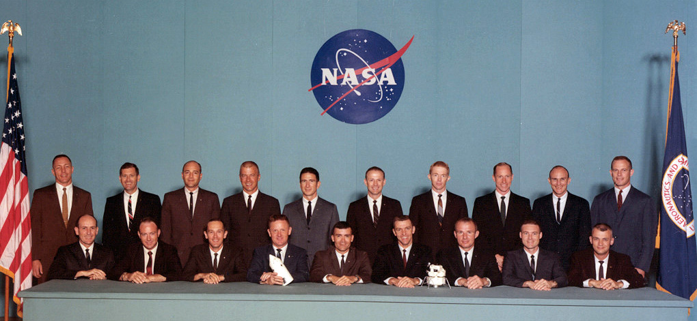

Przedstawiony poniżej krótki rys historyczny załogowych programów kosmicznych jest zorientowany na przedstawienie kwestii dotyczących selekcji astronautów. Poniżej przedstawiono zestawienie największych programów astronautycznych i kosmonautycznych USA oraz Federacji Rosyjskiej (byłego ZSRR).

Pionierzy kosmonautyki
======================
Erę rakietową rozpoczęła publikacja w 1903 roku tzw. wzoru Ciołkowskiego określającego prędkość rakiety zmieniającej masę (zużywającej paliwo podczas lotu). Wzór ten został opublikowany w książce "Badanie przestrzeni świata przy pomocy urządzeń odrzutowych" :cite:`Ciolkowski1967`. Do pierwszych pionierów kosmonautyki wykorzystujących podstawy teoretyczne stworzone przez Ciołkowskiego zalicza się:

- dr Robert H. Goddard (USA),
- Siergiej Korolew (ZSRR),
- Hermann Oberth (Niemcy),
- Robert Albert Charles Esnault-Pelterie (Francja).

Wyżej wymienieni naukowcy i inżynierowie prowadzili badania zarówno nad materiałami pędnymi, paliwami stałymi i ciekłymi oraz aerodynamiką rakiet. 16 marca 1926 roku Robert H. Goddard pomyślnie wystrzelił pierwszą na świecie rakietę napędzaną na paliwo ciekłe :cite:`Goddard-American-Rocketry-Pioneer`.

Podczas II wojny światowej prowadzono wiele badań wykorzystujących paliwo płynne. Stworzona przez Wernera von Brauna rakieta "Vergeltungswaffe 2" znana jako V-2 była pierwszą na świecie rakietą dalekiego zasięgu. Wykorzystywana głównie jako broń do bombardowania miast sojuszu alianckiego posłużyła również do testu, w którym po raz pierwszy udało się przekroczyć linię Karmana, tj. osiągnąć przestrzeń kosmiczną.

Krótki rys historyczny programów kosmicznych NASA
=================================================

Projekt Mercury
---------------
Głównym celem projektu Mercury trwającego od 1958 do 1963 było wyniesienie pierwszego obywatela USA w przestrzeń kosmiczną. Program ten wykorzystywał technologię opracowaną przez US Army tj. rakiety Redstone i w późniejszej fazie rakiety interkontynentalne Atlas LV-3B stworzone dla US Air Force :cite:`Swenson1966`, :cite:`Madrigal2013`, :cite:`Wolfe1979`.

Program Mercury zakładał wysłanie zwierzęcia przed pierwszym lotem człowieka. Ze względu na 98,4% podobieństwa DNA szympansa i człowieka wybrano ten gatunek naczelnych. Szympans nazywał się HAM co jest skrótem od Holloman Aerospace Medical Center, zlokalizowanego w Holloman Air Force Base w New Mexico w USA :cite:`Swenson1966`, :cite:`Human-Origins-Genetic-Evidence`.

W dniu 9 kwietnia 1959, NASA przedstawiła pierwszą grupę astronautów tzw. "Mercury 7" (:numref:`figure-selection-mercury`). Nazwiska astronautów, znak wywoławczy oraz datę wystrzelenia przedstawia tabela :numref:`table-mercury-astronauts`:

Z przyczyn zdrowotnych Deke Slayton został zdyskwalifikowany z udziału w programie Mercury i uziemiony. Przez trzynaście lat od czasu pierwszego lotu Sheparda, Deke Slayton kierował *Astronauts Office* (ang. biurem astronautów i przydziału do misji), które zostało przemianowane później na *Flight Crew Operations Office* (ang. biuro operacji personelu latającego). Slayton po ostatecznym przejściu badań medycznych wziął udział w ostatnim locie programu Apollo tj. Apollo-Sojuz. W tym locie doszło do historycznego dokowania na orbicie okołoziemskiej statków Apollo i Sojuz oraz do symbolicznego uściśnięcia dłoni przedstawicieli USA i ZSRR :cite:`Grimwood2014`, :cite:`Swenson1966`.

    Astronauci programu Mercury tzw. "Original Seven". Pierwszy rząd, od lewej do prawej: Walter M. Schirra, Jr., Donald K. "Deke" Slayton, John H. Glenn, Jr., and M. Scott Carpenter; tylny rząd, Alan B. Shepard, Jr., Virgil I. "Gus" Grissom, L. Gordon Cooper, Jr. źródło: NASA :cite:`Mercury7`.

.. figure:: img/spacecraft-comparision-mercury-gemini-vostok-voshod.jpg
    :name: spacecraft-comparision-mercury-gemini-vostok-voshod
    :scale: 75%
    :align: center

    Schemat porównawczy statków Mercury, Gemini, Wostok i Woschod. Źródło: Wikipedia

Project Gemini
--------------
W celu sprostania wymaganiom postawionym przez prezydenta J. F. Kennedy'ego dotyczącego wysłania człowieka na Księżyc konieczne było stworzenie programu pomostowego pomiędzy programami Mercury oraz Apollo. Celem programu miało być stworzenie i przetestowanie technologii umożliwiającej realizację lotu księżycowego, tj.:

- demonstracja wytrzymałości człowieka i ekwipunku w lotach kosmicznych trwających od 8 do 14 dni,
- zbliżenie i dokowanie (ang. *Rendezvous and docking*) dwóch statków kosmicznych oraz manewrowanie połączonym zespołem na orbicie używając systemu napędowego dokowanego pojazdu,
- demonstracja spacerów kosmicznych (ang. *EVA - Extra-Vehicular Activity*) na zewnątrz pojazdu wraz z pokazaniem możliwości wykonywania operacji przez astronautę w ciśnieniowym skafandrze :cite:`McDivitt1965`,
- udoskonalenie procedury wejścia w atmosferę (ang. *re-entry*) i precyzyjnego lądowania w określonym miejscu :cite:`Kranz2001`.

Amerykańska agencja kosmiczna NASA podczas projektu Gemini przeprowadziła dwa nabory na astronautów (:numref:`figure-selection-gemini-1`, :numref:`figure-selection-gemini-2`).

Podczas przygotowań do misji Gemini 12 amerykański astronauta Buzz Aldrin jako pierwszy wykorzystał techniki nurkowania w celu symulacji spacerów kosmicznych co zapoczątkowało rozpoczęcie badań i stworzenie ośrodków pływalności neutralnej (ang. *NBL - Neutral Buoyancy Laboratory*).

    Astronauci pierwszego naboru do programu Gemini. Rząd z tyłu, od lewej: See, McDivitt, Lovell, White, Stafford. Rząd z przodu: Conrad, Borman, Armstrong, Young. Źródło: NASA/JSC

.. figure:: img/selection-gemini-2.jpg
    :name: figure-selection-gemini-2
    :scale: 7%
    :align: center

    Astronauci drugiego naboru do programu Gemini. Rząd z tyłu, od lewej: Collins, Cunningham, Eisele, Freeman, Gordon, Schweickart, Scott, Williams. Rząd z przodu: Aldrin, Anders, Bassett, Bean, Cernan, Chaffee. Źródło: NASA/JSC

Program Apollo
--------------

    Astronauci pierwszego naboru do programu Apollo. Back, Swigert, Pogue, Evans, Weitz, Irwin, Carr, Roosa, Worden, Mattingly, Lousma. Front, Givens, Mitchell, Duke, Lind, Haise, Engle, Brand, Bull, McCandless. Źródło: NASA/JSC

Program Skylab
--------------
Głównym obiektem zainteresowania kolejnych programów NASA było zagospodarowanie niskiej orbity okołoziemskiej (ang. *LEO - Low Earth Orbit*). Jeszcze w trakcie ostatnich misji programu Apollo został powołany Apollo Applications Program (AAP), którego celem było stworzenie planu wykorzystania technologii wytworzonych na potrzeby misji księżycowych w dalszej eksploracji kosmosu :cite:`Ertel2007`. Pierwszym głównym programem realizującym nową strategię był Skylab (1973-1979). Jego głównym założeniem była budowa stacji kosmicznej i test wpływu długotrwałego pobytu w przestrzeni kosmicznej na organizm człowieka. Program Skylab odziedziczył rakiety Saturn V, które posłużyły nie tylko wynoszeniu elementów konstrukcji na orbitę, ale również po przekształceniu górnego stopnia rakiety, stworzyły podstawę budowy stacji. Astronauci do stacji Skylab byli wynoszeni w Apollo Command/Service Module (CSM) stworzonym na potrzeby realizacji programu Apollo i załogowych misji na Księżyc.

Wśród najważniejszych osiągnięć programu Skylab można zaliczyć:

- rozwinięcie technologii i procedur spacerów kosmicznych (*EVA*),
- dopracowanie konstrukcji skafandra kosmicznego,
- badanie długotrwałego wpływu środowiska mikrograwitacji na organizm człowieka,
- obserwacja słońca za pomocą wielospektralnego obserwatorium słonecznego (ang. *Apollo Telescope Mount*),
- dopracowanie konstrukcji portów dokowania,
- opracowanie technologii śluz powietrznych,
- pierwsza kontrolowana deorbitacja dużej konstrukcji.

Program Space Shuttle
---------------------
Jednym z najbardziej ikonicznych programów kosmicznych jest Space Transportation System czyli tzw. prom kosmiczny (ang. *Space Shuttle*). Podczas programu stworzono statek kosmiczny wielokrotnego użytku w kształcie przypominającym samolot. Orbiter był w stanie wynosić na orbitę 27,5 metrycznej tony ładunku oraz załogę do 8 osób (misja STS-61A).

W trakcie programu Space Shuttle stworzono następujące orbitery :cite:`NASASpaceShuttle`:

- Enterprise (1976) używany do testów podejścia i lądowania, nigdy nie osiągnął orbity,
- Columbia (1981) pierwszy prom, który osiągnął orbitę Ziemi, uległ zniszczeniu w 2003 roku przy wejściu w atmosferę, cała siedmioosobowa załoga zginęła,
- Challenger (1983) drugi prom który osiągnął orbitę, uległ zniszczeniu w 1986 przy starcie, cała siedmioosobowa załoga zginęła, zastąpiony przez prom Endeavour,
- Discovery (1984), trzeci orbiter, 27 lat służby, 39 lotów,
- Atlantis (1985), czwarty orbiter, 33 misje, 4848 orbit, 203 mln km,
- Endeavour (1992), ostatni orbiter, 25 misji, 4671 orbit, 198 mln km.

Program Space Shuttle pozwolił na zwiększenie częstotliwości lotów załogowych na niską orbitę okołoziemską. Dzięki promom kosmicznym i misjom STS Stany Zjednoczone osiągnęły bardzo wysoki poziom sprawności operacyjnej oraz ogromną przewagę w ilości wyszkolonych astronautów oraz osób, które odbyły lot w kosmos. Promy przyczyniły się również do budowy Międzynarodowej Stacji Kosmicznej oraz wyniesienia i późniejszego serwisowania teleskopu Hubble'a.

Podczas lotów promów kosmicznych amerykańska agencja NASA opracowała program szkolenia astronautów, który stał się podstawą dzisiejszych treningów. Stworzono również skafander EMU - Extravehicular Mobility Unit. Skafander ten był modyfikacją skafandra *A7L* wykorzystywanego w programie Apollo. EMU znajduje zastosowanie w misjach kosmicznych i w programie Międzynarodowej Stacji Kosmicznej.

    Rysunek przedstawia skalę amerykańskiego promu kosmicznego Space Shuttle oraz rosyjskiego statku Sojuz TMA :cite:`Portree1995`

Krótki rys historyczny programów kosmicznych ZSRR i Federacji Rosyjskiej
========================================================================

Program Wostok
--------------
Wostok był pierwszym załogowym programem kosmonautycznym w Związku Socjalistycznych Republik Radzieckich. Punktem kulminacyjnym programu był lot 12 kwietnia 1961 roku radzieckiego majora Jurija Gagarina - pierwszego człowieka w kosmosie. W trakcie trwania programu 1961 do 1963 roku odbyło się 6 lotów załogowych a najdłuższy trwał 5 dni. Cztery ostatnie loty były wystrzeliwane parami w odstępie jednego dnia od siebie. Listę kosmonautów programu przedstawia :numref:`table-wostok-cosmonauts`.

.. csv-table:: Lista lotów programu Wostok :cite:`Siddiqi2000`
    :name: table-wostok-flights
    :file: ../data/wostok-flights.csv
    :header-rows: 1

Program Woschod
---------------
Program Woschod był kontynuatorem programu Wostok. Wprowadzał modyfikację do kapsuły, wzrost jej objętości, oraz zwiększenie liczby członków załogi do trzech osób. Zastosowano również powiększoną rakietę nosiciela. W latach 1964 i 1965 odbyły się dwa loty w ramach programu.

Największym dokonaniem podczas programu Woschod było pierwsze wyjście człowieka w otwarty kosmos, tzw. *EVA*. Dokonał tego rosyjski kosmonauta Aleksiej Leonow 18 marca 1965 roku. Pierwsze wyjście trwało 12 minut i niemalże zakończyło się śmiercią kosmonauty. Jego skafander ze względu na różnicę ciśnień spuchł do rozmiarów niepozwalających na powrót do śluzy. Leonov rozhermetyzował skafander i upuścił powietrze w skutek czego nabrał możliwości ponownego wejścia do kapsuły.

.. csv-table:: Lista lotów programu Woschod :cite:`Siddiqi2000`
    :name: table-woshod-flights
    :file: ../data/woshod-flights.csv
    :header-rows: 1

.. figure:: img/spacecraft-voshod-2.png
    :name: figure-voshod-2
    :scale: 75%
    :align: center

    Schemat statku Voshod. Źródło: Wikipedia

Program Sojuz i Progress
------------------------
Program Sojuz jest jednym z najdłużej trwających programów kosmicznych. Był bezpośrednim następcą programu Woschod i rozpoczął się w połowie lat sześćdziesiątych XX wieku. Pierwotnie celem programu miało być stworzenie podstaw do lotów księżycowych, ale później wymagania zostały zmienione.

Program Sojuz wraz z kolejnymi modyfikacjami trwa do dziś. Rakieta i kapsuła Sojuz jest najbardziej niezawodnym statkiem kosmicznym. Od czasu wycofania z użycia amerykańskich promów Space Shuttle jest jedynym środkiem transportu do i z Międzynarodowej Stacji Kosmicznej. Więcej na temat programu w rozdziale poświęconym :ref:`szkoleniu w pilotowaniu statku kosmicznego Sojuz <Trening pilotażu statków kosmicznych i samolotów wysokomanewrowych>`.

Równocześnie z kapsułą załogową Sojuz tworzona była jej bezzałogowa wersja Progress. Podobnie jak Sojuz tak i Progress jest wciąż użytkowany i stanowi główne źródło zaopatrzenia dla ISS.

Program Salut
-------------
Pierwszym w historii programem orbitalnej stacji kosmicznej był Salut. Konstrukcja stacji była jednomodułowa i wynoszona na orbitę na rakiecie-nosicielu Proton. Kosmonauci za pomocą statków Sojuz dokowali do stacji, gdzie prowadzili badania nad efektami wpływu na organizm człowieka długotrwałego pobytu w stanie mikrograwitacji. Program również nosił nazwę Długoczasowa Stacja Orbitalna (ros. *DOS - Dołgowriemiennaja Orbitalnaja Stancija*), a równocześnie z nim był tworzony wojskowy program *Ałmaz* (ros. *Diament*).

Stacje wyposażone były w port dokowania, dzięki któremu zarówno załogowe jak i bezzałogowe statki Progress mogły dołączać do stacji i zaopatrywać ją w paliwo, tlen i inne zasoby.

.. csv-table:: Lista stacji kosmicznych w ramach programu Salut/Ałmaz/Mir. Źródło: Wikipedia
    :name: table-salyut-timeline
    :file: ../data/salyut-timeline.csv
    :header-rows: 1

.. figure:: img/spacestation-salyut-6.png
    :name: figure-spacestation-salyut-6
    :scale: 100%
    :align: center

    Schemat stacji kosmicznej Salut-6. Źródło: Wikipedia

Program Buran
-------------
Program Buran był odpowiedzią na amerykański program Space Shuttle. Pojazd, który został stworzony był podobny wizualnie, ale znacząco się różnił i przewyższał osiągami promy STS. W ramach programu została stworzona również rakieta Energia, która wykorzystywała zmodyfikowane silniki RD-170 z programu księżycowego. Buran wykonał jeden lot testowy 15 listopada 1988 bez załogi. Podczas lotu wykonał dwa okrążenia Ziemi i dokonał autonomicznego lądowania na pasie startowym *Site 251* - Yubileyniy Airfield otrzymując precyzję lądowania na poziomie 10 m w osi pasa.

Ze względów geopolitycznych program został zamknięty, a orbitery trafiły kolejno do hangaru na kosmodromie Bajkonur oraz do muzeum techniki w niemieckim mieście Speyer. W maju 2002 ze względu na obciążenia dachu wywołane potężną burzą dach hangaru, w którym przebywał Buran oraz rakieta Energia zawalił się niszcząc prom i nosiciela.

.. figure:: img/spacecraft-buran-vs-shuttle.png
    :name: figure-spacecraft-buran-vs-shuttle
    :scale: 25%
    :align: center

    Zestawienie porównawcze rakiety Sojuz, Space Shuttle oraz Energia-Buran. Źródło: Wikipedia

Stacja kosmiczna Mir
--------------------
Stacja kosmiczna Mir (ros. pokój) była bezpośrednim kontynuatorem programu Salut i pierwowzorem dla ISS. Początkowo służyła wyłącznie kosmonautom ZSRR oraz była udostępniana w ramach programu Interkosmos. Po upadku Związku Radzieckiego umożliwiono loty międzynarodowych załóg. Podczas ponad 15 lat pracy na orbicie gościła 28 stałych załóg i wiele tymczasowych wizyt amerykańskich promów Space Shuttle.

Jej konstrukcja rozpoczęła się od przeniesienia zasobów dostarczonych przez Progress-25 i Progress-26. Zadanie wykonała załoga Sojuz T-15 (Leonid Kizim i Władimir Sołowjow). Podczas 50 dniowego pobytu załoga również odwiedziła stację Salut-7 w celu przewiezienia części wyposażenia na Mir. Na chwilę obecną jest to jedyny przypadek w historii aby astronauci w trakcie jednego lotu odwiedzili dwie stacje.

.. figure:: img/spacestation-mir.png
    :name: figure-spacestation-mir
    :scale: 50%
    :align: center

    Schemat stacji kosmicznej Mir. Źródło: Wikipedia

Program Interkosmos
-------------------

Tabele
======
.. csv-table:: Przydział do misji i daty lotu oraz lądowania na księżycu :cite:`Slayton1994`, :cite:`French2007`, :cite:`Aldrin2009`
    :name: table-apollo-mission-list
    :file: ../data/apollo-mission-list.csv
    :header-rows: 1

.. csv-table:: Astronauci programu Apollo :cite:`Slayton1994`
    :name: table-selection-apollo
    :file: ../data/selection-apollo.csv
    :header-rows: 1

.. csv-table:: Astronauci programu Mercury wraz z czasem lotu oraz znakiem wywoławczym kapsuły :cite:`Slayton1994`
    :name: table-mercury-astronauts
    :file: ../data/selection-mercury.csv
    :header-rows: 1

.. csv-table:: Astronauci programu Gemini :cite:`Slayton1994`
    :name: table-selection-gemini
    :file: ../data/selection-gemini.csv
    :header-rows: 1

.. csv-table:: Lista kosmonautów programu Wostok wraz z wiekiem w czasie selekcji :cite:`Siddiqi2000`
    :name: table-wostok-cosmonauts
    :file: ../data/wostok-cosmonauts.csv
    :header-rows: 1

.. csv-table:: Lista rosyjskich kosmonautów
    :name: table-astronauts-roscosmos
    :file: ../data/astronauts-roscosmos.csv
    :header-rows: 1
