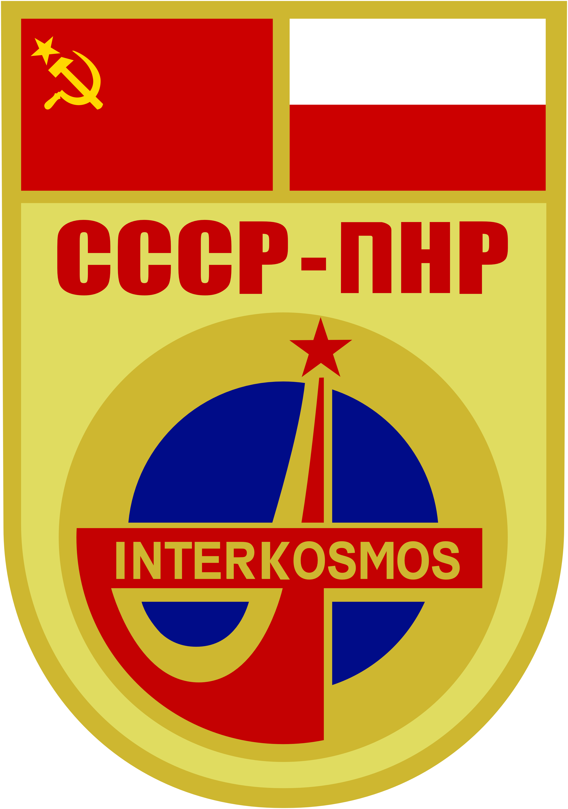
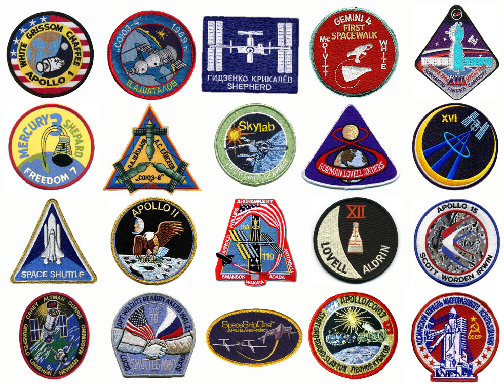

*************************************************
Misja, procedury i tradycje przed oraz po wylocie
*************************************************

Procedury i tradycje przed wylotem
==================================
.. todo::
    - Astronauci wyposażają MAG w podpaski, aby im nie przeciekały podczas oczekiwania na start (szkolenie w Cottage House nr 3 w Gwiezdnym Miasteczku) :cite:`Anderson2015`
    - Astronauci za czasów Shuttle zabierali ze sobą torbę z ubraniami, w zależności od miejsca gdzie będą lądować np. Luźniejsze cichy na Californię itp  :cite:`Anderson2015`, :cite:`Melvin2017`
    - Od czasów Shepparda jedzą stek i jajkami sadzonymi :cite:`Wolfe1979`, :cite:`French2007`

Tradycje przed wylotem załóg statku Sojuz z kosmodromu w Bajkonurze
-------------------------------------------------------------------
W celu upamiętnienia wydarzeń historycznych astronauci przed wylotem w kosmos uczestniczą w wielu tradycjach. Każde z wydarzeń jest monitorowane przez media z całego świata. Poniżej przedstawiono listę czynności wykonywanych przez przyszłych uczestników lotów kosmicznych.

Przed udaniem się na kosmodrom w Bajkonurze:

- wizyta na placu czerwonym,
- złożenie kwiatów pod murem Kremla na grobach poległych kosmonautów.

Bezpośrednio po przybyciu do Bajkonuru:

- podniesienie flag narodowych astronautów,
- zasadzenie drzewa w alei kosmonautów.

Na kilka dni przed wylotem :cite:`Kelly2017`, :cite:`Hermaszewski2013`:

- poświecenie rakiety przez popa,
- astronauci nie mogą zobaczyć rakiety ani po drugim ani po trzecim przeglądzie przedstartowym,
- kwarantanna i ochrona przed mikrobami,
- spanie na łóżku z głową w dół.

Bezpośrednio przed wylotem :cite:`Kelly2017`:

- ostatnie strzyżenie włosów przez fryzjera,
- ostatni posiłek załogi,
- podpis na drzwiach pokoju w którym się mieszkało,
- wpis do pamiątkowej księgi w biurze Gagarina,
- oglądanie filmu "Białe słońce pustyni",
- spisanie testamentu przed wylotem,
- astronauci są obracani przed startem góra dół kilka razy w celu przyzwyczajenia do kosmicznej choroby lokomocyjnej,
- ponowne sprawdzenie szczelności skafandra w autobusie podczas drogi na kosmodrom,
- pożegnanie z rodzinami,
- przejazd autobusem do budynku 254 w celu ubrania skafandra Sokol,
- oddanie moczu na koło autobusu - upamiętnienie czynu Gagarina (​kobiety urzednio przygotowują napełnione butelki, które rozlewają),
- ostatni salut stojąc na wyznaczonych miejscach,
- pozowanie do zdjęć i machanie do obserwatorów ze schodów do rakiety Sojuz,
- sprawdzanie systemów,
- każdy astronauta może wybrać trzy piosenki, które są odtwarzane podczas oczekiwania na start :cite:`Hermaszewski2013`.

Tradycje przed wylotem załóg promu kosmicznego Space Shuttle
------------------------------------------------------------
Amerykańskie tradycje przed wylotem są znaczenie skromniejsze niż ich odpowiedniki u Rosjan. Zwykle ograniczają się do :cite:`Hitt2014`:

- grila na dzień przed wylotem,
- tradycyjnego wspólnego ostatniego posiłku załogi,
- gry w pokera, w której astronauci grają do czasu przegrania dowódcy, co symbolizuje wykorzystanie całego "pecha" na czas trwania misji.

Na ostani posiłek przed lotem wielu amerykańskich astronautów wzorem Alana Sheparda (pierwszego amerykanina w kosmosie) wybiera tradycyjnie stek z jajecznicą :cite:`Madrigal2013` i sok pomarańczowy.

Astronaut Close Family Escort
-----------------------------
.. todo:: Family Escort, dwóch astronautów obecnie nie trenujących do misji. Jeden odpowiedzialny za bezpośrednią rodzine, drugi za extended family i przyjaciele podczas startu. Ten od rodziny pomaga później podczas nieobecności. Od liczenia znajomych w autobusie, załatwiania biletow do muzeum i wysłuchiwania narzekań o za zimno za ciepło w hotelu, przez pomoc w zakładaniu kont oszczędnościowych na studia dla dzieci, organixację pogrzebu i byciem advocate rodziny przy komisji badania wypadku. Pomaga zrozumieć jak start i misja wyglada z oczu rodziny.

Tworzenie insygnii misji
------------------------
Zgodnie z tradycją zapoczątkowaną wraz z pierwszymi lotami załogowymi zespoły udające się w kosmos projektują swoje "mission patch" (ang. odznaki misji). Najczęstszym formatem loga misji jest okrąg, w którego obramowanie wkomponowane są nazwiska astronautów. Wyjątkiem od reguły umieszczania nazwisk jest misja Apollo 11, podczas której ze względu na międzynarodowy charakter pierwszego lądowania na księżycu zrezygnowno z tej tradycji (misja Apollo 11 miała być misją całej ludzkości ang. "for all mankind").

Do stworzenia insygniów misji dowódca załogi wyznacza kilka osób, które współpracują z grafikiem i jest to jedna z pierwszych rzeczy jaką robią załogi po uzyskaniu przypisania do misji. Niektóre załogi korzystają z profesjonalnych firm, które zajmują się projektowaniem oraz wykonywaniem insygniów misji :cite:`Anderson2015`, :cite:`Spain2014`.

    Insygnia misji Sojuz-30 w ramach programu Interkosmos. W misji wzięli udział gen. Hermaszewski oraz gen. Klimuk. Źródło: Wikipedia

    Obraz przedstawia wybrane insygnia misji. Źródło: Wikipedia

Badania medyczne przed wylotem
------------------------------
Bezpośrednio przed samym wylotem po odbyciu procesu kwarantanny badania medyczne załóg amerykańskiego promu kosmicznego były tyko formalnością :cite:`Anderson2015`. W przypadku startów z kosmodromu w Bajkonurze załoga przechodzi gruntowne testy przedstartowe oraz odbywa proces leżenia z głową w dół aby przyzwyczaić organizm astronauty do stanu nieważkości :cite:`Hermaszewski2013`.

Przygotowanie powrotu na Ziemię
===============================

.. todo::
    - "Agreement on the Rescue of Astronauts, the Return of Astronauts and the Return of Objects Launched into Outer Space"
    - http://www.unoosa.org/oosa/en/ourwork/spacelaw/treaties/introrescueagreement.html

.. todo::
    - Astronauci wydłużają się o 5-7 cm i maja problemy z mieszczeniem się w swoje Custom made siedzenia w Sojuzie
    - Space Shuttle Wystawiała kółka by się rozgrzały

Przygotowanie
-------------
- Przygotowanie do powrotu na Ziemię
- Przekazanie dowodzenia ISS
- Pakowanie Sojuz (​Only cosmonauts are allowed to pack Soyuz before reentry.)

Lot powrotny
------------
- Undocking
- Obniżanie orbity
- De-orbit burn
- Wejście w atmosferę i lądowanie statkiem Sojuz

    - Normalne wejście w atmosferę
    - Wejście w atmosferę po krzywej balistycznej

​
24 immediate action buttons. Cover with flip lids, to prevent accidental pushes:
switch main engine off
Turn the backup thrusters
​Aby utrzymać panele słoneczne skierowane na słońce Sojuz kręci się jak kurczak na rożnie

Lądowanie i procedury po wylądowaniu
------------------------------------
​
Dropping remaining fuel before impact on landing
- System "Miękkiego" lądowania
- Lądowanie na wodzie
- Lądowanie na lądzie
- Lądowanie w terenie do tego nieprzeznaczonym
- Siły poszukiwawczo ratowczne
- Usuwanie nieczystości hydrazyny ze space shuttl

Procedury operacyjne po powrocie na Ziemię
==========================================

Tradycje po wylądowaniu na Ziemii
---------------------------------
Konferencja prasowa
Po wyjściu ze śmigłowca podpisanie drzwi
​Ceremonia wręczenia przez lokalnego VIPa purple robe and a black hat I dwie gitary wykładające jak ukulele. Kobiety w strojach ludowych dają sól chleb i wodę.

Badania medyczne - wzrok, układ ruchu i krążenia
------------------------------------------------
​Podawanie IV po lądowaniu. Każdy ma Swój MI-8 z pielęgniarką, łóżkiem, lekarzem i osoba do wsparcia.

.. todo::
    - W kosmosie układ odpornościowy jest znacznie osłabiony i dużo bardziej podatny na infekcje
    - Układ kostny osłabiony przez środowisko mikrograwitacji musi przetrzymać duże przeciążenie przy reentry a pózniej przez najbliższe dni na ziemi
    - serce musi się przystosować do pompowania krwi w grawitacji
    - Podwyższone tętno
    - Uczucie słabości w nogach jak po przebiegnięciu maratonu
    - Rozciągaj się codziennie
    - Mięśnie stają się krótsze, szczególnie te od chodzenia i zaczynają ciagnąć stawy, których normalnie nie ciągną

Badanie sprawności fizycznej
----------------------------
.. todo:: Badanie zręczności - konstrukcja elementów bazy
    Ewaluacja z wsadzaniem kołeczków „peg” w board. Evaluated speed and accuracy

    Symulacja komputerowa dziś miałeś trzymać kursor w kółku ktore jeździ na ekranie, a na drugim ekranie w tym samym czasie pisać numery które się pojawiają.
    Motion simulator (small cockpit on tilting platform):
    NASA T-38
    Driving race car on mountain range
    Mars rover on boulder field

    ​
    Aptitude test of using robotic arm in 3D (visualization in 3D)
    Calling medical clinic in order to get information about behavior of applicants.

Powrót
------
.. todo:: NASA G3, samolot na 10 osób z dwoma łóżkami z tylu.

Odprawa i ewaluacja astronauty po locie
---------------------------------------
Po przylocie odbywa się podsumowanie misji (ang. *mission review*). Podczas tego spotkania astronauci oraz osoby zaangażowane tj. kontrolerzy lotu podsumowują wydarzenia z ekspedycji. Głównym celemn odprawy (ang. *debriefing*) po misji jest stworzenie zbioru zasad lotu (ang. *Flight Rules*). Jest to zestawienie problemów wraz z rozwiązaniami na podstawie wydarzeń, które zdarzyły się podczas misji oraz akcji podjętych przez załogę. Każde z wydarzeń jest skrupulatnie omawiane a wyniki grupowane sa w wyżej wymieniony dokument, kóry zawiera bardzo szczegółowy opis. Spotkania podsumowujące trwają po jednym dniu dla każdego systemu a takie cykle mogą trwać trwać miesiącami :cite:`Hadfield2013`. Wśród omawianych komponentów znajdują się m.in.:

- systemy komunikacji,
- eksperymenty biologiczne,
- skafandry kosmiczne,
- jedzenie (czy była odpowiednia ilość, czy smakowało, jak sprawdziło się pakowanie).

Spotkanie odbywa się z astronautami, którzy brali udział w misji oraz z osobami odpowiedzialnymi za poszczególne podsystemy. Obrady mają charakter dyskusji. Osoby starsze stażem zajmują miejsca przy stole a mniej doświadczeni astronauci pod ścianą :cite:`Hadfield2013`.

W następnej kolejności kadra zarządzająca dokonuje ewaluacji astronauty (ang. post-flight evaluation) na podstawie, której podejmowane są później decyzje odnośnie kolejnych przydziałów.
