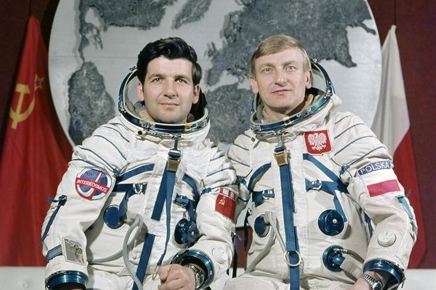
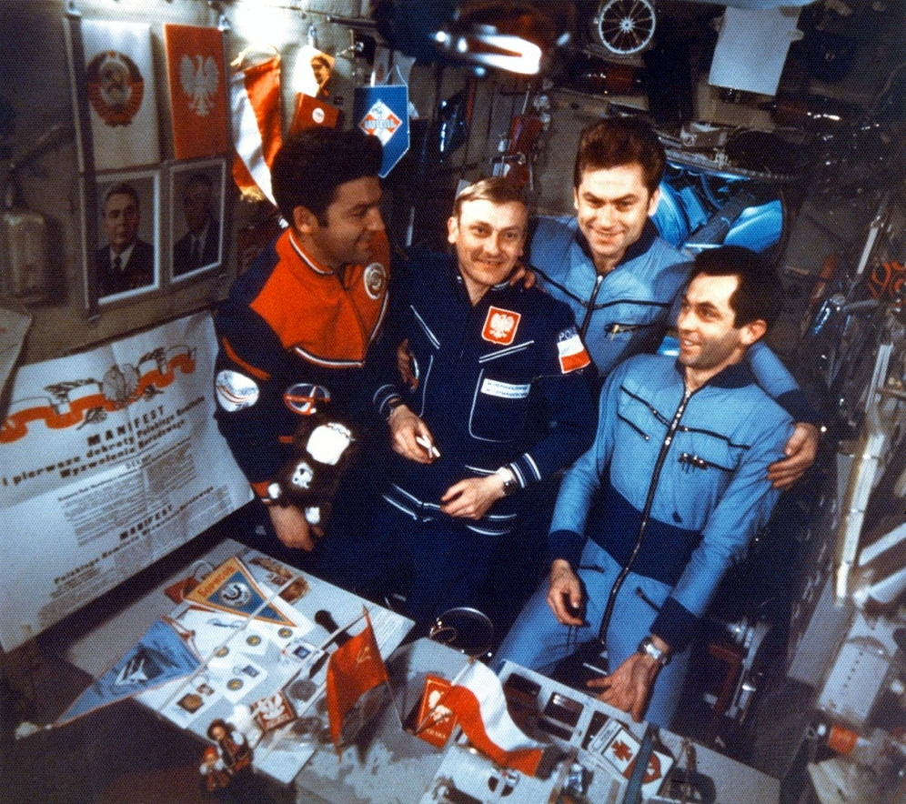
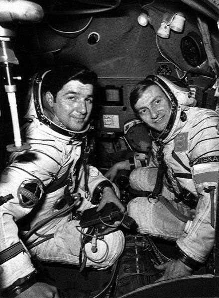

*********************************
Rys historyczny lotów kosmicznych
*********************************

Programy kosmiczne były prowadzone głównie przez dwa państwa USA i Federację Rosyjską (ZSRR). ZSRR był inicjatorem współpracy międzynarodowej. W ramach programu Interkosmos polecieli pierwsi kosmonauci niebędący obywatelami wyżej wymienionych mocarstw, a generał Hermaszewski został pierwszym polakiem, który tego dokonał.

Podczas selekcji kosmonauci i astronauci wybierani byli głównie ze względu na doświadczenie w pilotażu, chociaż pojawiały się również grupy osób z innych specjalności tj. inżynieria, nauka, medycyna jak również nauczyciele.

Wraz z rozwojem technologicznym pozwalającym na autonomiczne prowadzenie statków kosmiczncyh oraz ich dokowanie, oraz wraz ze zwiększającą się liczbą startów, zwiększaniem stabilizacji i bezpieczeństwa lotów jak i pobytu w kosmosie nacisk na doświadczenie kandydata jako pilota maleje. Chociaż to wciąż wysoko cenieni specjaliści, to ilość badań, ich złożoność oraz specyfika promuje profil kandydatów z wykształceniem naukowym lub inżynieryjnym. Jednocześnie na uwagę zasługuje fakt, iż w większości przydziałów do misji, osoby które udawały się w kosmos były szkolone do prowadzenia badań wychodzących poza zakres specjalizacji danego astronauty.

Na podstawie dominujących cech wśród astronautów analizowanych programów w ramach proponowanego celu pracy kandydaci powinni cechować się multidyscyplinarnością, umiejętnością pracy w grupie oraz prowadzenia badań wychodzących z poza zakresu specjalizacji, gdyż to właśnie te elementy dominowały przy wyborze, szkoleniu i odbywaniu misji.

Wyścig kosmiczny i krótki rys historyczny załogowych lotów kosmicznych
======================================================================
Po drugiej wojnie światowej wyścig zbrojeń przerodził się w tzw. zimną wojnę pomiędzy Stanami Zjednoczonymi Ameryki i Związkiem Socjalistycznych Republik Radzieckich. Za oficjalną datę rozpoczęcia wyścigu kosmicznego (ang. *Space Race*) przyjmuje się dzień 2 sierpnia 1955 roku. Tego dnia Związek Radziecki odpowiedział na ogłoszoną przez rząd USA cztery dni wcześniej deklarację zamiaru wystrzelenia sztucznego satelity z okazji międzynarodowego roku geofizyki :cite:`Space-Race`.

Wystrzelony 4 października 1957 należący do ZSRR Sputnik został pierwszym sztucznym satelitą Ziemi. To wydarzenie zapoczątkowało serię sukcesów Związku Socjalistycznych Republik Radzieckich w kosmosie, do których należały:

- pierwsze wystrzelenie zwierzęcia (pies Łajka, 3 październik 1957),
- pierwsze bezzałogowe lądowanie na Księżycu (Luna 2, 13 września 1959) :cite:`Shelton1969`,
- wystrzelenie oraz orbitowanie pierwszego człowieka (J. Gagarin, 12 kwietnia 1961),
- pierwsza lot orbitalny trwający ponad dobę (G. Titow, 6 sierpnia 1961),
- pierwsza kobieta w kosmosie (W. Tierieszkowa, 16 Czerwiec 1963),
- pierwszy spacer kosmiczny (A. Leonow, 18 marzec 1965),
- pierwsze zwierzęta orbitujące Księżyc, które powróciły na Ziemię (Zond 5, 15 września 1968) :cite:`Siddiqi2000`.

Pierwszym zwierzęciem, które przekroczyło linię graniczną kosmosu był pies Łajka wystrzelony za pomocą rakiety Sputnik 8K71PS w kapsule Sputnik-2 :cite:`Siddiqi2000`. Ze względu na wysoką temperaturę spowodowaną uszkodzeniem i niepełnym rozczepieniem członu rakiety od satelity zwierzę zdechło po kilku godzinach od startu. Pies planowo miał żyć na orbicie 10 dni. Po 162-óch dniach (około 2000 orbit) kapsuła z martwym ciałem weszła w atmosferę i spłonęła :cite:`Harford1997`.

Pierwszym człowiekiem w kosmosie był major Jurij Gagarin (awansowany później na pułkownika). Gagarin był jednym z 20 osób, które zostały wybrane wśród pilotów wojskowych Związku Radzieckiego :cite:`Siddiqi2000`. Wg. podań świadków major wyróżniał się wytrzymałością, duchem oraz doświadczeniem. Pośród wszystkich rekrutowanych kosmonautów przeprowadzono ankietę, w której zadano pytanie: "kogo wytypował byś na pierwszy lot". Osiemnaście na dwadzieścia osób z załogi wybrało Gagarina. Major został wystrzelony przez Związek Radziecki 12 kwietnia 1961 w 108 minutowy lot orbitalny wokół Ziemi na pokładzie Vostok-1. Po okrążeniu Ziemi wszedł ponownie w atmosferę w tzw. krzywej balistycznej cechującej się wysokim poziomem przeciążeń działających na ciało kosmonauty. Ze względu na fakt, iż Radzieccy konstruktorzy nie dysponowali jeszcze techniką aby bezpiecznie wylądować statkiem kosmicznym na ziemi zdecydowano się na użycie fotela katapultowego i spadochronu. Na poziomie 20 000 stóp nad poziomem morza (ok. 6 tys. metrów) Gagarin katapultował się z kapsuły i bezpiecznie wrócił na powierzchnię :cite:`Why-Yuri-Gagarin-Remains-the-First-Man-in-Space`.

Amerykańską odpowiedzią na plan wysłania człowieka w kosmos był program Mercury. W trakcie selekcji do programu wybrano siedmiu astronautów. 5 maja 1961 Alan Shepard jako pierwszy amerykanin poleciał w kosmos. 12 września 1962 - pół roku po locie Sheparda, aby zażegnać widmo porażki w kosmicznym wyścigu prezydent Stanów Zjednoczonych Ameryki J. F. Kennedy wygłosił mowę na Uniwersytecie Rice :cite:`Kennedy1962`, w której zmobilizował naród i postawił cel, aby "do końca dekady człowiek postawił nogę na Księżycu i bezpiecznie wrócił na Ziemię". Cel ten udało się zrealizować w 1969 roku, gdy amerykański astronauta Neil Armstrong stanął na naturalnym satelicie Ziemi. Do najważniejszych amerykańskich programów należą:

- project Mercury,
- project Gemini,
- project Apollo,
- project Skylab (Apollo Application),
- program Space Shuttle,
- uczestnictwo w programie ISS.

Związek Socjalistycznych Republik Radzieckich wiódł prym w tematach kosmicznych i do czasu pierwszych kroków Neila Armstronga technologia radziecka była uważana za dominującą. Programy załogowe ZSRR charakteryzowały się dużą złożonością i zróżnicowaniem. Wśród najważniejszych programów ZSRR i późniejszej Federacji Rosyjskiej można wymienić:

- program Wostok,
- program Woschod,
- program Sojuz i Progres,
- program Księżycowy (N1-L3),
- program Salut,
- program Interkosmos,
- program Buran,
- stacja kosmiczna Mir,
- uczestnictwo w programie ISS.

Ze względu na plan powrotu człowieka na Księżyc warto w szczegółach przyjrzeć się programowi Apollo oraz N1-L3. W ramach tych misji i całego cyklu przygotowania do lotów stworzone zostały mechanizmy, procedury oraz infrastruktura szkoleniowo-badawcza. Część technologii i opracowań, które w 1969 roku pozwoliły czlowiekowi stanąć wciąż są aktualne i mogą być wykorzystane przy szkoleniu astronautów do przyszłych misji na inne ciała niebieskie.

Program Apollo
--------------
Najbardziej ambitnym programem w historii astronautyki był program Apollo. W ciągu niespełna dekady udało się opracować technologię oraz procedury pozwalające człowiekowi stanąć na powierzchni Księżyca i bezpiecznie powrócić na Ziemię. Program Apollo był próbą realizacji oświadczenia prezydenta USA J. F. Kennedy'ego z 12 września 1962 roku :cite:`Kennedy1962`.

Każda z misji programu Apollo cechowała się innym zadaniem w zależności od kategorii do której była przydzielona :cite:`ApolloChronology2007`. :numref:`table-apollo-mission-types` przedstawia typy misji oraz opis każdej z kategorii.

Krótka charakterystyka misji Apollo:

- Apollo 1 - pożar przy rutynowym teście, załoga poniosła śmierć,
- Apollo 7 - pierwszy start rakiety Saturn V z astronautami w module dowodzenia (ang. *Command Module*) :cite:`Eisele2017`, :cite:`Cunningham2010`,
- Apollo 8 - pierwsze orbitowanie Księżyca, ikoniczne zdjęcie wschodu Ziemi (ang. *Lunar Earthrise*),
- Apollo 10 - pełny test do misji typu *G*, zbliżenie się na 8.4 NM (15.6 km) do Księżyca,
- Apollo 11 - pierwsze lądowanie na Księżycu,
- Apollo 12 - najbardziej dokładne lądowanie w programie Apollo, przejęcie kamery lądownika Surveyor 3, który lądował dwa lata wcześniej (20 kwietnia 1967),
- Apollo 13 - wybuch zbiornika z tlenem i dramatyczna walka z czasem aby sprowadzić załogę na Ziemię,
- Apollo 14 - najstarszy astronauta na Księżycu, pierwsza gra w golfa,
- Apollo 15 - pierwsze wykorzystanie pojazdu na powierzchni Księżyca,
- Apollo 16 - pierwsza misja trzydniowa na Księżycu (typ *J*)
- Apollo 17 - ostatnie lądowanie na Księżycu (pierwsza misja w której brał udział naukowiec - geolog), ikoniczne zdjęcie Ziemi z daleka (ang. *Blue Marble*) :cite:`Cernan2000`,
- Apollo-Soyuz Test Project - ostatnia misja programu, podczas której doszło do dokowania na orbicie statków Apollo oraz Sojuz i historycznego uścisku dłoni między reprezentantami dwóch mocarstw.

.. csv-table:: Typy misji w ramach programu Apollo :cite:`ApolloChronology2007`
    :name: table-apollo-mission-types
    :file: ../data/apollo-mission-types.csv
    :header-rows: 1

Program Księżycowy (N1-L3)
--------------------------
ZSRR konkurował ze stanami zjednoczonymi w ramach wyścigu kosmicznego. Punktem kulminacyjnym całego Space Race miał być załogowy lot na Księżyc. W tym celu Główny Konstruktor Siergiej Pawłowicz Korolew rozpoczął pracę nad rakietą N1. W ramach programu stworzony został również moduł orbitujący (ros. *LOK - Lunniy Orbitalny Korabl*) oraz lądownik (ros. *LK - Lunniy Korabl*) przedstawiony na obrazku :numref:`figure-spacecraft-lk-models`. Rakieta N1 ta w przeciwieństwie amerykańskiego do podejścia składała się nie z trzech a z 5 segmentów (ang. *stage*) oraz 30 silników pierwszego poziomu. Ze względu na złożoność systemu rakieta każdorazowo eksplodowała przy starcie. Po czwartym nieudanym podejściu i utracie nosiciela, zmianie geopolitycznej i przegraniu wyścigu kosmicznego Komitet Centralny Partii postanowił zamknąć program.

W 1966 roku kosmonauci zostali przydzieleni do treningów księżycowych (:numref:`table-selection-n1-l3`). Stworzono grupy, których celami były:

- Soyuz 7K-OK - kwalifikacja statków Soyuz do lotów orbitalnych (lider Gagarin)
- L1/Zond - lotów księżycowych na rakiecie Proton (lider Komarow),
- L3 - opracowanie procedur i metodyki lądowania na Księżycu (lider Leonow).

W ramach programu N1-L3 zaplanowano 18 misji. Ze względu na przewodzenie grupie opracowujących lądowanie Leonow miał największą szansę być nominowany do bycia pierwszym kosmonautą na Księżycu :cite:`LeonovScott2006`.

.. csv-table:: Lista kosmonautów przypisanych do grup szkoleniowych w ramach programu księżycowego :cite:`Kamanin-Diaries`
    :name: table-selection-n1-l3
    :file: ../data/selection-n1-l3.csv
    :header-rows: 1
    :widths: 10, 90

.. figure:: ../img/spacecraft-lk-models.jpg
    :name: figure-spacecraft-lk-models
    :scale: 100%
    :align: center

    Różne prototypy lądowników księżycowych w ramach programu załogowego ZSRR. Źródło: Astronautics/Mark Wade :cite:`SovietMannedLunarProjects`

Program Interkosmos i lot generała Hermaszewskiego
==================================================
W ramach zjazdu przedstawicieli krajów socjalistycznych w Moskwie 5-13 kwietnia 1967 roku przyjęto program współpracy w zakresie eksploracji kosmosu - Interkosmos. W ramach programu odbywały się loty zarówno załogowe jak i bezzałogowe. Głównym założeniem współpracy było korzystanie z infrastruktury naziemnej oraz  rakiet radzieckich. Międzynarodowa współpraca miała dotyczyć badań naukowych oraz lotów załogowych. Prawną stronę porozumienia i działania państw członkowskich regulował dokument zawarty 13 lipca 1976 roku. Porozumienie obowiązywało od 25 marca 1977 roku. W późniejszym czasie w ramach programu Interkosmos powstała stacja Mir.

Głównym celem programu Interkosmos były badania naukowe w obszarach:

- fizyki kosmicznej,
- meteorologii,
- łączności,
- biologii,
- medycyny kosmicznej.

W ramach programu odbywały się międzynarodowe loty załogowe, które umożliwiły kosmonautom spoza ZSRR oraz USA lot w kosmos. Kosmonautów w ramach programu Interkosmos wybierano z najlepszych pilotów w ramach państw, które ratyfikowały porozumienie. Pierwszym kosmonautą nie będącym obywatelem powyższych państw był czech Vladimír Remek, który poleciał 2 marca 1978 roku. Drugą osobą był generał Mirosław Hermaszewski (27 czerwca 1978). :numref:`table-selection-interkosmos` przedstawia listę kosmonautów programu Interkosmos.

.. figure:: ../img/map-interkosmos.png
    :name: figure-map-interkosmos
    :scale: 40%
    :align: center

    Państwa uczestniczące w ramach programu Interkosmos. Źródło: Wikipedia

Lot Sojuz-30 miał miejsce w dniach 27 czerwca – 5 lipca 1978. Skład głównej załogi stanowił zespół: Mirosław Hermaszewski (promotor pomocniczego tej pracy) oraz Piotr Iljicz Klimuk. W zespole rezerwowym byli Walerij Nikołajewicz Kubasow oraz Zenon Jankowski. :numref:`figure-soyuz-30-crew` przedstawia skład pierwszej załogi.

Głównym zadaniem Sojuz-30 było dokowanie do stacji Salut-6 oraz wykonanie badań naukowych i biomedycznych zestawionych w :numref:`table-soyuz-30-experiments` dla jednostek badawczych, tj. :cite:`Hermaszewski2013`:

- Wojskowy Instytut Medycyny Lotniczej (WIML),
- Instytut Fizyki PAN,
- Instytut Geodezji i Kartografii (IGiK),
- Centrum Badań Kosmicznych PAN (CBK),
- dla zagranicznych jednostek badawczych w ramach porozumienia Interkosmos.

Misja zakończyła się sukcesem a zadania założone zostały wykonane. :numref:`table-soyuz-30-timeline` przedstawia listę najważniejszych wydarzeń w trakcie lotu Sojuz-30.

W ramach treningu do misji kosmonauci odbyli szkolenia, m.in.:

- ratownictwo morskie i lądowanie w środowisku wodnym,
- zapoznanie się ze środowiskiem mikrograwitacji podczas lotu parabolicznego samolotem TU-104A,
- badania psychologiczne i kondycyjne,
- szkolenie z nawigacji i dynamiki lotu orbitalnego,
- trening aparatu błędnikowego na krześle Baraniego,
- badania wydolnościowe organizmu na cykloergometrze,
- symulacje lotu i manewrów dokowania oraz deorbitacji statku Sojuz-30 :numref:`figure-soyuz-30-simulator`,
- badania medyczne i sprawnościowe.

Za wyjątkiem treningu EVA oraz systemów robotycznych i specjalnych ISS proces przygotowania kosmonautów do lotu Sojuz-30 był podobny do procesu szkolenia do długotrwałych lotów kosmicznych na Międzynarodową Stację Kosmiczną.

Dla upamiętnienia lotu pierwszego Polaka załoga zabrała na pokład flagę i godło państwowe (:numref:`figure-soyuz-30-onboard`). Generał Hermaszewski na chwilę obecną pozostaje jedynym Polakiem w kosmosie. Trening do misji, szczegóły lotu, zakres badań prowadzonych na orbicie jak również wydarzenia po powrocie z misji można przeczytać w opracowaniu generała Hermaszewskiego pt. "Ciężar Nieważkości" :cite:`Hermaszewski2013`.

.. csv-table:: Lista badań w ramach misji Sojuz-30/Salut-6.
    :name: table-soyuz-30-experiments
    :file: ../data/soyuz-30-experiments.csv
    :header-rows: 1
    :widths: 10, 10, 80

.. csv-table:: Zestawienie najważniejszych wydarzeń w trakcie lotu Sojuz-30/Salut-6.
    :name: table-soyuz-30-timeline
    :file: ../data/soyuz-30-timeline.csv
    :header-rows: 1
    :widths: 10, 10, 10, 10, 10, 10, 40

    Załoga Sojuz-30 (od lewej): Piotr Iljicz Klimuk oraz Mirosław Hermaszewski

    Załoga Salut-6 (od lewej): Piotr Klimuk, Mirosław Hermaszewski, Aleksandr Ivanchenkov oraz Vladimir Kovalyonok

    Załoga Sojuz-30 (od lewej): Piotr Iljicz Klimuk oraz Mirosław Hermaszewski w trakcie szkolenia na symulatorze statku Sojuz.

Międzynarodowa Stacja Kosmiczna
===============================
Program międzynarodowej stacji rozpoczął się od połączenia konceptów projektów Freedom (ang. wolność) oraz Mir-2 (DOS-8). Następnie przekształcił się w pierwszą międzynarodową stację badawczą o nazwie International Space Station. Program jest tworzony wspólnie przez pięć największych agencji kosmicznych: NASA, Roskosmos, JAXA, ESA, i CSA. Budowa rozpoczęła się od umieszczenia rosyjskich modułów w 1998 roku. Pierwsza załoga przyleciała 2 listopada 2000 roku. Od tego czasu stacja jest stale zamieszkiwana przez załogi 3 lub 6 osobowe w ramach tzw. ekspedycji. Temat ISS szczegółowo przedstawiono w części dotyczącej :ref:`przygotowania załóg do lotów na jej pokład <Robotyka i systemy Międzynarodowej Stacji Kosmicznej>`.

Na chwilę obecną najbardziej czasochłonną częścią procesu szkolenia astronautów jest ich pryzgotowanie do pracy na międzynarodowej stacji kosmicznej. Jednakże należy zwrócić uwagę na fakt, iż planowo w 2024 Międzynarodowa Stacja Kosmiczna zostanie zdeorbitowana a wykształcenie Polskiego astronauty do tego czasu jest mało prawdopodobne. Nawet jeżeli zaistniałaby możliwość, że program ISS zostanie przedłużony, to i tak wszystkie przydziały do lotów załogowych zostaną zaplanowane z dużym wyprzedzeniem. Zważywszy na powyższy stan w ramach programu polskiego astronauty proponuje się odrzucenie wszelkich tematów związanych z obsługą systemów ISS.

.. figure:: ../img/spacestation-iss.png
    :name: figure-spacestation-iss
    :scale: 66%
    :align: center

    Schemat stacji kosmicznej ISS. Źródło: Wikipedia

Wybrane rekordy załogowych lotów kosmicznych
============================================
Najdłuższy pobyt w przestrzeni kosmicznej zanotował kosmonauta Roskosmos Dr. Valeri Polyakov, który spędził jednorazowo 437 dni, 17 godzin i 38 minut (14 miesięcy). Pobyt odbył się na Rosyjskiej stacji Mir od stycznia 1994 roku do marca 1995.

Największy kumulacyjny "nalot" zgromadził kosmonauta Roskosmos Gennady Padalka, który przybywał łącznie 879 dni na orbicie podczas 5 lotów kosmicznych.

Największy kumulacyjnie czas spędzony podczas EVA zanotował kosmonauta Roskosmos Anatoly Solovyev, który przebywał łącznie 82 godziny 22 minuty w trakcie 16 spacerów kosmicznych. Kosmonauta ten jest również osobą, która wykonała najwięcej spacerów kosmicznych w historii.

