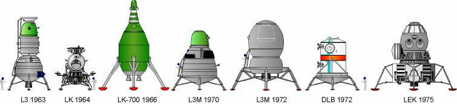

\usepackage{ulem}

\usepackage{ulem}

*********************************
Rys historyczny lotów kosmicznych
*********************************

Pionierzy kosmonautyki
======================
Erę rakietową rozpoczęła publikacja tzw. wzoru Ciołkowskiego w 1903 roku określającego prędkość rakiety zmieniającej masę (zużywającej paliwo podczas lotu). Wzór ten został opublikowany w książce "Badanie przestrzeni świata przy pomocy urządzeń odrzutowych" :cite:`Ciolkowski1967`. Do pierwszych pionierów kosmonautyki wykorzystujących podstawy teoretyczne stworzone przez Ciołkowskiego zalicza się:

- dr Robert H. Goddard (USA),
- Siergiej Korolew (ZSSR),
- Hermann Oberth (Niemcy),
- Robert Albert Charles Esnault-Pelterie (Francja).

Prowadzili badania zarówno nad materiałami pędnymi, paliwami stałymi i ciekłymi oraz aerodynamiką rakiet. 16 marca 1926 roku Robert H. Goddard pomyślnie wystrzelił pierwszą na świecie rakietę napędzaną na paliwo ciekłe :cite:`Goddard-American-Rocketry-Pioneer`.

Podczas II wojny światowej prowadzono wiele badań wykorzystujących paliwo płynne. Stworzona przez Wernera von Brauna rakieta "Vergeltungswaffe 2" znana jako V-2 była pierwszą na świecie rakietą dalekiego zasięgu. Wykorzystywana głównie jako broń do bombardowania miast sojuszu alianckiego posłużyła również do testu, w którym po raz pierwszy udało się przekroczyć linię Karmana, tj. osiągnąć przestrzeń kosmiczną.

Wyścig kosmiczny
================
Po drugiej wojnie światowej wyścig zbrojeń przerodził się w tzw. zimną wojnę pomiędzy Stanami Zjednoczonymi Ameryki i Związkiem Socjalistycznych Republik Radzieckich. Za oficjalną datę rozpoczęcia wyścigu kosmicznego (ang. *Space Race*) przyjmuje się dzień drugiego sierpnia 1955 roku. Tego dnia Związek Radziecki odpowiedział na ogłoszoną przez rząd USA cztery dni wcześniej deklarację zamiaru wystrzelenia sztucznego satelity z okazji międzynarodowego roku geofizyki :cite:`Space-Race`.

Wystrzelony 4 października 1957 należący do ZSSR Sputnik został pierwszym sztucznym satelitą Ziemi. To wydarzenie zapoczątkowało serię sukcesów Związku Socjalistycznych Republik Radzieckich w kosmosie, do których należały:

- pierwsze wystrzelenie zwierzęcia (pies Łaika, 3 październik 1957),
- pierwsze bezzałogowe lądowanie na Księżycu (Luna 2, 13 września 1959) :cite:`Shelton1969`,
- wystrzelenie oraz orbitowanie pierwszego człowieka (J. Gagarin, 12 kwietnia 1961),
- pierwsza doba na orbicie (G. Titow, 6 sierpnia 1961),
- pierwsza kobieta w kosmosie (W. Tierieszkowa, 16 Czerwiec 1963),
- pierwszy spacer kosmiczny (A. Leonow, 18 marzec 1965),
- pierwsze zwierzęta na orbicie Księżyca (Zond 5, 15 września 1968) :cite:`Siddiqi2000`.

Pierwszym zwierzęciem, które przekroczyło linię graniczną kosmosu był pies Łajka wystrzelony za pomocą rakiety *Sputnik 8K71PS* w kapsule *Sputnik 2* :cite:`Siddiqi2000`. Ze względu na wysoką temperaturę spowodowaną uszkodzeniem i niepełnym rozczepieniem członu rakiety od satelity zwierze zdechło po kilku godzinach od startu. Pies planowo miał żyć na orbicie 10 dni. Po około 2000 orbit w ciągu 162 dni kapsuła z martwym ciałem weszła w atmosferę i spłonęła :cite:`Harford1997`.

Pierwszym człowiekiem w kosmosie był major Yuri Gagarin (awansowany później na pułkownika). Został wystrzelony przez Związek Radziecki 12 kwietnia 1961 w 108 minutowy orbitalny wokół Ziemi na pokładzie *Vostok 1*. Gagarin był jednym z 20 osób, które zostały wybrane wśród pilotów wojskowych Związku Radzieckiego :cite:`Siddiqi2000`. Wg. podań świadków major wyróżniał się wytrzymałością, duchem oraz doświadczeniem. Wśród wszyskich rekrutowanych kosmonautów przeprowadzono ankietę, w której zadano pytanie "kogo wytypowałbyś na pierwszy lot". Osiemnaście na dwadzieścia osób z załogi wybrało Gagarina. Major po okrążeniu Ziemi wszedł ponownie w atmosferę w tzw. krzywej balistycznej cechującej się wysokim poziomem przeciążeń działających na ciało kosmonauty. Ze względu na fakt, iż Radzieccy konstruktorzy nie dysponowali jeszcze techniką aby bezpiecznie wylądować statekiem kosmicznym na ziemi zdecydowano się na użycie fotela katapultowego i spadochronu. Na poziomie 20 000 stóp nad poziomem morza (ok. 6 tys. metrów) Gagarin katapultował się z kapsuły i bezpiecznie wrócił na powierzchnię :cite:`Why-Yuri-Gagarin-Remains-the-First-Man-in-Space`.

Krótki rys historyczny programów kosmicznych NASA
=================================================
Amerykańską odpowiedzią na wydarzenie wysłania Gagarina w kosmos był program *Mercury*. W trakcie programu wybrano siedmiu astronautów. 12 września 1962 - pół roku po locie Alana Sheparda, pierwszego amerykańskiego astronauty, aby zażegnać widmo porażki w kosmicznym wyścigu prezydent Stanów Zjednoczonych Ameryki J. F. Kennedy wygłosił mowę na Uniwersytecie Rice :cite:`Kennedy1962`, w której zmobilizował naród i postawił cel, aby "do końca dekady człowiek postawił nogę na Księżycu i bezpiecznie wrócił na Ziemię". Cel ten udało się zrealizować w 1969 roku, gdy amerykański astronauta Neil Armstrong stanął na naturalnym satelicie Ziemi.

Do najważniejszych amerykańskich programów należą:

- program Mercury,
- program Gemini,
- program Apollo,
- program Skylab (Apollo application),
- program Space Shuttle,
- uczestnictwo w programie ISS.

Poniższe rozdziały krótko charakteryzują każdy z głównych programów.

Projekt Mercury
---------------
Głównym celem programu Mercury trwającego od 1958 do 1963 było wyniesienie pierwszego obywatela USA w przestrzeń kosmiczną. Program ten wykorzystywał technologię opracowaną przez US Army tj. rakiety *Redstone* i w późniejszej fazie rakiety interkontynentalne *Atlas LV-3B* stworzone dla US Air Force :cite:`History-of-Project-Mercury`, :cite:`Madrigal2013`, :cite:`Wolfe1979`.

Program Mercury zakładał wysłanie zwierzęcia przed pierwszym lotem człowieka. Ze względu na bardzo wiele wspólnych cech z człowiekiem wybrano szympansa (DNA szympansa jest w 98,4% identyczne z człowiekiem co czyni go najbliższym odpowiednikiem z królestwa zwierząt. Szympans nazywał się HAM co jest skrótem od Holloman Aerospace Medical Center, zlokalizowanego w Holloman Air Force Base w New Mexico w USA :cite:`History-of-Project-Mercury`, :cite:`Human-Origins-Genetic-Evidence`).

W dniu 9 kwietnia 1959, NASA przedstawiła pierwszą grupę astronautów tzw. *Mercury 7* (:numref:`figure-selection-mercury`). Nazwiska astronautów, znak wywoławczy oraz datę wystrzelenia przedstawia tabela :numref:`table-mercury-astronauts`:

.. csv-table:: Astronauci programu Mercury wraz z czasem lotu oraz znakiem wywoławczym kapsuły :cite:`Manned-Space-from-Mercury-to-the-Shuttle`
    :name: table-mercury-astronauts
    :file: ../data/selection-mercury.csv
    :header-rows: 1

.. figure:: ../img/selection-mercury.jpg
    :name: figure-selection-mercury
    :scale: 7%
    :align: center

    Astronauci programu *Mercury* tzw. *Original Seven*. Pierwszy rząd, od lewej do prawej: Walter M. Schirra, Jr., Donald K. "Deke" Slayton, John H. Glenn, Jr., and M. Scott Carpenter; tylny rząd, Alan B. Shepard, Jr., Virgil I. "Gus" Grissom, L. Gordon Cooper, Jr. źródło: NASA :cite:`Mercury7`.

Z przyczyn zdrowotnych Deke Slayton został zdyskwalifikowany z udziału w programie *Mercury* i uziemiony. Przez trzynaście lat od czasu pierwszego lotu Sheparda, Deke Slayton kierował *Astronauts Office* (ang. biurem astronautów i przydziału do misji), które zostało przemianowane później na *Flight Crew Operations Office* (ang. biuro operacji personelu latającego). Slayton po ostatecznym przejściu badań medycznych wziął udział w ostatnim locie programu *Apollo* tj. *Apollo-Souyz*. W tym locie doszło do historycznego dokowania na orbicie okołoziemskiej statków *Apollo* i *Soyuz* oraz do symbolicznego uściśnięcia dłoni przedstawicieli USA i ZSSR :cite:`MercuryChronology2014`, :cite:`History-of-Project-Mercury`.

Projekt Gemini
--------------
W celu sprostania wymaganiom postawionym przez prezydenta J. F. Kennedy'ego dotyczącego wysłania człowieka na Księżyc :cite:`Kennedy1962` konieczne było stworzenie programu pomostowego pomiędzy programami *Mercury* oraz *Apollo*. Celem programy miało być stworzenie i przetestowanie technologii umożliwiającej realizację lotu Księżycowego. Głównymi celami programu były:

- demonstracja wytrzymałości człowieka i ekwipunku w lotach kosmicznych trwających minimum 8 dni aż do 14 dni,
- zbliżenie (ang. *randevouz*) i dokowanie (ang. *docking*) dwóch statków kosmicznych oraz manewrowanie połączonym zespołem na robicie używając system napędowy docelowego pojazdu,
- demonstracja spacerów kosmicznych (ang. *Extra-Vehicular Activity*, *EVA*) na zewnątrz pojazdu wraz z pokaaniem możliwości wykonywania operacji przez astronautę w ciśnieniowym skafandrze :cite:`NASAGeminiIV`,
- udoskonalenie procedury wejścia w atmosferę (ang. *re-entry*) i precyzyjnego lądowania w określonym miejscu :cite:`Kranz2001`.

Amerykańska agencja kosmiczna NASA podczas projektu Gemini przeprowadziła dwa nabory na astronautów (:numref:`figure-selection-gemini-1`, :numref:`figure-selection-gemini-2`).

.. csv-table:: Astronauci programu Gemini :cite:`Manned-Space-from-Mercury-to-the-Shuttle`
    :name: table-selection-gemini
    :file: ../data/selection-gemini.csv
    :header-rows: 1

.. figure:: ../img/selection-gemini-1.jpg
    :name: figure-selection-gemini-1
    :scale: 20%
    :align: center

    Astronauci pierwszego naboru do programu *Gemini*. Rząd z tyłu, od lewej: See, McDivitt, Lovell, White, Stafford. Rząd z przodu: Conrad, Borman, Armstrong, Young. Źródło: NASA/JSC

    Astronauci drugiego naboru do programu *Gemini*. Rząd z tyłu, od lewej: Collins, Cunningham, Eisele, Freeman, Gordon, Schweickart, Scott, Williams. Rząd z przodu: Aldrin, Anders, Bassett, Bean, Cernan, Chaffee. Źródło: NASA/JSC

Podczas przygotowań do misji *Gemini 12* amerynański astronauta Buzz Aldrin jako pierwszy wykorzystał techiniki nurkowania w celu symulacji spacerów kosmicznych co zapoczątkowało rozpoczęcie badań i stworzenie ośrodków pływalności neutralnej (ang. *NBL - Neutral Buoyancy Laboratory*).

Program Apollo
--------------
Najbardziej ambitnym programem w historii astronautyki był program *Apollo*. W ciągu niespełna dekady udało się opracować technologię oraz procedury pozwalające człowiekowi stanąć na powierzchni Księżyca i bezpiecznie powrócić na Ziemię. Program *Apollo* był próbą realizacji oświadczenia prezydenta USA J. F. Kennedy'ego z 12 września 1962 roku :cite:`Kennedy1962`.

.. csv-table:: Astronauci programu Apollo :cite:`Manned-Space-from-Mercury-to-the-Shuttle`
    :name: table-selection-apollo
    :file: ../data/selection-apollo.csv
    :header-rows: 1

.. figure:: ../img/selection-apollo.jpg
    :name: figure-selection-apollo
    :scale: 65%
    :align: center

    Astronauci pierwszego naboru do programu *Apollo*. Back, Swigert, Pogue, Evans, Weitz, Irwin, Carr, Roosa, Worden, Mattingly, Lousma. Front, Givens, Mitchell, Duke, Lind, Haise, Engle, Brand, Bull, McCandless. Źródło: NASA/JSC

:numref:`table-selection-apollo` przedstawia listę astronautów programu Apollo wraz z przydziałem do misji oraz datami pobytu na Księżycu :cite:`FrenchBurgess2007`, :cite:`AldrinAbraham2009`.

Każda z misji programu Apollo cechowała się innym zadaniem w zależności od kategorii do której była przydzielona :cite:`ApolloChronology2007`. :numref:`table-apollo-mission-types` przedstawia typy misji oraz opis każdej z kategorii.

.. csv-table:: Typy misji w ramach programu Apollo :cite:`ApolloChronology2007`
    :name: table-apollo-mission-types
    :file: ../data/apollo-mission-types.csv
    :header-rows: 1
    :widths: 10, 90

Krótka charakterystyka misji *Apollo*:

- Apollo 1 - pożar przy rutynowym teście, załoga poniosła śmierć,
- Apollo 7 - pierwszy start rakiety *Saturn V* z astronautami w module dowodzenia (ang. *Command Module*) :cite:`Eisele2017`, :cite:`Cunningham2010`,
- Apollo 8 - pierwsze orbitowanie Księżyca, ikoniczne zdjęcie wschodu Ziemi (ang. *Lunar Earthrise*),
- Apollo 10 - pełny test do misji typu *G*, zbliżenie się na 8.4 NM (15.6 km) do Księżyca,
- Apollo 11 - pierwsze lądodanie na Księżycu,
- Apollo 12 - najbardziej dokładne lądowanie w programie *Apollo*, przejęcie kamery lądownika Surveyor 3, który lądował dwa lata wcześniej (20 kwietnia 1967),
- Apollo 13 - wybuch zbiornika z tlenem i dramatyczna walka z czasem aby sprowadzić załogę na Ziemię,
- Apollo 14 - najstarszy astronauta na Księżycu, pierwsza gra w golfa,
- Apollo 15 - pierwsze wykorzystanie pojazdu na powierzchni Księżyca,
- Apollo 16 - pierwsza misjia trzydniowa na Księżycu (typ *J*)
- Apollo 17 - ostatnie lądowanie na Księżycu (pierwsza misja w której brał udział naukowiec - geolog), ikoniczne zdjęcie Ziemii z daleka (ang. *Blue Marble*) :cite:`Cernan2000`,
- Apollo-Soyuz Test Project - ostatnia misja programu, podczas której doszło do dokowania na orbicie statków *Apollo* oraz *Soyuz* i historycznego uścisku dłoni między reprezentatmi dwóch mocarstw.

Program Skylab
--------------
W trakcie ostatnich misji programu Apollo został powołany zespół *Apollo Applications Program* (AAP), którego celem było stworzenie planu wykorzystania technologii wytworzonych na potrzeby misji księżycowych w dalszej eksploracji kosmosu :cite:`ApolloChronology2007`. Głównym celem kolejnych programów NASA było zagospodarowanie niskiej orbity okołaziemskiej (ang. *LEO - Low Earth Orbit*). Pierwszym głównym programem realizującym cele nowej strategii był *Skylab* (1973-1979). Jego głownym założeniem była budowa stacji kosmicznej i test wpływu długotrwałego pobytu w przestrzeni kosmicznej na organizm człowieka. Program *Skylab* odziedziczył rakiety *Saturn V*, które posłużyły nie tylko wynoszeniu elementów konstrukcji na orbitę, ale również po przekształceniu górnego stopnia rakiety stworzyły podstawę budowy stacji.

Astronauci do stacji *Skylab* byli wynoszeni w *Apollo Command/Service Module* (CSM) stworzonym na potrzeby realizacji programu *Apollo* i załgowych misji na Księżyc.

Wśród najważniejszych osągnięć programu *Skylab* można zaliczyć:

- rozwinięcie technologii i procedur spacerów kosmicznych (*EVA*),
- dopracowanie konstrukcji skafandra kosmicznego,
- badanie długotrwałego wpływu środowiska mikrograwitacji na organizm człowieka,
- obserwacja słońca za pomocą *Apollo Telescope Mount* (wielospektralne słoneczne obserwatorium,
- dopracowanie konstrukcji portów dokowania,
- opracowanie technologii śluz powietrznych,
- pierwsza kontrolowana deorbitacja dużej konstrukcji.

Program Space Shuttle
---------------------
Jendym z najbardziej ikoninych programów kosmicznych jest *Space Transportation System* czyli tzw. prom kosmiczny (ang. *Space Shuttle*). Podczas tego programu stworzono reużywalny statek kosmiczny w kształcie przypominający samolot, który był w stanie wynosić na orbitę 27,5 metrycznej tony ładunku oraz załogą do 8 osób (misja *STS-61A*).

W trakcie programu Space Shuttle stworzono orbitery :cite:`NASASpaceShuttle`:

- Enterprise (1976) używany do testów podejścia i lądowania, nigdy nie osiągnął orbity,
- Columbia (1981) pierwszy prom, który osiągnął orbitę Ziemii, uległ zniszczeniu w 2003 roku przy wejściu w atmosferę, cała siedmioosobowa załoga została utracona,
- Challenger (1983) drugi prom który osiągnął orbitę, uległ zniszczeniu w 1986 przy starcie, cała siedmioosobowa załoga została utracona, zastąpiony później przez *Endeavour*,
- Discovery (1984), trzeci orbiter, 27 lat służby, 39 lotów,
- Atlantis (1985), czwarty orbiter, 33 misje, 4848 orbit, 203 mln km,
- Endeavour (1992), ostatni orbiter, 25 misji, 4671 orbit, 198 mln km.

.. figure:: ../img/spacecraft-space-shuttle-and-soyuz.png
    :name: figure-spacecraft-space-shuttle-and-soyuz
    :scale: 10%
    :align: center

    Rysunenk przedstawia skalę amerykańskiego promu kosmicznego *Space Shuttle* oraz rosyjskiego statku *Soyuz TMA* :cite:`Portree1995`

Program Space Shuttle pozwolił na zwiększenie częstotliwości lotów załogowych na niską orbitę okołoziemską. Dzięki promom kosmicznym i misjom *STS* stany zjednoczone osiągnęły bardzo wysoki poziom sprawności operacyjnej oraz ogromną przewagę w ilości wyszkolonych astronautów oraz osób, które odbyły lot w kosmos. Promy przyczyniły się również do budowy Międzynarodowej Stacji Kosmicznej oraz wyniesieniu i późniejszemu serwisowaniu teleskopu Hubble.

Podczas lotów promów kosmicznych amerykańska agencja NASA opracowała program szkolenia astronautów, który stał się podstawą dzisiejszych treningów. Opracowano również skafander *EMU - Extravehicular Mobility Unit* (modyfikacja skafandra *A7L* wykorzystywanego w programie *Apollo*), który znajduje zastosowanie w misjach kosmicznych aż po dziś dzień w programie Międzynarodowej Stacji Kosmicznej.

Krótki rys historyczny programów kosmicznych ZSRR i Federacji Rosyjskiej
========================================================================
*Związek Socjalistycznych Republik Radzieckich* wiódł prym w tematach kosmicznych i do czasu pierwszych kroków Neila Armstonga technologia radziecka była uważana za dominującą. Wśród najważniejszych programów *ZSRR* i późniejszej Federacji Rosyjskiej można wymienić:

- program *Wostok*,
- program *Woshod*,
- program *Soyuz* i *Progress*,
- program Księżycowy (*N1-LK*),
- program *Salyut*,
- program *Interkosmos*,
- program *Buran*,
- stacja kosmiczna *Mir*,
- uczestnictwo w programie *ISS*.

Program Wostok
--------------
Wostok był pierwszym załogowym programem kosmonautycznym w *Związku Socjalistycznych Republik Radzieckich*. Punktem kulminacyjnym programu był lot 12 kwietnia 1961 roku radzieckiego majora Jurija Gagarina - pierwszego człowieka w kosmosie.

W trakcie trwania programu 1961 do 1963 roku odbyło się 6 lotów załogowych a najdłuższy trwał 5 dni. Cztery ostatnie loty były wystrzeliwane parami w odstępie jednego dnia od siebie.

.. figure:: ../img/spacecraft-comparision-mercury-gemini-vostok-voshod.jpg
    :name: spacecraft-comparision-mercury-gemini-vostok-voshod
    :scale: 75%
    :align: center

    Schemat porównawczy statków *Mercury*, *Gemini*, *Wostok* i *Woshod*. Źródło: Wikipedia

.. csv-table:: Lista kosmonautów programu Wostok wraz z wiekiem w czasie selekcji :cite:`Siddiqi2000`
    :name: table-wostok-cosmonauts
    :file: ../data/wostok-cosmonauts.csv
    :header-rows: 1

.. csv-table:: Lista lotów programu Wostok :cite:`Siddiqi2000`
    :name: table-wostok-flights
    :file: ../data/wostok-flights.csv
    :header-rows: 1

Program Woshod
--------------
Program *Woshod* był kontunuatorem programu *Wostok*. Wprowadzał modyfikację do kapsuły, wzrost jej objętości, oraz zwięszkenie załogi do trzech osób i powiększenie rakiety nosiciela. Odbyły się dwa loty w ramach programu w latach 1964 i 1965.

Największym dokonaniem podczas programu *Woshod* było pierwsze wyjście człowieka w otwarty kosmos, tzw. *EVA*. Dokonał tego rosyjski kosmonauta Alexey Leonov 18 marca 1965 roku. Pierwsze wyjście trwało 12 minut i niemalże zakończyło się śmiercią kosmonauty, gdyż jego skafander ze względu na różnicę ciśnień spuchł do rozmarów niepozwalających na powrót do śluzy. Leonov rozhermetyzował skafander i upuścił powietrze w skutek czego nabrał możliwości wejścia do kapsuły.

.. csv-table:: Lista lotów programu Woshod :cite:`Siddiqi2000`
    :name: table-wosohod-flights
    :file: ../data/woshod-flights.csv
    :header-rows: 1

.. figure:: ../img/spacecraft-voshod-2.png
    :name: figure-voshod-2
    :scale: 75%
    :align: center

    Schemat statku Voshod. Źródło: Wikipedia

Program Soyuz i Progress
------------------------
Program *Soyuz* jest jednym z najdłużej trwających programów kosmicznych. Był bezpośrednim następcą programu *Woshod* i rozpoczął się w połowie lat sześćdziesiątych XX wieku. Pierwotnie celem programu miało być stworzenie podstaw do lotów Księżycowych, ale później wymagania zostały zmienione.

Program *Soyuz* w swoich kolejnych modyfikacjach trwa do dziś. Jest najbardziej niezawodnym statkiem kosmicznym, a od czasu wycofania z użycia ameryksńskich promów *Space Shuttle* jest jedynym środkiem transportu do i z *Międzynarodowej Stacji Kosmicznej*. Więcej na temat programu w rozdziale poświęconym :ref:`szkoleniu w pilotowaniu statku kosmicznego Soyuz <pilotaz>`.

Równocześnie z kapsułą załogową *Soyuz* tworzona była jej bezzałogowa wersja *Progress*. Podobnie jak *Soyuz* tak i *Progress* jest wciąż użytkowany i stanowi główne źródło zaopatrzenia dla *ISS*.

Program Księżycowy
------------------
*ZSRR* konkurował ze stanami zjednoczonymi w ramach wyścigu kosmicznego. Apogeum całego *Space Race* miał być załogowy lot na Księżyc. W tym celu Główny Konstruktor Siergiej Pawłowicz Korolew rozpoczął pracę nad rakietą *N1*. Rakieta ta w przeciwieństwie do podejścia amerykańskiego składała się z 5 segmentów (ang. *stage*) oraz 30 silników pierwszego poziomu. Ze względu na złożoność systemu rakieta eksplodowała przy starcie. Po czwartym podejściu i utracie nosiciela, zmianie geopolitycznej, przegraniu wyścigu kosmicznego Komitet Centralny Partii postanowił zamknąć program.

W ramach programu stworzony został lądownik LK przedstawiony na obrazku :numref:`figure-spacecraft-lk-models`.

.. csv-table:: Lista kosmonautów przypisanych do grup szkoleniowych w ramach programu księżycowego :cite:`Kamanin-Diaries`
    :name: table-lk-astronauts
    :file: ../data/lk-astronauts.csv
    :header-rows: 1
    :widths: 10, 90

    Różne prototypy lądowników księżycowych w ramach programu załogowego *ZSRR*. Źródło: Astronautics/Mark Wade :cite:`SovietMannedLunarProjects`

Program Salyut
--------------
Pierwszym w historii programem orbitalnej stacji kosmicznej był *Salyut*. Konstrukcja stacji była jednomodułowa i wynoszona na orbitę za pomocą rakiety nośnej. Kosmonaucji za pomocą statków *Soyuz* dokowali do stacji, gdzie prowadzili badania nad efektami długotrwałego pobytu w stanie mikrograwitacji na organizm człowieka. Program również nosił nazwę Długoczasowa Stacja Orbitalna (ros. *DOS - Dołgowriemiennaja Orbitalnaja Stancija*) a równcześnie z nim był tworzony wojskowy program *Ałmaz* (ros. *Diament*).

Stacje wyposażone były w port dokowania dzięki, któremu zarówno załogowe jak i bezzałogowe statki *Progress* mogły dołączać do stacji i zaopatrywać ją w paliwo, tlen i inne zasoby.

    Schemat stacji kosmicznej Salyut 6. Źródło: Wikipedia

.. csv-table:: Lista stacji kosmicznych w ramach programu Salyut/Ałmaz/Mir. Źródło: Wikipedia
    :name: table-salyut-timeline
    :file: ../data/salyut-timeline.csv
    :header-rows: 1

Program Interkosmos i lot generała Hermaszewskiego
--------------------------------------------------
W ramach zjazdu przedstaicieli krajów socjalistycznych w Moskwie 5-13 kwietnia 1967 roku przyjęto program współpracy w zakresie eksploracji kosmosu - *Interkosmos*. W ramach programu odbywały się loty zarówno załogowe jak i bezzałogowe. Głównym założeniem współpracy było korzystanie z infrastruktury naziemnej oraz  rakiet radzieckiego programu kosmonautycznego. Międzynarodowa współpraca miała dotyczyć badań naukowych oraz lotów załóg. Prawną stronę porozumienia i działania państw członkowskich regulował dokument zawarty 13 lipca 1976 roku. Porozumienie obowiązywało od 25 marca 1977 roku.

Głównym celem programu *Interkosmos* były badania naukowe w obszarach:

- fizyki kosmicznej,
- meteorologii,
- łączności,
- biologii,
- medycyny kosmicznej

W ramach programu odbywały się międzynarodowe loty załogowe, które umożliwiły kosmonautom z poza *ZSRR* oraz *USA* lot w kosmos. Pierwszym kosmonautom nie będącym obywatelem powyższych państw był czech Vladimír Remek, który poleciał 2 marca 1978 roku. Drugą osobą był generał Mirosław Hermaszewski (27 czerwca 1978). :numref:`table-selection-interkosmos` przedstawia listę kosmonautów programu *Interkosmos*.

.. todo:: http://www.spacepatches.nl/salyut_frame.html

    Państwa uczestniczące w ramach programu *Interkosmos*. Źródło: Wikipedia

.. csv-table:: Lista kosmonautów w ramach programu *Interkosmos*. Źródło: Wikipedia
    :name: table-selection-interkosmos
    :file: ../data/selection-interkosmos.csv
    :header-rows: 1

Program Buran
-------------
Program *Buran* był odpwiedzią na amerykański program *Space Shuttle*. Pojazd, który został stworzony był podobny wizualnie, ale znacząco się różnił i przewyższał osiągami promy *STS*. W ramach programu została stworzona również rakieta *Energia*, która wykorzystywała zmodyfikowane silniki *RD-170* z programu *N1*.  *Buran* wykonał jeden lot testowy 15 listopada 1988 bez załogi podczas, którego wykonał dwa okrążenia Ziemii i dokonał autonomicznego lądowania na pasie startowym *Site 251* - *Yubileyniy Airfield* otrzymując precyzję lądowania na poziomie 10m w osi pasa.

Ze względów geopolitycznych program został zamknięty, a odbitery trafiły do hangaru na kosmodromie Bajkonur oraz do muzeum techniki w niemieckim mieście Speyer. W maju 2002 ze względu na obciążenia dachu wywołane potężną burzą dach hangaru, w którym przebywał *Buran* oraz rakieta nosiciel *Energia* zawalił się niszcząc prom.

    Zestawienie porównawcze rakiety *Soyuz*, *Space Shuttle* oraz *Energia-Buran*. Źródło: Wikipedia

Stacja kosmiczna Mir
--------------------
Stacja kosmiczna *Mir* (ros. *Pokój*) była bezpośrednim kontynuatorem programu *Salyut* i pierwowzorem dla *ISS*. Początkowo służyła wyłącznie kosmonautom *ZSRR* oraz w ramach programu *Interkosmos*. Po upadku Związku Radzieckiego umożliwiono loty międzynarodowych załóg. Podczas ponad 15 lat pracy na orbicie gościła 28 stałych załóg i wiele tymczasowych pobytów amerykańskich promów *Space Shuttle*.

Jej konstrukcja rozpoczęła się od przeniesienia zasobów dostarczonych przez *Progress 25* i *Progress 26*. Zadanie wykonała załoga *Soyuz T-15* (Leonid Kizim, Władimir Sołowjow). Ponadto podczas 50 dniowego pobytu załoga również odwiedziła stację *Salyut 7* w celu przewiezienia części wyposażenia na *Mir*. Na chwilę obecną jest to jedyny przypadek w historii aby astronauci podczas jednego lotu odwiedzili dwie stacje.

    Schemat stacji kosmicznej *Mir*. Źródło: Wikipedia

Międzynarodowa Stacja Kosmiczna
===============================
Program międzynarodowej stacji rozpoczął się od połączenia konceptu projektów *Freedom* (ang. wolność) oraz *Mir-2* (*DOS-8*). Następnie przekształcił się w pierwszą międzynarodową stację badawczą o nazwie *Internationl Space Station*. Budowa rozpoczęła się od umieszczenia rosyjskich modułów w 1998 roku. Pierwsza załoga przyleciała 2 listopada 2000 roku. Od tego czasu stacja jest stale zamieszkiwana przez załogi 3 lub 6 osobowe w ramach tzw. ekspedycji. Temat *ISS* szczegółowo przedstawiono w części dotyczącej :ref:`przygotowania załóg do lotów na jej pokład <iss>`.

    Schemat stacji kosmicznej *ISS*. Źródło: Wikipedia

Najdłuższy pobyt w przestrzeni kosmicznej
=========================================
Najdłuższy pobyt w przestrzeni kosmicznej zanotował kosmonauta Roscosmos Dr. Valeri Polyakov, który spędził jednorazowo 437 dni, 17 godzin i 38 minut (14 miesięcy). Podbyt odbył się na Rosyjskiej stacji *MIR* od stycznia 1994 roku do marca 1995.

Największy kumulacyjny nalot zgdomadził kosmonauta Roscosmos Gennady Padalka, który przybywał łącznie 879 dni na orbicie podczas 5 lotów kosmicznycj.

Największy kumulacyjnie czas spędzony podczas *EVA* zanotował kosmonauta Roscosmos Anatoly Solovyev, który przebywał łącznie 82 godziny 22 minuty w trakcie 16 spacerów kosmicznych. Kosmonauta ten jest również osobą, która wykonała najwięcej spacerów kosmicznych w historii.
