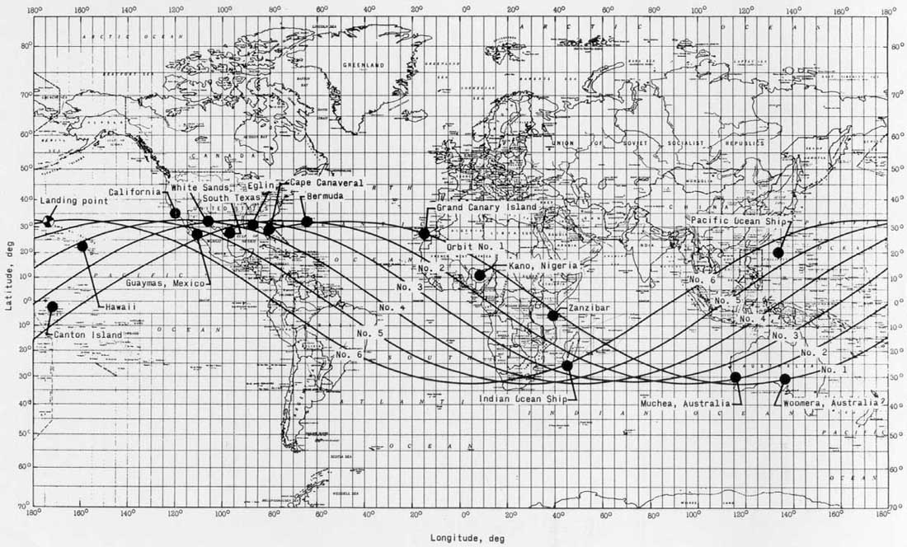
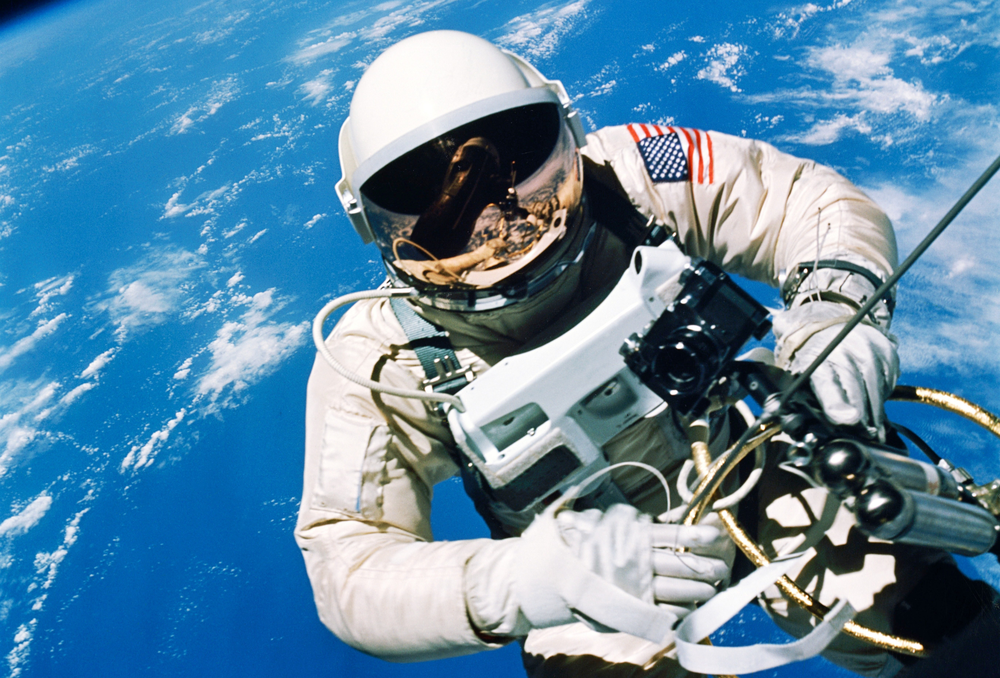
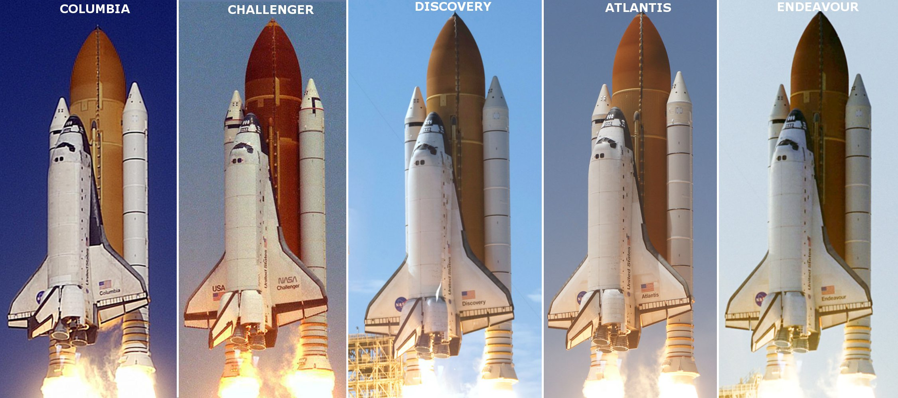

*********************************
Rys historyczny lotów kosmicznych
*********************************

Pionierzy kosmonautyki
======================
Erę rakietową rozpoczęła publikacja tzw. wzoru Ciołkowskiego w 1903 roku określającego prędkość rakiety zmieniającej masę (zużywającej paliwo podczas lotu). Wzór ten został opublikowany w książce "Badanie przestrzeni świata przy pomocy urządzeń odrzutowych" :cite:`Ciolkowski`. Do pierwszych pionierów kosmonautyki wykorzystujących podstawy teoretyczne stworzone przez Ciołkowskiego zalicza się:

- dr Robert H. Goddard (USA),
- Siergiej Korolew (ZSSR),
- Hermann Oberth (Niemcy),
- Robert Albert Charles Esnault-Pelterie (Francja).

Prowadzili badania zarówno nad materiałami pędnymi, paliwami stałymi i ciekłymi oraz aerodynamiką rakiet. 16 marca 1926 roku Robert H. Goddard pomyślnie wystrzelił pierwszą na świecie rakietę napędzaną na paliwo ciekłe :cite:`Goddard-American-Rocketry-Pioneer`.

Podczas II wojny światowej prowadzono wiele badań wykorzystujących paliwo płynne. Stworzona przez Wernera von Brauna rakieta "Vergeltungswaffe 2" znana jako V-2 była pierwszą na świecie rakietą dalekiego zasięgu. Wykorzystywana głównie jako broń do bombardowania miast sojuszu alianckiego posłużyła również do testu, w którym po raz pierwszy udało się przekroczyć linię Karmana, tj. osiągnąć przestrzeń kosmiczną.

Wyścig kosmiczny
================
Po drugiej wojnie światowej wyścig zbrojeń przerodził się w tzw. zimną wojnę pomiędzy Stanami Zjednoczonymi Ameryki i Związkiem Socjalistycznych Republik Radzieckich. Za oficjalną datę rozpoczęcia wyścigu kosmicznego (ang. Space Race) przyjmuje się dzień drugiego sierpnia 1955 roku. Tego dnia Związek Radziecki odpowiedział na ogłoszoną przez rząd USA cztery dni wcześniej deklarację zamiaru wystrzelenia sztucznego satelity z okazji międzynarodowego roku geofizyki :cite:`Space-Race`.

Wystrzelony 4 października 1957 należący do ZSSR Sputnik został pierwszym sztucznym satelitą Ziemi. To wydarzenie zapoczątkowało serię sukcesów Związku Socjalistycznych Republik Radzieckich w kosmosie, do których należały:

- pierwsze wystrzelenie zwierzęcia (pies Łaika, 3 październik 1957),
- pierwsze bezzałogowe lądowanie na Księżycu (Luna 2, 13 września 1959) :cite:`Zond2`,
- wystrzelenie oraz orbitowanie pierwszego człowieka (J. Gagarin, 12 kwietnia 1961),
- pierwsza doba na orbicie (G. Titow, 6 sierpnia 1961),
- pierwsza kobieta w kosmosie (W. Tierieszkowa, 16 Czerwiec 1963),
- pierwszy spacer kosmiczny (A. Leonow, 18 marzec 1965),
- pierwsze zwierzęta na orbicie Księżyca (Zond 5, 15 września 1968) :cite:`Soviet-Union-Space-Race`.

Aby zażegnać widmo porażki prezydent Stanów Zjednoczonych Ameryki J. F. Kennedy 12 września 1962 roku wygłosił mowę na Uniwersytecie Rice :cite:`Moon-Speach-Rice-Stadium`, w której zmobilizował naród i postawił cel, aby "do końca dekady człowiek postawił nogę na księżycu i bezpiecznie wrócił na Ziemię". Cel ten udało się zrealizować w 1969 roku, gdy amerykański astronauta Neil Armstrong stanął na Księżycu.

Pierwszym zwierzęciem, które przekroczyło linię graniczną kosmosu był pies Łajka wystrzelony za pomocą rakiety *Sputnik 8K71PS* w kapsule *Sputnik 2* :cite:`Soviet-Union-Space-Race`. Ze względu na wysoką temperaturę spowodowaną uszkodzeniem i niepełnym rozczepieniem członu rakiety od satelity zwierze zdechło po kilku godzinach od startu. Pies planowo miał żyć na orbicie 10 dni. Po około 2000 orbit w ciągu 162 dni kapsuła z martwym ciałem weszła w atmosferę i spłonęła :cite:`Korolev-How-One-Man-Masterminded-the-Soviet-Drive-to-Beat-America-to-the-Moon`.

Pierwszym człowiekiem w kosmosie był major Yuri Gagarin (awansowany później na pułkownika). Został wystrzelony przez Związek Radziecki 12 kwietnia 1961 w 108 minutowy orbitalny wokół Ziemi na pokładzie *Vostok 1*. Gagarin był jednym z 20 osób, które zostały wybrane wśród pilotów wojskowych Związku Radzieckiego :cite:`Soviet-Union-Space-Race`. Wg. podań świadków major wyróżniał się wytrzymałością, duchem oraz doświadczeniem. Wśród wszyskich rekrutowanych kosmonautów przeprowadzono ankietę, w której zadano pytanie "kogo wytypowałbyś na pierwszy lot". Osiemnaście na dwadzieścia osób z załogi wybrało Gagarina. Major po okrążeniu Ziemi wszedł ponownie w atmosferę w tzw. krzywej balistycznej cechującej się wysokim poziomem przeciążeń działających na ciało kosmonauty. Ze względu na fakt, iż Radzieccy konstruktorzy nie dysponowali jeszcze techniką aby bezpiecznie wylądować statekiem kosmicznym na ziemi zdecydowano się na użycie fotela katapultowego i spadochronu. Na poziomie 20 000 stóp nad poziomem morza (ok. 6 tys. metrów) Gagarin katapultował się z kapsuły i bezpiecznie wrócił na powierzchnię :cite:`Why-Yuri-Gagarin-Remains-the-First-Man-in-Space`.

Amerykańską odpowiedzią na to wydarzenie był program *Mercury*. W trakcie programu wybrano siedmiu astronautów.

Rys historyczny programów kosmicznych NASA
==========================================
W skład amerykańskiego programu kosmonatycznego wchodzą projekty:

- Mercury,
- Gemini,
- Apollo,
- Skylab (Apollo application),
- Space Shuttle,
- ISS.

Projekt Mercury
---------------
Głównym celem programu Mercury trwającego od 1958 do 1963 było wyniesienie pierwszego obywatela USA w przestrzeń kosmiczną :cite:`Getting-Alan-Shepard-Ready-for-Space`, :cite:`Wolfe1979`. Program ten wykorzystywał technologię opracowaną przez US Army tj. rakiety *Redstone* i w późniejszej fazie rakiety interkontynentalne *Atlas LV-3B* stworzone dla US Air Force :cite:`History-of-Project-Mercury`.

Program Mercury zakładał wysłanie zwierzęcia przed pierwszym lotem człowieka. Ze względu na bardzo wiele wspólnych cech z człowiekiem wybrano szympansa (DNA szympansa jest w 98,4% identyczne z człowiekiem co czyni go najbliższym odpowiednikiem z królestwa zwierząt :cite:`Human-Origins-Genetic-Evidence`). Szympans nazywał się HAM co jest skrótem od Holloman Aerospace Medical Center, zlokalizowanego w Holloman Air Force Base w New Mexico w USA :cite:`History-of-Project-Mercury`.

Nazwiska astronautów, znak wywoławczy oraz datę wystrzelenia przedstawia tabela poniżej:

.. csv-table:: Astronauci programu Mercury wraz z czasem lotu oraz znakiem wywoławczym kapsuły :cite:`Manned-Space-from-Mercury-to-the-Shuttle`
    :file: ../data/mercury-astronauts.csv
    :header-rows: 1

    Lista stacji naziemnych, które NASA zbudowało w celu komunikacji z kaspułami w trakcie programu *Mercury* :cite:`MercuryChronology2014`.

Z przyczyn zdrowotnych Deke Slayton został zdyskwalifikowany z udziału w programie *Mercury* i uziemiony. Przez trzynaście lat od czasu pierwszego lotu Sheparda, Deke Slayton kierował biurem astronautów i przydziału do misji (ang. *Astronauts Office*) przemianowany później na "Flight Crew Operations Office" i po ostatecznym przejściu badań medycznych wziął udział w ostatnim locie programu *Apollo* tj. *Apollo-Souyz* :cite:`History-of-Project-Mercury`. W tym locie doszło do historycznego dokowania na orbicie okołoziemskiej statków *Apollo* i *Soyuz* oraz do symbolicznego uściśnięcia dłoni przedstawicieli USA i ZSSR.

Projekt Gemini
--------------
W celu sprostania wymaganiom postawionym przez prezydenta J. F. Kennedy'ego dotyczącego wysłania człowieka na Księżyc :cite:`Moon-Speach-Rice-Stadium` konieczne było stworzenie programu pomostowego pomiędzy projektami *Mercury* oraz *Apollo*. Celem programy miało być stworzenie i przetestowanie technologii umożliwiającej realizację projektu Księżycowego. Po raz pierwszy miano zademonstrować

Głównymi celami programu były:

- demonstracja wytrzymałości człowieka i ekwipunku w lotach kosmicznych trwających minimum 8 dni aż do 14 dni,
- zbliżenie (ang. *randevouz*) i dokowanie (ang. *docking*) dwóch statków kosmicznych oraz manewrowanie połączonym zespołem na robicie używając system napędowy docelowego pojazdu,
- demonstracja spacerów kosmicznych (ang. *Extra-Vehicular Activity*, *EVA*) na zewnątrz pojazdu wraz z pokaaniem możliwości wykonywania operacji przez astronautę w ciśnieniowym skafandrze,
- udoskonalenie procedury wejścia w atmosferę (ang. *re-entry*) i precyzyjnego lądowania w określonym miejscu :cite:`Failure-Is-Not-an-Option`.

    Amerykański astronauta Edward White podczas pierwszego w historii stanów zjednoczonych wyjścia w przestrzeń kosmiczną :cite:`NASAGeminiIV`.

Amerykańska agencja kosmiczna NASA podczas projektu Gemini przeprowadziła dwa nabory na astronautów w których

.. csv-table:: Astronauci programu Gemini :cite:`Manned-Space-from-Mercury-to-the-Shuttle`
    :file: ../data/gemini-astronauts.csv
    :header-rows: 1

Podczas przygotowań do misji *Gemini 12* amerynański astronauta Buzz Aldrin jako pierwszy wykorzystał techiniki nurkowania w celu symulacji spacerów kosmicznych co zapoczątkowało rozpoczęcie badań i stworzenie ośrodków pływalności neutralnej (ang. *NBL - Nutral Buoyancy Laboratory*).

Program Apollo
--------------
Najbardziej ambitnym programem w historii astronautyki był program Apollo. W ciągu niespełna dekady udało się opracować technologię oraz procedury pozwalające człowiekowi stanąć na powierzchni Księżyca i bezpiecznie powrócić na Ziemię. Program Apollo był próbą realizacji oświadczenia prezydenta USA J. F. Kennedy'ego z 12 września 1962 roku :cite:`Moon-Speach-Rice-Stadium`.

.. figure:: ../img/eva-apollo-11-aldrin.jpg
    :scale: 50%
    :align: center

Tabela (:numref:`apollo-astronauts`) przedstawia listę astronautów programu Apollo wraz z przydziałem do misji oraz datami pobytu na Księżycu :cite:`FrenchBurgess2007`, :cite:`AldrinAbraham2009`.

.. _table-apollo-astronauts:

.. csv-table:: Astronauci programu Apollo :cite:`Manned-Space-from-Mercury-to-the-Shuttle`
    :file: ../data/apollo-astronauts.csv
    :header-rows: 1

Każda z misji programu Apollo cechowała się innym zadaniem w zależności od kategorii do której była przydzielona :cite:`ApolloChronology2007`. :numref:`table-apollo-mission-types` przedstawia typy misji oraz opis każdej z kategorii.

.. _table-apollo-mission-types:

.. csv-table:: Typy misji w ramach programu Apollo :cite:`ApolloChronology2007`
    :file: ../data/apollo-mission-types.csv
    :header-rows: 1
    :widths: 10, 90

Krótka charakterystyka misji *Apollo*:

- Apollo 1 - pożar przy rutynowym teście, załoga poniosła śmierć,
- Apollo 7 - pierwszy start rakiety Saturn V z astronautami w module Command Module :cite:`Eisele2017`, :cite:`Cunningham2010`,
- Apollo 8 - pierwsze orbitowanie Księżyca, ikoniczne zdjęcie wschodu Ziemi (ang. *Lunar Earthrise*),
- Apollo 10 - pełny test do misji typu *G*, zbliżenie się na 60 mil do Księżyca,
- Apollo 11 - pierwsze lądodanie na Księżycu,
- Apollo 12 - najbardziej dokładne lądowanie w programie *Apollo*,
- Apollo 13 - wybuch zbiornika z tlenem i dramatyczna walka z czasem aby sprowadzić załogę na Ziemię,
- Apollo 14 - najstarszy astronauta na Księżycu, pierwsza gra w golfa,
- Apollo 15 - pierwsze wykorzystanie pojazdu na powierzchni Księżyca,
- Apollo 16 - pierwsza misjia trzydniowa na Księżycu (typ *J*)
- Apollo 17 - ostatnie lądowanie na Księżycu (pierwsza misja w której brał udział naukowiec - geolog), ikoniczne zdjęcie Ziemii z daleka (ang. *blue marble*) :cite:`Cernan2000`,
- Apollo-Soyuz Test Project - ostatnia misja programu, podczas której doszło do dokowania na orbicie statków Apollo oraz Soyuz i historycznego uścisku dłoni między reprezentatmi dwóch mocarstw.

Program Skylab
--------------
Głównym celem kolejnych programów NASA było zagospodarowanie niskiej orbity dookołaziemskiej (ang. *LEO - Low Earth Orbit*). Pierwszym głównym programem był *Skylab* (1973-1979) - czyli budowa stacji kosmicznej i test wpływu długotrwałego pobytu w przestrzeni kosmicznej na organizm człowieka. W trakcie ostatnich misji programu Apollo został powołany zespół *Apollo Applications Program* (AAP), którego celem było stworzenie planu wykorzystania technologii wytworzonych na potrzeby misji księżycowych w dalszej eksploracji kosmosu :cite:`ApolloChronology2007`. Program *Skylab* odziedziczył rakiety *Saturn V*, które posłużyły nie tylko wynoszeniu elementów konstrukcji na orbitę, ale również po przekształceniu górnego stopnia rakiety stworzyły podstawę budowy stacji.

Astronauci do stacji *Skylab* byli wynoszeni w *Apollo Command/Service Module* (CSM) stworzonym na potrzeby realizacji programu *Apollo* i załgowych misji na Księżyc.

Wśród najważniejszych osągnięć programu *Skylab* można zaliczyć:

- rozwinięcie technologii i procedur spacerów kosmicznych (EVA),
- dopracowanie konstrukcji skafandra kosmicznego,
- badanie długotrwałego wpływu środowiska mikrograwitacji na organizm człowieka,
- obserwacja słońca za pomocą *Apollo Telescope Mount* (wielospektralne słoneczne obserwatorium,
- dopracowanie konstrukcji portów dokowania,
- opracowanie technologii śluz powietrznych,
- pierwsza kontrolowana deorbitacja dużej konstrukcji.

Program Space Shuttle
---------------------
Jendym z najbardziej ikoninych programów kosmicznych jest *Space Transportation System* czyli tzw. prom kosmiczny (ang. *Space Shuttle*). Podczas tego programu stworzono reużywalny statek kosmiczny w kształcie przypominający samolot, który był w stanie wynosić na orbitę 27,5 metrycznej tony ładunku oraz załogą do 8 osób (misja *STS-61A*).

W trakcie programu Space Shuttle stworzono orbitery:

- Enterprise (1976) używany do testów podejścia i lądowania, nigdy nie osiągnął orbity,
- Columbia (1981) pierwszy prom, który osiągnął orbitę Ziemii, uległ zniszczeniu w 2003 roku przy wejściu w atmosferę, cała siedmioosobowa załoga została utracona,
- Challenger (1983) drugi prom który osiągnął orbitę, uległ zniszczeniu w 1986 przy starcie, cała siedmioosobowa załoga została utracona, zastąpiony później przez *Endeavour*,
- Discovery (1984), trzeci orbiter, 27 lat służby, 39 lotów,
- Atlantis (1985), czwarty orbiter, 33 misje, 4848 orbit, 203 mln km,
- Endeavour (1992), ostatni orbiter, 25 misji, 4671 orbit, 198 mln km.

.. _figure-vehicle-space-shuttle:

    Rysunek przedstawia zdjęcia poszczególnych orbiterów zbudowanych podczas programu Space Shuttle. W kolejności Columbia (STS-107), Challenger (STS-51-B), Discovery (STS-124), Atlantis (STS-132), Endeavour (STS-118) :cite:`NASASpaceShuttle`

.. _figure-vehicle-sts-and-soyuz:

.. figure:: ../img/spacecraft-space-shuttle-and-soyuz.png
    :scale: 50%
    :align: center

    Rysunenk przedstawia skalę amerykańskiego promu kosmicznego Space Shuttle oraz rosyjskiego statku Soyuz TM :cite:`Portree1995`

Program Space Shuttle pozwolił na zwiększenie częstotliwości lotów załogowych na niską orbitę okołoziemską. Dzięki promom kosmicznym i misjom *STS* stany zjednoczone osiągnęły bardzo wysoki poziom sprawności operacyjnej oraz ogromną przewagę w ilości wyszkolonych astronautów oraz osób, które odbyły lot w kosmos. Promy przyczyniły się również do budowy Międzynarodowej Stacji Kosmicznej oraz wyniesieniu i późniejszemu serwisowaniu teleskopu Hubble.

Podczas lotów promów kosmicznych amerykańska agencja NASA opracowała program szkolenia astronautów, który stał się podstawą dzisiejszych treningów. Opracowano również skafander *EMU - Extravehicular Mobility Unit* (modyfikacja skafandra A7L wykorzystywanego w programie *Apollo*), który znajduje zastosowanie w misjach kosmicznych aż po dziś dzień w programie Międzynarodowej Stacji Kosmicznej.

Rys historyczny programów kosmicznych ZSRR i Federacji Rosyjskiej
=================================================================

Program Wostok
--------------

.. csv-table:: Lista kosmonautów programu Wostok wraz z wiekiem w czasie selekcji :cite:`Soviet-Union-Space-Race`
    :file: ../data/wostok-cosmonauts.csv
    :header-rows: 1

.. csv-table:: Lista lotów programu wostok :cite:`Soviet-Union-Space-Race`
    :file: ../data/wostok-flights.csv
    :header-rows: 1

Program Soyuz
-------------

Program Księżycowy
------------------

Program Salyut
--------------

Program Interkosmos i lot generała Hermaszewskiego
--------------------------------------------------
.. todo:: http://www.spacepatches.nl/salyut_frame.html

Stacja kosmiczna Mir
--------------------

Najdłuższy pobyt w przestrzeni kosmicznej
=========================================
.. todo:: http://www.asc-csa.gc.ca/eng/astronauts/faq.asp#details_48
.. todo:: What is the longest time anyone has ever spent in space? Russian cosmonaut Gennady Padalka holds the record for the longest accumulated stay in space, clocking 879 days in orbit, during five different missions.
.. todo:: Another Russian cosmonaut, Dr. Valeri Polyakov, holds the record for the longest continuous stay in space: 437 days, 17 hours and 38 minutes (14 months) on Mir, from January 1994 to March 1995.
