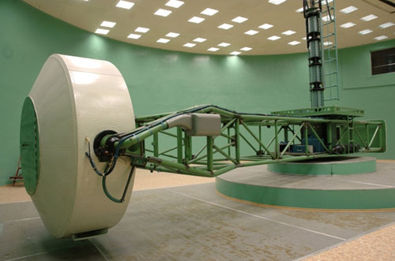
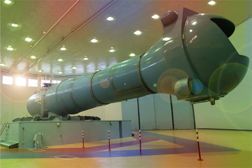
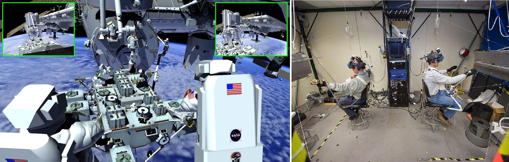
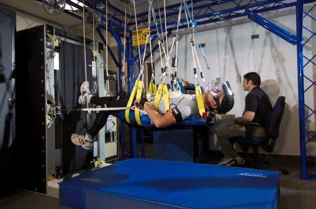
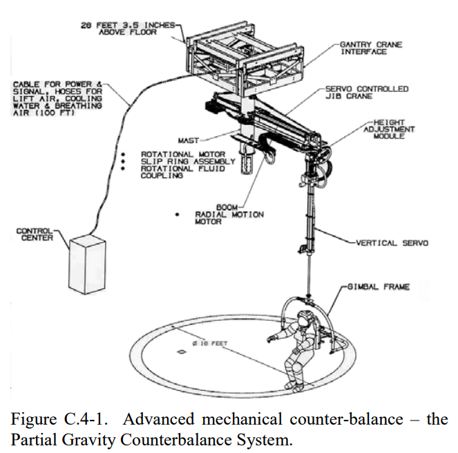

**************************
Infrastruktura szkoleniowa
**************************

Centra szkolenia astronautów
============================
Szkolenie astronautów odbywa się w wyspecjalizowanych ośrodkach treningowych. Skala i złożoność procesu szkolenia wymaga współpracy wielu agencji. Na chwilę obecną astronauci szkoleni są w ramach programów wymiany we wszystkich ośrodkach szkoleniowych. Ze względu na amerykańską regulację ITAR (International Traffic in Arms Regulations) określającą przemysł kosmiczny i rakietowy jako broń i zakazujący współpracy z Chinami, astronauci NASA nie odbywają szkolenia w ośrodkach ACC. Pozostałe kraje kooperują i wzajemnie szkolą astronautów w zakresie swojej specjalizacji. :numref:`table-infrastructure-training-centers` przedstawia listę centrów szkoleniowych.

.. csv-table:: Lista ośrodków szkoleniowych astronautów.
    :name: table-infrastructure-training-centers
    :file: ../data/infrastructure-training-centers.csv
    :header-rows: 1
    :widths: 10, 20, 40, 10, 10, 10

Centrum Przygotowania Kosmonautów, Gwiezdne Miasteczko, Moskwa, Rosja
---------------------------------------------------------------------
Jednym z najstarszych miejsc w którym szkoli się astronautów i kosmonautów jest Centrum Przygotowania Kosmonautów im. Jurija Gagarina (CPK) znajdujące się na terenie Gwiezdnego Miasteczka 20 km na północny wschód od Moskwy. W obiekcie tym trenują obecnie wszyscy astronauci, którzy są przydzieleni do lotów na ISS. Ośrodek posiada basen neutralnej pływalności Hydro Lab oraz zestaw symulatorów rosyjskich segmentów ISS i statku kosmicznego Sojuz, który jest obecnie jedynym środkiem transportu z i na ISS. CPK jest ostatnim ośrodkiem szkoleniowym. Bezpośrednio z tego miejsca astronauci są transportowani na kosmodrom Bajkonur (również nazywany Gwiezdnym Miasteczkiem) gdzie przechodzą ostatnie badania i przygotowania do startu rakietą Sojuz.

Johnson Space Center, Houston, TX, USA
--------------------------------------
Historycznie centrum kosmiczne Johnsona (JSC) było kolebką amerykańskiego programu astronautycznego. W tym miejscu mieści się również Astronauts Office (budynek 4-S) oraz Neutral Buoyancy Laboratory (budynek Sonny Carter Training Facility) i symulator amerykańskiej części ISS (budynek 29). Podobnie jak w Gwiezdnym Miasteczku, tak w centrum JSC trenują obecnie wszyscy astronauci, którzy są przydzieleni do lotów na ISS.

European Astronaut Centre, Kolonia, Niemcy
------------------------------------------
Europejskie Centrum Astronautów (EAC) jest miejscem gdzie astronauci przygotowujący się do lotu na ISS odbywają szkolenie z zakresu obsługi modułu Columbus Europejskiej Agencji Kosmicznej. Budynek ten jest również siedzibą europejskich astronautów i miejscem ich szkolenia. W EAC znajduje się także basen Neutral Buoyancy Facility, w którym astronauci zapoznają się z procedurami oraz strojem do spacerów kosmicznych. Więcej w rozdziale :ref:`dotyczącym szkolenia EVA <eva-training>`.

Tsukuba Space Center, Tsukuba, Ibaraki, Japonia
-----------------------------------------------
Tsukuba Space Center jest miejscem gdzie astronauci lecący na ISS odbywają szkolenie z japońskiej części stacji, tj. modułu Kibo oraz japońskich robotycznych systemów. Budynek ten jest również siedzibą astronautów JAXA.

Astronaut Centre of China, Pekin, Chiny
---------------------------------------
Ośrodek szkolenia Chińskich Astronautów (ACC) usytuowany jest w północno wschodniej części Pekinu :cite:`CNSAAstronautSelectionAndTraining`. Jest siedzibą chińskich astronautów i jako, że Chiny nie są państwem kontrybuującym do ISS nie odbywają się tutaj treningi przygotowujące do lotów na stację. W tym miejscu Chiński korpus astronautów szkoli się i przygotowuje do załogowych misji na stacje orbitalne w ramach programu Tiangong.

John H. Chapman Space Centre, Longueuil, QC, Kanada
---------------------------------------------------
John H. Chapman Space Centre jest siedzibą Kanadyjskiej Agencji Kosmicznej oraz kanadyjskich astronautów. W tym ośrodku astronauci przydzieleni do ekspedycji ISS odbywają szkolenie z manipulatora robotycznego Canadarm 2 (SRMS - Shuttle Remote Manipulator System) oraz kanadyjskich eksperymentów.

Baseny doskonałej pływalności
=============================
Od czasów przygotowania do lotu w ramach misji Gemini 12, gdy amerykański astronauta Buzz Aldrin jako pierwszy wykorzystał techniki nurkowania w celu symulacji spacerów kosmicznych agencje kosmiczne zaczęły wykorzystywać ośrodki neutralnej pływalności (ang. *NBL - Neutral Buoyancy Laboratory*) do szkolenia astronautów.

.. csv-table:: Lista basenów neutralnej pływalności
    :name: table-infrastructure-neutral-buoyancy-pools
    :file: ../data/infrastructure-neutral-buoyancy-pools.csv
    :header-rows: 1

    Porównanie skali oraz kształtów basenów neutralnej pływalności. Górny rząd pokazuje rzut z góry, dolny rzut z boku Źródło: Wikipedia

NASA - Neutral Buoyancy Laboratory
----------------------------------
Największym ośrodkiem szkoleniowym neutralnej pływalności jest NBL (Neutral Buoyancy Laboratory), który znajduje się w budynku Sonny Carter Training Facility niedaleko Johnson Space Center w Houston, Texas. Jest to jednocześnie największy basen na świecie. Na dnie basenu znajduje się szkielet amerykańskiego segmentu Międzynarodowej Stacji Kosmicznej. Astronauci w trakcie szkolenia podstawowego oraz późniejszego szkolenia przygotowującego przygotowują się do przeprowadzania najbardziej krytycznych zadań utrzymaniowych ISS.

Obecnie gdy ISS jest w pełni operacyjny w basenie NBL odbywa się bardzo dużo symulacji związanych z przygotowaniem do misji. Kalendarz symulacji jest wypełniony w 100% a treningi odbywają się w trzech zmianach ośmiogodzinnych na dobę. Pozostawia to niewielki margines na opracowywanie planów oraz testów dla technologii związanych z przyszłą eksploracją. Z tego powodu astronauci innych agencji szkolą się w swoich centrach w ramach "EVA pre-familiarisation", a następnie udają się do Houston w celu finalnego szkolenia i certyfikacji w wykorzystaniu skafandra EMU.

.. figure:: ../img/infrastructure-neutral-buoyancy-nbl.jpg
    :name: figure-infrastructure-neutral-buoyancy-nbl
    :scale: 25%
    :align: center

    Basen neutralnej pływalności NBL znajdujący się w Houston, TX, USA. Źródło: NASA/JSC

ESA - Neutral Buoyancy Facility
-------------------------------
Basen neutralnej pływalności, który znajduje się w ośrodku EAC w Kolonii służy astronautom ESA do tzw. "EVA pre-familiarisation", czyli do szkolenia zapoznawczego EVA. Ze względu na stałe obłożenie basenu NBL w Stanach Zjednoczonych i brak możliwości swobodnego treningu zdecydowano się na wybudowanie ośrodka w Europie. Kurs przygotowawczy ma na celu wstępne wyszkolenie Europejskich astronautów do treningów i certyfikacji, które będą odbywali w ośrodku NBL w Houston.

Najbardziej istotnymi elementami szkolenia w NBF są:

- procedury operacyjne EVA,
- zapoznanie się z protokołem zaczepów do stacji,
- praktyka transferów między modułami,
- używanie specjalistycznych narzędzi,
- komunikacja z pozostałymi członkami załogi (IVA oraz EVA),
- umiejętność pracy w środowisku neutralnej pływalności,
- szkolenie scenariuszy awaryjnych,
- utrzymywanie świadomości sytuacyjnej w złożonym i zmieniającym się środowisku.

Dla każdego EVA jest kilka jednostek treningowych, które muszą zostać ukończone. Każde wejście do basenu trwa około 5 godzin. Obecnie standardem jest trening 5-7 krotny każdej czynności certyfikowanej w NBL. Ilość zależy od stopnia skomplikowania jednostki szkoleniowej.

Późniejszy przydział do spacerów kosmicznych podczas misji bazuje na ewaluacji umiejętności EVA (która jest robiona na wczesnym etapie szkolenia w ośrodku NBL w USA). Ci astronauci, którzy zaprezentują najwyższy poziom umiejętności zostaną skierowani na dodatkowe szkolenie. Późniejszy przydział uwarunkowany jest również ze względu na zapotrzebowanie.

Ponadto ośrodek wykorzystywany jest również jako miejsce testowania narzędzi i procedur opracowywanych dla przyszłych misji.

.. figure:: ../img/infrastructure-neutral-buoyancy-nbf.jpg
    :name: figure-infrastructure-neutral-buoyancy-nbf
    :scale: 25%
    :align: center

    Basen neutralnej pływalności NBF znajdujący się w European Astronaut Center w Kolonii w Niemczech. Źródło: ESA/S. Corvaja

Roskosmos - Hydro Lab
---------------------
W celu certyfikacji do korzystania z rosyjskiego skafandra Orlan astronauci muszą przejść kurs w Centrum Przygotowania Kosmonautów w Gwiezdnym Miasteczku. Ośrodek ten wyposażony jest w basen Hydro Lab znajdujący się w budynku numer 30 oraz 32. :cite:`RoscosmosHydroLab`.

.. figure:: ../img/infrastructure-neutral-buoyancy-hydrolab.jpg
    :name: figure-infrastructure-neutral-buoyancy-hydrolab
    :scale: 50%
    :align: center

    Basen neutralnej pływalności Hydro Lab znajdujący się w Centrum Przygotowania Kosmonautów w Gwiezdnym Miasteczku w Rosji. Źródło: Roskosmos/CPK

CNSA - Neutral Buoyancy Facility
--------------------------------
Chińska Państwowa Agencja Kosmiczna otworzyła ośrodek do szkolenia taikonautów CNSA w Centrum Astronautycznym w Pekinie w Chinach. Ośrodek ten jednocześnie służy do certyfikacji z użytkowania skafandrów Feitan.

.. figure:: ../img/infrastructure-neutral-buoyancy-acc.jpg
    :name: figure-infrastructure-neutral-buoyancy-acc
    :scale: 50%
    :align: center

    Basen neutralnej pływalności ACC znajdujący się w Centrum Astronautycznym w Pekinie. Źródło: China Space Report

JAXA - Weightlessness Environment Test System
---------------------------------------------
Basen neutralnej pływalności agencji JAXA mieścił się Tsukuba Space Center w Ibaraki, Japonia. Od czasu silnego trzęsienia ziemi w 2011 roku ośrodek ten jest zamknięty. Japońscy astronauci trenują w amerykańskim NBL.

University of Maryland - Neutral Buoyancy Research Facility
-----------------------------------------------------------
Wybudowany w ramach grantu NASA w którym udział wziął wydział Space Systems Laboratory uczelni Massachusetts Institute of Technology (MIT). Ze względu na brak miejsca na kampusie zdecydowano się na konstrukcję basenu na uniwersytecie stanu Maryland.

    Basen neutralnej pływalności NBRF znajdujący się na Uniwersytecie Maryland w USA. Źródło: Diamondback/Julia Reed

Wirówki przeciążeniowe
======================
Wirówki przeciążeniowe są urządzeniami zdolnymi dzięki zwięszkaniu prędkości obrotowej zwiększyć siłę odśrodkową i odczuwalne przyspieszenie grawitacyjne (ang. *g-load*). Dzięki wirówkom możliwe jest testowanie oraz trenowanie tolerancji organizmu na przeciążenia. W zależności od kierunku działania wektora przyspieszenia, czasu trwania i jego intensywności pojawiają się efekty:

- utraty kolorów wizji (ang. *grey-out*),
- widzenie tunelowe (ang. *tunnel vision*),
- utraty widzenia (ang. *blackout*)
- utraty świadomości (ang. *G-LOC - Gravity Induced Loss of Consciousness*),
- czerwone widzenia (ang. *redout*) - działanie przyspieszenia ze zwrotem ujemnym (ang. *negative g*).

Na zwiększenie czynnika przyspieszenia grawitacyjnego mają wpływ gwałtowne manewrowanie samolotem, start rakiety, wejście w atmosferę, awaryjna trajektoria wejścia w atmosferę tzw. krzywa balistyczna oraz lądowanie. Skuteczność treningu w wirówce przeciążeniowej pozwala astronautom na tolerowanie przyspieszeń o 1.5-2g większych niż niewytrenowanej osoby. Należy nadmienić, że trening wymaga odnawiania, gdyż tolerancja ulega "zapomnieniu" przez organizm. Dla poprawy tolerancji stosuje się również uciskowe spodnie przeciążeniowe. Nacisk na naczynia powoduje spowolnienie odpływu krwi z nóg i mniejszą ilość krwi uderzającej do mózgu. Nacisk uzyskuje się statycznie (silne związanie) lub dynamicznie (nadmuchiwanie wszytych komór z powietrzem). Astronauci zakładają taki ubiór pod skafander Sokol przygotowując się do powrotu na Ziemię :cite:`Peake2017`. Ponadto tolerancję można zwiększyć stosując manewr AGSM (ang. *Anti-G Straining Maneuver*). Odpowiedni trening oddychania pozwala na zwiększenie tolerancji przeciążeń i dłuższe utrzymanie świadomości w przypadku ich wystąpienia.

Do najważniejszych wirówek przeciążeniowych wykorzystywanych w załogowych lotach kosmicznych można zaliczyć:

- CF-7, Roskosmos,
- CF-18, Roskosmos,
- 20-G Centrifuge, NASA,
- Human Performance Centrifuge, NASA,
- Short Radius Centrifuge, NASA.

.. csv-table:: Lista wirówek przeciążeniowych używanych do przygotowania astronautów w załogowych lotach
    :name: table-infrastructure-centrifuge-human
    :file: ../data/infrastructure-centrifuge-human.csv
    :header-rows: 1

CPK - CF-7
----------
Wirówka przeciążeniowa CF-7 została uruchomiona w 1973 roku. Wybrane parametry technicze przedstawia :numref:`table-infrastructure-centrifuge-human`. Zakres badań prowadzonych w urządzeniu :cite:`CPKCentrifuge`:

- test tolerancji przyspieszenia podczas szkolenia i selekcji pilotów i kosmonautów,
- badanie wpływu ekstremalnych warunków lotów kosmicznych na organizm człowieka,
- badanie nad metodami poprawy tolerancji przeciążeń i obniżenie negatywnych efektów,
- umiejętność przewidywania wpływu wysokich przeciążeń na organizm człowieka,
- stworzenie symulatora przyszłych pojazdów kosmicznych i samolotów,
- testowanie lotniczych i kosmicznych modeli.

    Wirówka przeciążeniowa CF-7 znajdująca się w Centrum Przygotowania Kosmonautów w Gwiezdnym Miasteczku w Rosji. Źródło: Roskosmos/CPK

CPK - CF-18
-----------
W 1980 roku w Centrum Przygotowania Kosmonautów otworzono drugą wirówkę przeciążeniową, która umożliwia zmianę kabin, oraz parametrów w kabinie takich jak temperatura, skład powietrza, wilgotność i ciśnienie. Wirówka CF-18 ma większy gradient przyspieszenia oraz maksymalną prędkość obrotową dającą przyspieszenie rzędu 30g :cite:`CPKCentrifuge`. Wybrane parametry technicze przedstawia :numref:`table-infrastructure-centrifuge-human`.

    Wirówka przeciążeniowa CF-18 znajdująca się w Centrum Przygotowania Kosmonautów w Gwiezdnym Miasteczku w Rosji. Źródło: Roskosmos/CPK

NASA - Ames Research Center 20-G Centrifuge
-------------------------------------------
Amerykańska wirówka przeciążeniowa 20-G Centrifuge znajduje się w ośrodku Ames Research Center, Moffett Field, CA w USA. Urządzenie służy do szkolenia personelu latającego Air Force, US Navy oraz dla astronautów NASA :cite:`NASACentrifuge`. Wybrane parametry technicze przedstawia :numref:`table-infrastructure-centrifuge-human`.

.. figure:: ../img/infrastructure-centrifuge-20g.jpg
    :name: figure-infrastructure-centrifuge-20g
    :scale: 25%
    :align: center

    Wirówka przeciążeniowa 20g znajdująca się w Ames Research Center, Moffett Field, CA w USA. Źródło: NASA/Ames

Wirówki przeciążeniowe do badań naukowych na ludziach
-----------------------------------------------------
Istnieje wiele obiektów przeznaczonych do badań nad wpływem wysokich przeciążeń na organizm człowieka. Część z nich nie jest bezpośrednio wykorzystywana w procesie szkolenia astronautów, ale może uczestniczyć w eksperymentach przeprowadzanych na ich organizmie. Do najważniejszych ośrodków można zaliczyć:

- Short Radius Centrifuge, University of Texas Medical Branch, Galveston, TX, USA
- Short Arm Human Centrifuge, DLR, Niemcy
- Wirówka przeciążeniowa - symulator szkoleniowy, WIML, Polska
- Dynamic Flight Simulator, Flight Physiological Center, Szwecja

Wirówki przeciążeniowe do badań naukowych
-----------------------------------------
Do badań naukowych wykorzystujących zwiększone przyspieszenie grawitacyjne i siłę odśrodkową, lecz nie certyfikowanych do wykorzystania przy badaniach ludzkich można zaliczyć:

- Large Diameter Centrifuge, ESA ESTEC, Noordwijk, Holandia
- 8-Foot Diameter Centrifuge, NASA Ames Research Center, CA, USA
- 2-Meter Diameter Centrifuge, NASA Ames Research Center, CA, USA
- 24-Foot Diameter Centrifuge, NASA Ames Research Center, CA, USA

Laboratoria Wirtualnej Rzeczywistości
=====================================
Laboratoria wirtualnej (ang. *VR - Virtual Reality*) oraz rozszerzonej (ang. *AR - Augmented Reality*) pozwalają na trening skomplikowanych czynności oraz procedur bez narażania życia astronautów. Ponadto astronauci szkolą się w używaniu technologii haptycznych tj. sprzężenia zwrotnego (ang. *Force Feedback*) oraz umiejętności interakcji człowiek-maszyna (ang. *HMI - Human-Machine Interaction*). Do najważniejszych laboratoriów VR należą:

- Virtual Reality Laboratory (VRL), NASA,
- Haptics Laboratory, ESA.

Virtual Reality Laboratory (VRL), NASA
--------------------------------------
VRL wyposażony jest w symulatory i urządzenia pozwalające na odtworzenie zewnętrznej części stacji. Dzięki okularom VR astronauta ma możliwość rozglądania się w środowisku. Rękawice i system który ma na sobie podczas szkolenia pozwala na kinestetyczne odczucie (ang. *kinesthetic sensation*), czyli inercji obiektów do 226,8 kg (500 lbs). W laboratorium VRL astronauci szkolą się w zakresie procedur i systemów EVA, tj.:

- obsługa systemu ratunkowego S.A.F.E.R.,
- kontrolowanie manipulatora SSRMS Canadarm2,
- rozkładu elementów zewnętrznych stacji ISS,
- utrzymywanie świadomości sytuacyjnej podczas EVA,
- umiejętności lokalizacji względem elementów stacji,
- transferu między modułami stacji.

    Astronauci trenujący EVA w laboratorium VRLab. Źródło: NASA/JSC

Haptics Lab ESA
---------------
Laboratorium Haptics Europejskiej Agencji Kosmicznej znajduje się w Centrum Inżynierii i Nauki ESTEC w Holandii. Laboratorium umożliwia testowanie systemów robotycznych oraz interfejsu HMI. W laboratorium opracowano egzoszkielet X-Arm-II (:numref:`figure-infrastructure-vr-exoskeleton`). Ponadto astronauci ESA ćwiczą umiejętność sterowania łazikami z wykorzystaniem kontrolerów z Force Feedback.

.. figure:: ../img/infrastructure-vr-exoskeleton.jpg
    :name: figure-infrastructure-vr-exoskeleton
    :scale: 25%
    :align: center

    X-Arm-II exoskeleton jest wykorzystywany do symulacji odczuć podczas sterowania maszynami. Źródło: ESA

Symulatory lotu
===============
Symulatory lotu są od wielu lat wykorzystywane w lotnictwie i towarzyszyły astronautom w ich szkoleniu od początków Space Race. Symulatory dzielą się na stacjonarne oraz wolne (ang. *FFS - Full Flight Simulator*). Symulatory FFS pozwalają na odczucie zwrotów oraz niewielkich odchyleń. Do najbardziej znanych symulatorów zalicza się:

- Symulator lądownika LM w programie Apollo,
- Shuttle Motion Simulator (SMS),
- Soyuz.

Symulatory lotu służą nie tylko szkoleniu astronautów ale również pozwalają na opracowywanie procedur i optymalizację konstrukcji kapsuł. Astronauci współpracują z inżynierami opracowującymi nowe techniki pilotażu oraz rozmieszczenie elementów interfejsu zarówno w kokpicie jak i na wielofunkcyjnym ekranie (ang. *MFD - Multifunctional Display*). Do symulatorów przyszłych statków kosmicznych można zaliczyć:

- Federacja,
- Orion,
- Boeing CST-100 Starliner,
- SpaceX Crew Dragon.

.. figure:: ../img/infrastructure-sim-soyuz-1.jpg
    :name: figure-infrastructure-sim-soyuz-1
    :scale: 33%
    :align: center

    Astronauci ćwiczą procedury w symulatorze Sojuz w CPK w Gwiezdnym Miasteczku. Źródło: ESA

Przyrządy ćwiczeniowe
=====================
W siłowniach i laboratoriach w których ćwiczą astronauci coraz częściej zaczyna się wykorzystywać nowoczesne technologie. Wśród nowatorskich pomysłów prowadzi się badania nad wykorzystaniem technologii VR do stymulacji mózgu podczas wykonywania ćwiczenia. Do przyrządów ćwiczeniowych wykorzystywanych podczas szkolenia i późniejszej rehabilitacji powracających z orbity astronautów można zaliczyć:

- koło reńskie obroty prawo-lewo,
- żyroskop - obrót wokół trzech osi,
- looping - huśtawka 360° z możliwością obrotu wokól osi pionowej ćwiczącego,
- ergometr,
- pionowe bieżnie (ang. *vertical treadmill*),
- połączenie systemów VR i bieżni zmieniających pochylenie i odchylenie (ang. *Adaptability Training System*),
- system bieżni nadciśnieniowych (ALTER).

System Vertical Treadmill dzięki zmianie kąta nachylenia bieżni i odległości wysięgnika ma możliwość zmiany  obciążenia odczuwalnego do symulowania grawitacji 1/6g (Księżyc) oraz 1/3g (Mars) :numref:`figure-infrastructure-gym-vertical-treadmill`.

    Astronauta podczas ćwiczenia na Vertical Treadmill. Źródło: NASA

Loty paraboliczne
=================
W celu zapoznania astronautów z wpływem mikrograwitacji na organizm człowieka oraz specyficznym zachowaniem podczas spadku swobodnego agencje kosmiczne zaczęły stosować samoloty w lotach parabolicznych. W zależności od parametrów paraboli można otrzymać:

- mikrograwitacja 0g,
- przyciąganie na powierzchni Księżyca (16,6% przyciągania ziemskiego),
- przyciąganie na powierzchni Marsa (40% przyciągania ziemskiego).

:numref:`table-infrastructure-parabollic` przedstawia zestawienie samolotów używanych przez agencje kosmiczne i prywatne firmy do lotów parabolicznych.

.. figure:: ../img/infrastructure-parabollic-profile.jpg
    :name: figure-infrastructure-parabollic-profile
    :scale: 75%
    :align: center

    Profil lotu parabolicznego podczas symulacji stanu braku grawitacji. Źródło: Nature

.. csv-table:: Zestawienie samolotów używanych do lotów parabolicznych
    :name: table-infrastructure-parabollic
    :file: ../data/infrastructure-parabollic.csv
    :header-rows: 1

Komory niskich ciśnień i komory próżniowe
=========================================
Zastosowanie komór niskich ciśnieniowych oraz komór próżniowych (ang. *vacuum chamber*) w trakcie szkolenia ma swoje początki wraz z pierwszymi prototypami skafandrów. Wówczas stosowano je do sprawdzania szczelności wytwarzanych iteracji ubrań ciśnieniowych. Podczas treningu komora ciśnieniowa wykorzystywana jest na cztery główne sposoby:

- zapoznanie się z objawami hypoxii,
- sprawdzanie szczelności skafandra,
- trening procedur awaryjnych skafandrów,
- zapoznanie się ze środowiskiem braku ośrodka gazowego.

Astronauci podobnie jak piloci samolotów stratosferycznych tj. U2, są poddawani szkoleniom w skafandrze wewnątrz komór ciśnieniowych. Podczas szkolenia trenujący doświadcza momentu rozhermetyzowania kabiny na dużej wysokości oraz uruchomienia automatycznego systemu podtrzymania życia w skafandrze.

Komory termalne
===============
Komory termalne (ang. *thermal chamber*) wykorzystuje się aby zapoznać astronautów ze zmiennym środowiskiem cieplnym występującym na zewnątrz pojazdu. Podczas ćwiczeń w komorach termalnych ćwiczący uczy się regulacji temperatury za pomocą systemu klimatyzacji skafandra.

Systemy podwieszania
====================
Do przygotowania astronautów w ograniczonym zakresie ruchu oraz przy zmieniającej się perspektywie widoku w programach szkolenia zastosowano system podwieszania. Ponadto system podwieszania pozwala na odciążenie astronauty i symulację grawitacji panującej na Księżycu, Marsie i innych ciałach niebieskich.

    System podwieszania zastosowany do treningu astronautów w Centrum Przygotowania Kosmonautów w Gwiezdnym Miasteczku w Rosji. Źródło: NASA/JSC

Eksperymenty izolacyjne
=======================
Długotrwały pobyt w przestrzeni kosmicznej przy niezmiennym towarzystwie wpływa na bardzo dużo złożonych procesów psychologicznych i sociodynamicznych. W szczególności przy planowanych misjach na Marsach czy dłuższych pobytach na Księżycu konieczne jest opracowanie sposobów wczesnej detekcji problemów psychicznych oraz sprawniejsze ich rozwiązywanie. W tym celu organizacje kosmiczne wykorzystują następujące metody:

- wykorzystanie komór (pojemników) izolacyjnych (ang. *PRE - Personal Rescue Enclosure*),
- przeprowadzanie badań izolacji w ośrodkach badań medycznych,
- wykorzystanie długotrwałych pobytów w habitatach wraz z połączeniem eksploracji środowiska.

Personal Rescue Enclosure
-------------------------
Personal Rescue Enclosure zostały stworzone na potrzeby prototypowego systemu ratownictwa załóg promów Space Shuttle. Mają kształt przypominający piłkę plażową o 86 cm średnicy i 0,33 :math:`m^2` objętości i są skonstruowane z materiału na bazie Kevlaru :cite:`Shayler2009`. Obecnie wykorzystywane są podczas selekcji astronautów w celu weryfikacji braku klaustrofobii.

Badania izolacyjne w ośrodkach medycznych
-----------------------------------------
Najbardziej znanym badaniem była misja Mars-500, gdy podczas trwającej 520 dni izolacji sprawdzano zachowanie załogi w symulowanej misji na Marsa. Program symulacji trwał między latami 2007 and 2011 i był prowadzony przez Instytut Problemów Biomedycznych Rosyjskiej Akademii Nauk przy współpracy Europejskiej Agencji Kosmicznej.

Badania izolacyjne w habitatach
-------------------------------
Na chwilę obecną na świecie jest niewiele placówek zajmujących się tematyką badań izolacyjnych połączonych z eksploracją środowiska. Każda z takich placówek specjalizuje się w określonym typie symulacji. Do habitatów w których odbywają się pobyty powyżej tygodnia można zaliczyć:

- Lunares, Polska,
- HI-Seas, USA,
- MDRS, USA,
- FMARS, Kanada,
- NEEMO, USA,
- HERA, USA.

Habitat Lunares został wybudowany przez firmę Space Garden przy udziale autora pracy (Mateusz Harasymczuk) oraz pomysłodawczynię dr Agatę Kołodziejczyk. Habitat ulokowany jest na lotnisku w Pile (ICAO: EPPK) w hangarze przy pasie startowym. W Lunares prowadzone są badania dotyczące:

- subiektywnej percepcji czasu,
- dynamiki grupy i wpływu izolacji,
- ergonomii habitatu,
- architektury habitatu,
- inteligentnych sensorów i czujników,
- systemów aquaponicznych i hydroponicznych,
- wykorzystania lamp fizjologicznych w pobudzaniu receptorów serotoninowych,
- sztucznym sterowaniem rytmem cyrkadialnym,
- planowaniem pracy i rozkładu zajęć astronautów,
- badania nad domknięciem półotwartego systemu podtrzymywania życia,
- wykorzystanie zasobów dostępnych w środowisku (ang. *ISRU - In-Situ Resource Utilization*),
- systemu operacyjnego habitatów pozaziemskich.
