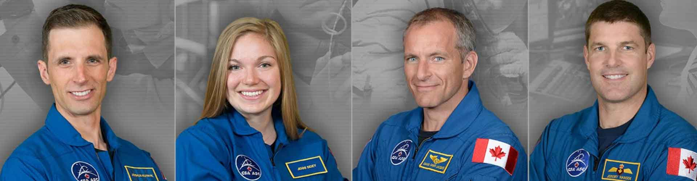

*************************************************
Selekcja kandydatów do przeszkolenia podstawowego
*************************************************
​
    Ability to parse and solve complex problems rapidly with incomplete information in a hostile environment, this is what makes you an astronaut. ​Astronaut is a person who can quickly without complete information make a decision when decisions can mean life or death.

    -- Chris Hadfield, An Astronaut's Guide to Life on Earth :cite:`Hadfield2013`

Przygotowanie astronautów i kosmonautów do długotrwałych misji kosmicznych zaczyna się od wyboru kandydatów do szkolenia podstawowego. Na chwilę obecną najczęściej rekrutuje się osoby wśród najbardziej pożądanych specjalizacji tj.:

- pilot, a w szczególności pilot testowy,
- lekarz,
- inżynier,
- naukowiec (nauki przyrodnicze).

Na wybór kandydata ma ogromny wpływ również doświadczenie, wykształcenie, nalot lotniczy oraz przebyte kursy i wyprawy przetrwania. Astronauci to także osoby publiczne często występujące przed dużymi audiencjami dlatego ceniona jest umiejętność posługiwania się mediami społecznościowymi, pisania tekstów oraz przemawiania :cite:`How-to-Become-an-ESA-Astronaut`. Język angielski i rosyjski są obecnie oficjalnymi używanymi na *Międzynarodowej Stacji Kosmicznej* (ISS) dlatego od kandydatów wymaga się również znajomości tych dwóch powyższych. Dodatkowo ze względu na międzynarodowy charakter misji kosmicznych mile widziane jest zainteresowanie kulturą Europejską, Stanów Zjednoczonych, Japonii i Rosji.

Osoby biorące udział w rekrutacji poddawane są skrupulatnym badaniom mającym na celu wyłonienia najlepszych kandydatów. Podczas badań brane są pod uwagę takie czynniki jak :cite:`Psychological-and-medical-selection-process`, :cite:`Health-and-physical-condition`, :cite:`Qualifications-and-skills-required`:

- kondycja fizyczna i wydolność organizmu,
- zdolność adaptacji do zmiennych warunków,
- stabilność psychiczna,
- odporność na stres,
- umiejętność działania pod presją,
- umiejętność podążania za procedurami,
- aktywność psychomotoryczna,
- wytrzymałość na przeciążenia,
- umiejętność kojarzenia i przewidywania.

Kryteria doboru kandydatów
==========================
Sam proces podstawowego szkolenia astronautów trwa około dwa lata. Głównym celem szkolenia jest wyrównanie poziomu wiedzy i umijejętności kandydatów pochodzących z różnych specjalizacji i dziedzin i wprowadzenie spójnego zasobu wiedzy, który stanowi podstawę do dalszego szkolenia. Ukończenie kursu podstawowego pozwala na zmianę tytułu z "kandydat na astronautę" na "astronauta" :cite:`NASA-Astronaut-Candidate-Program`. Jest to proces wymagający wielu poświęceń z życia prywatnego, który determinuje zasadność dalszych inwestycji przez agencję kosmiczną. W trakcie zbierania materiałów autor dotarł źródła pragnącego zachować anonimowość, które przekazało informację, że tylko 60% astronautów nadaje się do przydziałów do dalszych misji. Zgodnie z wywiadem pozostali "osiadają na laurach i przestają się uczyć", a ciągłe kształcenie jest podstawą specyfiki tego zawodu. Ze względu na dużą ilość osób i zasobów zaangażowanych w przygotowanie kandydata proces ten jest bardzo kosztowny. Wsparcie jakiego wymaga przygotowanie do i po misji jest ogromne. Z tego powodu agencje kosmiczne wybierają najbardziej odpowiednie osoby na to stanowisko, a proces szkolenia kandydackiego stanowi jeden z etapów późnej selekcji.

Aby przygotować misję kosmiczną wymagane są lata pracy wielu zespołów profesjonalistów. I choć pozycja astronauty jest jedną z najbardziej prestiżowych na świecie to ich sukces zbudowany jest przez tych co pozostali na Ziemi :cite:`How-to-Become-an-ESA-Astronaut`. Ograniczone możliwości w zakresie wysyłania ludzi w przestrzeń kosmiczną i koszt tego przedsięwzięcia wymaga starannego doboru kandydatów. Z tego powodu proces selekcji astronautów i kosmonautów jest zadaniem trudnym. Wymaga od ubiegających się o to stanowisko umiejętności multidyscyplinarnych oraz wysokiego poziomu przyswajania wiedzy z zakresu wielu dziedzin naukowych. W poniższym rozdziale przedstawione zostaną kryteria oraz proces wyboru najlepszych kandydatów.

:numref:`table-astronaut-requirements` Przedstawia zestawienie minimalnych umiejętności i porządanych cech kandydatów na astronautów w różnych agencjach kosmicznych.

.. _table-astronaut-requirements:

.. csv-table:: Wymagania dla kandydatów na astronautów i kosmonautów :cite:`NASA-Astronaut-Requirements`, :cite:`ESA-Astronaut-Training-Requirements`, :cite:`Roscosmos-Cosmonaus-Requirements`
    :file: ../data/astronaut-requirements.csv
    :header-rows: 1

Selekcja kondycyjna
-------------------
Charakter pracy astronauty wymaga wysokiej aktywności kondycyjnej i dużej sprawności fizycznej. Podczas wielomiesięcznych, a docelowo wieloletnich, misji kosmicznych astronauci aby przeciwdziałać niebezpiecznemu wpływowi braku grawitacji na układ szkieletowy oraz atrofii mięśni muszą ćwiczyć przynajmniej dwie godziny dziennie.

Jednorazowe wejście do basenu neutralnej pływalności w celu ćwiczenia spacerów kosmicznych (ang. *EVA - ExtraVehicular Activity*) trwa sześć godzin, w trakcie którego astronauta wykonuje zadania pod wodą będąc umieszczonym w skafandrze *EMU* lub *Orlan*. Każdy późniejszy *EVA* w przestrzeni kosmicznej jest poprzedzony przynajmniej dwudziestokrotnym treningiem w środowisku symulującym stan nieważkości. W tym celu w  basenie przy użyciu ciężarów i wyporników nadaje się skafandrowi kosmicznemu cechę neutralnego unoszenia się. Skafander w którym trenują astronauci oraz specjalne warunki wymienione powyżej wymagają wysokiej sprawności kondycyjnej i wytrzymałościowej.

Kandydaci którzy biorą udział w rekrutacji muszą być zdolni do wytrzymywania zadanych obciążeń i dużego wysiłku fizycznego. Umiejętności te wymagają wieloletniego przygotowania kondycyjno-wytrzymałościowego i są oceniane przez komisję rekrutacyjną.

Podczas rekrutacji oceniane są między innymi :cite:`CSAAstronautsFAQ`:

- umiejętność pływania (przepłynięcie 250m w 10 minut),
- umiejętność utrzymywania się na powierzchni wody bez użycia rąk (ang. *tread water*) 10 minut,
- umiejętność pływania pod wodą (minimum 15m),
- bieg po tzw. kopercie,
- bieg długodystansowy ze zwiększającym się tempem,
- podnoszenie ciężarów i ocena siły górnej partii ciała.

Selekcja medyczna
-----------------
Zdrowie kandydata jest jednym z najważniejszych kryteriów doboru. Osoby rekrutowane muszą się wykazać niezwykłą adaptacją do warunków panujących w stanie nieważkości. Jest to podyktowane głównie ogromnym kosztem wyszkolenia astronautów i chęcią zmniejszenia możliwości zaistnienia problemów podczas misji ze względu na stan zdrowia pracującego operatora. Sprawność układu ruchu, krążenia oraz równowagi ma ogromne znaczenie dla późniejszej pracy kandydata.

Ponadto jednym z kluczowych wskaźników jest także wzrost. Osoby niższe są bardziej predestynowane do wytrzymywania większych przeciążeń ze względu na niższą odległość pomiędzy sercem a mózgiem. Poza samą predyspozycją ze względów medycznych wzrost ma znaczenie ze względów konstrukcyjnych statków kosmicznych. Na chwilę obecną (marzec 2018) jedynym sposobem dostarczania astronautów na Międzynarodową Stację Kosmiczną jest rosyjski statek *Soyuz TMA*, który jest przewidziany dla osób ze wzrostem z zakresu 150 do 190 cm :cite:`ISS-Spacecraft-Soyuz-TM` (wersje TM przed czerwcem 1999 miały ograniczenie od 164 do 182 cm). Z tego samego powodu do amerykańskiego korpusu astronautów przyjmowani są kandydaci o wzroście pomiędzy 62 i 75 cali :cite:`NASA-Astronaut-Requirements` co odpowiada 157,5 i 190,5 cm. Wymaganiem Europejskiej Agencji Kosmicznej w tej dziedzinie jest wzrost pomiędzy 153 a 190 cm :cite:`ESA-Astronaut-Training-Requirements`.

.. csv-table:: Wybrane parametry członków załogi statku kosmicznego Soyuz TM (zmodyfikowany po czerwcu 1999) :cite:`Soyuz-A-Universal-Spacecraft`
    :file: ../data/soyuz-requirements.csv
    :header-rows: 1

Powyższe parametry są weryfikowane podczas badań medycznych w procesie selekcji astronautów wykorzystując :cite:`ESA-Astronaut-Training-Requirements`:

- koło reńskie - MAT (Multi-Axis Tool),
- krzesła obrotowe,
- komory ciśnień,
- wirówki przeciążeniowe (centrifuge),
- lot samolotem naddźwiękowym,
- loty w środowisku braku grawitacji.

Ponadto podczas treningu operacyjnego astronauci latają samolotami naddźwiękowymi, więc muszą posiadać zdolności medyczne na poziomie pilota wojskowego. Wśród badań można wymienić:

- ​RTG Klatki Piersiowej,
- ​pantomogram,
- ​RTG zatok,
- ​USG Jamy brzusznej,
- ​próba wysiłkowa na bieżni,
- analiza zapisu badania Holtera,
- echo serca,
- analiza zapisu EEG,
- analiza ENG oraz odpowiedzi układu równowagi na stymulacje błędnika,
- spirometria,
- zapis EKG,
- badanie okulistyczne,
- badanie internistyczne,
- badanie neurologiczne,
- badanie chirurgii-ortopedycznej,
- badanie laryngologiczne,
- audiogram i kontrola słuchu,
- pomiary antropometryczne,
- próba Komory Niskich Ciśnień,
- rezonans magnetyczny,
- badanie stomatologiczne,
- próba w wirówce przeciążeniowej.

Selekcja psychologiczna
-----------------------
Jednym z kluczowych elementów branych pod uwagę jest odporność na stres i umiejętność działania pod presją. Astronauta jako operator musi umieć realizować zadane czynności bez względu na okoliczności. Podążanie za procedurami w przypadku różnego rodzaju awarii i zdarzeń wyjątkowych jest absolutnie niezbędne. Procedury te zostały przygotowane przez lata praktyki i wszelkie odstępstwa mogą narazić członków załogi na niebezpieczeństwo lub śmierć.

Ponadto cechą pracy w warunkach kosmicznych jest przebywanie w małych pomieszczeniach pozbawionych okien (z wyjątkiem miejsc widokowych) w rzadko zmieniającym się towarzystwie. Kandydaci muszą umieć współistnieć w międzynarodowym środowisku, prowadzić badania i interakcje oraz komunikować się. Od kandydatów wymaga się stabilności psychicznej, braku uprzedzeń i dojrzałości emocjonalnej :cite:`FrenchBurgess2007`.

Jednym z kluczowych elementów szkolenia astronautów jest pobyt w różnych centrach szkolenia na świecie. Jest to związane z długim przebywaniem poza miejscem zamieszkania i w ciągłej separacji z rodziną. Sam pobyt na Międzynarodowej Stacji Kosmicznej na chwilę obecną trwa zwykle do sześciu miesięcy, ale te czasy zdecydowanie się wydłużą ze względu na konieczność przygotowania do długotrwałych misji kosmicznych na Księżyc i Marsa :cite:`Kelly2017`, :cite:`Massimino2016`.

Ponadto dużą uwagę zwraca się na :cite:`ESA-Astronaut-Training-Requirements`:

- zdolność rozumowania,
- dobra pamięć,
- koncentracja,
- zręczność manualna,
- umiejętność przystosowania się do zmiennych warunków przestrzennych.

Idealny kandydat posiada :cite:`ESA-Astronaut-Training-Requirements`:

- wysoką motywację,
- elastyczność,
- towarzyskość,
- empatię,
- niski poziom agresji,
- stabilność emocjonalna,
- umiejętność długotrwałej współpracy w międzykulturowym środowisku,
- multidyscyplinarność.

Proces badań wstępnych jest prowadzony przez zespół wykwalifikowanych specjalistów z zakresu psychologii. Wśród pytań zadawanych przez ekspertów wymienić można te, które pojawiają się najczęściej podczas rekrutacji :cite:`Hadfield2013`, :cite:`Hermaszewski2013`, :cite:`Anderson2015`, :cite:`Massimino2016`, :cite:`Wolfe1979` (pytania są tłumaczone przez autora pracy):

- Dlaczego chcesz zostać astronautą?
- Opisz swoje mocne strony i jak je wykorzystujesz,
- Opisz swoje słabe strony i jak nad nimi pracujesz,
- Jakie jest zastosowanie twojego doświadczenia?
- Czy masz dobrą świadomość sytuacyjną i osąd?
- Jak dobrze się komunikujesz?
- Czy jesteś graczem zespołowym?
- Czy przejawiasz inicjatywę w grupie?
- Czy jesteś osobą, która poświęca się dla pracy?
- Jaki jest balans pomiędzy twoją pokorą a ego?
- Czy umiesz naprawiać rzeczy (samochód, kran, ubikacja)?
- Jakie są twoje umiejętności operacyjne?
- Jak szybko adaptujesz się do nowego środowiska i ludzi?
- Jak radzisz sobie z ciągłymi zmianami?
- Czy nie masz zbyt intensywnej (narzucającej się) osobowości?
- Czy nie skupiasz się nadmiernie nad detalami?

Wielu kandydatów powiela utarty schemat. Agencje kosmiczne szukają osób, które są innowacyjne i potrafią wyróżnić się z grupy. Brak umiejętności przyswojenia zagadnień związanych z *EVA*, robotyką czy posługiwaniem się obcym językiem powoduje natychmiastową dyskwalifikację kandydata.

Idealny kandydat powinien pokazać:

- jak konsekwentnie stara się powiększać swoje umiejętności,
- jak stara się być lepszym,
- jest świadomy jakie cechy są wymagane na astronautę,
- nie boi się próbować nowych rzeczy,
- jak pracuje wysokowydajnie podczas stresu,
- potrafi szybko podejmować decyzje gdy konsekwencje mogą skutkować śmiercią,
- zdrowe ego (brak zarozumiałości).

Wszystkie licencje, szkolenia, edukacja, studia itp. muszą być ukończone przed datą końca aplikacji. Nieukończone rzeczy nie podlegają ocenie podczas selekcji :cite:`Massimino2016`. Rozmowy indywidualne prowadzone są przez obecnych astronautów oraz managerów wysokiego szczebla odpowiednich jednostek organizacyjnych agencji kosmicznych. Wytypowani kandydaci muszą zostać zaakceptowani przez dyrektorów agencji kosmicznych.

Powyższe pytania są tylko reprezentacyjnym przykładem kwestii poruszanych podczas rozmowy kwalifikacyjnej i mają na celu przedstawienie zachowania i myślenia kandydata. Komisja musi być również przekonana czy kandydat będzie dobrym reprezentantem agencji kosmicznej przez wiele następnych lat. Cała rozmowa osoby ubiegającej się o stanowisko astronauty sprowadza się do podstawowego i najważniejszego pytania, na które zwykle odpowiada lider komisji, starszy astronauta:

- Czy chciałbym polecieć w kosmos z tą osobą?

Selekcja umiejętności technicznych i naukowych
----------------------------------------------
Jednym z najbardziej kluczowych elementów selekcji kandydatów na astronautów i kosmonautów jest dobór ze względu na umiejętności i doświadczenie. Obecnie Europejska Agencja Kosmiczna (podobny profil poszukiwany jest również w innych agencjach kosmicznych) poszukuje kandydatów wśród specjalizacji:

- naukowiec,
- inżynier,
- pilot,
- lekarz.

Każda z tych profesji ma swoje zalety przy prowadzeniu badań w środowisku kosmicznym. Obecnie agencje odchodzą od specjalizacji astronautów :cite:`Hadfield2013`, :cite:`Anderson2015` i każdy z członków załogi musi poznać wszystkie aspekty pracy na orbicie, tj. pilotowanie statków kosmicznych, prowadzenie badań naukowych, udzielanie pomocy medycznej i przeprowadzanie operacji, kwestie związane z manipulowaniem ramion robotycznych i dokonywanie spacerów kosmicznych, czyli tzw. *EVA* (ang. *ExtraVehicular Activity*). Astronauta staje się operatorem czyli wysoce wykwalifikowanym specjalistą w wykonywaniu starannie zaplanowanych czynności. To wymaga dużej wszechstronności od kandydata i umiejętności adaptowania się do zmieniających się warunków.

W zależności od agencji kosmicznej różnie wymagane jest wykształcenie. Amerykańska NASA wymaga jedynie wykształcenia pierwszego stopnia (poziom licencjatu/inżyniera) w kategoriach nauk przyrodniczych i inżynieryjnych. Europejska ESA wymagają przynajmniej stopnia magistra oraz wysoko ceni ukończenie specjalności Lotnictwo i Kosmonautyka. Kandydat, który pozostał jedynie na minimalnym poziomie ma niewielkie szanse na wybór. Agencje kosmiczne wysoko cenią specjalistów i pracowników naukowych w stopniu doktora nauk (ang. *PhD*).

W przypadku lekarzy jest brane doświadczenie zawodowe oraz profil specjalizacyjny. W zależności od prowadzonych badań szanse na wybór mają lekarze o nasępujących specjalizacjach:

- radiolodzy,
- ortopedzi,
- kardolodzy/naczyniowcy (ang. *cardiovascular*),
- okuliści.

Selekcja ze względu na doświadczenie lotnicze
---------------------------------------------
Doświadczenie lotniczne nie jest wymagane dla kandydatów nie ubiegających się o rolę pilota-astronauty, ale wysoko pożądane :cite:`ESA-Astronaut-Training-Requirements`.

Pilot-astronauta podczas misji specjalizuje się w prowadzeniu statków kosmicznych. Historycznie w Amerykańskiej agencji NASA dowódcy misji byli pilotami. W zakres jego obowiązków wchodzi pilotaż, odpowiedzialność za załogę i powodzenie misji, oraz dbanie o bezpieczeństwo na pokładzie. Ponadto w lotach *Space Shuttle* było dwóch pilotów:

- Commander (dowódca statku),
- Pilot (pierwszy oficer).

Pilot (analogicznie do pierwszego oficera) wspiera dowódcę w kontrolowaniu statku.

W czasach lotów orbitalnych wykorzystując statek *Soyuz*, którego z przyczyn politycznych pilotować może wyłącznie Rosyjski kosmonauta, rola pilota w innych agencjach przekształciła się w tzw. inżyniera pokładowego (ang. *Flight Engineer*) analogicznego do specjalisty misji (ang. *Mission Specialist*) z ery lotów *STS*. Obecnie rola pilota może rozszerzyć się o zakres obowiązków związanych z przechwytywaniem i rozstawianiem satelit, korzystaniem z robotycznego ramienia - manipulatora, EVA oraz operacje związane z ładunkiem, dlatego wymagania są podobne jak wśród osób z innych środowisk :cite:`NASA-Astronaut-Requirements`.

Przy specjalizacji jako pilot-astronauta amerykańska agencja NASA wymaga 1000 godzin nalotu jako dowódca statku powietrznego (ang. *PIC - Pilot-in-Command*) na samolotach odrzutowych :cite:`NASA-Astronaut-Requirements`. W tym przypadku preferowane są osoby z doświadczeniem pilota testowego.

Wymagania dotyczące wzroku dla pilotów są zwiększone:

- 20/100 w widzeniu dalekim preferowane bez korekcji (okulary, soczewki),
- 20/20 w widzeniu z korekcją.

Zwiększone kryteria wzrostu:

- Minimalnie 58,5 cala (148,59 cm)
- Maksymalnie 76 cali (193,04 cm)

Dodatkowe, aktywności, uprawnienia i licencje wpływające na selekcję
--------------------------------------------------------------------
Agencje kosmiczne podczas selekcji cenią wiele uprawnień, aktywności i licencji. Ponadto licencje i uprawnienia liczą się wyłącznie jeżeli są aktywne i w pełni ukończone w dniu selekcji. :cite:`CSAAstronautsFAQ`

Wśród dodatkowych elementów można wyłonić te najbardziej pożądane:

- uprawnienia lotnicze, tj. licencje PPL(A), CPL(A),
- uprawnienia instruktorskie w dziedzinie lotnictwa,
- uprawnienia nurkowe akredytowanych instytucji tj. PADI, CMAS,
- uprawnienia speleologiczne,
- uprawnienia wspinaczkowe i alpinistyczne,
- kursy survivalowe i obozy przetrwania,
- szkolenia survivalu morskiego,
- nagrody i wyróżnienia w wyżej wymienionych dziedzinach.

Selekcja astronautów w agencjach i organizacjach rządowych
==========================================================
Program poszukiwania kandydatów jest prowadzony przez rządy państw najbardziej zaawansowanych technicznie. Obecnie wiodącą rolę w tej dziedzinie pełnią następujące państwa:

- Stany Zjednoczone,
- Rosja,
- państwa zjednoczone w Europejskiej Agencji Kosmicznej,
- Chiny,
- Kanada.

Ponadto agencje kosmiczne Zjednoczonych Emiratów Arabskich oraz Indyjska planują w niedalekiej przyszłości otworzenie selekcji astronautycznej.

NASA - Narodowa Agencja Aeronautyki i Astronautyki (USA)
--------------------------------------------------------
Amerykańska agencja kosmiczna NASA organizuje rekrutację na kandydata na astronautę (ang. *ASCAN - Astronaut Candidate*) regularnie co dwa lata. Ostania tego typu rekrutacja miała miejsce na przełomie 2015/2016 roku i zakończyła się 15 lutego 2016 :cite:`NASA-Astronaut-Selection-Proces`. Dzięki zaangażowaniu mediów społecznościowych oraz innych środków masowego przekazu swoje aplikacje złożyło rekordowo dużo osób. Komisja rekrutacyjna będzie musiała rozpatrzyć 18000 podań i z tego grona wybrać 12 najlepszych kandydatów, którzy rozpoczęli przygotowanie wstępne :cite:`NASA-Astronaut-Selection`.

.. figure:: ../img/selection-nasa-2017.jpg
    :scale: 50%
    :align: center

    Selekcja astronautów NASA rozpoczynających szkolenie w 2017 roku (ang. *2017 NASA Astronaut Class*): (od lewej) Zena Cardman, Jasmin Moghbeli, Jonny Kim, Frank Rubio, Matthew Dominick, Warren Hoburg, Robb Kulin, Kayla Barron, Bob Hines, Raja Chari, Loral O' Hara and Jessica Watkins. Źródło: NASA/Robert Markowitz

.. csv-table:: Dotychczasowe selekcje astronautów NASA :cite:`Active-NASA-Astronauts`, :cite:`Inactive-NASA-Astronauts`
    :file: ../data/selection-nasa.csv
    :header-rows: 1

.. csv-table:: Lista aktywnych astronautów NASA :cite:`Active-NASA-Astronauts`
    :file: ../data/astronauts-nasa.csv
    :header-rows: 1

Klasy astronautów podobnie jak zespoły przydzielone do misji tworzą tzw. insygnia klasy (ang. *class patch*). Każda z grup kandydatów ma swoją unikalną nazwę, która jest nadawana przez poprzedzającą selekcję :cite:`Anderson2015`.

Roscosmos (Federacja Rosyjska)
------------------------------
Do końca roku 2015 agencja kosmiczna Roscosmos podlegała strukturom wojskowym Federacji Rosyjskiej i wcześniej Związkowi Radzieckiemu. Z tego powodu kandydaci na kosmonautów byli wybierani wśród oficerów sił powietrznych. Wraz ze zmianami organizacyjnymi z 31 grudnia 2015 Roscosmos przekształcił się w cywilną agencję zarządzaną na wzór amerykańskiej NASA :cite:`Cosmonauts-Biographical-Data`. Z tego powodu proces rekrutacji kosmonautów może ulec zmianie i w najbliższych latach wśród rosyjskich kosmonautów znajdzie się więcej cywili, naukowców i inżynierów.

ESA - Europejska Agencja Kosmiczna
----------------------------------
Jednym z warunków bycia astronautą ESA jest aby państwo narodowości kandydata było oficjalnym członkiem tej agencji. Ostatni proces rekrutacji Europejskiej Agencji Kosmicznej rozpoczął się w maju 2008 a zakończył rok później w maju 2009 roku. Przedsięwzięcie prowadziła jednostka EAC (ang. *European Astronaut Centre*) w Kolonii w Niemczech. Wzięło w nim udział 8413 kandydatów. 20 maja 2009 sześciu nowych kandydatów na astronautów zostało przedstawionych na konferencji prasowej w siedzibie ESA w Paryżu. Kandydaci rozpoczęli swoje wstępne przeszkolenie 1 września 2009 roku. W tej selekcji wybrano następujących kandydatów :cite:`How-to-Become-an-ESA-Astronaut`, :cite:`International-Astronauts`:

.. csv-table:: Lista aktywnych astronautów ESA :cite:`European-Astronaut-Corps`
    :file: ../data/astronauts-esa.csv
    :header-rows: 1

    Sześciu nowych rekrutów European Astronaut Corps w European Astronaut Centre w roku 2009. Timothy Peake, Andreas Mogensen, Alexander Gerst, Luca Parmitano, Samantha Cristoforetti, Thomas Pesquet. Źródło: ESA–M. Koell

JAXA - Japońska Agencja Eksploracji Kosmicznej
----------------------------------------------
Przez ponad 20 lat od lotu Mamoru Mohri'ego, pierwszego Japończyka, który poleciał w kosmos na pokładzie amerykańskiego promu *Space Shuttle* w 1992 japońska agencja JAXA nie prowadziła naboru na kolejnych astronautów. Od czasu wybudowania centrum astronautycznego *Tsukuba Space Center* nastąpiła zmiana w polityce Agencji, która postanowiła przeprowadzić kolejne rekrutaje i poszerzyć zespół astronautów.

Podczas jednej z selekcji kandydatów obserwowano bardzo wnikliwie, śledząc ich zachownaia również poza oficjalnym czasem. Brano pod uwagę w jaki sposób zachowują się w restauracji, czy zostawiają jedzienie na talerzu, czy sprzątają po sobie i jak zachowują się pod presją. Jednym z zadań podczas rekrutacji było złożenie tysiąca łabędzi origami w określonym czasie. Komisja rekrutacyjna obserwowała staranność zgięć, przyłożenie się kandydata do powtarzającego zadania, jakość wykonania oraz działanie pod presją upływającego czasu.

Na chwilę obecną nie są znane dalsze plany na temat rekrutacji kolejnych astronautów JAXA.

    Chiaki Mukai, Koichi Wakata, Takao Doi, Soichi Noguchi, Akihiko Hoshide, Naoko Yamazaki, and Satoshi Furukawa

.. csv-table:: Lista aktywnych astronautów JAXA
    :file: ../data/astronauts-jaxa.csv
    :header-rows: 1

CNSA - Agencja Kosmiczna Chińskiej Republiki Ludowej
----------------------------------------------------
Proces selekcji Chińskich astronautów jest utajniony przez rząd Chińskiej republiki ludowej. Wiadomo, że kandydaci mają doświadczenie jako piloci wojskowi. Ponadto mają być w wieku od 25 do 30 lat, z minimalnym nalotem 800 godzin. Muszą także posiadać wykształcenie naukowe. Wzrost kandydatów musi zawierać się w przedziale 160 cm do 172 cm, a waga 50 kg do 70 kg.

Z informacji podanych do publicznej wiadomości wynika, że CNSA planuje rekrutację 12 astronautów w tym dwóch kobiet. Głównym celem jest stworzenie załogi, która będzie odbywała misje do Chińskiej Stacji Orbitalnej *Tiangong*.

CSA - Kanadyjska Agencja Kosmiczna
----------------------------------
Jedną z najbardziej otwartych agencji kosmicznych w kwestiach selekcji astronaów jest Kanadyjska Agencja Kosmiczna (ang. *CSA - Canadian Space Agency*) :cite:`CSAAstronautsFAQ` :cite:`CSAAstronautSelection`. Proces selekcji kandydatów jest przejrzysty i dobrze udokumentowany na stronie agencji. Wśród zadań z którymi musieli zmierzyć się kandydaci były:

- walka z ogniem,
- naprawa przeciekacjącego kontenera zanurzającego się w lodowatej wodzie,
- ewaluacja wyjścia z tonącej kabiny śmigłowca,
- ewaluacja kondycyjna kandydatów na sali gimnastycznej,
- ewualuacja sprawnościowa na pływalni.

Na szczególną uwagę zasługuje zadanie podczas którego osoby uczestniczące w procesie były podzielone na zespoły. Jedna osoba z zespołu była w ciemnym pomieszczeniu z kompletnym brakiem widoczności i musiała złożyć z klocków Lego model samolotu. Podczas wykonywania ćwiczenia mogła się jedynie komunikować wykorzystując radio (krótkofalówkę) z towarzyszem będącym w oświetlonym pomieszczeniu. Druga osoba miała instrukcję i opis jak złożyć model.

Podczas powyższego zadania komisja brała pod uwagę dziąłanie pod presją czasu, efektywność komunikacji, zwięzłość wypowiedzi i umiejętność przekazania niezbędnych danych oraz wizualizajcę problemu.

Całość procesu rekrutacji jest dobrze udokumentowana i przedstawiona na kanale *YouTube* Kanadyjskiej Agencji Kosmicznej :cite:`CSAAstronautSelectionVideo`.

    Aktywni kanadyjscy astronauci (od lewej): Joshua Kutryk, Jennifer Sidey, David Saint-Jacques, Jeremy Hansen
