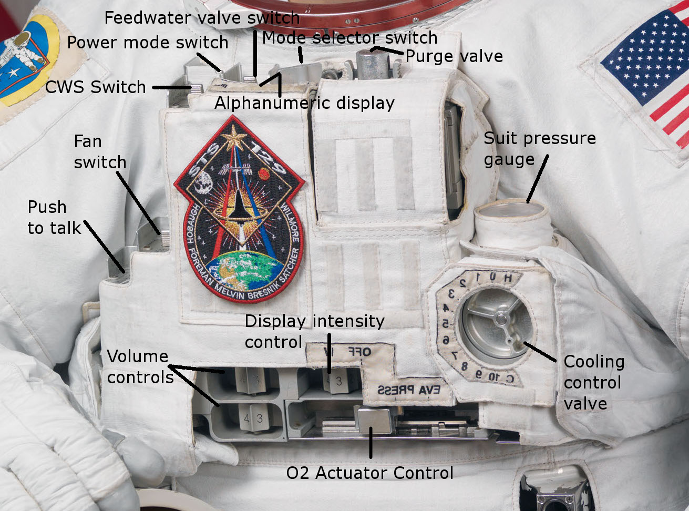

.. _eva-training:

******************************************
Wyjścia astronautów w przestrzeń kosmiczną
******************************************

.. todo::
    - narzędzia
    - Jaki jest wpływ interfejsów narzędzi na konstrukcje
    - Optymalizacja budowy stacji
    - Czy lepiej inaczej zaprojektować, czy mieć kilka EVA więcej
    - Stroje
    - Procedury
    - Szkolenia
    - Planowanie
    - Kontrola
    - Optymalizacja
    - Duże struktury ramię robotyczne, kable, człowiek
    - Komunikacja
    - Planning
    - Organizacja
    - Contingency EVA
    - Każdy crewmember musi być przygotowany aby je przeprowadzić w dowolnym momencie
    - Szybkie EVA do awaryjnej naprawy narzędzi i urządzeń
    - Jak polecimy na Marsa to w czasie drogi też trzeb będzie coś naprawić na statku itp
    - Jak naprawić zepsuty spacesuit w kosmosie?
    - Wykorzystując tylko narzędzia na ISS
    - Stroje były zaprojektowane by były składane w laboratorium przez techników a nie w środowisku 0g
    - Przecieranie się rękawiczek
    - Może doprowadzić do rozszczelnienia
    - Stroje mają kompresor, który pompuje dużo powietrza jak zobaczy, że uchodzi
    - Muszą uważać na główki śrubek, ostre poręcze i krawędzie, niezabezpieczone koncówki stalowych linek, poprzecierane uszczelki na metalowych elementach, zatyczki zabezpieczające śruby przed odkręceniem
    - Mikrometeoryty porobiły w stacji przez 15 lat niewielkie wyłomki i ostre krawędzie
    - Metalowe poręcze przez haki, których używają do przymocowywania porobiły niewielkie metalowe odpryski, które mogą przedziurawić rękawicę
    - Mikrometeoryty
    - https://youtu.be/Z5Bz6L93Gwo

Jednym z najtrudniejszych elementów pracy astronauty jest wyjście w przestrzeń kosmiczną na tzw. EVA (ang. Extravehicular Activity, pol. spacer kosmiczny). Do przeprowadzenia takiego wyjścia astronauci przygotowują się przez dwa lata przed misją przeprowadzając około 20 ćwiczeń w pełnym skafandrze pod wodą w basenach neutralnej pływalności. Każdy trening jest oceniany przez zespół wykwalifikowanych i certyfikowanych instruktorów.

Ze względu na bardzo szeroki zakres obowiązków podczas spacerów kosmicznych astronauci specjalizują się w swojej dziedzinie i charakterze przeprowadzanej operacji. Każdy z nich także otrzymuje szkolenie umożliwiające mu zastąpienie dowolnego innego astronauty w jego obowiązkach gdyby zaszła taka potrzeba. Z tego względu szkolenie astronautów podzielone jest na dwa typy:

- generic training (pol. szkolenie generalne),
- cross training (pol. szkolenie przekrojowe).

Astronauci podczas szkolenia podstawowego, a później dla utrzymania sprawności w trakcie swojej kariery ćwiczą wyjścia EVA w basenie neutralnej pływalności. Podczas tych zajęć szkolą się z rozwiązywania sytuacji awaryjnych, m.in. ewakuacja astronauty, który ma niesprawny kombinezon lub nie może się poruszać.

Na chwilę obecną wyjścia w przestrzeń kosmiczną skupiają się głównie na pracach na orbicie przy konstrukcji i naprawy międzynarodowej stacji kosmicznej. Przed erą ISS astronauci wychodzili aby naprawiać MIR czy Skylab, podczas programu Apollo w celu demontażu kamery oraz w programie STS, Gemini i Wostok. Dotychczas EVA na obcych planetach lub satelitach doświadczyło tylko i wyłącznie dwanaście osób. Jednym z najbardziej podstawowych podziałów spacerów kosmicznych są wyjścia:

- zaplanowane,
- awaryjne,
- na obcych ciałach niebieskich.

Spacery kosmiczne wymagają wysokiej sprawności oraz dużej siły fizycznej. Z tego względu nie wszyscy astronauci mają możliwość wykorzystania w kosmosie wyuczonych uprzednio umiejętności. Ay astronauta mógł wyjść w przestrzeń kosmiczną musi udowodnić znajomość stroju przechodząc stosowny egzamin jak również musi mieć odpowiednią kondycję i formę.

Zaznajomienie się ze skafandrem
===============================
Szkolenie przygotowujące do spacerów kosmicznych zaczyna się od zapoznania ze skafandrem. Astronauci są następnie przygotowywani do egzaminów z wykorzystania strojów EMU oraz Orlan. Ze względu na różnice w budowie, zakładaniu i zdejmowaniu skafandra, ciśnieniu operacyjnym oraz systemach awaryjnych astronauci muszą przejść ścieżkę certyfikacyjną z każdego stroju na międzynarodowej stacji kosmicznej. Po takiej certyfikacji astronauta powinien wykazać się dużą wiedzą na temat nie tylko posługiwania się wysoko wyspecjalizowanym ubiorem ale również w jego systemach awaryjnych. Każde ze szkoleń jest oceniane przez instruktorów z centrum kontroli misji.

Po pozytywnym zaliczeniu egzaminów teoretycznych astronauta jest dopuszczany do możliwości wykorzystania stroju w symulacjach w basenie neutralnej pływalności.

Do podstawowych zadań skafandra należą:

- ochrona przed ekstremalnym środowiskiem kosmosu,
- ochrona przed brakiem ciśnienia (próżnią),
- ochrona przed mikrometeorytami,
- ochrona termiczna przed fluktuacją temperatury od -156C do +121C,
- ochrona przed radiacją,
- ochrona przed promieniowaniem ultrafioletowym,

Generalna charakterystyka skafandrów kosmicznych
================================================
.. todo::
    - Every suit leaks
    - atmospheric 14.7 psi
    - w strojach tylko i wyłącznie oddychają czystym tlenem
    - szczelność
    - Rosjanie mają jednoczęściowe stroje do których wchodzi się przez plecak
    - dla kobiet i mężczyzn skafander jest taki sam
    - Kobiety są zwykle słabsze
    - EVA jest wymagające siłowo
    - Manewrowanie suitami
    - Suity były projektowane dla wielkich gości
    - Jeżeli jesteś mała osobą, to musisz mocno nawet do 120 stopni się skręcić aby Suit się skręcił
    - Kiedyś (ostatni lot STS) był prototyp małego stroju ale już nie ma

Strój wewnątrz skafandra
------------------------
.. todo::
    - Cotton Long Jons (zwykła off-the shelf bielizna bawełniana)
        - ma wsiąknąć w nią pot
        - aby ciało nie było śliskie
        - aby pot nie zbierał się i nie latał w kombinezonie
    - Liquid Cold Ventilation Gourmet
        - bielizna z długimi rękawami i naramiennikami poprzetykana rurkami z płynącą wodą
        - płynie w nim zimna woda
        - zmieniając prędkość płynięcia wody, można regulować temperaturę
        - rozmieszczenie rurek powoduje, że nie czujesz miejscowego chłodu, tylko rozprasza się po całym ciele
        - bielizna jest w drobną siateczkę przez którą przelatuje powietrze
    - Cotton gloves (które idą pod zwykłe rękawice) mają wsiąkać pot
    - Różne pads and shields aby chronić przed urażeniem ciała i odciskami skafandra plus guzami
    - pielucha dla dorosłych

Systemy biomedyczne skafandra
-----------------------------
.. todo::
    - Astronauci podczas EVA na ISS nie korzystają z radiation decimeter bo boją się, że zostanie nagrane i następnym razem ich nie puszczą.
    - Astronauci nie zawsze chcą wszystko raportować, na wszelki wypadek, bo nie są pewni czy wszystko zrobili perfekt.
    - Promieniowanie
        - Radiation dosimeter
    - Układ krwionośny
        - ECG, 3 electrode
    - Układ oddechowy
        - Respiratory Coefficient
        - Respiratory trace
        - Oxygen Consumption
        - Oxygen Uptake
        - CO2 sensor
        - O2 sensor
        - O2 consumption (per astronaut)
        - anarobic (na podstawie O2 i CO2)
        - metabolism
    - Biometryka
        - measuring chest
        - temperature sensor on your ear (wcześniej w rectal) [Russian Suit]
    - Systemy skafandra
        - Leak Check (every suit leaks)
        - Suit sensor
        - QRS complex
        - LCVG (Liquid Cooling and Ventilation Groumet)

Hełm
----
.. todo::
    - kamery na hełmie
    - oświtlenie nocne
    - cyrkulacja powietrza w masce
    - Communication Cap (Snoopy Cap)
        - wpina się do portu w skafandrze
        - pozwala na komunikację ze stacją i z ziemią
    - strój i materiały wewnątrz tłumią echo
    - hełm się nie rusza
    - Field of View jest limited
    - Situational Awareness również jest limited
    - hełm ma wbudowany Visor ze złota (gałka po prawej)
    - oraz daszek (shield) chroniący przed direct sun (gałka po lewej)
    - szyba jest zrobiona ze zwykłego polycarbonate lexan plastic

Tors
----
.. todo::
    - Upper Torso i Lower Torso jest w trzech rozmiarach
        - Small
        - Medium
        - Large

Ramiona i Rękawice
------------------
.. todo::
    - rękawice i obniżona zręczność
    - checklista naramienna
    - są customizowane do pewnego stopnia, mają dużo różnych rozmiarów
    - tradeoff pomiędzy dextirity a comfort
    - muszą lekko uwierać aby dextirity było największe
    - ważne są rękawiczki i przeguby
    - rękawice definiują to co możesz zrobić
    - każdy ma swoje rękawiczki

Nogi i Buty
-----------

.. todo:: Przetłumaczyć opis zdjęcia

.. figure:: /img/spacesuit-a7l-boots.jpg
    :scale: 75%
    :align: center

    The Lunar Overshoe was a boot that the astronaut slipped on over the pressure boot of the spacesuit. Except for the ribbed silicone rubber sole, the outer layer of the lunar boot was made from metal-woven fabric (Chromel R) for abrasion protection. The boots inner layers were made from Teflon-coated fiber-glass cloth followed by 25 alternating layers of Kapton film and fiber-glass cloth to form an efficient, lightweight thermal insulation. The boot was manufactured by General Electric and ILC Industries Inc.

Plecak z systemem podtrzymywania życia
--------------------------------------
.. todo::
    - Portable Life Support System

Zaczepy na narzędzia
--------------------
.. todo::
    - Mini workstation dołączany bezpośrednio do Hard Upper Torso
    - narzędzia są dobierane w zależności od zadań które trzeba wykonać przy EVA
    - narzędzia
        - ratchet wrench 3H drive, z pokrętłem z tyłu aby móc operować w małej przestrzeni, możliwość doczepienia cheater arm, aby przedłużyć uchwyt i podwoić moment torque (trzeba uważać aby nie ukręcić śruby)
        - kręcąc kluczem, klucz odpycha Ciebie więc zwykle korzysta się z niego jedną ręką a druga trzyma się stacji aby zyskać stabilność, chyba że używają foot restraint aby nie odlatywać
        - narzędzia nigdy nie mogą być bez przywiązania, są połączone ze skafandrem Equipment Theather (z karabińczykiem)
        - ze względu na różną wielkość gniazd i śrub są także przejściówki, które nakłada się na klucz, przejściówki również są podpięte do mniejszego Equipment Theater (socket catty) z zatyczką aby przy zakładaniu nie odleciały

Ciśnienie pracy
---------------
.. todo::
    - 3.7 psi (Apollo),
    - 4.3 psi (EMU)
    - 5.8 psi(Orlan) of current spacesuits.
    - dlaczego obniżone ciżnienie? ze względu na wagę oraz flamability
    - nowe skafandry na księżyc oraz mars mają być 8 psi (bez pre-breating) ten sam poziom co łazik
    - pre-breathing protocols
    - 100% pure oxygen (ze względu na masę azotu)

Insygnia oraz naszywki
----------------------
.. todo::
    - That is the EVA insignia patch.  It is the symbol used by the team responsible for the suits.  It is a space age representation of Leonardo daVinci's Vitruvian man.  The five stars represent the five NASA programs that have utilized EVA (Extravehicular Activity).

Lista skafandrów kosmicznych
============================

Skafandry kosmiczne wykorzystywane podczas startu i lądowania
-------------------------------------------------------------

.. csv-table:: Zestawienie skafandrów do czynności podczas startu i lądowania IVA (ang. Intravehicular Activity)
    :file: ../data/spacesuits-iva.csv
    :header-rows: 1

Skafandry kosmiczne wykorzystywane podczas wyjść w przestrzeń kosmiczną
-----------------------------------------------------------------------

.. csv-table:: Zestawienie skafandrów do spacerów kosmicznych EVA (ang. Extravehicular Activity)
    :file: ../data/spacesuits-eva.csv
    :header-rows: 1

Charakterystyka wybranych skafandrów kosmicznych
================================================

Charakterystyka skafandra Sokol
-------------------------------

Charakterystyka skafandra Orlan MKS
-----------------------------------
.. todo::
    - 5.7 PSI

Charakterystyka skafandra ACES i MACES
--------------------------------------
.. todo::
    - The Advanced Crew Escape Suit (ACES) or "pumpkin suit",[1] was a full pressure suit that began to be worn by Space Shuttle crews after STS-65, for the ascent and entry portions of flight. The suit is a direct descendant of the U.S. Air Force high-altitude pressure suits worn by the two-man crews of the SR-71 Blackbird, pilots of the U-2 and X-15, and Gemini pilot-astronauts, and the Launch Entry Suits (LES) worn by NASA astronauts starting on the STS-26 flight, the first flight after the Challenger disaster. The suit is manufactured by the David Clark Company of Worcester, Massachusetts. Cosmetically the suit is very similar to the LES. ACES was first used in 1994.
    - Underneath the suits, astronauts wear "Maximum Absorbency Garment" (MAGs) urine-containment trunks (resembling "Depends" incontinence shorts) and blue-colored thermal underwear, which has plastic tubing woven into the garments allowing for liquid cooling and ventilation, the latter being handled by a connector located on the astronaut's left waist.
    - MACES (Modified Advanced Crew Escape Suit) is a work in progress. It is a suit intended for use in Orion. Because of mass and volume constraints, NASA wanted to be able to use ACES (the suit intended for ascent and entry during Space Shuttle missions) both for ascent/entry periods of Orion missions and also for EVA (space walks). MACES, therefore, is a hybrid of the orange Space Shuttle escape suit and the white ISS EVA suit.
    - The suit has a new cooling garment and new bearings in the joints. It also uses the gloves and boots from the ISS EVA suit (EMU). It looks like it will be suitable for EVAs up to about four hours. And, since that is a much longer period that the crew have to keep the visor closed while in the vehicle, a drink bag has also been added.
    - Initially, ACES was intended to be retired after the Space Shuttle Program and be replaced by the Constellation Space Suit.[8] The Orion missions are now instead planned to use a modified ACES (MACES). This suit would have increased mobility in comparison to its Space Shuttle counterpart and would use a closed-loop system to preserve resources.[9] NASA is also considering using it for contingency and possibly limited capacity EVAs, such as those carried out during the Gemini program.[10] Simulated microgravity testing has occurred on parabolic flights and in the Neutral Buoyancy Laboratory, in order to better characterise the suit's mobility.[10][11]
    - ACES Specifications
    - Name: Advanced Crew Escape Suit (S1035)[3]
    - Derived from: USAF Model S1034[3]
    - Manufacturer: David Clark Company[3]
    - Missions: STS-64[6] to STS-135
    - Function: Intra-vehicular activity (IVA)[3]
    - Pressure Type: Full[3][2]
    - Operating Pressure: 3.5 psi (24.1 kPa)[3]
    - Suit Weight: 28 lb (12.7 kg)[3]
    - Parachute and Survival Systems Weight: 64 lb (29 kg)[3]
    - Total Weight: 92 lb (41.7 kg)[3]
    - Useful Altitude: 30 km (100,000 ft)[7]
    - Primary Life Support: Vehicle Provided[3]
    - Backup Life Support: 10 minutes[3]
    - [2] Daniel M.Barry; John W. Bassick (July 1995). "25th International Conference on Environmental Systems: NASA Space Shuttle Advanced Crew Escape Suit Development". San Diego, California: David Clark Company/SAE International. Retrieved 6 October 2014.
    - [3] Kenneth S. Thomas; Harold J. McMann (2006). US Spacesuits. Chichester, UK: Praxis Publishing Ltd. p. 374. ISBN 0-387-27919-9. https://books.google.com/books?id=cdO2-4szcdgC&source=gbs_navlinks_s
    - [7] http://www.nasa.gov/centers/johnson/pdf/383443main_crew_escape_workbook.pdf
    - [10] "Space Station Live: Orion Spacesuits with Dustin Gohmert". NASA. 20 June 2013. Retrieved 10 August 2013. https://www.youtube.com/watch?v=Uvn3BM7aOeY

Charakterystyka skafandra EMU
-----------------------------
.. todo::
    - Donning - zakładanie stroju EMU
    - Doffing - ściąganie stroju EMU
    - total suit weighs about 275 lbs
    - 4.3 PSI
    - Extravehicular Mobility Unit
    - design z ery Apollo
    - Strój składa się z różnych materiałów i warstw kompozytów, tajemnica NASA
    - Ubieranie stroju
        - Lower Torso Assembly - spodnie
        - Upper Torso Assembly - góra
        - hard upper torso - sztywna skorupa, ze względu na konieczność podtrzymywania narzędzi, Life Support Systems
        - ubierają spodnie a później nakładają górę
        - mają metalową obręcz z haczykami która spina obie części
        - później nakładają rękawice
        - hełm
    - SAFER

    Moduł kontrolny z wyświetlaczem amerykańskiego skafandra EMU (ang. *EMU DCM - Display and Control Module*)

Utrzymywanie sprawności skafandra
=================================
.. todo::
    - nie są przystosowane do naprawy w nieważkości
    - Suit "Surgery", fan, pump, water-gas separator failure
    - Day and a half procedure
    - Knots and bolts
    - Twizzers, vacuum cleaner with mash Net do zasysania śrubek i ręcznik z drugiej strony aby upewnić się czy śrubki nie wpadają do środka
    - Wszystkie rzeczy w rękawiczkach, wszystko nagrywane na kamerach i monitorowane z ziemi przez inżynierów, mają specjalne narzędzia do space suitów które nie są nigdzie wykorzystywane, space suity działają w środowisku 100% oxygen

Systemy awaryjne skafandrów EVA
===============================
.. todo::
    - W przypadku Emergency case ludzie rzucają eksperymenty i skupiają się na pomocy EV na powrocie do bazy.
    - EMU trzyma ciśnienie przez 22 min

SAFER
-----
.. todo::
    - Augument Reality i możliwość zdalnego aktualizowania procedur

Augmentacja
===========
.. todo::
    - mobiPV
    - Google Glass
    - Pozycjonowanie astronautów i obserwacja realtime gdzie są

        - GPS na Księżycu i Marsie
        - Nawigowanie alternatywne
        - Geografia terenu

Sprawdzenie szczelności skafandra
---------------------------------
Przed wykonywaniem zadań w basenie astronauci wykonują tzw. sprawdzenie szczelności skafandra. Podczas tego testu astronauta ubrany w strój do wyjść EVA jest zamykany w pomieszczeniu, w którym odpompowywane jest powietrze do uzyskania ciśnienia zbliżonego do próżni. W trakcie trwania testu astronauci zapoznają się z zachowaniem skafandra i materiału, który sztywnieje i się napręża dając uczucie nadmuchania. Z tego względu praca w warunkach braku ciśnienia panujących poza statkiem kosmicznym jest znacznie trudniejsza od symulacji prowadzonych w basenie doskonałej pływalności.

Systemy biomedyczne stosowane podczas EVA
-----------------------------------------
Każdy skafander kosmiczny posiada inny zestaw sensorów i urządzeń kontrolujących organizm i pracę astronautów. Szczegółowe informacje na temat systemów biomedycznych skafandrów zostały przedstawione w osobnym rozdziale. Podczas podstawowego zapoznania się ze skafandrem astronauta poznaje systemy wspierające i monitorujące:

- promieniowanie,
- działanie układu krwionośnego,
- działanie układu oddechowego,
- systemy biometryczne,
- systemy podtrzymania życia.

Układ krwionośny monitorowany jest za pomocą trzypunktowych elektrod EKG (Elektrokardiografu). Informacje na temat układu oddechowego stanowią dane odnośnie ilości wdychania tlenu i wydychania dwutlenku węgla, dzięki czemu lekarze i biomedycy mogą wyliczyć metabolizm oraz przemianę anaerobową w trakcie wykonywania prac.

Każdy z systemów pobiera informacje i przekazuje je do centrum kontroli misji gdzie inżynierowie skafandra, inżynierowie biomedyczni oraz lekarz lotu (ang. flight surgeon) asystują astronautom podczas wyjścia w przestrzeń kosmiczną.

Ze względu na niedoskonałość materiału każdy strój posiada tzw. przecieki, które są również monitorowane. W przypadku zbyt dużego tempa wycieku powietrza uruchamiane są systemy awaryjne a astronauta natychmiast musi przerwać pracę na zewnątrz i udać się do śluzy pojazdu. Więcej na temat procedur oraz systemów awaryjnych w osobnym podrozdziale.

Wykorzystywanie specjalistycznych narzędzi do pracy
---------------------------------------------------

Prace w przestrzeni kosmicznej wymagają znajomości wysokospecjalistycznych narzędzi. Ich rolą jest nie tylko pomoc astronaucie w dokonaniu naprawy czy montażu sprzętu ale również zachowanie pozycji czy bezpiecznego poruszania się w obrębie stacji kosmicznej.

Urządzenia wykorzystywane w pracy w przestrzeni kosmicznej możemy podzielić na:

- śrubokręty (ang. hex screwdriver),
- klucze dynamometryczne (ang. ratchet wrench),
- wiertarki i wkrętarki (ang. pistol grip tool),
- urządzenia do spawania.

Prowadzenie prac w środowisku mikrograwitacji przy wykorzystaniu urządzeń tj. śrubokręty, wiertarki i wkrętarki nie jest tak proste jak na Ziemi. Brak oporu i bardzo zmniejszone przyciąganie ziemskie powoduje wytworzenie niezbilansowanego momentu skręcającego działającego na astronautę a to w konsekwencji prowadzi do zmiany jego pozycji względem stacji. Astronauta używając klucza czy wkrętarki musi być przymocowany aby móc przyłożyć odpowiednią siłę.

Wykorzystanie urządzeń wspierających pracę w przestrzeni kosmicznej
-------------------------------------------------------------------
Urządzenia wspierające pozwalają na zachowanie pozycji względem stacji kosmicznej oraz na łatwiejsze posługiwanie się narzędziami. Do głównych urządzeń wspierających czynności podczas spacerów kosmicznych można zaliczyć:

- przedłużki zmieniające ramię narzędzi,
- liny stalowe (ang. tethering),
- przymocowania stóp (ang. foot restraints).

Do zadania przedłużek należy zwiększenie długości ramienia klucza. Urządzenia te usadza się na końcu klucza przedłużając jego rączkę. Dzięki ich zastosowaniu astronauta może zwiększyć moment obrotowy działający na śrubę i dzięki temu przykręcić lub odkręcić śruby z większą siłą i precyzją.

Urządzenia przymocowywania stóp były głownie wykorzystywane podczas misji amerykańskich promów kosmicznych, gdzie astronauta przymocowany nogami do specjalnego panelu zamontowanego na ramieniu robotycznym mógł być bezpiecznie i stabilnie być wspierany przy wykonywaniu prac w stanie nieważkości.

Obecnie podstawowym elementem wyposażenia każdego stroju astronauty są tzw. uprzęże z bloczkami stalowych lin. Każdy strój do wyjść w przestrzeń kosmiczną posiada dwie takie uprzęże. Podczas spaceru kosmicznego astronauci muszą być przymocowani za pomocą przynajmniej jednej liny z klamrą do stacji kosmicznej aby nie odlecieć w przestrzeń. W celu przemieszczenia się astronauta zaczepia drugą klamrę do następnego punktu przymocowania i po upewnieniu się pewności zaczepu odczepia pierwszą przechodząc w dalsze miejsce.

Symulacje wykorzystujące komputery i wirtualną rzeczywistość
============================================================
Z uwagi na koszt, stopień skomplikowania i czasochłonność operacji w basenie neutralnej pływalności astronauci najpierw przechodzą szkolenie zapoznawcze w laboratorium wirtualnej rzeczywistości (ang. VR - Virtual Reality Lab) wykorzystując symulacje komputerowe tj. Oculus Rift czy HoloLens firmy Microsoft. W specjalnie napisanych w tym celu aplikacjach mają możliwość przećwiczenia manewrów, zapoznania się z segmentem stacji, której dotyczy praca czy praktykowaniem umiejętności poruszania się i odnajdywania na zewnątrz międzynarodowej stacji kosmicznej.

Symulacja prac w basenie doskonałej pływalności
===============================================
.. todo::
    - Ćwiczą 20 zanim wykonają to w kosmosie
        - Wejścia po 6 godzin
        - Pózniej w kosmosie 8/9 godzin
        - Hadfield spędził 240h przed EVA z Canada Arm 2
        - mają misję do ukończenia
        - Generic Training, a później Flight Assignment, Repetition mode już bezpośrednio przed samym wylotem.
        - generic training - szkolenie generyczne z umiejętności, które się zawsze przydają
        - cross-training szkolą ludzi tak by każdy miał przynajmniej pojęcie jak to się robi
        - trenowanie napraw ISS
    - Komunikacja
        - W basenie trenują również kontakt z CAPCOM
        - O wszystkim informują CAPCOM
        - Comcheck pierwsza rzecz po wejściu pod wodę
    - Wykorzystywanie narędzi
        - Korzystanie z narzędzi
        - rozszerzalność cieplna metali i zmiana siły na pokrętłach i wajchach
        - jeżeli jesteś w foot restraint to powinieneś przestać przykładać siłę w cokolwiek aby nie urwać
    - Zaznajomienie się ze skafandrem
        - sprawdzenie czy Portable Life System jest włączony
        - Wyrównywanie ciśnienia w środku skafandra
        - EVA szkolenie z trzymania się, podwójnego bezpieczeństwa i przenoszenia ładunku
        - Badanie ciśnieniowe skafandra
        - schodzenie do basenu po linie w dół aby Astronauta mógł reagować na zmiany ciśnienia w swoim tempie i aby nic się nie stało
        - urządzenie do przedmuchiwania ciśnienia w uszach (Valsalva maneuver - przedmuchiwanie uszu, gdy ciśnienie zapycha) Dolly Burton (ustnik do przedmuchiwania ciśnienia)
        - Siedzą pod wodą po 6 godzin i strasznie to wykańcza ręce
        - Why are space suits still bulky? While it's technically possible to create a tight suit that protects you from the vacuum of space and probably the extreme temperatures as well, one of the functions of the suit is to protect you from meteoroids -- grains of sand moving at tens of thousands of miles per hour. For this reason, the suit is made up of many layers of different fabrics that will stop a meteoroid from puncturing the suit -- and the astronaut. As you can see in this diagram, layers 6 through 14, 9 layers in total, are devoted to stopping meteoroids.
    - Procedury charakterystyczne dla basenu
        - weight out - nurkowie wyważają astronautę - dodają pianki i ciężarków abyś był neutralny w każdej pozycji: pionowo, do góry nogami, bokiem
        - puszczają muzyczkę (Bastille - Pompeii)
    - Obstawa
        - 2 safety divers
        - 1 floating diver (z kamerą)
        - 2 utility diver z narzędziami, monitorują i pomagają się rozstawić
        - NBL: dwóch nurków (EV1, EV2) na jednego astronautę Safety Diver + jeden (Float Diver) z kamerą i zmieniają się co dwie godziny, video jest do prezentacji i do analizowania szkoleń
        - Na dwie osoby trenujące EVA jest około 40 osób, które upewniają się, że wszystko jest bezpiecznie

.. csv-table:: Lista basenów neutralnej pływalności
    :file: ../data/neutral-buoyancy-pools.csv
    :header-rows: 1

NASA - Neutral Buoyancy Laboratory
----------------------------------

ESA - Neutral Buoyancy Facility
-------------------------------
.. todo::
    - EVA pre-familiarisation training (w NBF w EAC, ESA)
    - EVA training (w NBL w Huston, TX) jest prowadzony po ukończeniu pre-familiarisation w Kolonii
    - In this situation, EAC created a so-called EVA pre-familiarisation training course, which is conducted at EAC's Neutral Buoyancy Facility (NBF). This programme teaches ESA astronauts basic EVA concepts and EVA skills such as tethering to the Station, use of special EVA tools, communication with an EVA crewmate as well as with the control room and how to keep full situational awareness in a complex and challenging environment.
    - The full spacewalk, or Extra Vehicular Activity (EVA), training for the ISS is traditionally done at NASA’s Neutral Buoyancy Laboratory (NBL) at the Johnson Space Center, Houston, Texas, and at the Gagarin Cosmonaut Training Center, in Russia.
    - For each specific spacewalk, there are several training units to be completed. One EVA run lasts around 5 hours, and the standard right now is that you spend five to seven times as long in the NBL at Houston for each EVA, depending on the difficulty. In addition to that you train a lot of contingency scenarios.
    - With the assembly of the ISS in full swing, the EVA training schedule in the NBL is tight, the facility itself overbooked with operational and mission-related EVA training so the training schedule is compressed into three shifts a day. In addition, it will in future also be used for exploration related testing, which leaves little time for providing EVA skills training to ESA astronauts.
    - An assignment to take part in a spacewalk during a space mission depends on an EVA skills evaluation, which takes place at a very early stage of the EVA training programme in Houston. Those astronauts who handle their very first neutral buoyancy experiences in Houston well will be chosen to perform EVAs and receive the full-blown EVA training.
    - 3-4 trenują w NBF pod wodą

Roscosmos - Hydro Lab
---------------------

CNSA - Neutral Buoyancy Facility
--------------------------------

JAXA - Weightlessness Environment Test System
---------------------------------------------

University of Maryland - Buoyancy Research Facility
---------------------------------------------------

Komunikacja i podział ról podczas symulacji oraz wyjścia w przestrzeń kosmiczną
===============================================================================

Role i obowiązki astronautów
----------------------------
.. todo::
    - Przynajmniej dwie osoby wychodzą na EVA i minimalnie jedna zostaje w bazie jako IVA.
    - EV1 jest bardziej prestiżowy. Astronauci o to konkurują.
    - EV1 jest przyznawany ze względu na ranking lub wyszkolenie.
    - communication relay protocol
    - common language
    - common alphabet

Role i obowiązki kontrolerów misji
----------------------------------

Charakterystyka komunikacji
---------------------------
.. todo::
    - Podczas EVA masz big loop i każdy może słuchać i włączać się do rozmów.
    - Ground Loop
    - Space to Ground Loop
    - EV Loop (for EVA)
    - Russian CapCom rozmawia z ruskim CapComem
    - jaki język jest podczas rozmowy?
    - Amerykański CapCom rozmawia z Amerykańskim
    - CapCom jest astronautą i przechodzi przez ten sam trening. Ci ludzie dobrze się znają.
    - Zwykle podczas EVA CapCom komunikuje się z zespołem.

Procedura przeprowadzenia spaceru kosmicznego
=============================================

Przygotowanie do wyjścia w przestrzeń kosmiczną
-----------------------------------------------
.. todo::
    1. obniżenie ciśnienia w airlock do 5 psi
    	- check safety thether
    2. communication check and suit leak checks
    3. obniżenie ciśnienia do 0
    4. final suit leak check
    5. przełączenie skafandrów na zasilanie wewnętrzne (DCM power switch to internal)
    	- check DCM power monitor
    	- UAA (?) power to off
    	- LEDs check to be power off
    	- SC disconnect from DCM
    	- on the crew lock pressure control valve is locked
    	- DCM temperature control valve max heat
    	- switch water on
    	- DCM check blank and bite (byte) off
    	- temperature control valve as desired
    	- suit pressure guage (psi 4.3 for EV1 and EV2)
    	- check your visor as desired
    	- read the configuration for the safety thether (opnen, close, lock, unlocked)
    	- EV1 checks EV2, EV2 checks EV1
    6. wyjście w przestrzeń kosmiczną (egress)
    	- buddy checks
    	- HAPs - helmet absorbsion pads checks (wchłaniają wodę w przypadku przecieku, wprowadzone po incydencie Luca Parmitano)

    - podczas spaceru, Ground IV co jakiś czas przekazuje informacje o 'cautions' i 'warnings' czyli informacje na temat niebezpieczeństw, które mogą być w pobliżu EV
    	- ostre krawędzie
    	- urządzenia pod napięciem
    	- informacje czego nie dotykać
    	- informacje do czego się ne podpinać
    - Ground IV informuje o następnych krokach dla EV1 oraz EV2
    - instalacja portable foot restraint, przed przystąpieniem do dalszych czynności takich jak odkręcanie
    - Spacewalker Communitacatior - Ground IV - (flight choreographer) osoba w MCC, która czuwa nad tym czy eva przebiega zgodnie z planem i czy wszystko jest ok. (podczas EVA pierwszego w 2017 był nim Luca Parmitano)
    - Ingress i Regress
    - What medical examination you perform before and after EVA
    - Ruskie MO - medical assessment (5 or 6)
    - threadmill, hand ergomenter,
    - ECG, cardiovascular, blood pressure, QRS complex
    - zdarzyło się raz aby ktoś był wykluczony
    - badają zdolność do EVA już nawet na kilka dni przed
    - What is the procedure for EVA preparation (oxygen intake) - pre-breath protocol
        - O2 environment makes pre-breath easier
        - Rosyjski strój pozwala szybciej wyjść, ale nie tak długo siedzieć
        - kiedyś, oddychają czystym O2 jadąc na rowerze z maską, a później wchodzą do stroju i obniżają ciśnienie
        - camp-out, śpią w śluzie z 10.2 PSI i to się zmienia z 21% do 28% tlenu
        - exercise protocol in the suit, połączenie starszych
        - możesz zrobić cały pre-breath przez 4 godziny w stroju (zrobili to dwukrotnie, awaryjnie)
        - Rosjanie mają 30-40 minut
        - jeżeli miałbyś strój z 8 PSI to nie musisz mieć żadnych pre-breath, ale nie dałoby się niczego robić

Wyjście i przykładowe zadania
-----------------------------

Procedury po powrocie
---------------------
.. todo::
    - Ruskie walą wódkę, jeszcze w śluzie zanim się zdepresuryzuje. nigdy się nic nie stało
    - amerykanom dwukrotnie zdarzyło się przytrzasnąć narzędzie
    - wyrównują do 5 PSI i robią leak check, jeżeli nie działa, to upuszają powietrze i jeszcze raz sprawdzają właz
    - nominal procedures
    - repress takes 15 minutes
    - depress takes 30 minutes
    - cooling, oxygen supplies

EVA na powierzchni innych ciał niebieskich
==========================================
.. todo::
    - temperatura
    - upadki i wstawanie
    - radzenie sobie z pyłem
    - fotografia
    - Pozycjonowanie astronautów i obserwacja realtime gdzie są
        - GPS na Księżycu i Marsie
        - Nawigowanie alternatywne
        - Geografia terenu
    - Tools
        - spectometers
        - portable X-ray fluorecscence analyzers
        - SCIO
        - Magnetotlluric analysis
        - Terramenter LS
        - Stratagem
        - Seismic discovery

EVA na powierzchni Księżyca
---------------------------
.. todo::
    - 3 ways of scrubbing CO2
    - Lithium-hydroxide
    - EMU ma wymienialne kardridże
    - EMU ma metal-oxide w wymienialnych kardridżach
    - swing-bads - molecular sivs (mass number of the element from the) sito działa na zasadzie wysysania w przestrzeń kosmiczną gazu ze specyficzną masą atomową
    - Wszystkie systemy muszą być przynajmniej potrójne

EVA na powierzchni planet
-------------------------

EVA na powierzchni asteroid
---------------------------

Wykorzystywanie pojazdów
========================
.. todo::
    - rovers
        - manned rovers
        - autonomous rovers
        - remote controlled rovers
        - Astronaut Personal Carriers
    - heavy duty and drilling
        - telescopic reconessance
        - watchtower
    - Drones (jet / blades)
        - jet drones
        - Submarines
        - Baloons
        - Moles
        - Hovercraft
    - Emergency
        - In field battery fix
        - Gripper or drill stuck
        - in-blind rover control

Sytuacje awaryjne
=================

Systemy awaryjne skafandra
--------------------------
.. todo::
    - SAFER
    - trzymanie ciśnienia przez 22 min

Procedury bezpieczeństwa
------------------------
.. todo::
    - skażenie skafandra podczas EVA
        - procedury dla airlock
        - procedury powrotu aby nie ryzykować życia innych
        - pędzel do strzepania amoniaku
        - wyparowanie płatków śniegowych w słońcu
        - wyrównanie ciśnienia w airlock aby móc otworzyć i wrzucić mokre ręczniki by się wytarli oraz ściany i odpowietrzniki
    - Amonia (NH3) Leak
    - Przećwiczenie ściągania osoby, która ma problemy podczas EVA.
    - Kiedy nie mogą widzieć przez visor.
    - Kiedy jakiś członek zespołu jest unieruchomiony.
    - Kiedy straci przytomność.
    - Kiedy są lekkie problemy ze strojem.
    - Kiedy są ciężkie problemy ze strojem.
    - Udostępnienie powietrza za pomocą przewodu (umbilical connection).
    - Na każdym suicie mają dwa radia. Kiedy jedno przestanie działać, muszą zmienić częstotliwość.
    - Używają języka znaków i gestów w przypadku braku możliwości komunikacji.
    - Mają nasłuch na dwóch częstotliwościach.
    - Ćwiczenie relay-com czyli przekazywanie wiadomości przez pośrednika gdy nie ma łączności bezpośredniej z członkiem EVA
    - TDRA - Space to Space communication system, predefined 8 miliseconds slots
    - Trenują abnormal situations w NBL
    - Emergency: Jednemu astronaucie podczas EVA kończy się powietrze
    - Emergency: Pojawienie się wody w skafandrze
    - Emergency: Chłodzenie
    - Emergency: Ewakuacja habitatu
    - Emergency: Holowanie nieprzytomnego astronauty
    - Emergency: Komunikacja na wypadek braku łączności podczas EVA
    - Abort case

Przykładowe zadania wykonywane podczas spacerów kosmicznych
===========================================================

Dekonstrukcja kamer i aparatu fotograficznego podczas misji Apollo
------------------------------------------------------------------

Demonstracja poruszania się w przestrzeni kosmicznej w programach Wostok, Gemini
--------------------------------------------------------------------------------

Instalacja systemów ISS
-----------------------

Konserwacja i naprawa systemów na ISS
-------------------------------------

******************************************
Wyjścia astronautów w przestrzeń kosmiczną
******************************************

.. todo::
    - narzędzia
    - Jaki jest wpływ interfejsów narzędzi na konstrukcje
    - Optymalizacja budowy stacji
    - Czy lepiej inaczej zaprojektować, czy mieć kilka EVA więcej
    - Stroje
    - Procedury
    - Szkolenia
    - Planowanie
    - Kontrola
    - Optymalizacja
    - Duże struktury ramię robotyczne, kable, człowiek
    - Komunikacja
    - Planning
    - Organizacja
    - Contingency EVA
    - Każdy crewmember musi być przygotowany aby je przeprowadzić w dowolnym momencie
    - Szybkie EVA do awaryjnej naprawy narzędzi i urządzeń
    - Jak polecimy na Marsa to w czasie drogi też trzeb będzie coś naprawić na statku itp
    - Jak naprawić zepsuty spacesuit w kosmosie?
    - Wykorzystując tylko narzędzia na ISS
    - Stroje były zaprojektowane by były składane w laboratorium przez techników a nie w środowisku 0g
    - Przecieranie się rękawiczek
    - Może doprowadzić do rozszczelnienia
    - Stroje mają kompresor, który pompuje dużo powietrza jak zobaczy, że uchodzi
    - Muszą uważać na główki śrubek, ostre poręcze i krawędzie, niezabezpieczone koncówki stalowych linek, poprzecierane uszczelki na metalowych elementach, zatyczki zabezpieczające śruby przed odkręceniem
    - Mikrometeoryty porobiły w stacji przez 15 lat niewielkie wyłomki i ostre krawędzie
    - Metalowe poręcze przez haki, których używają do przymocowywania porobiły niewielkie metalowe odpryski, które mogą przedziurawić rękawicę
    - Mikrometeoryty
    - https://youtu.be/Z5Bz6L93Gwo

Jednym z najtrudniejszych elementów pracy astronauty jest wyjście w przestrzeń kosmiczną na tzw. EVA (ang. Extravehicular Activity, pol. spacer kosmiczny). Do przeprowadzenia takiego wyjścia astronauci przygotowują się przez dwa lata przed misją przeprowadzając około 20 ćwiczeń w pełnym skafandrze pod wodą w basenach neutralnej pływalności. Każdy trening jest oceniany przez zespół wykwalifikowanych i certyfikowanych instruktorów.

Ze względu na bardzo szeroki zakres obowiązków podczas spacerów kosmicznych astronauci specjalizują się w swojej dziedzinie i charakterze przeprowadzanej operacji. Każdy z nich także otrzymuje szkolenie umożliwiające mu zastąpienie dowolnego innego astronauty w jego obowiązkach gdyby zaszła taka potrzeba. Z tego względu szkolenie astronautów podzielone jest na dwa typy:

- generic training (pol. szkolenie generalne),
- cross training (pol. szkolenie przekrojowe).

Astronauci podczas szkolenia podstawowego, a później dla utrzymania sprawności w trakcie swojej kariery ćwiczą wyjścia EVA w basenie neutralnej pływalności. Podczas tych zajęć szkolą się z rozwiązywania sytuacji awaryjnych, m.in. ewakuacja astronauty, który ma niesprawny kombinezon lub nie może się poruszać.

Na chwilę obecną wyjścia w przestrzeń kosmiczną skupiają się głównie na pracach na orbicie przy konstrukcji i naprawy międzynarodowej stacji kosmicznej. Przed erą ISS astronauci wychodzili aby naprawiać MIR czy Skylab, podczas programu Apollo w celu demontażu kamery oraz w programie STS, Gemini i Wostok. Dotychczas EVA na obcych planetach lub satelitach doświadczyło tylko i wyłącznie dwanaście osób. Jednym z najbardziej podstawowych podziałów spacerów kosmicznych są wyjścia:

- zaplanowane,
- awaryjne,
- na obcych ciałach niebieskich.

Spacery kosmiczne wymagają wysokiej sprawności oraz dużej siły fizycznej. Z tego względu nie wszyscy astronauci mają możliwość wykorzystania w kosmosie wyuczonych uprzednio umiejętności. Ay astronauta mógł wyjść w przestrzeń kosmiczną musi udowodnić znajomość stroju przechodząc stosowny egzamin jak również musi mieć odpowiednią kondycję i formę.

Zaznajomienie się ze skafandrem
===============================
Szkolenie przygotowujące do spacerów kosmicznych zaczyna się od zapoznania ze skafandrem. Astronauci są następnie przygotowywani do egzaminów z wykorzystania strojów EMU oraz Orlan. Ze względu na różnice w budowie, zakładaniu i zdejmowaniu skafandra, ciśnieniu operacyjnym oraz systemach awaryjnych astronauci muszą przejść ścieżkę certyfikacyjną z każdego stroju na międzynarodowej stacji kosmicznej. Po takiej certyfikacji astronauta powinien wykazać się dużą wiedzą na temat nie tylko posługiwania się wysoko wyspecjalizowanym ubiorem ale również w jego systemach awaryjnych. Każde ze szkoleń jest oceniane przez instruktorów z centrum kontroli misji.

Po pozytywnym zaliczeniu egzaminów teoretycznych astronauta jest dopuszczany do możliwości wykorzystania stroju w symulacjach w basenie neutralnej pływalności.

Sprawdzenie szczelności skafandra
---------------------------------
Przed wykonywaniem zadań w basenie astronauci wykonują tzw. sprawdzenie szczelności skafandra. Podczas tego testu astronauta ubrany w strój do wyjść EVA jest zamykany w pomieszczeniu, w którym odpompowywane jest powietrze do uzyskania ciśnienia zbliżonego do próżni. W trakcie trwania testu astronauci zapoznają się z zachowaniem skafandra i materiału, który sztywnieje i się napręża dając uczucie nadmuchania. Z tego względu praca w warunkach braku ciśnienia panujących poza statkiem kosmicznym jest znacznie trudniejsza od symulacji prowadzonych w basenie doskonałej pływalności.

Systemy biomedyczne stosowane podczas EVA
-----------------------------------------
Każdy skafander kosmiczny posiada inny zestaw sensorów i urządzeń kontrolujących organizm i pracę astronautów. Szczegółowe informacje na temat systemów biomedycznych skafandrów zostały przedstawione w osobnym rozdziale. Podczas podstawowego zapoznania się ze skafandrem astronauta poznaje systemy wspierające i monitorujące:

- promieniowanie,
- działanie układu krwionośnego,
- działanie układu oddechowego,
- systemy biometryczne,
- systemy podtrzymania życia.

Układ krwionośny monitorowany jest za pomocą trzypunktowych elektrod EKG (Elektrokardiografu). Informacje na temat układu oddechowego stanowią dane odnośnie ilości wdychania tlenu i wydychania dwutlenku węgla, dzięki czemu lekarze i biomedycy mogą wyliczyć metabolizm oraz przemianę anaerobową w trakcie wykonywania prac.

Każdy z systemów pobiera informacje i przekazuje je do centrum kontroli misji gdzie inżynierowie skafandra, inżynierowie biomedyczni oraz lekarz lotu (ang. flight surgeon) asystują astronautom podczas wyjścia w przestrzeń kosmiczną.

Ze względu na niedoskonałość materiału każdy strój posiada tzw. przecieki, które są również monitorowane. W przypadku zbyt dużego tempa wycieku powietrza uruchamiane są systemy awaryjne a astronauta natychmiast musi przerwać pracę na zewnątrz i udać się do śluzy pojazdu. Więcej na temat procedur oraz systemów awaryjnych w osobnym podrozdziale.

Wykorzystywanie specjalistycznych narzędzi do pracy
---------------------------------------------------

Prace w przestrzeni kosmicznej wymagają znajomości wysokospecjalistycznych narzędzi. Ich rolą jest nie tylko pomoc astronaucie w dokonaniu naprawy czy montażu sprzętu ale również zachowanie pozycji czy bezpiecznego poruszania się w obrębie stacji kosmicznej.

Urządzenia wykorzystywane w pracy w przestrzeni kosmicznej możemy podzielić na:

- śrubokręty (ang. hex screwdriver),
- klucze dynamometryczne (ang. ratchet wrench),
- wiertarki i wkrętarki (ang. pistol grip tool),
- urządzenia do spawania.

Prowadzenie prac w środowisku mikrograwitacji przy wykorzystaniu urządzeń tj. śrubokręty, wiertarki i wkrętarki nie jest tak proste jak na Ziemi. Brak oporu i bardzo zmniejszone przyciąganie ziemskie powoduje wytworzenie niezbilansowanego momentu skręcającego działającego na astronautę a to w konsekwencji prowadzi do zmiany jego pozycji względem stacji. Astronauta używając klucza czy wkrętarki musi być przymocowany aby móc przyłożyć odpowiednią siłę.

Wykorzystanie urządzeń wspierających pracę w przestrzeni kosmicznej
-------------------------------------------------------------------
Urządzenia wspierające pozwalają na zachowanie pozycji względem stacji kosmicznej oraz na łatwiejsze posługiwanie się narzędziami. Do głównych urządzeń wspierających czynności podczas spacerów kosmicznych można zaliczyć:

- przedłużki zmieniające ramię narzędzi,
- liny stalowe (ang. tethering),
- przymocowania stóp (ang. foot restraints).

Do zadania przedłużek należy zwiększenie długości ramienia klucza. Urządzenia te usadza się na końcu klucza przedłużając jego rączkę. Dzięki ich zastosowaniu astronauta może zwiększyć moment obrotowy działający na śrubę i dzięki temu przykręcić lub odkręcić śruby z większą siłą i precyzją.

Urządzenia przymocowywania stóp były głownie wykorzystywane podczas misji amerykańskich promów kosmicznych, gdzie astronauta przymocowany nogami do specjalnego panelu zamontowanego na ramieniu robotycznym mógł być bezpiecznie i stabilnie być wspierany przy wykonywaniu prac w stanie nieważkości.

Obecnie podstawowym elementem wyposażenia każdego stroju astronauty są tzw. uprzęże z bloczkami stalowych lin. Każdy strój do wyjść w przestrzeń kosmiczną posiada dwie takie uprzęże. Podczas spaceru kosmicznego astronauci muszą być przymocowani za pomocą przynajmniej jednej liny z klamrą do stacji kosmicznej aby nie odlecieć w przestrzeń. W celu przemieszczenia się astronauta zaczepia drugą klamrę do następnego punktu przymocowania i po upewnieniu się pewności zaczepu odczepia pierwszą przechodząc w dalsze miejsce.

Symulacje wykorzystujące komputery i wirtualną rzeczywistość
============================================================
Z uwagi na koszt, stopień skomplikowania i czasochłonność operacji w basenie neutralnej pływalności astronauci najpierw przechodzą szkolenie zapoznawcze w laboratorium wirtualnej rzeczywistości (ang. VR - Virtual Reality Lab) wykorzystując symulacje komputerowe tj. Oculus Rift czy HoloLens firmy Microsoft. W specjalnie napisanych w tym celu aplikacjach mają możliwość przećwiczenia manewrów, zapoznania się z segmentem stacji, której dotyczy praca czy praktykowaniem umiejętności poruszania się i odnajdywania na zewnątrz międzynarodowej stacji kosmicznej.

Symulacja prac w basenie doskonałej pływalności
===============================================
.. todo::
    - Ćwiczą 20 zanim wykonają to w kosmosie
        - Wejścia po 6 godzin
        - Pózniej w kosmosie 8/9 godzin
        - Hadfield spędził 240h przed EVA z Canada Arm 2
        - mają misję do ukończenia
        - Generic Training, a później Flight Assignment, Repetition mode już bezpośrednio przed samym wylotem.
        - generic training - szkolenie generyczne z umiejętności, które się zawsze przydają
        - cross-training szkolą ludzi tak by każdy miał przynajmniej pojęcie jak to się robi
        - trenowanie napraw ISS
    - Komunikacja
        - W basenie trenują również kontakt z CAPCOM
        - O wszystkim informują CAPCOM
        - Comcheck pierwsza rzecz po wejściu pod wodę
    - Wykorzystywanie narędzi
        - Korzystanie z narzędzi
        - rozszerzalność cieplna metali i zmiana siły na pokrętłach i wajchach
        - jeżeli jesteś w foot restraint to powinieneś przestać przykładać siłę w cokolwiek aby nie urwać
    - Zaznajomienie się ze skafandrem
        - sprawdzenie czy Portable Life System jest włączony
        - Wyrównywanie ciśnienia w środku skafandra
        - EVA szkolenie z trzymania się, podwójnego bezpieczeństwa i przenoszenia ładunku
        - Badanie ciśnieniowe skafandra
        - schodzenie do basenu po linie w dół aby Astronauta mógł reagować na zmiany ciśnienia w swoim tempie i aby nic się nie stało
        - urządzenie do przedmuchiwania ciśnienia w uszach (Valsalva maneuver - przedmuchiwanie uszu, gdy ciśnienie zapycha) Dolly Burton (ustnik do przedmuchiwania ciśnienia)
        - Siedzą pod wodą po 6 godzin i strasznie to wykańcza ręce
        - Why are space suits still bulky? While it's technically possible to create a tight suit that protects you from the vacuum of space and probably the extreme temperatures as well, one of the functions of the suit is to protect you from meteoroids -- grains of sand moving at tens of thousands of miles per hour. For this reason, the suit is made up of many layers of different fabrics that will stop a meteoroid from puncturing the suit -- and the astronaut. As you can see in this diagram, layers 6 through 14, 9 layers in total, are devoted to stopping meteoroids.
    - Procedury charakterystyczne dla basenu
        - weight out - nurkowie wyważają astronautę - dodają pianki i ciężarków abyś był neutralny w każdej pozycji: pionowo, do góry nogami, bokiem
        - puszczają muzyczkę (Bastille - Pompeii)
    - Obstawa
        - 2 safety divers
        - 1 floating diver (z kamerą)
        - 2 utility diver z narzędziami, monitorują i pomagają się rozstawić
        - NBL: dwóch nurków (EV1, EV2) na jednego astronautę Safety Diver + jeden (Float Diver) z kamerą i zmieniają się co dwie godziny, video jest do prezentacji i do analizowania szkoleń
        - Na dwie osoby trenujące EVA jest około 40 osób, które upewniają się, że wszystko jest bezpiecznie

.. csv-table:: Lista basenów neutralnej pływalności
    :file: ../data/neutral-buoyancy-pools.csv
    :header-rows: 1

NASA - Neutral Buoyancy Laboratory
----------------------------------

ESA - Neutral Buoyancy Facility
-------------------------------
.. todo::
    - EVA pre-familiarisation training (w NBF w EAC, ESA)
    - EVA training (w NBL w Huston, TX) jest prowadzony po ukończeniu pre-familiarisation w Kolonii
    - In this situation, EAC created a so-called EVA pre-familiarisation training course, which is conducted at EAC's Neutral Buoyancy Facility (NBF). This programme teaches ESA astronauts basic EVA concepts and EVA skills such as tethering to the Station, use of special EVA tools, communication with an EVA crewmate as well as with the control room and how to keep full situational awareness in a complex and challenging environment.
    - The full spacewalk, or Extra Vehicular Activity (EVA), training for the ISS is traditionally done at NASA’s Neutral Buoyancy Laboratory (NBL) at the Johnson Space Center, Houston, Texas, and at the Gagarin Cosmonaut Training Center, in Russia.
    - For each specific spacewalk, there are several training units to be completed. One EVA run lasts around 5 hours, and the standard right now is that you spend five to seven times as long in the NBL at Houston for each EVA, depending on the difficulty. In addition to that you train a lot of contingency scenarios.
    - With the assembly of the ISS in full swing, the EVA training schedule in the NBL is tight, the facility itself overbooked with operational and mission-related EVA training so the training schedule is compressed into three shifts a day. In addition, it will in future also be used for exploration related testing, which leaves little time for providing EVA skills training to ESA astronauts.
    - An assignment to take part in a spacewalk during a space mission depends on an EVA skills evaluation, which takes place at a very early stage of the EVA training programme in Houston. Those astronauts who handle their very first neutral buoyancy experiences in Houston well will be chosen to perform EVAs and receive the full-blown EVA training.
    - 3-4 trenują w NBF pod wodą

Roscosmos - Hydro Lab
---------------------

CNSA - Neutral Buoyancy Facility
--------------------------------

JAXA - Weightlessness Environment Test System
---------------------------------------------

University of Maryland - Buoyancy Research Facility
---------------------------------------------------

Komunikacja i podział ról podczas symulacji oraz wyjścia w przestrzeń kosmiczną
===============================================================================

Role i obowiązki astronautów
----------------------------
.. todo::
    - Przynajmniej dwie osoby wychodzą na EVA i minimalnie jedna zostaje w bazie jako IVA.
    - EV1 jest bardziej prestiżowy. Astronauci o to konkurują.
    - EV1 jest przyznawany ze względu na ranking lub wyszkolenie.
    - communication relay protocol
    - common language
    - common alphabet

Role i obowiązki kontrolerów misji
----------------------------------

Charakterystyka komunikacji
---------------------------
.. todo::
    - Podczas EVA masz big loop i każdy może słuchać i włączać się do rozmów.
    - Ground Loop
    - Space to Ground Loop
    - EV Loop (for EVA)
    - Russian CapCom rozmawia z ruskim CapComem
    - jaki język jest podczas rozmowy?
    - Amerykański CapCom rozmawia z Amerykańskim
    - CapCom jest astronautą i przechodzi przez ten sam trening. Ci ludzie dobrze się znają.
    - Zwykle podczas EVA CapCom komunikuje się z zespołem.

Procedura przeprowadzenia spaceru kosmicznego
=============================================

Przygotowanie do wyjścia w przestrzeń kosmiczną
-----------------------------------------------
.. todo::
    1. obniżenie ciśnienia w airlock do 5 psi
    	- check safety thether
    2. communication check and suit leak checks
    3. obniżenie ciśnienia do 0
    4. final suit leak check
    5. przełączenie skafandrów na zasilanie wewnętrzne (DCM power switch to internal)
    	- check DCM power monitor
    	- UAA (?) power to off
    	- LEDs check to be power off
    	- SC disconnect from DCM
    	- on the crew lock pressure control valve is locked
    	- DCM temperature control valve max heat
    	- switch water on
    	- DCM check blank and bite (byte) off
    	- temperature control valve as desired
    	- suit pressure guage (psi 4.3 for EV1 and EV2)
    	- check your visor as desired
    	- read the configuration for the safety thether (opnen, close, lock, unlocked)
    	- EV1 checks EV2, EV2 checks EV1
    6. wyjście w przestrzeń kosmiczną (egress)
    	- buddy checks
    	- HAPs - helmet absorbsion pads checks (wchłaniają wodę w przypadku przecieku, wprowadzone po incydencie Luca Parmitano)

    - podczas spaceru, Ground IV co jakiś czas przekazuje informacje o 'cautions' i 'warnings' czyli informacje na temat niebezpieczeństw, które mogą być w pobliżu EV
    	- ostre krawędzie
    	- urządzenia pod napięciem
    	- informacje czego nie dotykać
    	- informacje do czego się ne podpinać
    - Ground IV informuje o następnych krokach dla EV1 oraz EV2
    - instalacja portable foot restraint, przed przystąpieniem do dalszych czynności takich jak odkręcanie
    - Spacewalker Communitacatior - Ground IV - (flight choreographer) osoba w MCC, która czuwa nad tym czy eva przebiega zgodnie z planem i czy wszystko jest ok. (podczas EVA pierwszego w 2017 był nim Luca Parmitano)
    - Ingress i Regress
    - What medical examination you perform before and after EVA
    - Ruskie MO - medical assessment (5 or 6)
    - threadmill, hand ergomenter,
    - ECG, cardiovascular, blood pressure, QRS complex
    - zdarzyło się raz aby ktoś był wykluczony
    - badają zdolność do EVA już nawet na kilka dni przed
    - What is the procedure for EVA preparation (oxygen intake) - pre-breath protocol
        - O2 environment makes pre-breath easier
        - Rosyjski strój pozwala szybciej wyjść, ale nie tak długo siedzieć
        - kiedyś, oddychają czystym O2 jadąc na rowerze z maską, a później wchodzą do stroju i obniżają ciśnienie
        - camp-out, śpią w śluzie z 10.2 PSI i to się zmienia z 21% do 28% tlenu
        - exercise protocol in the suit, połączenie starszych
        - możesz zrobić cały pre-breath przez 4 godziny w stroju (zrobili to dwukrotnie, awaryjnie)
        - Rosjanie mają 30-40 minut
        - jeżeli miałbyś strój z 8 PSI to nie musisz mieć żadnych pre-breath, ale nie dałoby się niczego robić

Wyjście i przykładowe zadania
-----------------------------

Procedury po powrocie
---------------------
.. todo::
    - Ruskie walą wódkę, jeszcze w śluzie zanim się zdepresuryzuje. nigdy się nic nie stało
    - amerykanom dwukrotnie zdarzyło się przytrzasnąć narzędzie
    - wyrównują do 5 PSI i robią leak check, jeżeli nie działa, to upuszają powietrze i jeszcze raz sprawdzają właz
    - nominal procedures
    - repress takes 15 minutes
    - depress takes 30 minutes
    - cooling, oxygen supplies

EVA na powierzchni innych ciał niebieskich
==========================================
.. todo::
    - temperatura
    - upadki i wstawanie
    - radzenie sobie z pyłem
    - fotografia
    - Pozycjonowanie astronautów i obserwacja realtime gdzie są
        - GPS na Księżycu i Marsie
        - Nawigowanie alternatywne
        - Geografia terenu
    - Tools
        - spectometers
        - portable X-ray fluorecscence analyzers
        - SCIO
        - Magnetotlluric analysis
        - Terramenter LS
        - Stratagem
        - Seismic discovery

EVA na powierzchni Księżyca
---------------------------
.. todo::
    - 3 ways of scrubbing CO2
    - Lithium-hydroxide
    - EMU ma wymienialne kardridże
    - EMU ma metal-oxide w wymienialnych kardridżach
    - swing-bads - molecular sivs (mass number of the element from the) sito działa na zasadzie wysysania w przestrzeń kosmiczną gazu ze specyficzną masą atomową
    - Wszystkie systemy muszą być przynajmniej potrójne

EVA na powierzchni planet
-------------------------

EVA na powierzchni asteroid
---------------------------

Wykorzystywanie pojazdów
========================
.. todo::
    - rovers
        - manned rovers
        - autonomous rovers
        - remote controlled rovers
        - Astronaut Personal Carriers
    - heavy duty and drilling
        - telescopic reconessance
        - watchtower
    - Drones (jet / blades)
        - jet drones
        - Submarines
        - Baloons
        - Moles
        - Hovercraft
    - Emergency
        - In field battery fix
        - Gripper or drill stuck
        - in-blind rover control

Sytuacje awaryjne
=================

Systemy awaryjne skafandra
--------------------------
.. todo::
    - SAFER
    - trzymanie ciśnienia przez 22 min

Procedury bezpieczeństwa
------------------------
.. todo::
    - skażenie skafandra podczas EVA
        - procedury dla airlock
        - procedury powrotu aby nie ryzykować życia innych
        - pędzel do strzepania amoniaku
        - wyparowanie płatków śniegowych w słońcu
        - wyrównanie ciśnienia w airlock aby móc otworzyć i wrzucić mokre ręczniki by się wytarli oraz ściany i odpowietrzniki
    - Amonia (NH3) Leak
    - Przećwiczenie ściągania osoby, która ma problemy podczas EVA.
    - Kiedy nie mogą widzieć przez visor.
    - Kiedy jakiś członek zespołu jest unieruchomiony.
    - Kiedy straci przytomność.
    - Kiedy są lekkie problemy ze strojem.
    - Kiedy są ciężkie problemy ze strojem.
    - Udostępnienie powietrza za pomocą przewodu (umbilical connection).
    - Na każdym suicie mają dwa radia. Kiedy jedno przestanie działać, muszą zmienić częstotliwość.
    - Używają języka znaków i gestów w przypadku braku możliwości komunikacji.
    - Mają nasłuch na dwóch częstotliwościach.
    - Ćwiczenie relay-com czyli przekazywanie wiadomości przez pośrednika gdy nie ma łączności bezpośredniej z członkiem EVA
    - TDRA - Space to Space communication system, predefined 8 miliseconds slots
    - Trenują abnormal situations w NBL
    - Emergency: Jednemu astronaucie podczas EVA kończy się powietrze
    - Emergency: Pojawienie się wody w skafandrze
    - Emergency: Chłodzenie
    - Emergency: Ewakuacja habitatu
    - Emergency: Holowanie nieprzytomnego astronauty
    - Emergency: Komunikacja na wypadek braku łączności podczas EVA
    - Abort case

Przykładowe zadania wykonywane podczas spacerów kosmicznych
===========================================================

Dekonstrukcja kamer i aparatu fotograficznego podczas misji Apollo
------------------------------------------------------------------

Demonstracja poruszania się w przestrzeni kosmicznej w programach Wostok, Gemini
--------------------------------------------------------------------------------

Instalacja systemów ISS
-----------------------

Konserwacja i naprawa systemów na ISS
-------------------------------------
