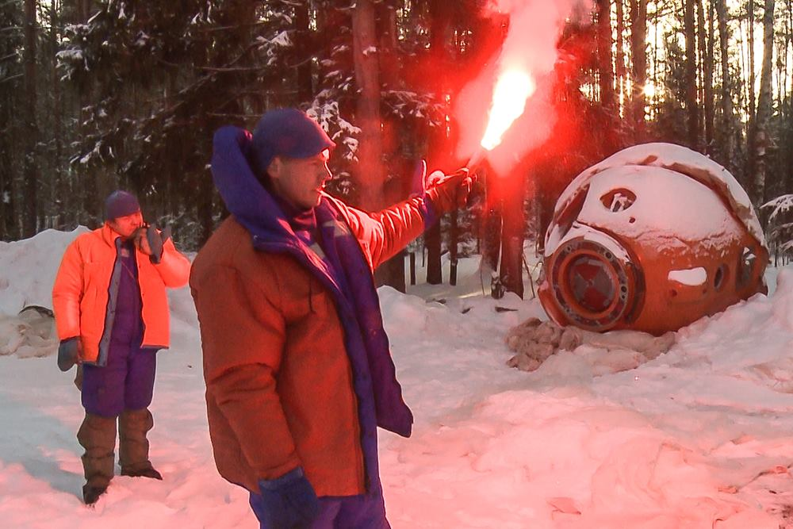
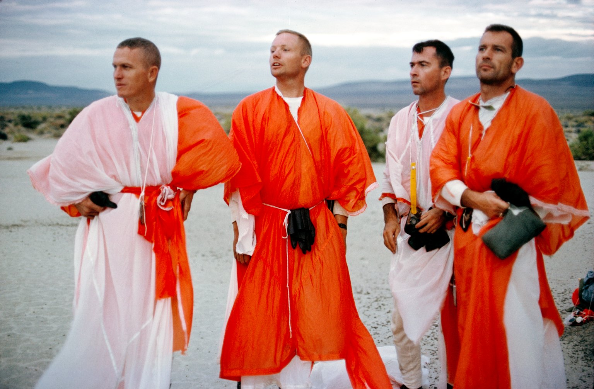
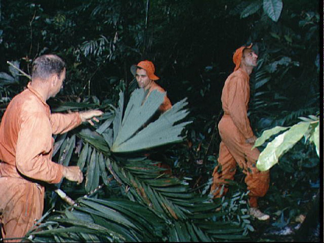
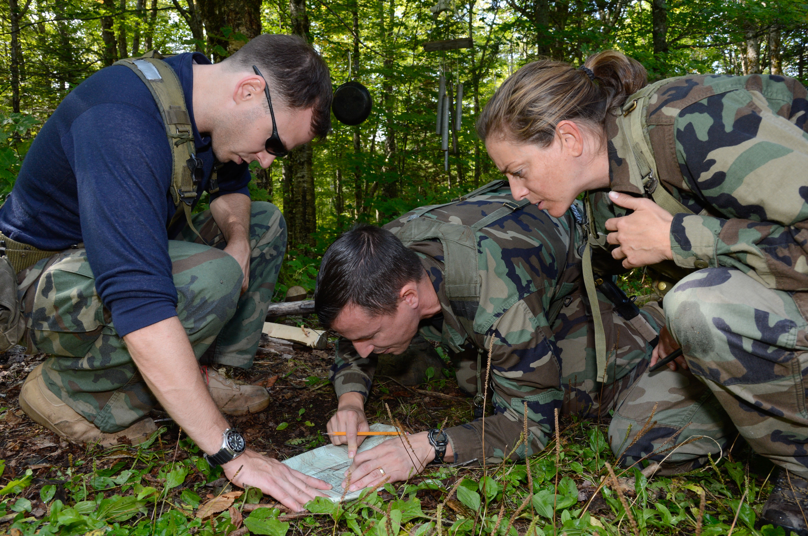
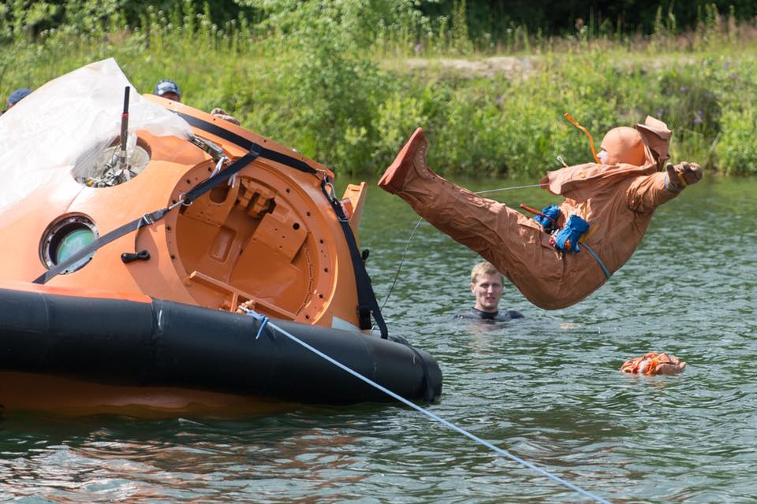
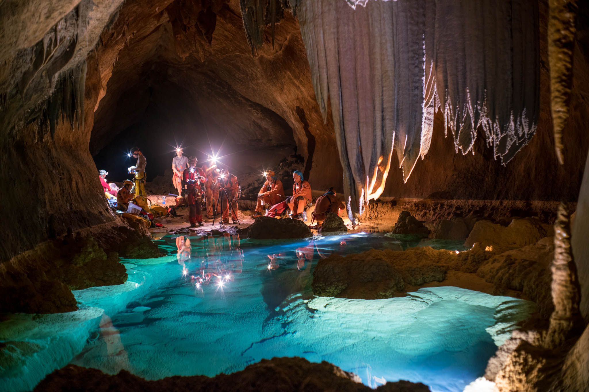
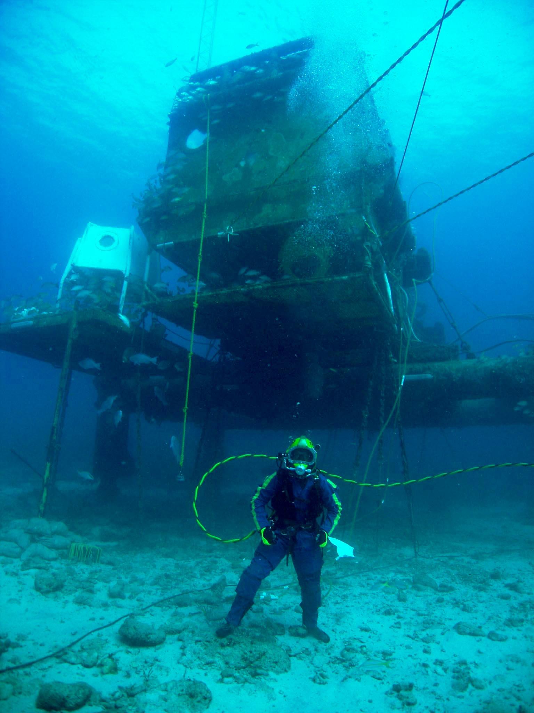
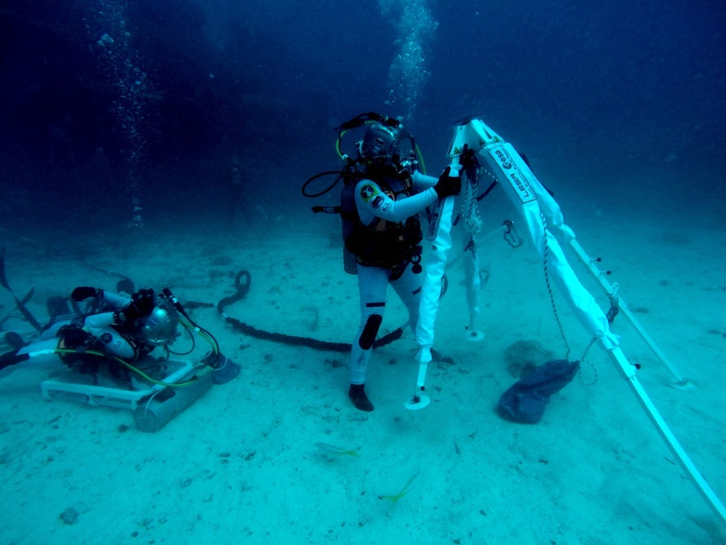

********************
Szkolenie podstawowe
********************

    I'm not a techie, I am an operator

    -- Astronaut Victor Glover :cite:`Glover2016`

Po selekcji osoba wybrana przez komisję ma za zadanie stawić się na tzw. szkolenie podstawowe. Podczas szkolenia kandydat na astronautę (ang. *ASCAN - Astronaut Candidate*) będzie przygotowany przez ekspertów oraz starszych stażem astronautów do pełnienia służby i docelowego lotu w kosmos. Szkolenie kandydackie trwa w zależności od agencji półtora do dwóch i pół roku. Po jego ukończeniu osoba ubiegająca się będzie mogła oczekiwać na przydział do misji :cite:`Gregersen2009`, a następnie szkolenie specyficzne trwające zwykle około 2 lat. Wyjątkiem jest CNSA, gdzie szkolenie podstawowe 3 lata, a szkolenie do przydzielonej misji 10 miesięcy.

Podczas szkolenia podstawowego kanadyjscy astronauci mają zajęcia z :cite:`CSAFlightTraining`, :cite:`CSAOngoingTraining`, :cite:`CSABasicTraining`:

- orientacja w strukturze organizacyjnej CSA i w działalności agencji,
- historia lotów kosmicznych,
- podstawy lotów kosmicznych,
- procedury operacyjne i kontrola lotów,
- systemy ISS,
- nauki przyrodnicze i o życiu,
- inżynieria materiałowa i dynamika płynów,
- obserwacja ziemi i wykorzystanie danych satelitarnych,
- kosmologia,
- robotyka,
- człowiek, jego zachowanie i możliwości,
- szkolenie lotnicze,
- skoki spadochronowe,
- ćwiczenia kondycyjne,
- pierwsza pomoc i pomoc krążeniowo-oddechowa,
- szkolenie językowe (głównie język rosyjski),
- korzystanie ze sprzętu fotograficznego,
- kontakt z mediami,
- szkolenie survivalowe i przetrwania.

Chociaż kanadyjscy astronauci odbywają większość szkolenia w JSC w Houston to powyższy program CSA jest reprezentacyjnym cyklem szkolenia astronautów we wszystkich agencjach. Szkolenie podstawowe astronautów we wszystkich analizowanych agencjach, dzieli się na 5 głównych części:

- przygotowanie teoretyczne i wiedza ogólna, w tym nauka języków obcych,
- szkolenie z systemów robotycznych i manipulatorów, tj. Canadarm 2,
- szkolenie z systemów Międzynarodowej Stacji Kosmicznej,
- nauka spacerów kosmicznych (ang. *EVA - ExtraVehicular Activity*),
- nauka pilotażu samolotów odrzutowych oraz statków kosmicznych.

:numref:`figure-astronaut-career-lifecycle` prezentuje cykl kariery astronauty od jego selekcji, treningu podstawowego, wsparcia obecnie trwających misji po szkolenie do przydzielonej misji (ang. *mission specific training*).

.. figure:: /img/astronaut-career-lifecycle.png
    :name: figure-astronaut-career-lifecycle
    :align: center
    :scale: 75%

    Cykl kariery i szkoleń astronautów.

W kolejnych rozdziałach autor przybliża każdy z powyższych tematów.

Przygotowanie teoretyczne i wiedza ogólna
=========================================
Głównym celem szkolenia jest wyrównanie poziomu wiedzy i umiejętności kandydatów pochodzących z różnych specjalizacji i dziedzin i wprowadzenie spójnego zasobu wiedzy, który stanowi podstawę do dalszego szkolenia. Ukończenie kursu podstawowego pozwala na zmianę tytułu z "kandydat na astronautę" na "astronauta" :cite:`NASA-Astronaut-Candidate-Program`. Jest to proces wymagający wielu poświęceń z życia prywatnego, który determinuje zasadność dalszych inwestycji przez agencję kosmiczną. W trakcie zbierania materiałów autor dotarł źródła pragnącego zachować anonimowość, które przekazało informację, że tylko 60% astronautów nadaje się do przydziałów do dalszych misji. Zgodnie z wywiadem pozostali "osiadają na laurach i przestają się uczyć", a ciągłe kształcenie jest podstawą specyfiki tego zawodu. Proces szkolenia podstawowego stanowi jeden z etapów weryfikacji umiejętności i zaangażowania.

Nauka języków obcych i przygotowanie kulturowe
----------------------------------------------
Wg. wielu astronautów dla których język rosyjski nie jest ojczystym najtrudniejszym etapem szkolenia jego nauka. Przed wysłaniem na szkolenie do Centrum Przygotowania Kosmonautów każdy astronauta musi przejść kurs składający się z 1000 godzin praktyki tego języka :cite:`ESA-Astronaut-Training-Requirements`, :cite:`Peake2017`.

Praca w międzynarodowym środowisku wymaga znajomości zachowań i różnic kulturowych, dlatego wśród zajęć w ramach szkolenia podstawowego prowadzi się przedmiot związany z przygotowaniem kulturowym.

Przygotowanie teoretyczne z nauk przyrodniczych i technicznych
--------------------------------------------------------------
Podstawą badań prowadzonych w kosmosie są nauki przyrodnicze i techniczne. Ze względu na konieczność wyrównania wiedzy osób z różnych środowisk w ramach szkolenia teoretycznego i wiedzy ogólnej astronauci uczestniczą w zajęciach z przedmiotów tj.:

- biologia (zoologia i botanika),
- geologia,
- geofizyka,
- obserwacje meteorologiczne,
- obserwacje geograficzne i oceanograficzne,
- inżynieria materiałowa,
- dynamika płynów,
- mechanika,
- fizyka,
- chemia,
- robotyka.

Kurs inżynierii kosmicznej i systemowej
---------------------------------------
Każdy astronauta z założenia powinien przyswoić sobie działanie systemów statków kosmicznych i stacji orbitalnej. W tym celu podczas kursu kandydackiego wykładane są przedmioty z zakresu inżynierii kosmicznej (ang. *aerospace engineering*) i inżynierii systemowej (ang. *systems engineering*). Wśród przedmiotów wykładanych w formie zajęć teoretycznych można wymienić:

- aerodynamika lotów atmosferycznych dużych prędkości (lot i przejście między prędkościami):

    - poddźwiękowe (ang. *subsonic*) <0,8 Ma,
    - okołodźwiękowe (ang. *transonic*) 0,8-1,3 Ma,
    - naddźwiękowe (ang. *supersonic*) 1,3–5,0 Ma,
    - hiperdźwiękowe (ang. *hypersonic*) 5,0–10,0 Ma,
    - wysoko hiperdźwiękowe (ang. *high-hypersonic*) 10,0–25,0 Ma,
    - wejścia atmosferycznego (ang. *re-entry*) >25,0 Ma,

- materiały i kompozyty używane w technice kosmicznej,
- konstrukcja rakiet i silników rakietowych,
- dynamika lotu rakiety,
- paliwa rakietowe i systemu RCS,
- dynamika lotu statków kosmicznych,
- orbitalne systemy manewrowe,
- planowanie misji i ładunku (ang. *Mission design and payloads*)
- systemy kontroli i zmiany ustawienia (ang. *ADCS - Attitude Dynamic and Control Subsystems*)
- systemy zmiany orbity (ang. *OCS - Orbit Control System*)
- systemy zasilania oraz pozyskiwania energii (ang. *power*),
- systemy przechowywania energii (ang. *Power Storage*)
- systemy odprowadzania ciepła (ang. *thermal*),
- telemetria, śledzenie i sterowanie (ang. *TT&C - Telemetry-Tracking and Control*),
- sterowanie i kontrola (ang. *Command and Control*),
- układy liczące i architektura logiczna (ang. *On-board processors*),
- oprogramowanie sterujące (ang. *OBSW - On-board software*),
- systemy awaryjne, detekcji awarii, izolacji i przywracania (ang. *Safe Mode, Fault Detection, Isolation and Recovery*),
- architektura segmentu naziemnego (ang. *ground segment*),
- architektura systemów ratunkowych,
- systemy podtrzymywania życia (ang. *ECLSS - Environmental Control and Life Support System*).

Kurs astrodynamiki, nawigacji i mechaniki orbitalnej
----------------------------------------------------
W ramach kursu wyrównującego wiedzę kandydaci na astronautów muszą przyswoić wiedzę z szerokiego zakresu nawigacji, astrodynamiki i mechaniki orbitalnej. Wśród tematów poruszanych na szkoleniach można wymienić:

- podstawy balistyki,
- nawigacja i pozycjonowanie,
- trajektoria lotu orbitalnego,
- manewry orbitalne i asysty grawitacyjne,
- transfery orbitalne:

    - transfer Hohmanna,
    - transfer dwu-eliptyczny (ang. *Bi-elliptic transfer*),

- zmiany inklinacji,
- operacje zbliżania i dokowania (ang. *rendezvous and docking*),
- manewry "Fly-around"
- przebazowanie (ang. *redocking*),
- odejście,
- obniżanie orbity i wejście w atmosferę.

Przygotowanie medyczne i dentystyczne
-------------------------------------
Podczas pobytu na międzynarodowej stacji kosmicznej oraz w trakcie długotrwałego lotu astronauci są zdani wyłącznie na pomoc medyczną udzieloną w ramach zespołu :cite:`CSAOngoingTraining`. Operacje medyczne dotyczą nie tylko sytuacji awaryjnych, lecz również rutynowych zadań wykonywanych podczas badań naukowych. Do typowych czynności należą:

- pobieranie krwi (ang. *drawing blood*),
- pobieranie próbek śliny i płynów ustrojowych,
- badanie ultrasonograficzne (oczu, żył, mięśni, serca, tętnic),
- obrazowanie oczu (optyczna tomografia koherencji siatkówki) (urządzeniem ophthalmoscope),
- mierzenie ciśnienia płynu wewnątrz gałki ocznej (tonometria),
- nawilżenia skóry (kliometria),
- biopsja mięśni (przed, w trakcie i po misji),
- resuscytacja krążeniowo oddechowa (ang. *cardio-pulmonary resuscitation*),
- szycie (ang. *suture*).

Podczas lotu Jurija Romanenko w 1973 roku w ramach misji Salut 6 kosmonauta doznał bólu zęba. Ból był tak silny, że rzutował na jego sprawność podczas badań na orbicie. Kosmonauta był zmuszony czekać dwa tygodnie do czasu powrotu na Ziemię aby uzyskać pomoc dentystyczną. Od tamtego czasu wszyscy astronauci przechodzą podstawowy kurs stomatologiczny.

.. figure:: ../img/training-dentistry.jpg
    :name: figure-training-dentistry
    :scale: 75%
    :align: center

    Astronauta CSA David Saint-Jacques podczas kursu dentystycznego. Źródło: Canadian Space Agency

Komunikacja nauki
-----------------
Agencje kosmiczne działają w oparciu o środki publiczne uzyskane w ramach uchwalonego budżetu państwa lub państw członkowskich (w przypadku ESA). Aby zwiększyć świadomość publiczną a co za tym idzie poparcie i dofinansowanie programów konieczna jest działalność w kontekście popularyzacji nauki, technologii, inżynierii (sztuki) i matematyki (and. *S.T.E.M./S.T.E.A.M. - Science Technology Engineering (Arts) Mathematics*).

W ramach szkolenia kandydackiego astronautów poruszane są tematy:

- wykorzystanie mediów społecznościowych do popularyzacji nauki i misji,
- nauka wystąpień publicznych i "Space Advocacy",
- wykorzystanie amatorskiego radia krótkofalowego.

Astronauci są osobami publicznymi często występującymi przed zgromadzeniami. Od ich prezencji i sposoby wypowiadania się zależy wizerunek agencji i całego programu kosmicznego. Z tego powodu agencje kosmiczne już podczas selekcji cenią umiejętność przemówień publicznych. Ponadto konieczna jest umiejętność prezentacji skomplikowanych problemów w prosty i przystępny sposób nawet dla najmłodszego odbiorcy.

Czynności rutynowe
------------------
W ramach przedmiotu Routine Ops astronauci przyswajają umiejętności związane z:

- fotografią,
- strzyżeniem włosów,
- sprzątaniem,
- korzystaniem z toalety,
- korzystaniem ze sprzętu elektronicznego,
- naprawami sprzętu i toalety.

Ze względu na fakt iż długie włosy mogą się zaczepić w powszechnie wykorzystywane w kosmosie rzepy lub śrubki astronauci są zmuszeni do ich okresowego ścinania. W trakcie przedmiotu uczeni są technik fryzjerskich na sobie oraz na innych członkach załogi.

W ramach zajęć z fotografii astronauci uczą się fotografować:

- delty rzeczne,
- ustępowanie lodowców,
- regiony przybrzeżne i nadmorskie,
- kratery uderzeniowe po asteroidach,
- wulkanicznej aktywności,
- łańcuchów górskich, tj. Himalaye,
- obiektów znaczenia historycznego, tj. piramidy w Gizie.

Treningi i symulacje
====================
Treningi i symulacje stanowią główny przedmiot szkolenia astronautów. Już w ramach programu Mercury wykorzystano pierwsze urządzenia elektroniczne pozwalające na przygotowanie astronautów do lotów kosmicznych. Urządzenia pozwoliły na symulację 276 problemów i sytuacji awaryjnych, które mogłyby wydarzyć się podczas lotu. Dla programu Gemini udostępniono kolejny symulator, który pozwolił na testowanie kilku tysięcy problemów związanych z lotem kosmicznym, wejściem w atmosferę itd. Wszystkie urządzenia zlokalizowane były w ośrodku w Langley, Virginia do czasu wybudowania w 1964 roku Manned Space Center w Houston, TX (obecnie Johnson Space Center) :cite:`Monchaux2011`. Należy zwrócić uwagę na pierwsze zastosowanie basenu neutralnej pływalności w przygotowywaniu wyjść EVA. W ramach programu Mercury i Gemini astronauci spędzali około 1/3 czasu w symulatorach.

Następnie w programie Apollo rozwinięto oprzyrządowanie i zastosowano 11 symulatorów testujących m.in. następujące sytuacje :cite:`Monchaux2011`:

- wieloosiowy symulator dezorientacji (ang. *Multi-Axial*),
- symulator-fotel 1/6g kompensujący 5/6g do symulowania grawitacji księżycowej,
- symulator-fotel 5DL używany do szkolenia poruszania się w przestrzeni kosmicznej wyłącznie za pomocą rąk (bez użycia nóg),
- symulator-ściana 0g obniżająca odczuwalne przeciążenie,
- symulator SSMT (walec o 1,83m średnicy, pozwalający na rotację astronauty we wszystkich osiach),
- symulator Command Module pozwalający na trening startu, sytuacji awaryjnych, dokowania z LM w trakcie podróży na Księżyc, dokowania z LM na orbicie oraz procedur powrotu i wejścia w atmosferę,
- symulator LM do szkolenia lądowań na Księżycu,
- LLRV - Lunar Landing Research Vehicle.

W programie Apollo czas spędzony w symulatorach zajmował około 50% szkolenia. Z 959 godzin przygotowania przed lotem Neil Armstrong poświęcił 285 godzin wyłącznie na trening lądowania, a Buzz Aldrin poświęcił temu elementowi 1/3 z 1000 godzin szkolenia. Wyżej wymienione czasy nie uwzględniają LLRV oraz sumarycznego czasu dwóch tygodni spędzonego na spotkaniach omawiających ten najtrudniejszy element misji :cite:`Monchaux2011`.

Wczesne symulatory były ogromnymi urządzeniami elektronicznymi, które pozwalały na wyświetlanie na ekranach wizji z kamer mechaniczne ustawionych na szynach i wysięgnikach nad ręcznie malowanymi makietami powierzchni Księżyca. Makiety były odtworzone na podstawie zdjęć z poprzednich załogowych i bezzałogowych misji na tego naturalnego satelitę.

Wyżej wymieniony LLRV był konstrukcją metalową wyposażoną w silnik odrzutowy, którego dysza była skierowana w dół. Umieszczone po bokach silniczki manewrowe pozwalały na zmianę kierunku lotu za pomocą impulsowych strzałów gazów. Pilot był umieszczony w kabinie. Urządzenie okazało się być bardzo niebezpieczne w użytkowaniu i narażało astronautów na niepotrzebne ryzyko. Z tego powodu po awarii silnika i awaryjnym katapultowaniu się przez Neila Armstronga symulacje LLRV zawieszono :cite:`Peterson2017`.

W kolejnych programach wzbogacono trening m.in. o:

- symulator systemu manewrowego MMU (Manned Maneuvered Unit),
- symulator SMS (Shuttle Motion Simulator) dla promu Space Shuttle,
- symulator awaryjnego opuszczania Space Shuttle.

Ćwiczenia kondycyjne i badania wydolności organizmu
---------------------------------------------------
Przeciążenia podczas startu i wchodzenia w atmosferę oraz wysiłek fizyczny w trakcie EVA są głównymi czynnikami wpływającymi na konieczność utrzymania wysokiej sprawności fizycznej. Ponadto astronauci w trakcie lotu, a w szczególności lotów długotrwałych ze względu na dystrofię mięśni i demineralizację układu kostnego muszą ćwiczyć minimum dwie godziny dziennie. Aby zapobiec negatywnemu wpływowi braku grawitacji na organizm astronauci już w trakcie szkolenia są poddawani treningom kondycyjnym oraz badaniu wydolności organizmu. Do powyższych ćwiczeń są wykorzystywane urządzenia gimnastyczne ogólnego przeznaczenia. tj:

- ergometr,
- sztangi,
- koła reńskie,
- żyroskopy treningowe,
- huśtawki 360,
- ergometr,
- bieżnie pionowe,
- Adaptability Training System,
- system bieżni nadciśnieniowych (ALTER).

Ze względu na brak przyspieszenia grawitacyjnego wszelkie urządzenia, które bazują na podnoszeniu ciężarów lub oporowi wywołanemu przeciwdziałaniu grawitacji są niefunkcjonalne. We względu na specyfikę stanu nieważkości inżynierowie skonstruowali urządzania, które dzięki komorom próżniowym symulują zachowanie podobnego przyrządu na Ziemi. Ponadto stosowane są również specjalistyczne urządzenia opracowane do treningu w środowisku zmniejszonej grawitacji, tj.:

- bieżnia T2,
- Advanced Resistance Exercise Device (ARED),
- Cycle Ergometer with Vibration Isolation and Stabilization (CEVIS).

Podczas przeszkolenia do misji astronauci odbywają trening obsługi oraz poprawności wykonywania ćwiczeń.

Na specjalną uwagę zasługuje fakt, iż aby mierzyć zmianę masy ciała u astronautów w stanie nieważkości konieczne było opracowanie rozwiązania technicznego ​​Body Mass Measuring Device (BMMD). Przyrząd podczas pomiaru, który wśród astronautów zwany jest ujeżdżaniem osła (ang. *ride the donkey*), potrząsa przyczepionym do niego astronautom i mierzy siłę bezwładności. Pomiar dokonywany jest trzykrotnie i wyciągana jest z niego średnia. Urządzenie pozwala na określenie masy astronauty z błędem rzędu 1kg. Czynność wykonywana jest raz w miesiącu :cite:`Peake2017`.

.. figure:: ../img/training-fitness.jpg
    :name: figure-training-fitness
    :scale: 33%
    :align: center

    Astronautka NASA Christina M. Hammock podczas ćwiczeń kondycyjnych i badań wydolności organizmu. Źródło: NASA/JSC

Przygotowanie psychologiczne do pracy w odosobnieniu
----------------------------------------------------
Dotychczas tematy związane z przygotowaniem psychologicznym do pracy w odosobnieniu nie miały najwyższego priorytetu. Długość misji kosmicznych nie przekraczała progu, w którym starannie wyselekcjonowani a później przygotowywani astronauci ulegają załamaniu. Wraz ze wzrostem długości pozostawania na orbicie bez kontaktu fizycznego z bliskimi i rodziną specyfika zawodu się zmienia. Ponadto środowisko, w którym przebywają astronauci wymaga stałego wysokiego poziom kocentracji i skupienia, a każda pomyłka może stanowić o śmierci osoby lub wszystkich członków załogi i końca programu. Presja której poddawani są kandydaci jest ogromna i wymaga dużej stabilności i dojrzałości emocjonalnej, psychicznej i umiejętności trzeźwego myślenia w sytuacjach stresowych.

Ze względu na fakt, że temat jest dopiero rozpoznawany a badania w tym zakresie dopiero zaczynają być prowadzone, aby przygotować astronautów do pełnienia obowiązków w trakcie długotrwałych lotów kosmicznych w stałej wysokiej aktywności i sprawności intelektualnej wprowadzono do szkolenia wiele symulacji. I choć urządzenia symulujące awarie i sytuacje niebezpieczne są używane od początku programów to pokrywają jedynie niewielką część przygotowania psychicznego astronautów do długotrwałych misji.

Badania, które są obecnie prowadzone w różnych habitatach i ośrodkach medycznych na świecie pozwalają zbadać wpływ długotrwałej izolacji na psychikę człowieka. Podczas obserwacji grupy dokonywane są analizy zmian psychologicznych oraz dynamiki grupy. W tym celu stosuje się urządzenia zapisujące metadane głosu tj. poziom głośności, szybkość mówienia, intonację, częstość wypowiedzi oraz dynamikę rozmowy. Ponadto ocenie podlegają również zmiany tych parametrów w trakcie rozmowy jak i w stosunku do innych konwersacji. Do badań wykorzystywane są również informacje tj. miejsce przeprowadzania rozmów, warunki atmosferyczne (ciśnienie, temperatura), czas dnia oraz skład osobowy dyskursu. Wszystkie te elementy wpływają na charakter prowadzenia konwersacji oraz na stosunki i ich zmianę podczas trwania izolacji.

W trakcie badań przeprowadzanych w habitatach naukowcy mają dostęp do informacji na temat symulowanej długości doby, która dla misji marsjańskich i księżycowych ma inną wartość. Ponadto obciążenie zadaniami, terminowość ich wykonywania, tzw. gonienie czerwonej kreski (markera czasu na planie) jak również ilość wolnego czasu na odpoczynek i jego jakość ma ogromny wpływ na interakcje między członkami zespołów.

Szkolenia geologiczne i speleologiczne
--------------------------------------
Jednym z najbardziej charakterystycznych elementów szkolenia, szczególnie w kontekście eksploracji innych ciał niebieskich jest szkolenie geologiczne. :numref:`table-apollo-geological-locations` przedstawia zestawienie wybranych lokalizacji używanych w szkoleniu geologicznym astronautów w programie Apollo.

Na przykładzie Apollo 15 możemy przedstawić strukturę szkolenia geologicznego astronautów w programie Apollo :cite:`Bleacher2014`:

- 375 godzin ogólnego szkolenia geologicznego,
- 80 godzin ogólnych geologicznych wykładów naukowych,
- 20 godzin odpraw z wiodącymi badaczami (ang. *PI - Principal investigator*),
- 80 godzin wykładów z geologii orbitalnej,
- 12 godzin szkolenia pobierania próbek księżycowych,
- 470 godzin praktycznych wypraw terenowych.

Każdy z astronautów programu Apollo otrzymał około 1030-1040 godzin szkolenia geologicznego. Ponadto astronautów trenowano również w rozstawianiu sprzętu, tj. kamery i flagi, oraz urządzeń badawczych.

W szkoleniach geologicznych do misji Apollo 15-17, które odbywały się pomiędzy majem 1970 a listopadem 1972 wzięło udział 59 doświadczonych badaczy w charakterze trenerów. Na każdego astronautę, który miał stanąć na księżycu przypadało 10 szkoleniowców. W programie zorganizowano 375 indywidualnych wypraw badawczych do 27 unikalnych miejsc.

W ramach szkolenia geologicznego tj. DRATS 2010 (NASA) czy PANGAEA (ESA) astronauci uczą się:

- identyfikacja i dokumentacja próbek,
- rozstawianie sprzętu i urządzeń badawczych,
- mapowanie terenu,
- interpretacja obszaru geologicznego z Ziemi oraz z orbity,
- eksploracja tuneli lawy (ang. *Lava tubes*),
- zbieranie danych geologicznych i geofizycznych,
- identyfikacja i pobieranie próbek geobiologicznych,
- dyskusja o hipotezach powstawania warstw,
- uzyskują umiejętność komunikacji z profesjonalnymi geologami,
- opis skał, minerałów i warstw skalnych,
- umiejętność pobierania próbek w ograniczającym ruch skafandrze,
- poruszanie się pojazdami tj. Lunar Roving Vehicle (LRV) czy Mars Exploration Vehicle (MEV),
- identyfikacja odkrywek i odsłonięć pokładów.

Poza charakterem edukacyjnym szkolenia geologiczne pełnią jeszcze rolę integracyjną dla budowania zespołu.

Odmiennym aczkolwiek skorelowanym szkoleniem są wyjazdy speleologiczne. Podczas eksploracji jaskiń w ramach programu CAVES (ESA) astronauci różnych narodowości brali udział w mapowaniu podziemnych korytarzy, identyfikacji i dokumentowaniu próbek skalnych i mikrobiologicznych, identyfikowaniu nowych gatunków organizmów oraz zaawansowanej wspinaczce jaskiniowej. Temat szerzej omówiony w rozdziale :ref:`Wyprawy w ramach programu CAVES`.

Przygotowanie do pracy w ekstremalnych warunkach
================================================
Kandydaci, którzy są wybierani w procesie selekcji są bardzo aktywnymi osobami. Często zajmują się ekstremalnymi sportami oraz uprawiają zaawansowaną turystykę kwalifikowaną. Ponadto podczas szkolenia podstawowego astronauci są poddawani treningom survivalowym i obozom przetrwania, które również na celu mają integrację zespołu. Wśród zajęć terenowych można wyróżnić:

- szkolenie z geologii planetarnej i geofizyki,
- wycieszki piesze (ang. *hiking*) i wysokogórskie,
- ekspedycje naukowe, tj. wyprawy na Arktykę czy Antarktydę,
- obozy przywództwa i pracy zespołowej,
- szkolenia przetrwania na pustyni,
- szkolenia przetrwania w środowisku zimowym,
- szkolenia przetrwania w środowisku morskim,
- szkolenia przetrwania w środowisku dżungli.

Przetrwanie w warunkach zimowych
--------------------------------
W trakcie programu kandydackiego NASA astronauci są wysyłani na dwutygodniową ekspedycję podczas, której w trudnych warunkach pogodowych wraz z realnym zagrożeniem mają przetrwać przez określony czas i dotrzeć do punktów kontrolnych. Najczęściej szkolenie zimowe odbywa się w regionach Alaski lub północnej Kanady. Do zadań astronautów należy nawigacja w zaśnieżonych górach z uwagą na lawiny, konstrukcja schronienia, organizacja pożywienia oraz wody. W zależności od szkolenia astronauci mogą być wyposażeni w narty biegowe oraz 75 kg ekwipunki, które ciągną pokonując niedostępne arktyczne tereny. Ponadto w trakcie ekspedycji członkowie zmieniają tury przywództwa dzięki czemu uczą się również komunikacji i różnych ról w zespole. Do zadań symulowanych podczas szkolenia należy również poszukiwanie ofiar lawin wykorzystując specjalny system nadajników (ang. *avalanche homing beacon and monitor*). Pierwsze dni szkolenia prowadzone są pod nadzorem instruktorów, którymi zwykle są żołnierze sił specjalnych lub przeszkoleni profesjonaliści. Po określonym czasie instruktor odłącza się od grupy a astronauci muszą przetrwać i wykorzystać nabytą wiedzę.

Każdy kosmonauta i astronauta, który za pośrednictwem statku Soyuz jest wynoszony na Międzynarodową Stację kosmiczną musi przejść szkolenie przetrwania w warunkach letnich (wodnych) oraz zimowych. Szkolenie zimowe jest przeprowadzane w lesie 15 km od Ośrodka Szkolenia Kosmonautów rosyjskiej agencji kosmicznej. Szkolenie odbywa się przy temperaturze około -20 stopni celsjusza i trwa dwa dni i noce. Podczas nocy temperatura spada do -26 stopni, a kandydaci są zachęcani do budowania szałasów i rozpalania ognisk dla utrzymania ciepła. Przed szkoleniem kursanci otrzymują jednodniowe szkolenie teoretyczne i instrukcje niezbędne do przetrwania w ekstremalnych warunkach. Każdy przyszły uczestnik lotu kosmicznego bez względu na doświadczenie i liczbę odbytych dotychczasowych szkoleń survivalowych musi przejść to szkolenie. Podczas symulacji astronauci i kosmonauci uczą się jak przywdziewać w niewielkiej kabinie statku Soyuz odpowiedni zimowy strój, jak używać strzelby do odstraszania zwierząt, jak budować odpowiedni wigwam pozwalający na cyrkulację powietrza i odprowadzenie monotlenku węgla (CO). Rozpalają dwa ogniska, jedno sygnalizacyjne płonące szybko, dające dużo dymu i wysoko sięgającymi płomieniami oraz drugie w schronieniu do zapewnienia ciepła dla załogi - niewysokie, płonące wolno i niedymiące. Drugie musi być stale podtrzymywane, również w nocy. Uczestnicy szkolenia żywią się wojskowymi racjami żywnościowymi MRE (ang. *Meal Ready to Eat*), które dzięki reakcji egzotermicznej zawartych w opakowaniu substancji chemicznych podgrzewają się.

Ponadto podczas szkolenia astronauci odgrywają scenariusz pomocy osobie poszkodowanej. W tym celu jeden z astronautów pozoruje złamanie nogi a pozostali muszą udzielić pierwszej pomocy oraz przetransportować poszkodowanego do obozu a później do miejsca ewakuacji, gdzie za pomocą rac sygnalizacyjnych ściągają uwagę ekipy ratunkowej.

    Astronauci przywdziewają strój pozwalający na przetrwanie w niskich temperaturach podczas szkolenia survivalowego w zimowych warunkach w Centrum Przygotowania Kosmonautów w Gwiezdnym Miasteczku. Źródło: Roscosmos/CPK

Przetrwanie w warunkach pustynnych
----------------------------------
Podczas nieprzewidzianych problemów na orbicie lub sytuacji awaryjnych lądownik po wejściu w atmosferę może wlecieć na teren pustynny i tam do czasu przybycia ekipy ratunkowej załoga statku kosmicznego musi również umieć przetrwać. Podczas szkoleń w ramach misji Mercury, Gemini, Apollo i dalszych astronauci byli po instruktarzu pozostawieni na terenach pustynnych. Podczas szkolenia musieli zaznajomić się w jaki sposób rozpalić ogień, jak złapać i przygotować węża oraz jak pozyskać wodę pitną w suchym środowisku.

    Astronauci programu Apollo podczas szkolenia przetrwania na pustyni. Źródło: NASA/JSC

Przetrwanie w warunkach dżungli
-------------------------------
W trakcie programów Mercury, Gemini i Apollo astronauci byli transportowani do dżungli w Panamie i tam pozostawieni na kilka dni. Podczas tego okresu musieli wykorzystać umiejętności nabyte podczas wcześniejszych szkoleń, zbudować szałas oraz ochronić się przed insektami i zwierzętami. Istotnym elementem było również nawigowanie w terenie nieprzychylnym.

    Astronauci podczas szkolenia przetrwania w panamskiej dżungli. Źródło: NASA/JSC

Obozy przywództwa i pracy zespołowej
------------------------------------
Obecnie program szkolenia nie przewiduje survivalu w dżungli. Podobnych umiejętności kandydaci nabywają podczas szkolenia w lesie na trzydniowym szkoleniu. Jest to jeden z pierwszych etapów szkolenia kandydackiego. Pozwala na zapoznanie członków grupy ze sobą oraz weryfikację cech kandydatów.

Istnieje również wariant łączący szkolenie przetrwania oraz obóz przywództwa i pracy zespołowej, który prowadzony jest w East Temple Peak, Wyoming, USA. Podczas szkolenia, które trwa 8 dni i 8 nocy astronauci są poddawani różnym testom, które mają zbudować ducha zespołu.

    Kandydaci na astronautów podczas szkolenia przetrwania w dziczy w Rangeley w stanie Maine, USA. Źródło: NASA/JSC

Przetrwanie w warunkach wodnych
-------------------------------
Jednym z istotniejszych elementów szkolenia przetrwania jest umiejętność przeżycia po lądowaniu na morzu. Ze względu na specyfikę lądowania, rosyjskie kapsuły lądują z założenia na lądzie, amerykańskie na wodzie, nacisk poszczególnych agencji jest różny.

Rosyjscy kosmonauci praktykują, krótkie jednodniowe szkolenie na jeziorze. W skład szkolenia wchodzi: skok ze śmigłowca (platformy imitującej wiszący śmigłowiec), procedury operacyjne po wodowaniu, umiejętność dobierania odpowiedniego stroju ochronnego w zależności od temperatury powietrza oraz wody, oraz formacje ratunkowe na powierzchni. Ponadto uczestnicy kursu uczą się rozstawiania tratwy i obsługi odsalarki do produkcji wody pitnej. W trakcie pierwszych czterech dekad rosyjskiego programu kosmonautycznego szkolenie było przeprowadzane na morzu a kapsuła wraz z kosmonautami była zrzucana ze statku "Apszeron" :cite:`Hermaszewski2013`.

Dla astronautów NASA szkolenie z przetrwania na morzu jest kluczowe. Ze względu na sposób lądowania kapsuły wyróżnia się lądowanie w pozycji stabilnej pierwszej lub drugiej (wyjście z kapsuły jest pod wodą). Astronauci praktykują powyższe sytuacje najpierw w basenie neutralnej pływalności a następnie na otwartym oceanie przy różnych warunkach atmosferycznych i różnym stanie morza tj. wielkość fal i siła wiatru.

    Rosyjski kosmonauta podczas szkolenia ratownictwa morskiego wykonuje skok do wody z kapsuł Soyuz. Kosmonauta jest ubrany w suchy skafander pozwalający na utrzymanie ciepła w zimnej wodzie. Źródło: Roskosmos/CPK

Wyprawy w ramach programu CAVES
-------------------------------
Misja CAVES (Cooperative Adventure for Valuing and Exercising human behaviour and performance Skills) jest tworem Europejskiej Agencji Kosmicznej i ma na celu zaznajomienie członków wyprawy z życiem w ekstremalnych warunkach tj. jaskinie. Podczas szkolenia astronauci różnych agencji biorą udział w mapowaniu korytarzy jaskini Sa Grutta na Sardynii we Włoszech. Ponadto uczą się dokumentowania i pobierania próbek skalnych oraz materiału mikrobiologicznego wraz z późniejszym jego zabezpieczaniem jak również identyfikowaniem minerałów.

    Astronauci Europejskiej Agencji kosmicznej podczas misji CAVES w 2016 roku do jaskini Sa Grutta na Sardynii we Włoszech. W wyprawie wzięli udział astronauci z CNSA (Ye Guangfu), Roskosmos (Sergei Vladimirovich), JAXA (Aki Hoshide), ESA (Pedro Duque) i NASA (Ricky Arnold, Jessica Muir). Źródło: ESA/V. Crobu

Wyprawy w ramach programu PANGAEA
---------------------------------
Wyprawy w ramach programu PANGAEA mają na celu przybliżenie astronautom umiejętności eksploracji geologicznej terenów przypominających Księżyc, asteroidy i Mars. Ponadto w trakcie programu prowadzone są wykłady z astrobiologii, geofizyki, geologii i geobiologii. U astronautów kształcona jest umiejętność obserwacyjna i decyzyjna w kwestii identyfikacji cech geologicznych. Ponadto tak jak w przypadku CAVES testowane są nowe sposoby podejmowania próbek, dokumentacji złóż i umiejętności efektywnego komunikowania elementów krajobrazu do MCC i badaczy geologicznych.

Kurs został podzielony na trzy etapy:

- geologia planetarna i kurs wprowadzający w Bressanone we Włoszech,
- geologia terenowa (ang. *field*) i wulkaniczna na wyspie Lanzarote, Wyspy Kanaryjskie, Hiszpania,
- kurs astrobiologiczny i mikrobiologiczny na uniwersytetach w Niemczech i w ośrodku EAC oraz DLR.

Ponadto wykorzystywane są również obszary krateru Ries w okolicach Nördlingen, Niemcy oraz teren Bletterbach we włoskich Dolomitach.

Misje NEEMO
-----------
Misje NASA Extreme Environment Mission Operations (NEEMO) organizowane są dla astronautów agencji ESA, NASA, CSA, Roskosmos i JAXA. Ośrodek Aquarius - podwodny habitat znajduje się 12 km na wschód od Key Largo na Florydzie w USA. Habitat jest położony 20 metrów pod wodą a misje w nim trwają zwykle 12 dni. W trakcie trwania misji astronauci przebywają w tzw. stanie nurkowania nasyconego (ang. *saturation diving*) i nie istnieje możliwość swobodnego wypłynięcia na powierzchnię oceanu bez konsekwencji poważnej choroby dekompresyjnej. Proces dekompresji trwa 18 godzin.

W trakcie misji używane są techniki neutralnej pływalności oraz zmniejszonej pływalności aby testować pojazdy i urządzenia przeznaczone do wykorzystywania na powierzchni innych ciał niebieskich. Przykładem takiego testu jest system Lunar Evacuation System Assembly (LESA) zaprojektowany przez Centrum Szkolenia Astronautów ESA.

    Astronauta NASA na tle habitatu Aquarius . Źródło: ESA/EAC

    Astronauta NASA Kjell Lindgren rozkłada Lunar Evacuation System Assembly. Źródło: ESA/EAC

Symulacja pracy w środowisku mikrograwitacji
--------------------------------------------
Chociaż 99% kariery astronauty jest na Ziemi to dla pozostałego 1% konieczne jest odbycie szkoleń przygotowujących do pracy w środowisku mikrograwitacji. W tym celu agencje stosują:

- urządzenia symulujące obniżoną grawitację (systemy podwieszania, bieżnie pionowe, MAT),
- treningi w wirówce przeciążeniowej zwiększający odporność organizmu na przyspieszenia,
- loty paraboliczne symulujące stan nieważkości.

Analiza szkolenia podstawowego w kontekście celu pracy
======================================================
Za wyjątkiem lotów parabolicznych omówionych już wcześniej część szkolenia można przeprowadzić w Polsce. W programie szkolenia podstawowego dla kandydatów na astronautów najważniejsza jest wiedza teoretyczna oraz przygotowanie praktyczne.

Posiadana infrastruktura akademicka pozwala na realizację teoretycznych przedmiotów z większości tematów poruszanych podczas dotychczasowych procesów szkolenia astronautów, tj.

- orientacja w strukturach organizacyjnych i w działalności agencji kosmicznych,
- historia lotów kosmicznych,
- podstawy lotów kosmicznych,
- nauki przyrodnicze i o życiu,
- inżynieria materiałowa i dynamika płynów,
- obserwacja ziemi i wykorzystanie danych satelitarnych,
- kosmologia,
- robotyka,
- szkolenie lotnicze,
- skoki spadochronowe,
- ćwiczenia kondycyjne,
- pierwsza pomoc i pomoc krążeniowo-oddechowa,
- szkolenie językowe (głównie język rosyjski),
- korzystanie ze sprzętu fotograficznego,
- kontakt z mediami,
- szkolenie survivalowe i przetrwania.

W ramach przeprowadzonych analiz i poszukiwania źródeł w Polsce nie ma dobrze rozwiniętej kadry w ramach tematów:

- człowiek, jego zachowanie i możliwości w otoczeniu kosmicznym,
- procedury operacyjne i kontrola lotów,
- robotyka kosmiczna,
- inżynieria kosmiczna oraz systemy statków kosmicznych.

Autorowi pracy udało się dotrzeć do osób (Polaków) przebywających za granicą posiadających wyżej wymienione kompetencje, którzy mogliby stanowić zalążek kadry naukowej.

Niestety ze względu na położenie geograficzne niemożliwe jest przeprowadzenie zaawansowanych szkoleń przetrwania w warunkach pustynnych, dżungli oraz stworzenie analogicznych programów jak CAVES, PANGAEA czy NEEMO. Obecnie jednak agencje kosmiczne odeszły od szkoleń pustynnych oraz w terenach równikowych. Całkowicie do zagospodarowania pozostaje temat wypraw geologicznych, geofizycznych oraz speleologicznych. Ze względu na niewielkie zróżnicowanie terenu oraz brak analogicznych terenów do eksploracji geologicznej i astrobiologicznej proponuje się rozwiązanie aby pierwsza połowa szkolenia prowadzona była w kraju a reszta przy współpracy międzynarodowej w obszarach o dużej różnorodności wraz z ukształtowaniem terenu pozwalającym na prowadzenie symulacji księżycowych i marsjańskich. Takie ułożenie programu pozwoli na optymalizację kosztów jak również na wysoki poziom kształcenia kandydatów.
