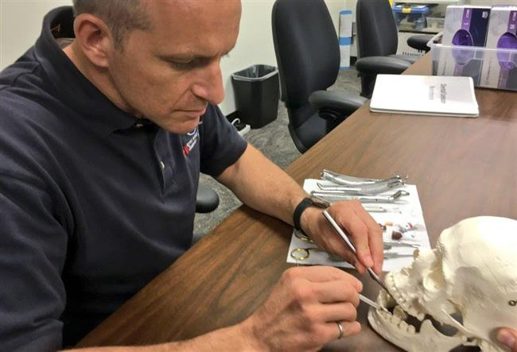
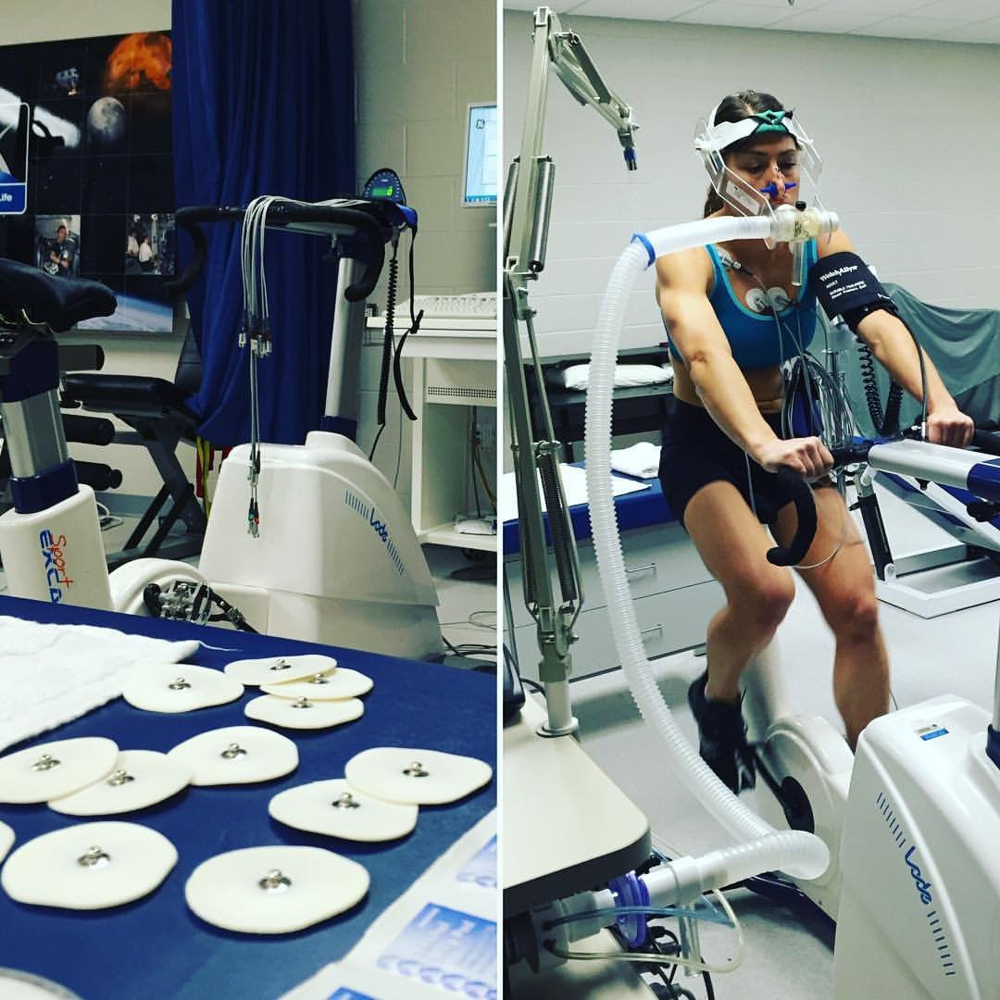

********************
Szkolenie podstawowe
********************

    I'm not a techie, I am an operator

    -- Astronaut Victor Glover :cite:`Glover2016`

Po selecji osoba wybrana przez komisję ma za zadanie stawić się na tzw. szkolenie podstawowe. Podczas szkolenia kandydat na astronatę (ang. *ASCAN - Astronaut Candidate*) będzie przygotowany przez ekspertów oraz starszych stażem astronautów do pełnienia służby i docelowego lotu w kosmos. Szkolenie kandydackie trwa w zależności od agencji półtora do dwóch i pół roku. Po jego ukończeniu osoba ubiegająca się będzie mogła oczekiwać na przydział do misji :cite:`Gregersen2009`, a następnie szkolenie specyficzne trwające zwykle około 2 lat. Wyjątkiem jest CNSA, gdzie szkolenie podstawowe 3 lata, a szkolenie do przydzielonej misji 10 miesięcy.

Szkolenie podstawowe astronautów, które  dzieli się na 4 główne części:

- wiedza ogólna,
- robotyka i systemy ISS,
- trening spacerów kosmincznych,
- pilotaż.

W kolejnych rozdziałach autor przybliży każdy z powyższych tematów.

Przygotowanie teoretyczne i wiedza ogólna
=========================================
Głównym celem szkolenia jest wyrównanie poziomu wiedzy i umijejętności kandydatów pochodzących z różnych specjalizacji i dziedzin i wprowadzenie spójnego zasobu wiedzy, który stanowi podstawę do dalszego szkolenia. Ukończenie kursu podstawowego pozwala na zmianę tytułu z "kandydat na astronautę" na "astronauta" :cite:`NASA-Astronaut-Candidate-Program`. Jest to proces wymagający wielu poświęceń z życia prywatnego, który determinuje zasadność dalszych inwestycji przez agencję kosmiczną. W trakcie zbierania materiałów autor dotarł źródła pragnącego zachować anonimowość, które przekazało informację, że tylko 60% astronautów nadaje się do przydziałów do dalszych misji. Zgodnie z wywiadem pozostali "osiadają na laurach i przestają się uczyć", a ciągłe kształcenie jest podstawą specyfiki tego zawodu. Proces szkolenia podstawowego stanowi jeden z etapów weryfikacji umiejętności i zaangażowania.

Nauka języków obcych i przygotowanie kulturowe
----------------------------------------------
Wg. wielu astronautów dla których język rosyjski nie jest ojczystym najtrudniejszym etapem szkolenia jego nauka. Przed wysłaniem na szkolenie do Centrum Przygotowania Kosmonautów każdy astronauta musi przejść kurs składający się z 1000 godzin praktyki tego języka :cite:`ESA-Astronaut-Training-Requirements`, :cite:`Peake2017`.

Praca w międzynarodowym środowisku wymaga znajomości zachowań i różnic kulturowych, dlatego wśród zajęć w ramach szkolenia podstawowego prowadzi się przedmiot związany z przygotowaniem kulturowym.

Przygotowanie teoretyczne z nauk przyrodniczych i technicznych
--------------------------------------------------------------
Podstawą badań prowadzonych w kosmosie są nauki przyrodnicze i techniczne. Ze względu na konieczność wyrównania wiedzy osób z różnych środowisk w ramach szkolenia teoretycznego i wiedzy ogólnej astronauci uczestniczą w zajęciach z przedmiotów tj.:

- biologia (zoologia i botanika),
- geologia,
- geofizyka,
- obserwacje meteorologiczne,
- obserwacje geograficzne i oceanograficzne,
- inżynieria materiałowa,
- dynamika płynów,
- mechanika,
- fizyka,
- robotyka.

Kurs inżynierii kosmicznej i systemowej
---------------------------------------
Każdy astronauta z założenia powinien przyswoić sobie działanie systemów statków kosmicznych i stacji orbitalnej. W tym celu podzczas kursu kandydackiego wykładane są przedmioty z zakresu inżynierii kosmicznej (ang. *aerospace engineering*) i inżynierii systemowej (ang. *systems engineering*). Wśród przedmiotów wykładanych w formie zajęć teoretycznych można wymienić:

- aerodynamika lotów atmosferycznych dużych prędkości (lot i przejście między prędkościami):

    - poddźwiękowe (ang. *subsonic*) <0,8 Ma,
    - okołodźwiękowe (ang. *transonic*) 0,8-1,3 Ma,
    - naddźwiękowe (ang. *supersonic*) 1,3–5,0 Ma,
    - hiperdźwiękowe (ang. *hipersonic*) 5,0–10,0 Ma,
    - wysoko hiperdźwiękowe (ang. *high-hypersonic*) 10,0–25,0 Ma,
    - wejścia atmosferycznego (ang. *re-entry*) >25,0 Ma,

- materiały i kompozyty używane w technice kosmicznej,
- konstrukcja rakiet i silników rakietowych,
- dynamika lotu rakiety,
- paliwa rakietowe i systemu RCS,
- dynamika lotu statków kosmicznych,
- orbitalne systemy manewrowe,
- planowanie misji i ładunku (ang. *Mission design and payloads*)
- systemy kontroli i zmiany ustawienia (ang. *ADCS - Attitude Dynamic and Control Subsystems*)
- systemy zmiany orbity (ang. *OCS - Orbit Control System*)
- systemy zasilania oraz pozyskiwania energii (ang. *power*),
- systemy przechowywania energii (ang. *Power Storage*)
- systemy odprowadzania ciepła (ang. *thermal*),
- telemetria, śledzenie i sterowanie (ang. *TT&C - Telemetry-Tracking and Control*),
- sterowanie i kontrola (ang. *Command and Control*),
- układy liczące i architektura logiczna (ang. *On-board processors*),
- oprogramowanie sterujące (ang. *OBSW - On-board software*),
- systemy awaryjne, detekcji awarii, izolacji i przywracania (ang. *Safe Mode, Fault Detection, Isolation and Recovery*),
- architektura segmentu naziemnego (ang. *ground segment*),
- architektura systemów ratunkowych,
- systemy podtrzymywania życia (ang. *ECLSS - Environmental Control and Life Support System*).

Kurs astrodynamiki, nawigacji i mechaniki orbitalnej
----------------------------------------------------
W ramach kursu wyrównującego wiedzę kandydaci na astronautów muszą przyswoić wiedzę z szerokiego zakresu nawigacji, astrodynamiki i mechaniki orbitalnej. Wśród tematów poruszanych na szkoleniach można wymienić:

- podstawy balistyki,
- nawigacja i pozycjonowanie,
- trajektoria lotu orbitalnego,
- manewry orbitalne i asysty grawitacyjne,
- transfery orbitalne:

    - transfer Hohmanna,
    - transfer dwueliptyczny (ang. *Bi-elliptic transfer*),

- zmiany inklinacji,
- operacje zbliżania i dokowania (ang. *rendezvous and docking*),
- manewry "Fly-around"
- przebazowanie (ang. *redocking*),
- odejście,
- obniżanie orbity i wejście w atmosferę.

Przygotowanie medyczne i dentystyczne
-------------------------------------
Podczas pobytu na międzynarodowej stacji kosmicznej oraz w trakcie długotrwałego lotu astronauci są zdani wyłącznie na pomoc medyczną udzieloną w ramach zespołu :cite:`CSAOngoingTraining`. Operacje medyczne dotyczą nie tylko sytuacji awaryjnych, lecz również rutynowych zadań wykonywanych podczas badań naukowych. Do typowych czynności należą:

- pobieranie krwi (ang. *drawing blood*),
- pobieranie próbek śliny i płynów ustrojowych,
- badanie ultrasonograficzne (ang. *ultrasounds*),
- resuscytacja krążeniowo oddechowa (ang. *cardio-pulmonary resuscitation*),
- szycie (ang. *suture*).

Podczas lotu Jurija Romanenko w 1973 roku w ramach misji Salyut 6 kosmonauta doznał bólu zęba. Ból był tak silny, że rzutował na jego sprawność podczas badań na orbicie. Kosmonauta był zmuszony czekać dwa tygodnie do czasu powrotu na Ziemię aby uzyskać pomoc dentystyczną. Od tamtego czasu wszyscy astronauci przechodzą podstawowy kurs stomatologiczny.

    Astronauta CSA David Saint-Jacques podczas kursu dentystycznego. Źródło: Canadian Space Agency

Komunikacja nauki
-----------------
Agencje kosmiczne działają w oparciu o środki publiczne uzyskane w ramach uchwalonego budżetu państwa lub państw członkowskich (w przypadku ESA). Aby zwiększyć świadomość publiczną a co za tym idzie poparcie i dofinansowanie programów konieczna jest działalność w kontekście popularyzacji nauki, technologii, inżynierii (sztuki) i matematyki (and. *S.T.E.M./S.T.E.A.M. - Science Technology Engineering (Arts) Mathematics*).

W ramach szkolenia kandydackiego astronautów poruszane są tematy:

- wykorzystanie mediów społecznościowych do popularyzacji nauki i misji,
- nauka wystąpień publicznych i "Space Advocacy",
- wykorzystanie amatorskiego radia krótkofalowego.

Astronauci są osobami publicznymi często występującymi przed zgromadzeniami. Od ich prezencji i sposoby wypowiadania się zależy wizerunek agencji i całego programu kosmicznego. Z tego powodu agencje kosmiczne już podczas selekcji cenią umiejętność przemiówień publiczncyh. Ponadto konieczna jest umiejętność prezentacji skomplikowanych problemów w prosty i przystępny sposób nawet dla najmłodszego odbiorcy.

Czynności rutynowe
------------------
W ramach przedmiotu Routine Ops astronauci przyswajają umiejętności związane z:

- fotografią,
- strzyżeniem włosów,
- sprzątaniem,
- korzystnaiem z toalety,
- korzystaniem ze sprzętu elektronicznego,
- naprawami sprzętu i toalety.

Ze względu na fakt iż długie włosy mogą się zaczepić w powszechnie wykorzystywane w kosmosie rzepy lub śrubki astronauci są zmuszeni do ich okresowego ścinania. W trakcie przedmiotu uczeni są technik fryzjerskich na sobie oraz na innych członkach załogi.

Treningi i symulacje
====================

.. todo:: Treningi i symulacje
    - Astronaut Pilots and Commanders are a breed apart, as are Test Pilots. These are people with total control over their emotions and reactions, rarely if ever flustered. If you've watched test pilots flying aircraft in Air Shows, and seen planes literally come apart and the pilot stays seemingly forever in the cockpit, before a last ditch ejection, then you know the kind of people I'm talking about.  I have flown simulations with Astronauts and they really do have ice water running through their veins.  Nothing rattles them.  They do not have a death wish, but they face every situation, including the toughest ones, with a calm that's nearly impossible to believe.
    - http://www.asc-csa.gc.ca/eng/astronauts/about-the-job/basic-training.asp
    - Canadian Astronaut Basic training covers many subjects, including:

        - CSA orientation
        - History of space flight
        - Fundamentals of space flight
        - Space operations and procedures
        - International Space Station systems
        - Life science
        - Materials and fluid science
        - Earth observation
        - Space science
        - Robotics
        - Human behaviour and performance
        - Flight training
        - Parachute jumps
        - Physical training
        - First aid and CPR
        - Language training (e.g. learning Russian)
        - Operation of photographic equipment
        - Media relations
        - Survival training

    - http://www.asc-csa.gc.ca/eng/astronauts/about-the-job/flight-training.asp
    - http://www.asc-csa.gc.ca/eng/astronauts/about-the-job/ongoing-training.asp

    - Symulatory w centrum wyszkolenia:

        - MMU Simulator - how astronauts move in space
        - Simulator Multi-Axes - Rotate in three different axis. Learn how to concentrate facing complete disorientation situation.
        - Simulator 1/6 chair - during Apollo program. used to train astronauts how to walk on the moon. Elastic suspension compansate 5/6 body weight.
        - Simulator 5DL Chair - Simulator used to train how to move in space using only arms and hands.
        - Simulator 0-gravity wall
        - Simulator SSMT - Simulator acustoms trainee to move in Space Station - 1,83m diameter cylinder allows to rotate 360 degrees.

Ćwiczenia kondycyjne i badania wydolności organizmu
---------------------------------------------------

    Astronautka NASA Christina M. Hammock podczas ćwiczeń kondycyjnych i badań wydolności organizmu. Źródło: NASA/JSC

Przygotowanie psychologiczne do pracy w odosobnieniu
----------------------------------------------------
.. todo::
    - Przygotowanie do samotności
    - Brak bliskich
    - Psychika
    - requirements: mental, spiritual (emotional), physical fitness
    - dealing with stress, emotional and physical

Przygotowanie do pracy w ekstremalnych warunkach
================================================
.. todo::
    - hiking
    - planetary science
    - geology
    - poznawanie siebie i innych w zespole aby być lepszymi kumplami
    - expeditionary training
    - graduation of national outdoor leadership school, Orlando, Wyoming (hike 8 days and 8 nights)
    - east temple peak
    - walking up to the peak holding hands z innymi
    - Tzw. survival training
    - kiedy takie sytuacje mogą wystąpić?
    - desert training
    - water training
    - jungle survival training
    - cook and eat snake
    - how to make a water in the desert

Przetrwanie w warunkach zimowych
--------------------------------
.. todo::
    - Jazda na nartach crosscountry, ciągnąć 75kg nosze z plecakiem w zimną zimę
    - Winter show shelter construction, techniques and procedures
    - Living outdoors in arctic Alaska
    - Proper way to defecate in snow and freezing temperature
    - Navigation in snow mountains, being aware of avalanches.
    - Practicing searching for bodies under snow avalanche (using beacon system); avalanche beacon; homing beacon and monitor
    - In part of the Survival, instructors disappear and crew need to survive
    - Russian survival training is easier. It last for 2.5day. They encourage you to have fire to have cold. Woods 8 miles outside of star city. Minus 26 degrees in night
    - Before 1 day of instructions and theories
    - Cosmonauts has to have training before they are flying, no matter how many times they had it before
    - Before going out, change to winter survival gear
    - Different suit for Water, ice cold water, survival
    - Construction of "lean to" shelter.
    - Wigwams need air circulation, otherwise you can inhale carbon monoxide
    - Two fires. Signal fire (fast, hot, top) and shelter fire next to the shelter, constantly maintained
    - Using navy army food rations (MRI)
    - Incapacitated astronaut while medevac (broken leg)

Przetrwanie w warunkach pustynnych
----------------------------------
.. todo::
    - cook and eat snake
    - how to make a water in the desert

Przetrwanie w warunkach dżungli
-------------------------------

.. _sea-survival:

Przetrwanie w warunkach wodnych
-------------------------------

Misje CAVES
-----------

Misje NEEMO
-----------
.. todo::
    - Pierwowzorem był SEALAB https://en.wikipedia.org/wiki/SEALAB
    - Key West, Florida
    - Day 1
        - zapoznanie z wodą
        - nurkowanie w rafie koralowej
        - nauka nurkowania
    - Day 2
        - zapoznanie ze sprzętem, hełm

Misje Pangea
------------

Obozy przywództwa i pracy zespołowej
------------------------------------

Symulacja pracy w środowisku mikrograwitacji
============================================

Urządzenia symulujące obniżoną grawitację
-----------------------------------------
.. todo::
    - liny i poruszanie się po ścianie w boki (z programu apollo)
    - urządzenie na którym trenował Ed White poruszanie się w kosmosie
    - MAT Multi Axial Trainer
    - vertical threadmill (poruszanie się w górę)

Test w wirówce zwiększający odporność organizmu na przeciążenia
---------------------------------------------------------------

Loty paraboliczne symulujące stan nieważkości
---------------------------------------------
.. todo:: Loty paraboliczne symulujące stan nieważkości
    - (Zero-G Flight) - Vomit Commet
    - Poprzenie samoloty wykorzystywane przez NASA
    - Zero-G corp Boeing 727
    - Samoloty wykorzystywane przez Ruskich
    - ESA samolot
