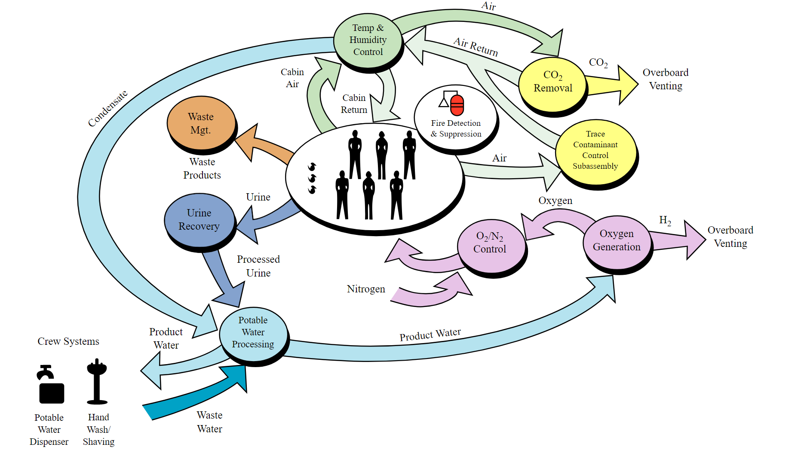

************************************
Robotyka i systemy stacji kosmicznej
************************************

Istotną częścią podstawowego szkolenia astronautów jest trening wykorzystania podstawowych urządzeń robotyki kosmicznej oraz systemów ISS. Jednakże należy zwrócić uwagę na fakt, iż planowo w 2024 Międzynarodowa Stacja Kosmiczna zostanie zdeorbitowana a wykształcenie Polskiego astronauty do tego czasu jest mało prawdopodobne. Nawet jeżeli zaistniałaby możliwość, że program ISS zostanie przedłużony, to i tak wszyskie przydziały do lotów załogowych zostaną zaplanowane z dużym wyprzedzeniem. Zważywszy na powyższy fakt w ramach porgramu polskiego astronauty proponuje się odrzucenie wszelkich tematów związanych z obsługą systemów ISS.

Z tego powodu w niniejszym rozdziale zostaną opisane jednynie technologie i systemy, które mogłyby być wykorzystane w przyszłych planowanych misjach i programach.

Systemy operacyjne i oprogramowanie wykorzystywane w kosmosie
=============================================================
Międzynarodowa Stacja Kosmiczna jest złożoną konstrukcją pobierającą 84-120 kW energii dostarczanej przez panele słoneczne o powierzchni 2,500 :math:`\m^2` i rozpiętości 65 metrów. W strukturze ISS znajduje się 12.9 km kabli elektrycznych podłączonych do 52 komputerów sterujących stacją. Oprogramowanie zarządzające tą skalą ma 3.3 mln lini kodu (część naziemna) oraz 1.8 mln linii kodu część kontrolująca stację (ang. *flight software*). W ramach szkolenia astronauci poznają system operacyjny Międzynarodowej Stacji Kosmicznej wraz z jego użytkowymi detalami :cite:`ISSTechnicalDetails`, :cite:`Parazynski2017`.

System czasu
------------
W przypadku proponowanego programu polskiego astronauty wprowadzony zostałby temat systemu operacyjnego i elementów dotyczących habitatu pozaziemskiego. Jednocześnie ze względu na zupełnie inny sposób liczenia czasu na powierzchni Marsa czy Księżyca konieczne jest wprowadzenie systemów o innej podstawie niż sekunda ziemska tj.: Coordinated Mars Time, Mars Sol Date, Lunar Standard Time. Ponadto omówiona powinna zostać również konwersje między tymi czasami.

W misjach Księżycowych opóźnienie w komunikacji sygnału elektromagnetycznego może sięgać od 1,19 do 1,35 sekundy (średnio 1,25 sek.) i nie stanowi problemu dla obecnych systemów. Problem stanowi komunikacja z obiektami np. lecącymi w stronę Marsa. W rozważaniach należy uwzględnić opóźnienia rzędu od 4 do 24 minut (średnio 13 min. 48 sek.). Z tego względu przy wszelkiego rodzaju komunikacji, tj. transfer danych naukowych, danych medyczny i parametrów biometrycznych, danych EVA czy komunikacji prywatnej astronauta może spodziewać się problemów.

System planowania zadań
-----------------------
Planowanie zadań jest krytycznym elementem misji i wpływa na wydajność osób pracujących w kosmosie. Na skalę złożoności procesu wpływa fakt, iż planowanie składa się z trzech poziomów zadań: długoterminowych, krótkoterminowych oraz nieokreślonych w czasie. Jednocześnie są zadania, które mają możliwość być przeniesione na inny dostępny slot czasowy oraz zadania nie posiadające takiej możliwości.

Plan astronautów dla misji na Marsa ze względu na brak bezpośredniej komunikacji z MCC będzie w większości zadaniowy i nieprzypisany do sztywno okreslonych slotów czasowych. Wymaga to większej koordynacji i samoorganizacji pracy przez astronautów. Z drugiej strony system jest elastyczniejszy i lepiej dostosowuje się do preferencji użytkownika. Istotną kwestią pozostanie odpowiedzialność za wykonane zadania oraz śledzenie postępu wykonania.

W badaniach na ISS wzięły udział urządzenia do bezdotykowego przeglądania procedur tj. Mobile Procedure Viewer (mobiPV). Urządzenie wyglądem przypomina Google Glass i pozwala na obsługę urządzeń wykorzystywanych podczas badań z jednoczesną możliwościa kontroli procedur. MobiPV obsługuje nagrywanie materiału wideo oraz audio, jego transmisję na Ziemię oraz komunikację pomiędzy PI a astronautą.

Systemy kontroli środowiskowej i podtrzymania życia
---------------------------------------------------
Najistotniejszym elementem zarówno stacji kosmicznej jak i habitatu jest system kontroli środowiskowej i podtrzymania życia (ang. *ECLSS - Environmental Control and Life Support System*). W ramach elementów sterowanych przez system można wymienić:

- kontrola temperatury,
- kontrola wilgotności powietrza,
- kontrola parametrów i składu atmosfery,
- monitoring poziomu CO2,
- monitoring parametrów atmosfery z uwzględnieniem przesunięć czasowych,
- wizualizacja parametrów stanu habitatu,
- monitoring zużycia wody (szara, żółta, zielona, niebieska),
- zastosowanie algorytmów uczenia maszynowego w optymalizacji zużycia wody,
- zarządzanie odpadami ciekłymi,
- zarządzanie odpadami stałymi,
- kontrola oświetlenia.

System ECLSS jest podstawowym systemem każdego statku kosmicznego i stacji.

    System Systemy kontroli środowiskowej i podtrzymania życia na ISS. Źródło: Wikipedia

Moduł badań naukowych i danych
------------------------------
- Eksperymenty bazujące na danych automatycznie zbierających się w systemie
- Eksperymenty bazujące na danych wprowadzanych przez użytkownika
- Sterowanie systemem hydroponiki i aquaponiki (monitoring, kontrola parametrów środowiska, stan urządzeń technicznych, wizualizacja procesu)
- Moduł zbierania danych geologicznych i geofizycznych
- Moduł zbierania danych psychologicznych i socjodynamicznych
- Moduł zbierania danych medycznych (ewaluacja, kwestionariusze, choroby, stan załogi)
- Zastosowanie algorytmów uczenia maszynowego w analizie anomalii danych medycznych
- Zastosowanie algorytmów uczenia maszynowego w analizie danych psychologicznych i socjodynamicznych
- Zastosowanie algorytmów uczenia maszynowego w wykrywaniu intencji w raportach dziennych i snach astronautów
- Śledzenie aktywności fizycznej astronautów (spalane kalorie, ćwiczenia, intensywność)
- Śledzenie poruszania się w habitacie i położenia załogi
- Śledzenie jakości i parametrów snu

System śledzenia inwentarza
---------------------------
- Baza danych przedmiotów i identyfikacja (QR, barcode)
- Śledzenie daty zdatności do wykorzystania
- Śledzenie położenia przedmiotów
- Śledzenie stanu magazynowego przedmiotów jednorazowych
- Śledzenie lekarstw i przedmiotów medycznych
- Śledzenie pożywienia, kaloryczności oraz wartości odżywczych
- Monitoring stanu zapasów pożywienia i daty zdatności do spożycia
- Monitoring konsumpcji oraz wartości kalorycznych i odżywczych przyjmowanych przez załogę
- Raportowanie incydentów i napraw
- Monitorowanie stanu sprzętu i detekcja uszkodzeń
- Zastosowanie algorytmów uczenia maszynowego w analizie stanu i detekcji uszkodzeń

Komunikacja
-----------
- Dzienniki osobiste
- Dzienniki audio i wideo
- Zastosowanie algorytmów uczenia maszynowego w analizie intencji tekstów, materiałów audio oraz wideo

System wsparcia EVA
-------------------
- Mapowanie terenu i odwzorowanie kartograficzne
- Planowanie spacerów kosmicznych i planetarnych
- Monitoring pozycji astronautów w czasie rzeczywistym
- Strumieniowanie danych audiowizualnych
- Parametry biomedyczne skafandra
- Wsparcie dla sytuacji awaryjnych
- Wsparcie współpracy z systemami robotycznymi
- Systemy wsparcia rozszerzonej rzeczywistości i wyświetlania procedur operacyjnych
- Zmiana celów w trakcie trwania EVA
- Odprawa i rozliczanie załóg

Systemy wsparcia robotycznego
=============================

.. figure:: ../img/iss-robotics-controller.jpg
    :name: figure-iss-robotics-controller
    :scale: 33%
    :align: center

    Astronautka NASA Christina M. Hammock podczas ćwiczeń systemów robotycznych. Źródło: NASA/JSC

Manipulator SSRMS Canadarm 2
----------------------------

.. todo:: The MSS is composed of three components - the Space Station Remote Manipulator System (SSRMS), known as Canadarm2, the Mobile Remote Servicer Base System (MBS) and the Special Purpose Dexterous Manipulator (SPDM, also known as Dextre or Canada hand). The system can move along rails on the Integrated Truss Structure on top of the US provided Mobile Transporter cart which hosts the MRS Base System. The system's control software was written in the Ada 95 programming language.[http://www.adacore.com/uploads/customers/CaseStudy_SpaceArm.pdf]

​
50 feet length (old arm?)
Three jointed shoulder
Elbow
Three jointed wrist
Able to change base location
7 joints 540 degrees rotation
Force moment sensors for Force feedback
Advanced automatic vision system
Basic Collision avoidance system
250.000 lbs. payload handling

Urządzenie Mobile Remote Servicer Base System
---------------------------------------------

Manipulator Special Purpose Dexterous Manipulator
-------------------------------------------------

Wykorzystanie systemów robotycznych
===================================

Dokowanie statków kosmicznych
-----------------------------
.. todo::
    - Za pomocą Canadaarm2
    - ATV
    - Dragon
    - Progress

Asystowanie przy spacerach kosmicznych
--------------------------------------

Symulacja przechwytywania pojazdów kosmicznych na orbicie
=========================================================

Sterowanie robotami na Ziemi z orbity
======================================

Urządzenia wirtualnej rzeczywistości
======================================

Analiza szkolenia robotycznego i systemów ISS w kontekście celu pracy
=====================================================================
Ze względu na brak trenażerów systemów ISS, jego wewnętrznej i zewnętrznej części jak również na chwilę obecną brak basenu nadającego się do prowadzenia szkolenia z EVA niemożliwe jest odtworzenie tych elementów szkolenia. Jednakże należy zwrócić uwagę na fakt, iż planowo w 2024 Międzynarodowa Stacja Kosmiczna zostanie zdeorbitowana a wykształcenie polskiego astronauty do tego czasu jest mało prawdopodobne. Nawet jeżeli zaistniałaby możliwość, że program ISS zostanie przedłużony, to i tak wszyskie przydziały do lotów załogowych zostaną zaplanowane z dużym wyprzedzeniem. Zważywszy na powyższy fakt w ramach porgramu polskiego astronauty proponuje się odrzucenie wszelkich tematów związanych z obsługą systemów ISS.

Szkolenie z wykorzystywania i utrzymywania ISS jest jednym z najbardziej czasochłonnych oraz zasobochłonnych aspektów szkolenia astronautów. Proponowane rozwiązanie wykluczenia powyższych elementów ze szkolenia pozwoli nie tylko na optymalizację kosztów, jak również zwiększy możliwość procentowego udziału w szkoleniu w Polsce.

Obecnie planowane są misje na Księżyc, Mars oraz asteroidy i inne ciała o niewielkim przyciąganiu grawitacyjnym. Autor pracy sugeruje aby wykorzystać nowatorskie badania i unikalną infrastrukturę aby rozwinąć program szkolenia przygotowujący do lotów na inne ciała niebieskie. Dzięki habitatowi Lunares Polska nie tylko jest w stanie szkolić astronautów, ale również wieść prym w nowej klasie treningów.
