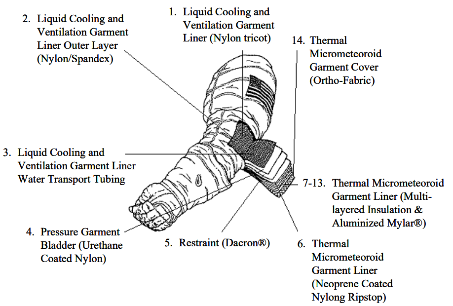

************************************************
Szkolenie przygotowujące do spacerów kosmicznych
************************************************

Jednym z najtrudniejszych elementów pracy astronauty jest wyjście w przestrzeń kosmiczną na tzw. EVA (ang. Extravehicular Activity, pol. spacer kosmiczny). Do przeprowadzenia takiego wyjścia astronauci przygotowują się przez dwa lata przed misją przeprowadzając około 20 ćwiczeń w pełnym skafandrze pod wodą w basenach neutralnej pływalności. Każdy trening jest oceniany przez zespół wykwalifikowanych i certyfikowanych instruktorów.

Jednorazowe wejście do basenu neutralnej pływalności NBL jak i Hydro Lab w celu ćwiczenia spacerów kosmicznych (ang. *EVA - ExtraVehicular Activity*) trwa sześć godzin. W trakcie astronauta wykonuje zadania pod wodą będąc umieszczonym w skafandrze EMU lub Orlan. Każdy późniejszy EVA w przestrzeni kosmicznej jest poprzedzony przynajmniej dwudziestokrotnym treningiem w środowisku symulującym stan nieważkości. W tym celu w basenie przy użyciu ciężarów i wyporników nadaje się skafandrowi kosmicznemu cechę neutralnego unoszenia się. Skafander w którym trenują astronauci oraz specjalne warunki wymienione powyżej wymagają wysokiej sprawności kondycyjnej i wytrzymałościowej.

Ze względu na bardzo szeroki zakres obowiązków podczas spacerów kosmicznych astronauci specjalizują się w swojej dziedzinie i charakterze przeprowadzanej operacji. Każdy z nich także otrzymuje szkolenie umożliwiające mu zastąpienie dowolnego innego astronauty w jego obowiązkach gdyby zaszła taka potrzeba. Z tego względu szkolenie astronautów podzielone jest na dwa typy:

- generic training (pol. szkolenie generalne),
- cross training (pol. szkolenie przekrojowe).

Astronauci podczas szkolenia podstawowego, a później dla utrzymania sprawności w trakcie swojej kariery ćwiczą wyjścia EVA w basenie neutralnej pływalności. Podczas tych zajęć szkolą się z rozwiązywania sytuacji awaryjnych, m.in. ewakuacja astronauty, który ma niesprawny kombinezon lub nie może się poruszać.

Spacery kosmiczne wymagają wysokiej sprawności oraz dużej siły fizycznej. Z tego względu nie wszyscy astronauci mają możliwość wykorzystania w kosmosie wyuczonych uprzednio umiejętności. Ay astronauta mógł wyjść w przestrzeń kosmiczną musi udowodnić znajomość stroju przechodząc stosowny egzamin jak również musi mieć odpowiednią kondycję i formę.

Na chwilę obecną wyjścia w przestrzeń kosmiczną skupiają się głównie na pracach na orbicie przy konstrukcji i naprawy międzynarodowej stacji kosmicznej. Przed erą ISS astronauci wychodzili aby naprawiać MIR czy Skylab, podczas programu Apollo w celu demontażu kamery oraz w programie STS, Gemini i Wostok. Dotychczas EVA na obcych planetach lub satelitach doświadczyło tylko i wyłącznie dwanaście osób. Jednym z najbardziej podstawowych podziałów spacerów kosmicznych są wyjścia:

- zaplanowane,
- awaryjne,
- na obcych ciałach niebieskich.

.. figure:: ../img/eva-infrastructure-and-supporting-systems.png
    :name: figure-eva-infrastructure-and-supporting-systems
    :scale: 66%
    :align: center

    Podział systemów oraz infrastruktury EVA. Źródło: NASA/JSC

Podział skafandrów kosmicznych
==============================
Najważniejszym podziałem skafandrów jest rozdzielenie ich ze względu na przeznaczenie:

- Skafandry kosmiczne wykorzystywane podczas startu i lądowania (IVA),
- Skafandry kosmiczne wykorzystywane podczas wyjść w przestrzeń kosmiczną (EVA).

Ze względu na strukturę oraz konstrukcję podział wygląda następująco:

- Soft suits (tworzone z tkanin),
- Hard-shell suits (tworzone z kompozytów i metali),
- Hybrid suits (połączenie tkanin i kompozytów lub metali),
- Skintight suits (skafandry przylegające do skóry - biosuits).

Skafandry kosmiczne wykorzystywane podczas startu i lądowania
-------------------------------------------------------------
Od czasów śmierci załogi Sojuz-11, którego załogę stanowili:

- Georgy Dobrovolsky (dowódca),
- Vladislav Volkov (inżynier pokładowy),
- Viktor Patsayev (inżynier testów),

w skutek rozszczelnienia kapsuły i utraty powietrza wszystkie loty kosmiczne odbywają się w skafandrach do użycia wewnątrz pojazdu (ang. *IVA - Intravehicular Activity*). Skafandry te są lżejsze od skafandrów EVA i nie posiadają własnego systemu podtrzymywania życia (*PLSS*), co czynie je zależne od statku kosmicznego do którego zostały przystosowane. :numref:`table-spacesuits-iva` przedstawia zestawienie historyczne skafandrów *IVA*. Głównymi skafandrami wykorzystywanymi obecnie w lotach załogowych są skafandry *Sokol*.

Na uwagę zasługuje fakt, iż wcześniejsze loty w ramach programów Wostok, Woschod oraz Sojuz odbywały się przy załodze ubranej w skafandry *IVA*. Jednakże zwiększenie załogi z jednego, później do dwóch i docelowo trzech astronautów spowodowało brak miejsca w kapsule i decyzję o nieużywaniu skafandrów.

W amerykańskim programie załogowym również zdarzył się przypadek gdzie niemalże nie doszło do katastrofy i utraty załogi. Podczas powrotu z misji "Apollo-Sojuz" załoga:

- Thomas P. Stafford (Commander),
- Vance D. Brand (Command Module Pilot),
- Donald K. "Deke" Slayton (Docking Module Pilot),

została poddana wpływowi tetratlenku diazotu :math:`N_2O_2` (ang. *nitrogen tetroxide*) stosowanemu jako utleniacz dla hydrazyny i silników pozycyjnych.

Za wyjątkiem *STS-1* loty amerykańskich promów kosmicznych zabierały na pokład załogi bez skafandrów. Fakt ten odwrócił się po tragedii promu *Challenger* w 1986. Od tamtego czasu wszystkie załogi latały w skafandrach *ACES* w kolorze pomarańczowym, który ułatwia odnalezienie ewentualnego rozbitka na morzu.

Ze względu na dobre przyleganie i całkowitą izolację orgranizm astronauty narażony jest na przegrzanie. Charakterystyczne dla skafandrów *IVA* jest noszenie systemów klimatyzacji i wymuszonego obiegu powietrza w walizkach przez astronautów, co można zaobserwować na zdjęciach załóg idących na kosmodrom lub platformę startową.

.. csv-table:: Zestawienie skafandrów do czynności podczas startu i lądowania *IVA* (ang. *Intravehicular Activity*)
    :name: table-spacesuits-iva
    :file: ../data/spacesuits-iva.csv
    :header-rows: 1

Skafandry kosmiczne wykorzystywane podczas wyjść w przestrzeń kosmiczną
-----------------------------------------------------------------------
Skafandry, które wykorzystuje się do wyjść w przestrzeń kosmiczna, tj. do pracy poza statkiem, nazywa się skafandrami EVA (ang. *Extravehicular Activity*). Do podstawowych zadań skafandra należą:

- ochrona przed ekstremalnym środowiskiem kosmosu,
- ochrona przed brakiem ciśnienia (próżnią),
- ochrona przed mikrometeorytami,
- ochrona termiczna przed fluktuacjami temperatury od -156°C do +121°C,
- próba ochrony przed radiacją, cząstkami wysokich energii oraz promieniowaniem kosmicznym tła,
- ochrona przed promieniowaniem ultrafioletowym.

:numref:`table-spacesuits-eva` przedstawia listę skafandrów kosmicznych wykorzystywanych do wyjść w przestrzeń.

Na uwagę zasługuje fakt, że podobnie jak w skafandrach *IVA* tak przy EVA część skafandrów tworzona jest iteracyjnie, tzn. poprzednie modele z wcześniejszych programów są poddawane modyfikacjom i wykorzystywane w nowym środowisku. Przykładem jest skafander obecny *EMU*, który wyewoluował ze skafandra wykorzystywanego podczas lotów wahadłowców.

.. csv-table:: Zestawienie skafandrów do spacerów kosmicznych EVA (ang. *Extravehicular Activity*)
    :name: table-spacesuits-eva
    :file: ../data/spacesuits-eva.csv
    :header-rows: 1

Zaznajomienie się ze skafandrem
===============================
Szkolenie przygotowujące do spacerów kosmicznych zaczyna się od zapoznania ze skafandrem. Astronauci są następnie przygotowywani do egzaminów z wykorzystania strojów *EMU* oraz *Orlan*. Ze względu na różnice w budowie, zakładaniu i zdejmowaniu skafandra, ciśnieniu operacyjnym oraz systemach awaryjnych astronauci muszą przejść ścieżkę certyfikacyjną z każdego stroju na międzynarodowej stacji kosmicznej. Po takiej certyfikacji astronauta powinien wykazać się dużą wiedzą na temat nie tylko posługiwania się wysoko wyspecjalizowanym ubiorem ale również w jego systemach awaryjnych. Każde ze szkoleń jest oceniane przez instruktorów z centrum kontroli misji.

Po pozytywnym zaliczeniu egzaminów teoretycznych z przedmiotu zaznajomienia się ze skafandrem (ang. *Suit Familiarization*) astronauta jest dopuszczony do możliwości wykorzystania stroju w symulacjach w basenie neutralnej pływalności.

    Warstwy skafandra na przykładzie amerykańskiego *A7L*. Źródło: NASA/JSC

Generalna charakterystyka skafandrów kosmicznych
------------------------------------------------
Większość skafandrów działa w podobny sposób i składa się z 4 podstawowych warstw:

- warstwa pęcherza (ang. *bladder*)
- warstwa nadająca kształt (ang. *restraint*),
- warstwa ochronna (ang. *Thermal Micrometeoroid Garment*),
- warstwa zewnętrzna.

    Warstwy skafandra na przykładzie amerykańskiego *EMU*. Źródło: NASA/JSC

W zależności od skafandra inny jest sposób jego przywdziewania (ang. *donning*) i zdejmowania (ang. *doffing*). Rosyjskie skafandry *Orlan* oraz Chiński *Feitian* zakłada się wchodząc przez wejście na plecach otwierając plecak *PLSS*.

Amerykańskie *EMU* przywdziewa się składając z kilku części, tj.:

- tors,
- chełm,
- rękawice,
- spodnie z butami.

Niezależnie od rozwiązania warstwa *LCVG*, która pozwala na regulowanie temperatury jest zakładana przez astronautę przed wejściem do skafandra EVA.

Sprawdzenie szczelności skafandra
---------------------------------
Przed wykonywaniem zadań w basenie astronauci wykonują tzw. sprawdzenie szczelności skafandra. Podczas tego testu astronauta ubrany w strój do wyjść EVA jest zamykany w pomieszczeniu, w którym odpompowywane jest powietrze do uzyskania ciśnienia zbliżonego do próżni. W trakcie trwania testu astronauci zapoznają się z zachowaniem skafandra i materiału, który sztywnieje i się napręża dając uczucie nadmuchania. Z tego względu praca w warunkach braku ciśnienia panujących poza statkiem kosmicznym jest znacznie trudniejsza od symulacji prowadzonych w basenie doskonałej pływalności.

Systemy biomedyczne stosowane podczas EVA
-----------------------------------------
Każdy skafander kosmiczny posiada inny zestaw sensorów i urządzeń kontrolujących organizm i pracę astronautów. Szczegółowe informacje na temat systemów biomedycznych skafandrów zostały przedstawione w osobnym rozdziale. Podczas podstawowego zapoznania się ze skafandrem astronauta poznaje systemy wspierające i monitorujące:

- promieniowanie,
- działanie układu krwionośnego,
- działanie układu oddechowego,
- systemy biometryczne,
- systemy podtrzymania życia.

Układ krwionośny monitorowany jest za pomocą trzypunktowych elektrod EKG (Elektrokardiografu). Informacje na temat układu oddechowego stanowią dane odnośnie ilości wdychania tlenu i wydychania dwutlenku węgla, dzięki czemu lekarze i biomedycy mogą wyliczyć metabolizm oraz przemianę anaerobową w trakcie wykonywania prac.

Każdy z systemów pobiera informacje i przekazuje je do centrum kontroli misji gdzie inżynierowie skafandra, inżynierowie biomedyczni oraz lekarz lotu (ang. flight surgeon) asystują astronautom podczas wyjścia w przestrzeń kosmiczną.

Ze względu na niedoskonałość materiału każdy strój posiada tzw. przecieki, które są również monitorowane. W przypadku zbyt dużego tempa wycieku powietrza uruchamiane są systemy awaryjne a astronauta natychmiast musi przerwać pracę na zewnątrz i udać się do śluzy pojazdu. Więcej na temat procedur oraz systemów awaryjnych w osobnym podrozdziale.

Wykorzystywanie specjalistycznych narzędzi do pracy
---------------------------------------------------
Prace w przestrzeni kosmicznej wymagają znajomości wysokospecjalistycznych narzędzi. Ich rolą jest nie tylko pomoc astronaucie w dokonaniu naprawy czy montażu sprzętu ale również zachowanie pozycji czy bezpiecznego poruszania się w obrębie stacji kosmicznej.

    Narzędzia wykorzystywane podczas EVA. Źródło: NASA/JSC

Urządzenia wykorzystywane w pracy w przestrzeni kosmicznej możemy podzielić na:

- śrubokręty (ang. hex screwdriver),
- klucze dynamometryczne (ang. ratchet wrench),
- wiertarki i wkrętarki (ang. pistol grip tool),
- urządzenia do spawania.

Prowadzenie prac w środowisku mikrograwitacji przy wykorzystaniu urządzeń tj. śrubokręty, wiertarki i wkrętarki nie jest tak proste jak na Ziemi. Brak oporu i bardzo zmniejszone przyciąganie ziemskie powoduje wytworzenie niezbilansowanego momentu skręcającego działającego na astronautę a to w konsekwencji prowadzi do zmiany jego pozycji względem stacji. Astronauta używając klucza czy wkrętarki musi być przymocowany aby móc przyłożyć odpowiednią siłę.

Wykorzystanie urządzeń wspierających pracę w przestrzeni kosmicznej
-------------------------------------------------------------------
Urządzenia wspierające pozwalają na zachowanie pozycji względem stacji kosmicznej oraz na łatwiejsze posługiwanie się narzędziami. Do głównych urządzeń wspierających czynności podczas spacerów kosmicznych można zaliczyć:

- przedłużki zmieniające ramię narzędzi,
- liny stalowe (ang. tethering),
- przymocowania stóp (ang. foot restraints).

Do zadania przedłużek należy zwiększenie długości ramienia klucza. Urządzenia te usadza się na końcu klucza przedłużając jego rączkę. Dzięki ich zastosowaniu astronauta może zwiększyć moment obrotowy działający na śrubę i dzięki temu przykręcić lub odkręcić śruby z większą siłą i precyzją.

Urządzenia przymocowywania stóp były głównie wykorzystywane podczas misji amerykańskich promów kosmicznych, gdzie astronauta przymocowany nogami do specjalnego panelu zamontowanego na ramieniu robotycznym mógł być bezpiecznie i stabilnie być wspierany przy wykonywaniu prac w stanie nieważkości.

Obecnie podstawowym elementem wyposażenia każdego stroju astronauty są tzw. uprzęże z bloczkami stalowych lin. Każdy strój do wyjść w przestrzeń kosmiczną posiada dwie takie uprzęże. Podczas spaceru kosmicznego astronauci muszą być przymocowane za pomocą przynajmniej jednej liny z klamrą do stacji kosmicznej aby nie odlecieć w przestrzeń. W celu przemieszczenia się astronauta zaczepia drugą klamrę do następnego punktu przymocowania i po upewnieniu się pewności zaczepu odczepia pierwszą przechodząc w dalsze miejsce.
