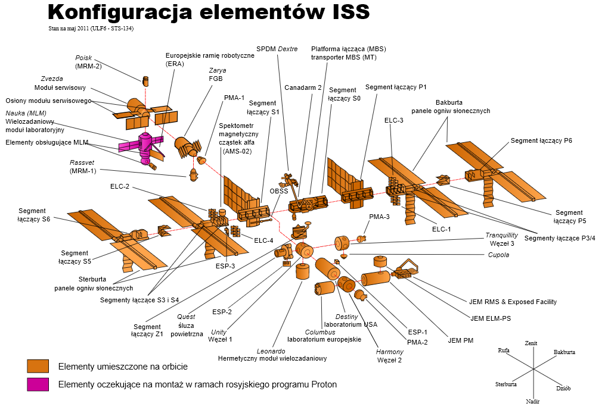

Międzynarodowa Stacja Kosmiczna
===============================
Program Międzynarodowej Stacji Kosmicznej rozpoczął się od połączenia konceptów projektów Freedom (ang. wolność) oraz Mir-2 (DOS-8). Następnie przekształcił się w pierwszą międzynarodową platformę badawczą o nazwie International Space Station. Program jest tworzony wspólnie przez pięć największych agencji kosmicznych: NASA, Roskosmos, JAXA, ESA, i CSA. Budowa rozpoczęła się od umieszczenia rosyjskich modułów w 1998 roku. Pierwsza załoga przyleciała 2 listopada 2000 roku. Od tego czasu stacja jest stale zamieszkiwana przez załogi 3 lub 6 osobowe w ramach tzw. ekspedycji. Temat ISS szczegółowo przedstawiono w części dotyczącej :ref:`przygotowania załóg do lotów na jej pokład <Robotyka i systemy Międzynarodowej Stacji Kosmicznej>`.

Na chwilę obecną najbardziej czasochłonną częścią procesu szkolenia astronautów jest ich przygotowanie do pracy na Międzynarodowej Stacji Kosmicznej. Jednakże należy zwrócić uwagę na fakt, iż planowo w 2030 ISS zostanie zdeorbitowana.

    Schemat stacji kosmicznej ISS. Źródło: Wikipedia
