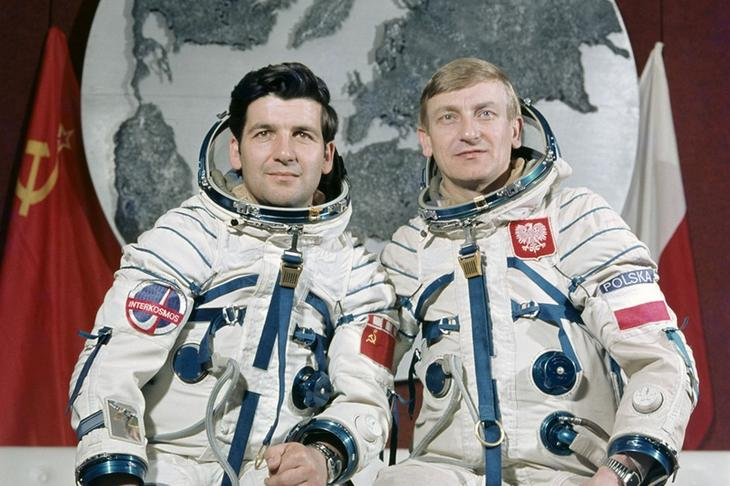
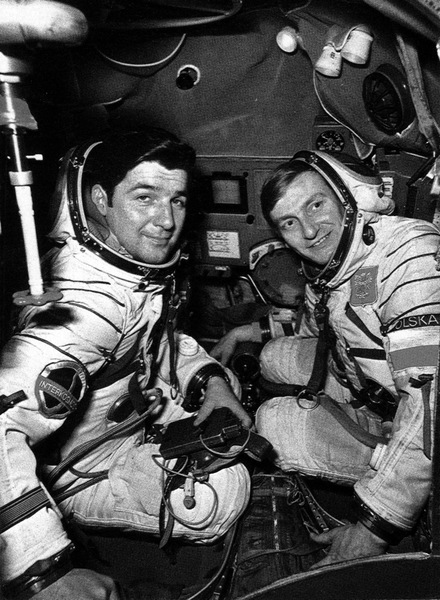
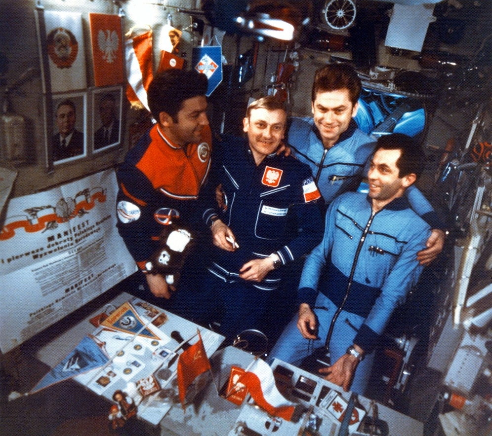

Lot generała Hermaszewskiego
============================

Lot Sojuz-30 miał miejsce w dniach 27 czerwca – 5 lipca 1978. Skład głównej załogi stanowił zespół: Mirosław Hermaszewski oraz Piotr Iljicz Klimuk (:numref:`figure-soyuz-30-crew`). W zespole rezerwowym byli Walerij Nikołajewicz Kubasow oraz Zenon Jankowski.

Głównym zadaniem Sojuz-30 było dokowanie do stacji Salut-6 oraz wykonanie badań naukowych i biomedycznych zestawionych w :numref:`table-soyuz-30-experiments` dla jednostek badawczych, tj. :cite:`Hermaszewski2013`:

- Wojskowy Instytut Medycyny Lotniczej (WIML),
- Instytut Fizyki PAN,
- Instytut Geodezji i Kartografii (IGiK),
- Centrum Badań Kosmicznych PAN (CBK),
- dla zagranicznych jednostek badawczych w ramach porozumienia Interkosmos.

Misja zakończyła się sukcesem a zadania założone zostały wykonane. :numref:`table-soyuz-30-timeline` przedstawia listę najważniejszych wydarzeń w trakcie lotu Sojuz-30.

W ramach treningu do misji kosmonauci odbyli szkolenia, m.in.:

- ratownictwo morskie i lądowanie w środowisku wodnym,
- zapoznanie się ze środowiskiem mikrograwitacji podczas lotu parabolicznego samolotem TU-104A,
- badania psychologiczne i kondycyjne,
- szkolenie z nawigacji i dynamiki lotu orbitalnego,
- trening aparatu błędnikowego na krześle Baraniego,
- badania wydolnościowe organizmu na cykloergometrze,
- symulacje lotu i manewrów dokowania oraz deorbitacji statku Sojuz-30 :numref:`figure-soyuz-30-simulator`,
- badania medyczne i sprawnościowe.

Za wyjątkiem treningu EVA oraz systemów robotycznych i specjalnych ISS proces przygotowania kosmonautów do lotu Sojuz-30 był podobny do procesu szkolenia do długotrwałych lotów kosmicznych na Międzynarodową Stację Kosmiczną.

Dla upamiętnienia lotu pierwszego Polaka załoga zabrała na pokład flagę i godło państwowe (:numref:`figure-soyuz-30-onboard`). Generał Hermaszewski na chwilę obecną pozostaje jedynym Polakiem w kosmosie. Trening do misji, szczegóły lotu, zakres badań prowadzonych na orbicie jak również wydarzenia po powrocie z misji można przeczytać w opracowaniu generała Hermaszewskiego pt. "Ciężar Nieważkości" :cite:`Hermaszewski2013`.

.. csv-table:: Lista badań w ramach misji Sojuz-30/Salut-6.
    :name: table-soyuz-30-experiments
    :file: data/soyuz-30-experiments.csv
    :header-rows: 1
    :widths: 10, 10, 80

.. csv-table:: Zestawienie najważniejszych wydarzeń w trakcie lotu Sojuz-30/Salut-6.
    :name: table-soyuz-30-timeline
    :file: data/soyuz-30-timeline.csv
    :header-rows: 1
    :widths: 15, 5, 5, 5, 5, 5, 50

    Załoga Sojuz-30 (od lewej): Piotr Iljicz Klimuk oraz Mirosław Hermaszewski

    Załoga Sojuz-30 (od lewej): Piotr Iljicz Klimuk oraz Mirosław Hermaszewski w trakcie szkolenia na symulatorze statku Sojuz.

    Załoga Salut-6 (od lewej): Piotr Klimuk, Mirosław Hermaszewski, Aleksandr Ivanchenkov oraz Vladimir Kovalyonok
