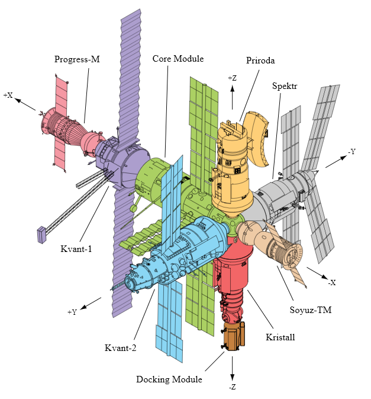

Stacja kosmiczna Mir
====================

Stacja kosmiczna Mir (ros. pokój) była bezpośrednim kontynuatorem programu Salut i pierwowzorem dla ISS. Początkowo służyła wyłącznie kosmonautom ZSRR oraz była udostępniana w ramach programu Interkosmos. Po upadku Związku Radzieckiego umożliwiono loty międzynarodowych załóg. Podczas ponad 15 lat pracy na orbicie gościła 28 stałych załóg i wiele tymczasowych wizyt amerykańskich promów Space Shuttle.

Jej konstrukcja rozpoczęła się od przeniesienia zasobów dostarczonych przez Progress-25 i Progress-26. Zadanie wykonała załoga Sojuz T-15 (Leonid Kizim i Władimir Sołowjow). Podczas 50 dniowego pobytu załoga również odwiedziła stację Salut-7 w celu przewiezienia części wyposażenia na Mir. Na chwilę obecną jest to jedyny przypadek w historii aby astronauci w trakcie jednego lotu odwiedzili dwie stacje.

    Schemat stacji kosmicznej Mir. Źródło: Wikipedia
