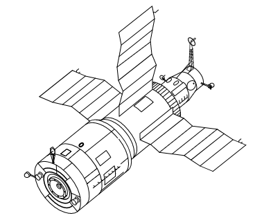

Program Salut
=============

Pierwszym w historii programem orbitalnej stacji kosmicznej był Salut. Konstrukcja stacji była jednomodułowa i wynoszona na orbitę na rakiecie-nosicielu Proton. Kosmonauci za pomocą statków Sojuz dokowali do stacji, gdzie prowadzili badania nad efektami wpływu na organizm człowieka długotrwałego pobytu w stanie mikrograwitacji. Program również nosił nazwę Długoczasowa Stacja Orbitalna (ros. *DOS - Dołgowriemiennaja Orbitalnaja Stancija*), a równocześnie z nim był tworzony wojskowy program *Ałmaz* (ros. *Diament*).

Stacje wyposażone były w port dokowania, dzięki któremu zarówno załogowe jak i bezzałogowe statki Progress mogły dołączać do stacji i zaopatrywać ją w paliwo, tlen i inne zasoby.

.. csv-table:: Lista stacji kosmicznych w ramach programu Salut/Ałmaz/Mir. Źródło: Wikipedia
    :name: table-salyut-timeline
    :file: data/salyut-timeline.csv
    :header-rows: 1

    Schemat stacji kosmicznej Salut-6. Źródło: Wikipedia
