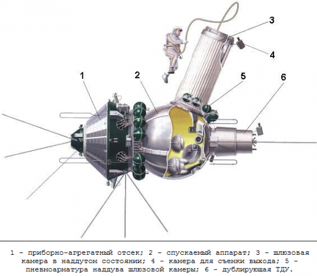

Program Woschod
===============

Program Woschod był kontynuatorem programu Wostok. Wprowadzał modyfikację do kapsuły, wzrost jej objętości, oraz zwiększenie liczby członków załogi do trzech osób. Zastosowano również powiększoną rakietę nosiciela. W latach 1964 i 1965 odbyły się dwa loty w ramach programu.

Największym dokonaniem podczas programu Woschod było pierwsze wyjście człowieka w otwarty kosmos, tzw. *EVA*. Dokonał tego rosyjski kosmonauta Aleksiej Leonow 18 marca 1965 roku. Pierwsze wyjście trwało 12 minut i niemalże zakończyło się śmiercią kosmonauty. Jego skafander ze względu na różnicę ciśnień spuchł do rozmiarów niepozwalających na powrót do śluzy. Leonov rozhermetyzował skafander i upuścił powietrze w skutek czego nabrał możliwości ponownego wejścia do kapsuły.

.. csv-table:: Lista lotów programu Woschod :cite:`Siddiqi2000`
    :name: table-woshod-flights
    :file: data/woshod-flights.csv
    :header-rows: 1

    Schemat statku Voshod. Źródło: Wikipedia
