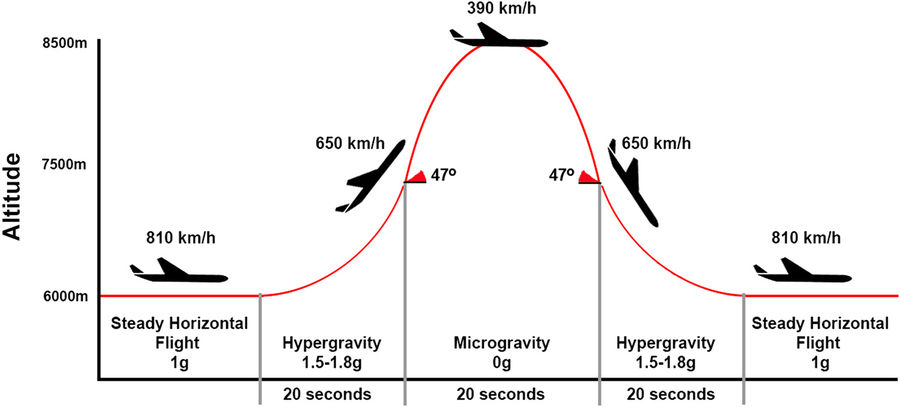

Loty paraboliczne symulujące środowisko mikrograwitacji
=======================================================
W celu zapoznania astronautów z wpływem mikrograwitacji na organizm człowieka oraz specyficznym zachowaniem podczas spadku swobodnego agencje kosmiczne zaczęły stosować samoloty w lotach parabolicznych. W zależności od parametrów paraboli można otrzymać:

- mikrograwitacja 0g,
- przyciąganie na powierzchni Księżyca (16,6% przyciągania ziemskiego),
- przyciąganie na powierzchni Marsa (40% przyciągania ziemskiego).

:numref:`table-infrastructure-parabolic` przedstawia zestawienie samolotów używanych przez agencje kosmiczne i prywatne firmy do lotów parabolicznych.

    Profil lotu parabolicznego podczas symulacji stanu braku grawitacji. Źródło: Nature

.. csv-table:: Zestawienie samolotów używanych do lotów parabolicznych
    :name: table-infrastructure-parabolic
    :file: data/infrastructure-parabolic.csv
    :header-rows: 1
