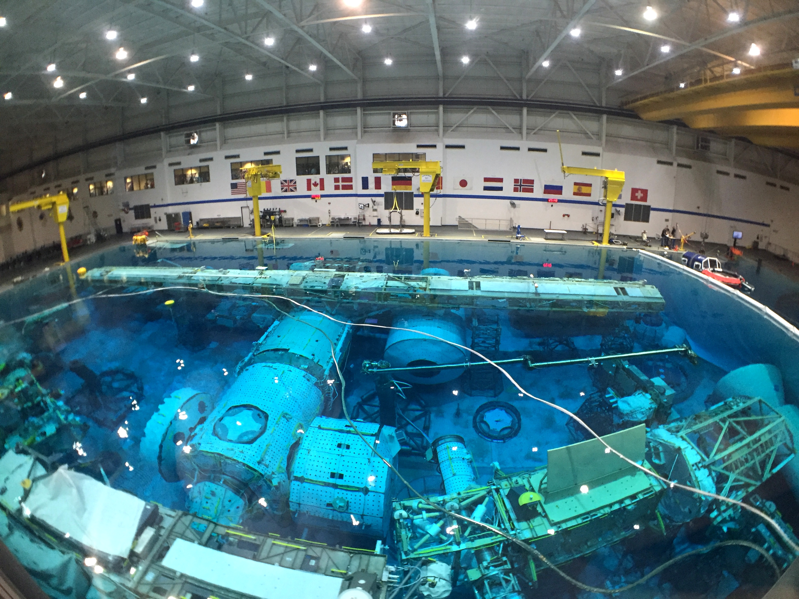

Baseny neutralnej pływalności
=============================

Od czasów przygotowania do lotu w ramach misji Gemini 12, gdy amerykański astronauta Buzz Aldrin jako pierwszy wykorzystał techniki nurkowania w celu symulacji EVA agencje kosmiczne zaczęły wykorzystywać ośrodki neutralnej pływalności (ang. *Neutral Buoyancy*) do szkolenia astronautów.

Ponadto baseny neutralnej pływalności wykorzystywane są również w szkoleniu awaryjnego opuszczania statku kosmicznego. Przykładem tego typu urządzeń jest symulator H.U.E.T. (Helicopter Underwater Egress Trainer) oraz M.E.T.S. (Modular Egress Training Simulator). W tego typu urządzenia wyposażone jest jedynie laboratorium NBL należące do NASA. Astronauci innych agencji w celu odbycia szkolenia z ratownictwa morskiego wykorzystują infrastrukturę należącą do firm prywatnych.

.. csv-table:: Lista basenów neutralnej pływalności
    :name: table-infrastructure-neutral-buoyancy-pools
    :file: data/infrastructure-neutral-buoyancy-pools.csv
    :header-rows: 1

.. figure:: img/infrastructure-neutral-buoyancy-comparision.png
    :name: figure-infrastructure-neutral-buoyancy-comparision
    :width: 80%
    :align: center

    Porównanie skali oraz kształtów basenów neutralnej pływalności. Górny rząd pokazuje rzut z góry, dolny rzut z boku Źródło: Wikipedia

NASA - Neutral Buoyancy Laboratory
----------------------------------
Największym ośrodkiem szkoleniowym neutralnej pływalności jest NBL (Neutral Buoyancy Laboratory), który znajduje się w budynku Sonny Carter Training Facility niedaleko Johnson Space Center w Houston, Texas. Jest to jednocześnie największy basen na świecie. Na jego dnie znajduje się szkielet (ang. *mock-up*) amerykańskiego segmentu Międzynarodowej Stacji Kosmicznej. Astronauci w trakcie szkolenia podstawowego oraz późniejszego szkolenia specyficznego przygotowują się do przeprowadzania najbardziej krytycznych zadań utrzymaniowych ISS, tj. serwisowanie oraz wymiana elementów na zewnątrz stacji i procedury awaryjne.

Obecnie gdy ISS jest w pełni operacyjny w basenie NBL odbywa się bardzo dużo symulacji związanych z przygotowaniem do misji. Kalendarz symulacji jest wypełniony w 100% a treningi odbywają się w trzech zmianach ośmiogodzinnych na dobę. Pozostawia to niewielki margines na opracowywanie planów oraz testów dla technologii związanych z przyszłą eksploracją Księżyca, Marsa i asteroid. Z tego powodu astronauci innych agencji szkolą się w swoich centrach w ramach "EVA pre-familiarisation", a następnie udają się do Houston w celu finalnego szkolenia i certyfikacji w wykorzystaniu skafandra EMU.

    Basen neutralnej pływalności NBL znajdujący się w Houston, TX, USA. Źródło: NASA/JSC

ESA - Neutral Buoyancy Facility
-------------------------------
Basen neutralnej pływalności (NBF) znajduje się w ośrodku EAC w Kolonii. Służy astronautom ESA do tzw. "EVA pre-familiarisation", czyli do szkolenia zapoznawczego z procedurami spacerów kosmicznych. Ze względu na stałe obłożenie basenu NBL w Stanach Zjednoczonych i brak możliwości swobodnego treningu zdecydowano się na wybudowanie ośrodka w Europie. Kurs przygotowawczy ma na celu wstępne wyszkolenie europejskich astronautów do treningów i certyfikacji, które będą odbywali w ośrodku NBL w Houston.

Najbardziej istotnymi elementami szkolenia w NBF są:

- procedury operacyjne EVA,
- zapoznanie się z protokołem bezpieczeństwa zaczepów do stacji,
- praktyka transferów między modułami,
- trening używania specjalistycznych narzędzi,
- rozwój umiejętności komunikacji z pozostałymi członkami załogi (IVA oraz EVA),
- umiejętność pracy w środowisku neutralnej pływalności,
- szkolenie scenariuszy awaryjnych,
- utrzymywanie świadomości sytuacyjnej w złożonym i zmieniającym się środowisku.

Symulowane wyjścia EVA dzielą się na tzw. jednostki treningowe. Podczas każdego zanurzenia wszystkie jednostki muszą zostać ukończone. Każde nurkowanie trwa około 5 godzin. Obecnie standardem jest 5-7 krotny trening każdej czynności certyfikowanej w NBL. Ilość zależy od stopnia skomplikowania jednostki szkoleniowej oraz poziomu umiejętności szkolonego astronauty.

Późniejszy przydział do spacerów kosmicznych podczas misji na ISS bazuje na ewaluacji umiejętności EVA, która jest robiona na wczesnym etapie szkolenia w ośrodku NBL w USA. Ci astronauci, którzy zaprezentują najwyższy poziom umiejętności zostaną skierowani na dodatkowe szkolenie. Późniejszy przydział uwarunkowany jest również ze względu na zapotrzebowanie lub/i sytuacje awaryjne.

Ponadto ośrodek wykorzystywany jest również jako miejsce testowania narzędzi i procedur opracowywanych dla przyszłych misji Księżycowych.

.. figure:: img/infrastructure-neutral-buoyancy-nbf.jpg
    :name: figure-infrastructure-neutral-buoyancy-nbf
    :width: 80%
    :align: center

    Basen neutralnej pływalności NBF znajdujący się w European Astronaut Center w Kolonii w Niemczech. Źródło: ESA/S. Corvaja

Roskosmos - Hydro Lab
---------------------
W celu certyfikacji do korzystania z rosyjskiego skafandra Orlan astronauci muszą przejść kurs w Centrum Przygotowania Kosmonautów w Gwiezdnym Miasteczku. Ośrodek ten wyposażony jest w basen Hydro Lab znajdujący się w budynku numer 30 oraz 32 :cite:`RoscosmosHydroLab`. W basenie znajduje się rzeczywistych rozmiarów szkielet rosyjskiej części ISS. Kosmonauci ćwiczą poruszanie się pomiędzy modułami jak również operowanie specyficznym mechanizmem rosyjskiej śluzy powietrznej.

.. figure:: img/infrastructure-neutral-buoyancy-hydrolab.jpg
    :name: figure-infrastructure-neutral-buoyancy-hydrolab
    :width: 80%
    :align: center

    Basen neutralnej pływalności Hydro Lab znajdujący się w Centrum Przygotowania Kosmonautów w Gwiezdnym Miasteczku w Rosji. Źródło: Roskosmos/CPK

CNSA - Neutral Buoyancy Facility
--------------------------------
Chińska Państwowa Agencja Kosmiczna otworzyła ośrodek do szkolenia taikonautów CNSA w Centrum Astronautycznym w Pekinie w Chinach. Ośrodek ten jednocześnie służy do certyfikacji z użytkowania skafandrów Feitan. Na chwilę obecną jedynie chińscy astronauci trenują w tym obiekcie. Stan ten może się zmienić, gdyż Chiny rozpoczęły wzmożoną współpracę z ESA oraz Roskosmos w ramach konceptu Moon Village i wspólnej eksploracji Księżyca.

.. figure:: img/infrastructure-neutral-buoyancy-acc.jpg
    :name: figure-infrastructure-neutral-buoyancy-acc
    :width: 80%
    :align: center

    Basen neutralnej pływalności ACC znajdujący się w Centrum Astronautycznym w Pekinie. Źródło: China Space Report

JAXA - Weightlessness Environment Test System
---------------------------------------------
Basen neutralnej pływalności agencji JAXA mieścił się Tsukuba Space Center w Ibaraki, Japonia. Od czasu silnego trzęsienia ziemi w 2011 roku ośrodek ten jest zamknięty. Japońscy astronauci trenują głównie w amerykańskim NBL.

University of Maryland - Neutral Buoyancy Research Facility
-----------------------------------------------------------
Ośrodek badawczy neutralnej pływalności (NBRF) został wybudowany w ramach grantu NASA, w którym udział wziął wydział Space Systems Laboratory uczelni Massachusetts Institute of Technology (MIT). Ze względu na brak miejsca na kampusie zdecydowano się na konstrukcję basenu na uniwersytecie stanu Maryland. W ośrodku tym nie odbywają się szkolenia astronautów. Basen jest aktywnie wykorzystywany w ramach badań nad przyszłymi misjami oraz testem innowacyjnego sprzętu do EVA.

.. figure:: img/infrastructure-neutral-buoyancy-nbrf.jpg
    :name: figure-infrastructure-neutral-buoyancy-nbrf
    :width: 80%
    :align: center

    Basen neutralnej pływalności NBRF znajdujący się na Uniwersytecie Maryland w USA. Źródło: Diamondback/Julia Reed
