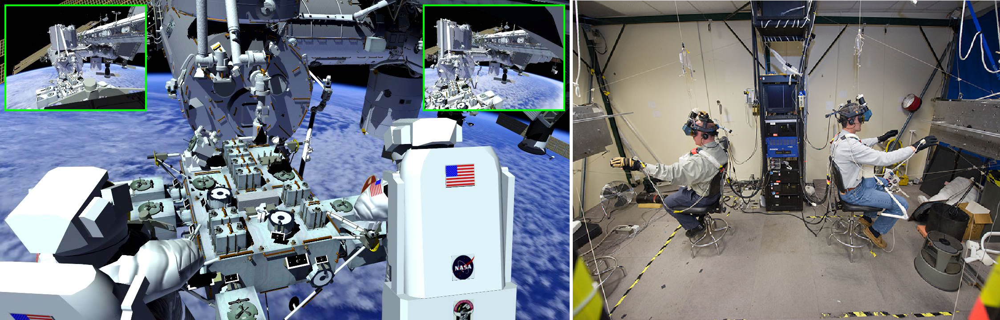

Laboratoria Wirtualnej Rzeczywistości
=====================================

Laboratoria wirtualnej (ang. *VR - Virtual Reality*) oraz rozszerzonej (ang. *AR - Augmented Reality*) pozwalają na trening skomplikowanych czynności oraz procedur bez narażania życia astronautów i konieczności posiadania kosztownej infrastruktury. Ponadto astronauci szkolą się w używaniu technologii haptycznych tj. sprzężenia zwrotnego (ang. *Force Feedback*) oraz umiejętności interakcji człowiek-maszyna (ang. *HMI - Human-Machine Interaction*). Do najważniejszych laboratoriów VR należą:

- Virtual Reality Laboratory (VRL), NASA,
- Haptics Laboratory, ESA.

Virtual Reality Laboratory (VRL), NASA
--------------------------------------
VRL wyposażony jest w symulatory i urządzenia pozwalające na odtworzenie zewnętrznej części stacji. Dzięki okularom VR astronauta ma możliwość rozglądania się w środowisku i trenowanie świadomości sytuacyjnej podczas EVA. Rękawice i system który ma na sobie podczas szkolenia pozwala na kinestetyczne odczucie (ang. *kinesthetic sensation*), czyli symulowane poczucie inercji obiektów. Rękawice mogą odtworzyć uczucie do 226,8 kg (500 lbs). W laboratorium VRL astronauci szkolą się w zakresie procedur i systemów EVA, tj.:

- obsługa systemu ratunkowego S.A.F.E.R.,
- kontrolowanie manipulatora SSRMS Canadarm2,
- rozkładu elementów zewnętrznych stacji ISS,
- umiejętności lokalizacji względem elementów stacji,
- transferu między modułami stacji.

    Astronauci trenujący EVA w laboratorium VRLab. Źródło: NASA/JSC

Haptics Lab ESA
---------------
Laboratorium Haptics Europejskiej Agencji Kosmicznej znajduje się w Centrum Inżynierii i Nauki ESTEC w Holandii. Laboratorium umożliwia testowanie systemów robotycznych oraz interfejsu HMI. W laboratorium opracowano egzoszkielet X-Arm-II (Rys. 3.11.). Ponadto astronauci ESA ćwiczą umiejętność sterowania łazikami z wykorzystaniem kontrolerów z Force Feedback.

.. figure:: img/infrastructure-vr-exoskeleton.jpg
    :name: figure-infrastructure-vr-exoskeleton

    X-Arm-II exoskeleton jest wykorzystywany do symulacji odczuć podczas sterowania maszynami. Źródło: ESA
