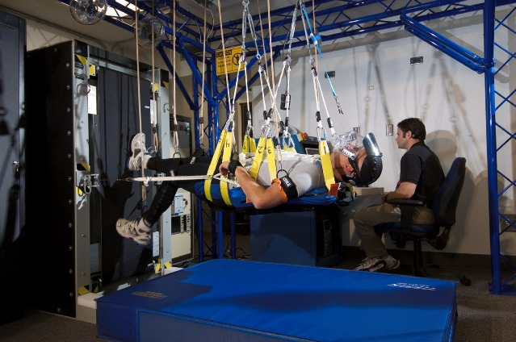

Przyrządy ćwiczeniowe
=====================

W siłowniach i laboratoriach w których ćwiczą astronauci coraz częściej zaczyna się wykorzystywać nowoczesne technologie. Wśród nowatorskich pomysłów prowadzi się badania nad wykorzystaniem technologii VR do stymulacji mózgu podczas wykonywania ćwiczenia w celu przyspieszenia rehabilitacji astronautów powracających z długotrwałych lotów. Do przyrządów ćwiczeniowych wykorzystywanych podczas szkolenia i późniejszej fizjoterapii można zaliczyć:

- koła reńskie (obroty prawo-lewo),
- żyroskop (ang. *MAT - Multi-Axial Trainer*) (obrót wokół trzech osi),
- looping (huśtawka 360° z możliwością obrotu wokół osi pionowej ćwiczącego),
- ergometr,
- pionowe bieżnie (ang. *vertical treadmill*),
- połączenie systemów VR i bieżni zmieniających pochylenie i odchylenie (ang. *Adaptability Training System*),
- system bieżni nadciśnieniowych (ALTER).

System Vertical Treadmill dzięki zmianie kąta nachylenia bieżni i odległości wysięgnika ma możliwość zmiany  obciążenia odczuwalnego do symulowania grawitacji Księżyca oraz Marsa :numref:`figure-infrastructure-gym-vertical-treadmill`.

    Astronauta podczas ćwiczenia na Vertical Treadmill. Źródło: NASA
