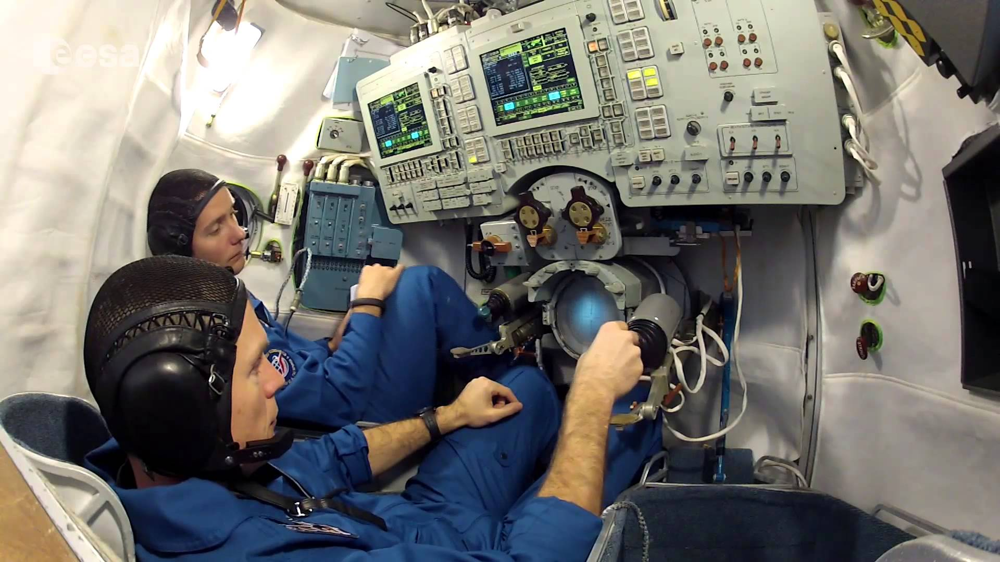

Symulatory lotu
===============

Symulatory lotu są od wielu lat wykorzystywane w lotnictwie i towarzyszyły astronautom w ich szkoleniu od początków Space Race. W najprostszym podziale symulatory lotu dzielą się na stacjonarne (Basic Instrument Training Device [BITD], Flight and Navigation Procedures Trainer [FNPT], Flight Training Device [FTD]) oraz ruchome (ang. *FFS - Full Flight Simulator*) :cite:`Kelly2017`. Symulatory FFS pozwalają na odczucie zwrotów oraz odchyleń. Do najbardziej znanych symulatorów zalicza się:

- symulator lądownika LM w programie Apollo,
- Shuttle Motion Simulator (SMS),
- symulator statku kosmicznego Soyuz.

Symulatory lotu służą nie tylko szkoleniu astronautów ale również pozwalają na opracowywanie procedur i optymalizację konstrukcji kapsuł i awioniki. Astronauci współpracują z inżynierami opracowującymi nowe techniki pilotażu, ergonomię użytkowania w locie oraz rozmieszczenie elementów interfejsu zarówno w kokpicie jak i na wielofunkcyjnym ekranie (ang. *MFD - Multi-functional Display*). Do symulatorów przyszłych statków kosmicznych można zaliczyć:

- Federacja,
- Orion,
- Boeing CST-100 Starliner,
- SpaceX Crew Dragon.

    Astronauci Oleg Novitskiy (Roskosmos) oraz Thomas Pesquet (ESA) ćwiczą procedury w symulatorze Sojuz w CPK w Gwiezdnym Miasteczku. Źródło: ESA
