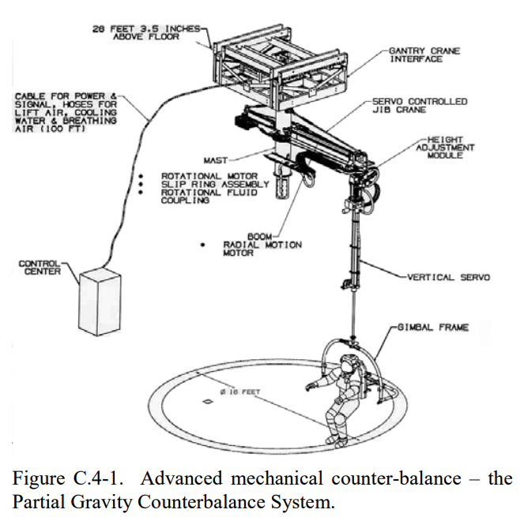

Systemy podwieszania symulujące środowisko obniżonej grawitacji
===============================================================

Do przygotowania astronautów w ograniczonym zakresie ruchu oraz przy zmieniającej się perspektywie widoku w programach szkolenia zastosowano system podwieszania. Ponadto to rozwiązanie pozwala na symulację grawitacji panującej na Księżycu, Marsie i innych ciałach niebieskich poprzez odciążenie astronauty i zastosowanie lin o odpowiedniej sprężystości.

    System podwieszania zastosowany do treningu astronautów w Centrum Przygotowania Kosmonautów w Gwiezdnym Miasteczku w Rosji. Źródło: NASA/JSC

.. todo:: Rys. 3.15. System podwieszania "Partial Gravity Counterbalance System" zastosowany do treningu astronautów w Centrum Przygotowania Kosmonautów w Gwiezdnym Miasteczku w Rosji. Źródło: NASA/JSC
