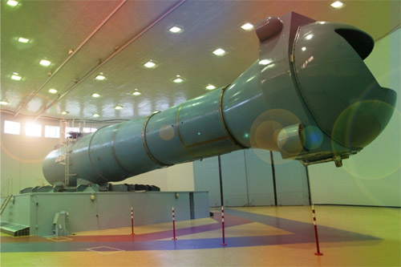

Wirówki przeciążeniowe
======================

Wirówki przeciążeniowe są urządzeniami zdolnymi zwiększyć siłę odśrodkową i odczuwalne przyspieszenie grawitacyjne (ang. *g-load*). Dzięki odpowiedniej konstrukcji i zwiększaniu prędkości obrotowej można dostosować prędkość obrotową i symulowane przeciążenie. Dzięki wirówkom możliwe jest testowanie oraz trenowanie tolerancji organizmu na przeciążenia. W zależności od kierunku działania wektora przyspieszenia, czasu trwania i jego intensywności pojawiają się efekty:

- utraty kolorów wizji (ang. *grey-out*),
- widzenie tunelowe (ang. *tunnel vision*),
- utraty widzenia (ang. *blackout*),
- utraty świadomości (ang. *G-LOC - Gravity Induced Loss of Consciousness*),
- czerwone widzenia (ang. *redout*) - działanie przyspieszenia ze zwrotem ujemnym (ang. *negative g*).

Na zwiększenie czynnika przyspieszenia grawitacyjnego mają wpływ gwałtowne manewrowanie pojazdem, start rakiety, wejście w atmosferę, awaryjna trajektoria lotu w atmosferze tzw. krzywa balistyczna oraz lądowanie. Skuteczność treningu w wirówce przeciążeniowej pozwala astronautom na tolerowanie przyspieszeń o 1.5-2g większych niż niewytrenowanej osoby. Należy nadmienić, że trening wymaga odnawiania, gdyż tolerancja ulega "zapomnieniu" przez organizm.

Dla poprawy tolerancji stosuje się również uciskowe spodnie przeciążeniowe. Nacisk na naczynia powoduje spowolnienie odpływu krwi z nóg i mniejszą ilość krwi uderzającej do mózgu. Nacisk uzyskuje się statycznie (silne związanie) lub dynamicznie przez nadmuchiwanie wszytych komór z powietrzem wraz ze wzrostem przeciążenia. Astronauci zakładają taki ubiór pod skafander Sokol przygotowując się do powrotu na Ziemię :cite:`Peake2017`. Ponadto tolerancję można zwiększyć stosując manewr AGSM (ang. *Anti-G Straining Maneuver*). Odpowiedni trening oddychania pozwala na zwiększenie tolerancji przeciążeń i dłuższe utrzymanie świadomości w przypadku ich wystąpienia.

Do najważniejszych wirówek przeciążeniowych wykorzystywanych w załogowych lotach kosmicznych można zaliczyć:

- CF-7, Roskosmos,
- CF-18, Roskosmos,
- 20-G Centrifuge, NASA,
- Human Performance Centrifuge, NASA,
- Short Radius Centrifuge, NASA.

.. csv-table:: Lista wirówek przeciążeniowych używanych do przygotowania astronautów w załogowych lotach
    :name: table-infrastructure-centrifuge-human
    :file: data/infrastructure-centrifuge-human.csv
    :header-rows: 1
    :widths: 10, 20, 20, 5, 5, 5, 5, 30

CPK - CF-7
----------
Wirówka przeciążeniowa CF-7 została uruchomiona w 1973 roku. Wybrane parametry techniczne przedstawia :numref:`table-infrastructure-centrifuge-human`. Zakres badań prowadzonych w urządzeniu :cite:`CPKCentrifuge`:

- test tolerancji przyspieszenia podczas szkolenia i selekcji pilotów i kosmonautów,
- badanie wpływu ekstremalnych warunków lotów kosmicznych na organizm człowieka,
- badanie nad metodami poprawy tolerancji przeciążeń i obniżenie negatywnych efektów,
- umiejętność przewidywania wpływu wysokich przeciążeń na organizm człowieka,
- stworzenie symulatora przyszłych pojazdów kosmicznych i samolotów,
- testowanie lotniczych i kosmicznych modeli.

.. figure:: img/infrastructure-centrifuge-cf-7.jpg
    :name: figure-infrastructure-centrifuge-cf-7
    :scale: 75%
    :align: center

    Wirówka przeciążeniowa CF-7 znajdująca się w Centrum Przygotowania Kosmonautów w Gwiezdnym Miasteczku w Rosji. Źródło: Roskosmos/CPK

CPK - CF-18
-----------
W 1980 roku w Centrum Przygotowania Kosmonautów otworzono drugą wirówkę przeciążeniową, która umożliwia wymianę wnętrza kabiny, oraz parametrów wewnątrz kabiny tj.: temperatura, skład powietrza, wilgotność i ciśnienie. Wirówka CF-18 ma większy gradient przyspieszenia oraz maksymalną prędkość obrotową dającą symulowane przeciążenie rzędu 30g :cite:`CPKCentrifuge`. Wybrane parametry techniczne przedstawia :numref:`table-infrastructure-centrifuge-human`.

    Wirówka przeciążeniowa CF-18 znajdująca się w Centrum Przygotowania Kosmonautów w Gwiezdnym Miasteczku w Rosji. Źródło: Roskosmos/CPK

NASA - Ames Research Center 20-G Centrifuge
-------------------------------------------
Amerykańska wirówka przeciążeniowa 20-G Centrifuge znajduje się w ośrodku Ames Research Center, Moffett Field, CA w USA przedstawiona jest na :numref:`figure-infrastructure-centrifuge-20g`. Urządzenie służy do szkolenia personelu latającego Air Force, US Navy oraz dla astronautów NASA :cite:`NASACentrifuge`. Wybrane parametry techniczne przedstawia :numref:`table-infrastructure-centrifuge-human`. Niezależnie przed lotem statkiem Sojuz astronauci NASA i ESA przechodzą szkolenie w Rosyjskich wirówkach CF-7 i CF-18.

.. figure:: img/infrastructure-centrifuge-20g.jpg
    :name: figure-infrastructure-centrifuge-20g
    :scale: 25%
    :align: center

    Wirówka przeciążeniowa 20g znajdująca się w Ames Research Center, Moffett Field, CA w USA. Źródło: NASA/Ames

Wirówki przeciążeniowe do badań naukowych na ludziach
-----------------------------------------------------
Istnieje wiele obiektów przeznaczonych do badań nad wpływem wysokich przeciążeń na organizm człowieka. Część z nich nie jest bezpośrednio wykorzystywana w procesie szkolenia astronautów, ale może uczestniczyć w eksperymentach przeprowadzanych na ich organizmie. Do najważniejszych ośrodków można zaliczyć:

- Short Radius Centrifuge, University of Texas Medical Branch, Galveston, TX, USA,
- Short Arm Human Centrifuge, DLR, Niemcy,
- Dynamic Flight Simulator, Flight Physiological Center, Szwecja,
- Wirówka przeciążeniowa - symulator szkoleniowy, WIML, Polska.

Polska posiada jedną z najnowocześniejszych wirówek przeciążeniowych certyfikowanych do badań z udziałem ludzi oraz do prowadzenia treningów przeciążeniowych. Wirówka ta znajduje się w ośrodku Wojskowego Instytutu Medycyny Lotniczej w Warszawie. Infrastruktura ta jest unikalna w skali światowej, gdyż jako jedna z trzech potrafi symulować przeciążenia w osi Gx+ oraz Gx-.

Wirówki przeciążeniowe do badań naukowych
-----------------------------------------
Do badań naukowych wykorzystujących zwiększone przyspieszenie grawitacyjne i siłę odśrodkową, lecz nie certyfikowanych do wykorzystania przy badaniach na ludziach można zaliczyć wybrane wirówki przeciążeniowe:

- Large Diameter Centrifuge, ESA ESTEC, Noordwijk, Holandia,
- 8-Foot Diameter Centrifuge, NASA Ames Research Center, CA, USA,
- 2-Meter Diameter Centrifuge, NASA Ames Research Center, CA, USA,
- 24-Foot Diameter Centrifuge, NASA Ames Research Center, CA, USA.
