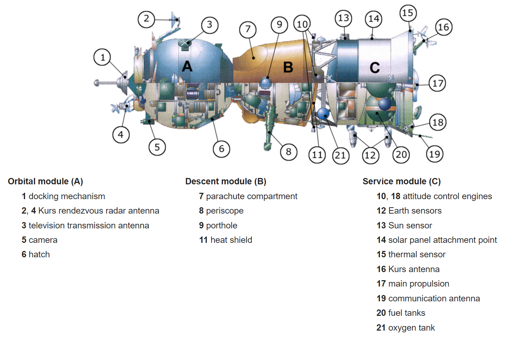

******************************************************************
Trening pilotażu statków kosmicznych i samolotów wysokomanewrowych
******************************************************************

Za czasów programu Apollo astronauci byli szkoleni również z pilotażu śmigłowców oraz trenażera lądowania księżycowego (ang. *LLRV - Lunar Landing Research Vehicle*) tj. pojazdu pionowego startu i lądowania wyglądem przypominającego pająka z silnikiem odrzutowym umiejscowionym w spodniej części. Zarówno szkolenie śmigłowcowe jak i LLRV przygotowywały astronautów do umiejętności startu, zawisu i lądowania.

Ponadto astronauci biorą również udział w badaniach naukowych oraz opracowaniu technologii dla przyszłych misji. Przykładem tego ostatniego może być kanadyjski astronauta Jeremy Hansen, który będąc z zawodu pilotem samolotu CF-18 przeszedł kolejne intensywne szkolenie lotnicze w Flight Research Laboratory, NRC, Kanada. Gdzie nauczył się pilotować zmodyfikowaną wersję śmigłowca Bell 205 przekształconą w symulator lądownika Księżycowego. Rozwój tego rozwiązania pozwoli na wykorzystanie maszyny w szkoleniu przyszłych astronautów, których zadaniem będzie powrót na Księżyc czy lądowanie na Marsie :cite:`CSAAstronautsFAQ`.

Szkolenie pilotażowe jest jednym z najtrudniejszych elementów szkolenia astronautycznego, ze względu na konieczność podejmowania decyzji stanowiących o życiu lub śmierci w reżimie wysokiego ryzyka i stresu. Dotychczas większość z astronautów była wybierana z korpusu testowych pilotów wojskowych, gdyż ich domeną był badawczo-naukowy charakter pracy co również przyczyniało się do skuteczniejszego wykorzystania ich umiejętności :cite:`Glover2016`.

Obecnie poziom bezpieczeństwa lotów osiągnął poziom pozwalający na większe zaangażowanie pracowników naukowych i inżynieryjnych. Jednakże aby zaznajomić ich z wymagającym charakterem zadań i działaniem pod presją wciąż wykorzystuje się szkolenie pilotażowe aby to osiągnąć.

Trening pilotażu samolotów
==========================
Szkolenie pilotażowe astronautów zwykle przebiega podobnie jak szkolenie pilota z wyłączeniem zadań specjalnych tj. użycie broni. W zależności od agencji kosmicznej astronauci mają różny stopień przeszkolenia. Amerykańscy astronauci szkoleni są w bazie Ellington Air Force Base (Ellington AFB) na samolotach szkolno-treningowych T-38. Uprzednio uzyskują również trening przygotowujący do lotów kosmicznych (ang. *Space Flight Readiness Training*) na samolocie WB-57 w Beale AFB, North Carolina. Jednym z elementów szkolenia jest tzw. latanie w formacji (ang. *formation flying*). Ta umiejętność ćwiczy precyzję i pracę zespołową. Zadanie polega na pilotowaniu statku powietrznego, który poruszając się 900 km/h zbliża się do drugiego na odległość 2-3 metrów i utrzymując odległość razem z nim wykonuje figury akrobatyczne. Szkolenie pilotażowe w powietrzu wymaga od pilota umiejętności, które są w inny sposób nieosiągalne. Manewry typu "Wyciskanie G" (ang. *Pulling G's*) w różnych pozycjach szczególnie w locie odwróconym wymagaj fizycznej wytrzymałości organizmu w szczególności mięśni i serca oraz wysokiej adaptacji fizjologicznej. Szkolenie na samolotach T-38 jest ostatnim etapem szkolenia kandydatów na astronautów NASA.

Szkolenie pilotażowe kosmonautów rosyjskich i wcześniej radzieckich podobnie jak u amerykanów również odbywają się na samolotach odrzutowych. Program szkolenia i zakres ćwiczeń jest analogiczny do NASA.

Europejscy astronauci uzyskują licencję pilota prywatnego PPL(A) na lotnisku w Kolonii w Niemczech. Podczas ćwiczeń wykonują zadania zgodnie z programem szkolenia pilotów cywilnych.

W ramach ćwiczeń trenowane są :cite:`Parazynski2017`, :cite:`Massimino2016`:

- loty akrobacyjne na wysokomanewrowych samolotach,
- latanie w formacji,
- zapoznanie się w wysokimi wartościami przeciążenia (ang. *g-load*),
- szybkie podejmowanie decyzji, gdy konsekwencje mogą stanowić o życiu,
- loty wysokościowe,
- monitorowanie paliwa i parametrów samolotu,
- monitorowanie stanu atmosfery,
- lądowania awaryjne,
- treningi katapultowania,
- symulacja problemów spadochronu hamującego (ang. *PLF - Parachute Landing Failure*),
- przeżycie po katapultowaniu w środowisku nieprzygodnym.

Trening pilotażu innych statków powietrznych
============================================
Za czasów programu Apollo astronauci byli szkoleni również z pilotażu śmigłowców oraz trenażera lądowania księżycowego (ang. *LLRV - Lunar Landing Research Vehicle*) tj. pojazdu pionowego startu i lądowania wyglądem przypominającego pająka z silnikiem odrzutowym umiejscowionym w spodniej części. Zarówno szkolenie śmigłowcowe jak i LLRV przygotowywały astronautów do umiejętności startu, zawisu i lądowania.

Ponadto astronauci biorą również udział w badaniach naukowych oraz opracowaniu technologii dla przyszłych misji. Przykładem tego ostatniego może być kanadyjski astronauta Jeremy Hansen, który będąc z zawodu pilotem samolotu CF-18 przeszedł kolejne intensywne szkolenie lotnicze w Flight Research Laboratory, NRC, Kanada. Gdzie nauczył się pilotować zmodyfikowaną wersję śmigłowca Bell 205 przekształconą w symulator lądownika Księżycowego. Rozwój tego rozwiązania pozwoli na wykorzystanie maszyny w szkoleniu przyszłych astronautów, których zadaniem będzie powrót na Księżyc czy lądowanie na Marsie :cite:`CSAAstronautsFAQ`.

Pilotaż oraz wykorzystanie systemów statku kosmicznego Sojuz
============================================================
Na chwilę obecną jednym z najważniejszych aspektów szkolenia astronautów przed lotem kosmicznym jest szkolenie z wykorzystywania systemów rosyjskiego statku kosmicznego Sojuz. Operacje wykonywane przez ten statek są w pełni zautomatyzowane, ale w sytuacjach awaryjnych istnieje możliwość przejścia na tzw. ręczny tryb i samodzielne przejęcie kontroli nad kapsułą. Z tego też powodu zarówno astronautów jak i kosmonautów poddaje się szkoleniu, które trwa około 790 godzin i obejmuje aspekty :cite:`Hadfield2013`:

Sytuacje normalne:

- przygotowanie do startu,
- start,
- zwiększanie orbity,
- podejście do ISS,
- manewr dokowania,
- manewr odejścia od ISS,
- obniżanie orbity,
- wejście w atmosferę,
- lądowanie.

Sytuacje awaryjne:

- rozszczelnienie,
- pożar,
- przerwanie startu,
- problemy na orbicie,
- przejście na manualne sterowanie,
- niedziałające systemy (elektryczny, podtrzymanie życia, nawigacja, sterowanie),
- kolizja,
- wejście wykorzystując profil balistyczny,
- problemy przy lądowaniu.

    Schemat statku Sojuz. Źródło: Roskosmos

Statek Sojuz wyposażony jest w system *KURS*, który pozwala na automatyczne naprowadzanie oraz dokowanie kapsuły do Międzynarodowej Stacji Kosmicznej. System ten był opracowany dla kapsuł dokujących do stacji Salut :cite:`Siddiqi2000` oraz dla stacji MIR. Obecnie system jest wypierany przez nowszy i dokładniejszy system, którego podzespoły w kapsule są znacznie lżejsze.

Ze względu na przesunięty środek ciężkości kapsuły Sojuz istnieje możliwość za pomocą niewielkich silniczków sterowania miejscem położenia tego punktu. Dzięki temu astronauci uzyskują możliwość sterowania kapsułą a zasięg korekty profilu lądowania może wynieść nawet do kilkunastu kilometrów.

Kapsuła Sojuz używa tzw. "systemu miękkiego lądowania". System ten składa się z niewielkich silniczków rakietowych z wektorem ciągu przeciwnie skierowanym do lotu kapsuły. System ten jest aktywowany na dwa metry przed uderzeniem w ziemię pozwalając na zminimalizowanie w znacznym stopniu siły uderzenia o grunt. Jego użycie powoduje charakterystyczny płomień i dym przy uderzeniu w ziemię co mylnie kojarzone jest z sytuacją niebezpieczną. Aktywacja tego systemu oraz miękkie lądowanie zostało uwiecznione na taśmach wideo [62], [26].

Sytuacje awaryjne statku kosmicznego
====================================
Loty kosmiczne są obarczone wysokim stopniem ryzyka. Większość z godzin przeprowadzonych w symulatorze statku kosmicznego Sojuz ma za zadanie przygotować załogę na umiejętność reakcji w krytycznych sytuacjach. Do najbardziej prawdopodobnych i najgroźniejszych sytuacji należy: rozszczelnienie oraz pożar.

Rozszczelnienie
---------------
Do rozszczelnienia kapsuły może dojść na skutek kolizji z mikrometeorytem, który niszcząc poszycie pozostawia otwór, z którego uchodzi powietrze. W zależności od wielkości uszkodzenia są różne procedury. Jedną z najważniejszych rzeczy należących do załogi jest uszczelnienie skafandra IVA Orlan oraz odkręcenie dopływu powietrza. Do czasu misji Sojuz-11 podczas, której przy wejściu w atmosferę doszło do rozszczelnienia kapsuły i ujścia powietrza co skutkowało śmiercią załogi, kosmonauci nosili strojów wewnątrz kapsuły :cite:`Wade2017a`. Od czasu tego incydentu zarówno podczas startu, dokowania, odejścia, i wejścia w atmosferę astronauci muszą znajdować się w stroju IVA :cite:`Wade2017b`.

Podobny incydent zdarzył się podczas lotu Apollo-Sojuz gdy do amerykańskiej kapsuły Apollo podczas wejścia w atmosferę zaczął wdzierać się toksyczny gaz tetratlenek diazotu |N2O4| (ang. *dinitrogen tetroxide*) :cite:`Kranz2001`, :cite:`Slayton1994`. Szybka i właściwa reakcja astronautów zapobiegła utracie załogi.

.. |N2O4| replace:: N\ :sub:`2`\ O\ :sub:`4`

Pożar na pokładzie statku kosmicznego
-------------------------------------
Podczas treningu w statku kosmicznym Sojuz gdy astronauta zauważy dym lub ogień powinien natychmiast zamknąć szybę w skafandrze by uniknąć inhalacji potencjalnie szkodliwym dla zdrowia dymem :cite:`Mogensen2015`. Po wykonaniu tej czynności przystępuje do gaszenia ognia. Ze względu na brak gaśnic oraz urządzeń do walki z ogniem na pokładzie statku kosmicznego astronauci mają następujące możliwości powstrzymania rozprzestrzeniania się ognia:

- wyłączenie wentylatorów i urządzeń cyrkulacji powietrza,
- wyłączenie wszystkich elektrycznych urządzeń łącznie z komputerem pokładowym,
- rozszczelnienie statku powietrznego.

W środowisku mikrograwitacji nie występuje wymuszona konwekcja ciepła i ruchu powietrza. Wyłączenie wentylatorów i urządzeń cyrkulacji ma na celu zdławienie ognia poprzez wykorzystanie powietrza w procesie spalania w pobliżu miejsca, w którym doszło do zapłonu.

Wyłączenie urządzeń elektrycznych ma na celu wyeliminowanie źródeł powstania ognia. W przerwy w zasilaniu ogień powinien sam zgasnąć. Po odczekaniu określonego czasu następuje ponowne włączenie urządzeń pokładowych.

Najbardziej drastycznym sposobem na wyeliminowanie pożaru jest rozszczelnienie statku kosmicznego (ang. *depressurization*). Wraz z pozbawieniem atmosfery tlenu ogień zgaśnie. Jest to najbardziej niebezpieczny sposób gaszenia i to rozwiązanie pozostaje do użycia tylko w ostateczności. Przed procesem rozszczelnienia kapsuły astronauci muszą sprawdzić szczelność swoich skafandrów aby upewnić się czy sami nie będą narażeni na niebezpieczeństwo wystawienia na działanie próżni. Przy wykorzystaniu tego sposobu misja jest przerywana i kapsuła musi skierować się do awaryjnego wejścia w atmosferę w ciągu 125 minut. Czas ten odpowiada 1.5 okrążeniu Ziemi i powinien być wystarczający aby powrócić do jednego z wyznaczonych uprzednio miejsc awaryjnego lądowania. Podczas tego czasu temperatura ciała astronautów powoli zacznie wzrastać ze względu na tempo pompowania powietrza do skafandra - 22 litry na minutę. Tempo to jest wystarczające aby pozwolić astronautom bezpiecznie oddychać, ale nie pozwala na chłodzenie ciała. Z tego względu czas 125 minut jest krytyczny aby zapobiec śmierci astronautów ze względu na przegrzanie organizmu.

System przerwania startu (Launch Escape System)
-----------------------------------------------
Wszystkie załogowe statki kosmiczne są wyposażone w system ewakuacji podczas startu (ang. Launch Escape System). Systemy te pozwalają na ucieczkę załogi gdy rakieta zachowuje się nieprawidłowo, lub gdy na płycie startowej doszło do eksplozji. Zasada działania systemu zwykle być bardzo prosta i polega na trzech przewodach elektrycznych. Jeżeli napięcie zaniknie na dwóch z nich - przewód jest przerwany - automatycznie aktywują się silniki rakietowe odciągające kapsułę z załogą z dala od wybuchającej rakiety. W system ten były wyposażone już rakiety z programu Mercury-Redstone i późniejsze.

Na specjalną uwagę zasługuje fakt, iż w programie Gemini zdecydowano się na zmianę systemu awaryjnego opuszczania pojazdu przy starcie i zastąpiono go wyrzucanymi fotelami katapultowymi. W podobny system był wyposażony statek Wostok, którym Gagarin jako pierwszy okrążył Ziemię. W późniejszych lotach radzieckich Woschod ze względu na brak miejsca w kabinie zrezygnowano z systemu awaryjnego.

System ewakuacji załogi podczas startu może być aktywowany :cite:`AstronautTrainingJournals2005`:

- automatycznie (przerwanie minimum dwóch z trzech obwodów),
- ręcznie przez kontrolerów lotu na polecenie kierownika lotu (ang. Flight Director),
- ręcznie przez dowódcę załogi.

Astronauci są szkoleni z wykorzystywania systemu lecz nie zdarzył się przypadek gdy system ten zadziałał z tego powodu. Podczas misji Apollo 12 po starcie rakiety piorun trafił w strukturę pojazdu i dowódca Charles "Pete" Conrad był bliski aktywowania systemu. Piorun trafił w rakietę dwukrotnie, ale w żadnym z tych wydarzeń system nie został aktywowany i misja przebiegła bez incydentów :cite:`Kranz2001`.

System ten został użyty podczas misji Sojuz T-10-1 (26 września 1983) i pozwolił załodze na bezpieczne oddalenie się od rakiety, która wybuchła na platformie startowej. Astronauci podczas tego wydarzenia byli poddani przeciążeniu chwilowemu równemu 14G do 17G (137 do 167 :math:`m \over s^2`).

Z systemem ewakuacji podczas startu związany jest również wypadek, w którym zginęli inżynierowie pracujący na platformie w kosmodromie Bajkonur w Kazachstanie. System będąc uzbrojonym błędnie zinterpretował dane na temat awarii i uruchomił silniki odrzutowe. Od tego momentu system uzbraja się bezpośrednio przed startem po opuszczeniu przez wszystkich platformy startowej i okolic rakiety Sojuz 7K-OK No.1 :cite:`Kamanin1999`.

Podczas pierwszych testowych lotów prom był wyposażony w fotele katapultowe dla pierwszego i drugiego pilota. Z systemu tego zrezygnowano w późniejszych lotach ze względu na niewielkie prawdopodobieństwo przeżycia załogi. W zamian za to zastosowano system tzw. Mode VIII - Bail-out, w którym wyposażeni w spadochrony astronauci mieli zsunąć się z wyciągniętej z promu grubej rury chroniącej przed uderzeniem w usterzenie i skrzydła a następnie na spadochronach wylądować w oceanie i rozpocząć procedurę wodnego przetrwania (opis w :numref:`Przetrwanie w warunkach wodnych` dotyczącym przetrwania w warunkach morskich i oceanicznych) :cite:`Coldiron2005`.

.. todo:: Opisać przypadek Soyuz MS-10
