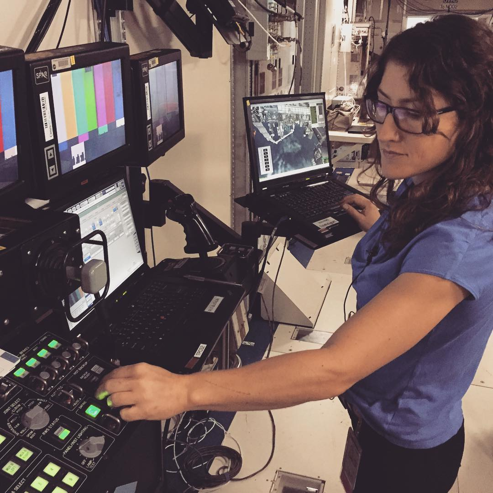

****************************************************
Robotyka i systemy Międzynarodowej Stacji Kosmicznej
****************************************************

Istotną częścią podstawowego szkolenia astronautów jest trening wykorzystania podstawowych urządzeń robotyki kosmicznej oraz systemów ISS. Jednakże należy zwrócić uwagę na fakt, iż planowo w 2024 Międzynarodowa Stacja Kosmiczna zostanie zdeorbitowana a wykształcenie Polskiego astronauty do tego czasu jest mało prawdopodobne. Nawet jeżeli zaistniałaby możliwość, że program ISS zostanie przedłużony, to i tak wszystkie przydziały do lotów załogowych zostaną zaplanowane z dużym wyprzedzeniem. Zważywszy na powyższy stan w ramach programu polskiego astronauty proponuje się odrzucenie wszelkich tematów związanych z obsługą systemów ISS.

Z tego powodu w niniejszym rozdziale zostaną opisane jedynie technologie i systemy, które mogłyby być wykorzystane w przyszłych planowanych misjach i programach. Lista jest tworzona na podstawie obecnie istniejącego programu szkolenia astronautów wybranych agencji kosmicznych.

Systemy kontroli środowiskowej i podtrzymania życia
===================================================
Najistotniejszym elementem zarówno stacji kosmicznej jak i habitatu jest system kontroli środowiskowej i podtrzymania życia (ang. *ECLSS - Environmental Control and Life Support System*). W ramach elementów sterowanych przez system można wymienić:

- kontrola temperatury,
- kontrola wilgotności powietrza,
- kontrola parametrów i składu atmosfery,
- monitoring poziomu CO2,
- monitoring parametrów atmosfery z uwzględnieniem przesunięć czasowych,
- wizualizacja parametrów stanu habitatu,
- monitoring zużycia wody (szara, żółta, zielona, niebieska),
- zastosowanie algorytmów uczenia maszynowego w optymalizacji zużycia wody,
- zarządzanie odpadami ciekłymi,
- zarządzanie odpadami stałymi,
- kontrola oświetlenia.

System ECLSS jest podstawowym systemem każdego statku kosmicznego i stacji.

.. figure:: img/spacestation-iss-eclss.png
    :name: spacestation-iss-eclss
    :scale: 50%
    :align: center

    System Systemy kontroli środowiskowej i podtrzymania życia na ISS. Źródło: Wikipedia

Polski wkład w szkolenie tego typu może mieć infrastruktura habitatu Lunares. Organizacja zarządzająca ośrodkiem prowadzi obecnie badania w celu stworzenia szczelnego ciśnieniowo budynku wraz z systemami wymienionymi powyżej. Rozwój kompetencji oraz urządzeń pozwoliłby na prowadzenie badań jak również na istotny wkład w uczestnictwo w przygotowaniu do przyszłych misji Księżycowych i Marsjańskich.

Systemy operacyjne i oprogramowanie wykorzystywane w kosmosie
=============================================================
Międzynarodowa Stacja Kosmiczna jest złożoną konstrukcją pobierającą 84-120 kW energii dostarczanej przez panele słoneczne o powierzchni 2,500 metrów kwadratowych i rozpiętości 65 metrów. W strukturze ISS znajduje się 12.9 km kabli elektrycznych podłączonych do 52 komputerów sterujących stacją. Oprogramowanie zarządzające tą skalą ma 3.3 mln linii kodu (część naziemna) oraz 1.8 mln linii kodu część kontrolująca stację (ang. *flight software*). W ramach szkolenia astronauci poznają system operacyjny Międzynarodowej Stacji Kosmicznej wraz z jego użytkowymi detalami :cite:`ISSTechnicalDetails`, :cite:`Parazynski2017`.

System czasu
------------
Na Międzynarodowej Stacji Kosmicznej wykorzystywana jest strefa czasowa UTC, która jest kompromisem dla Centrów Kontroli Misji zarówno w Houston jak i w Moskwie.

W misjach Księżycowych opóźnienie w komunikacji sygnału elektromagnetycznego może sięgać od 1,19 do 1,35 sekundy (średnio 1,25 sek.). Wartość ta nie wpływa znacząco na obecnie wykorzystywane systemy. Problem stanowi komunikacja z obiektami np. lecącymi na większe odległości. W rozważaniach lotów w kierunku Marsa należy uwzględnić opóźnienia rzędu od 4 do 24 minut (średnio 13 min. 48 sek.). Z tego względu przy wszelkiego rodzaju komunikacji, tj. transfer danych naukowych, danych medyczny i parametrów biometrycznych, danych EVA czy komunikacji prywatnej astronauta oraz MCC może spodziewać się komplikacji i nieporozumień co dodatkowo może powodować frustrację załogi oraz syndrom przemieszczenia (ang. *displacement*), który polega na rozładowaniu emocji (zwykle wrogości) na obiektach innych niż te, które je wzbudziły. Syndrom ten jest znany w specyfice lotów kosmicznych, gdzie astronauci zwykle obwiniają MCC.

Ze względu na zupełnie inny sposób liczenia czasu na powierzchni Marsa czy Księżyca do lotów długoterminowych i między ciałami niebieskimi konieczne jest wprowadzenie systemów o innej podstawie niż sekunda ziemska tj.: Coordinated Mars Time, Mars Sol Date, Lunar Standard Time. Ponadto omówiona powinna zostać również konwersje między czasami ziemskimi a kosmicznymi.

System planowania zadań
-----------------------
Planowanie zadań jest krytycznym elementem misji i wpływa na wydajność osób pracujących w kosmosie. Na skalę złożoności procesu wpływa fakt, iż planowanie składa się z trzech poziomów zadań: długoterminowych, krótkoterminowych oraz nieokreślonych w czasie. Jednocześnie są zadania, które mają możliwość być przeniesione na inny dostępny slot czasowy oraz zadania nie posiadające takiej możliwości. Do planowania i śledzenia postępu prac wykorzystuje się system informatyczny OnBoard Station Procedure Viewing Software (OBSPV).

Plan astronautów dla misji na Marsa ze względu na brak bezpośredniej komunikacji z MCC będzie w większości zadaniowy i nieprzypisany do sztywno określonych slotów czasowych. Wymaga to większej koordynacji i samoorganizacji pracy przez astronautów. Z drugiej strony system jest elastyczniejszy i lepiej dostosowuje się do preferencji użytkownika. Istotną kwestią pozostaje odpowiedzialność za wykonane zadania oraz śledzenie postępu wykonania.

W badaniach na ISS wzięły udział urządzenia do bezdotykowego przeglądania procedur tj. Mobile Procedure Viewer (mobiPV). Urządzenie wyglądem przypomina Google Glass i pozwala na obsługę urządzeń wykorzystywanych podczas badań z jednoczesną możliwością kontroli procedur. MobiPV obsługuje nagrywanie materiału wideo oraz audio, jego transmisję na Ziemię oraz komunikację między PI a astronautą.

System obsługi badań naukowych i zbierania danych
-------------------------------------------------
Badania naukowe są głównym powodem eksploracji kosmosu. System wspierający składowanie i obróbkę danych jest więc niezwykle istotnym elementem całości. Dane, które znajdują się w systemie można podzielić na dwie kategorie: dane zbierane automatycznie oraz dane wprowadzane przez astronautów. W tym celu konieczne jest zaprojektowanie odpowiedniego interfejsu.

Oprogramowanie sterujące badaniami naukowymi ma wpływ na monitoring, kontrolę parametrów środowiska w trakcie badania, informację na temat stanu urządzeń technicznych. Dla eksploracji powierzchni ciał niebieskich należy wzbogacić oprogramowanie o funkcje analizy danych geologicznych, astrobiologicznych oraz geofizycznych.

Ponadto jeżeli oprogramowanie ma być wykorzystywane do wsparcia załogi, konieczna jest również analiza danych psychologicznych i socjodynamicznych. Pozwoli to na reagowanie na wcześniejszym etapie na nieprawidłowości w zachowaniu i aktywności astronauty.

Wsparcie medyczne w długotrwałych lotach kosmicznych jest niezwykle istotnym elementem. W tym celu system musi pomóc w ewaluacji stanu astronauty i diagnozie wszelkich chorób. W tym celu można zastosować algorytmy uczenia maszynowego wykrywające anomalie w napływających danych biometrycznych oraz medycznych jak również systemy eksperckie pozwalające na wsparcie diagnozy.

Dane te mogą posłużyć również do planowania aktywności astronautów, dostosowania intensywności i długości ćwiczeń jak również w optymalizacji poruszania się załogi.

System śledzenia stanów magazynowych
------------------------------------
Ogromna objętość i złożoność stacji kosmicznej sprzyja możliwości gubienia przedmiotów i narzędzi. Ponadto międzynarodowy i rotacyjny charakter załóg powoduje, że konieczne stało się stworzenie systemu śledzenia inwentarza. Każdy przedmiot wykorzystywany na ISS ma unikalny identyfikator, dzięki czemu astronauta, który go używa może w szybki sposób zaznaczyć ten fakt skanując jego kod kreskowy.

Informacje na temat położenia przedmiotów, daty ważności (w przypadku lekarstw i pożywienia) są przetrzymywane w systemie. Prowadzenie elektronicznego inwentarza pozwala na monitorowanie poziomu zapasów zasobów zużywających się (ang. *consumables*).

Dobrze użyty system potrafi śledzić kaloryczność oraz wartości odżywcze pokarmów przyjmowanych przez załogę co jest konieczne przy utrzymywaniu zbalansowanej diety zawierającej minerały spowalniające niekorzystne czynniki działania w środowisku mikrograwitacji.

System ponadto pozwala na monitorowanie stanu przedmiotów, ich uszkodzeń oraz prowadzenie dziennika napraw.

Komunikacja
-----------
Podstawą komunikacji ISS z MCC jest komunikacja głosowa. Okazjonalnie astronauci uczestniczą w konferencjach wideo w szczególności w ramach wydarzeń public relations agencji. Do tego mogą prowadzić elektroniczne dzienniki osobiste, dzienniki wideo i audio.

Astronauci na ISS do konferencji prywatnych korzystają z wielokanałowej łączności wykorzystującej protokół Voice Over IP (VoIP). Urządzenie ze względu na specyfikę architektury ruchu między ISS a MCC może mieć do 2 sekund opóźnienia.

System wsparcia EVA
-------------------
Rolą systemu informatycznego wspierającego EVA jest:

- pomoc w planowaniu spacerów kosmicznych,
- monitoring pozycji astronautów w czasie rzeczywistym,
- strumieniowanie danych audiowizualnych,
- zbieranie i wysyłanie chirurgowi misji (ang. *Flight Surgeon*) parametrów biomedycznych skafandra,
- wsparcie dla sytuacji awaryjnych,
- wsparcie współpracy z systemami robotycznymi,
- planowany systemy wsparcia rozszerzonej rzeczywistości i wyświetlania procedur operacyjnych,
- zmianę celów w trakcie trwania EVA,
- odprawę i rozliczanie załóg z wykonanych zadań.

HabitatOS - Polski system operacyjny dla pozaziemskich habitatów
----------------------------------------------------------------
HabitatOS jest specjalistycznym oprogramowaniem klasy systemu operacyjnego, który łączy ze sobą wszystkie wymienione systemy. Oprogramowanie jest tematem rozprawy doktorskiej prowadzonej na LAW w Dęblinie. Ponadto system jest rozwijany i testowo wdrożony w ramach Polskiego habitatu Lunares. W trakcie trwających dwa tygodnie symulacji analogowi astronauci wykorzystują system do zarządzania badaniami medycznymi i danymi z eksperymentów, do komunikacji uwzględniającej opóźnienia czasowe oraz do kontroli parametrów habitatu za pomocą zintegrowanych czujników znajdujących się w budynku.

Systemy wsparcia robotycznego
=============================

Manipulator SSRMS Canadarm 2
----------------------------
Głównym urządzeniem użytym podczas konstrukcji stacji ISS jak również dla jej prawidłowego rozwoju był Manipulator SSRMS Canadarm 2. To ramię robotyczne o długości 15,25 m pozwala na manipulację siedmioma stawami (trzy w nadgarstku, trzy w barku i jedno w łokciu) ramienia i obrót o 360 stopni. Dzięki kontrolerowi wykorzystującemu technologię Force Feedback obsługujący go astronauta może zachować precyzję nawet podczas dokowania statku o masie 113,4 tony metrycznej. Ramię wyposażone jest w podstawowy system unikania kolizji (ang. *Basic Collision avoidance system*) oraz zaawansowany automatyczny system wizyjny (ang. *Advanced automatic vision system*).

    Astronautka NASA Christina M. Hammock podczas ćwiczeń systemów robotycznych. Źródło: NASA/JSC

Polska nie posiada tak zaawansowanego manipulatora. Jednakże w ramach uczelni politechnicznych w kraju znajdują się urządzenia mogące symulować część umiejętności ramienia robotycznego, a co za tym idzie możliwe jest stworzenie programu wprowadzającego to problematyki sterowania urządzeniami robotycznymi.

Łaziki oraz autonomiczne pojazdy
--------------------------------
Polska jest liderem na skalę światową w tematyce konstrukcji łazików księżycowych i marsjańskich oraz autonomicznych pojazdów. Świadczą o tym wysokie miejsca w klasyfikacji ogólnej odbywającego się co rok konkursu University Rover Challenge organizowanego przez Mars Society przy wsparciu NASA na amerykańskiej pustyni w stanie Utah. W Polsce jest również organizowany European Rover Challenge, który jest najbardziej prestiżowym konkursem w Europie. Podobnie jak w przypadku URC tak i podczas ERC konstrukcje z Polski są w czołówce, a nierzadko również wygrywają zawody.

Korzystając z unikalnych kompetencji możliwe jest stworzenie części szkolenia opierającego się o posiadane już zasoby w postaci łazików jak również planu szkolenia dla operatorów tych pojazdów.
