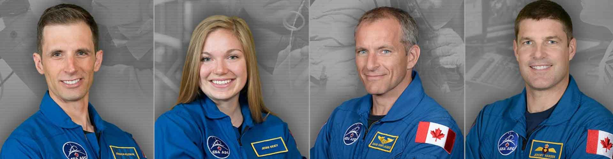

CSA - Kanadyjska Agencja Kosmiczna
----------------------------------
Jedną z najbardziej otwartych agencji kosmicznych w kwestiach selekcji astronautów jest Kanadyjska Agencja Kosmiczna. Proces selekcji kandydatów jest przejrzysty i dobrze udokumentowany na stronie agencji. Wśród zadań z którymi musieli zmierzyć się kandydaci były :cite:`CSAAstronautsFAQ` :cite:`CSAAstronautSelection`:

- walka z ogniem,
- naprawa przeciekającego kontenera zanurzającego się w lodowatej wodzie,
- ewaluacja wyjścia z tonącej kabiny śmigłowca,
- ewaluacja kondycyjna kandydatów na sali gimnastycznej,
- ewaluacja sprawnościowa na pływalni.

Na szczególną uwagę zasługuje zadanie podczas którego osoby uczestniczące w procesie były podzielone na zespoły. Jedna osoba z zespołu była w ciemnym pomieszczeniu z kompletnym brakiem widoczności i musiała złożyć z klocków Lego model samolotu. Podczas wykonywania ćwiczenia mogła się jedynie komunikować wykorzystując radio (krótkofalówkę) z towarzyszem będącym w oświetlonym pomieszczeniu. Druga osoba miała instrukcję i opis jak złożyć model.

Podczas powyższego zadania komisja brała pod uwagę działanie pod presją czasu, efektywność komunikacji, zwięzłość wypowiedzi i umiejętność przekazania niezbędnych danych oraz wizualizację problemu.

Całość procesu rekrutacji jest dobrze udokumentowana i przedstawiona na oficjalnym kanale *YouTube* Kanadyjskiej Agencji Kosmicznej :cite:`CSAAstronautSelectionVideo`.

    Aktywni kanadyjscy astronauci (od lewej): Joshua Kutryk, Jennifer Sidey, David Saint-Jacques, Jeremy Hansen. Źródło: CSA
