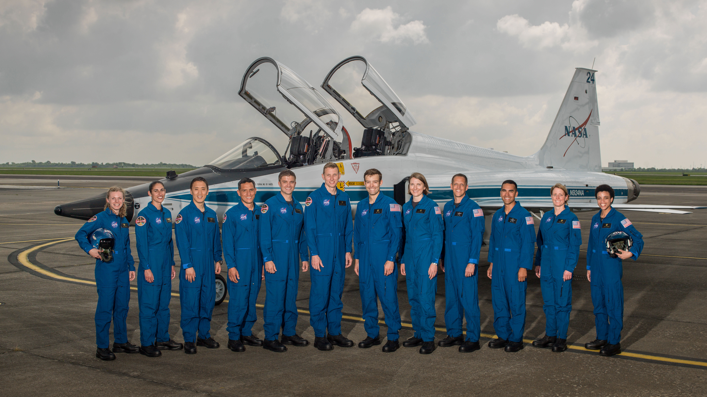

NASA - Narodowa Agencja Aeronautyki i Astronautyki (USA)
--------------------------------------------------------
Amerykańska agencja kosmiczna NASA organizuje rekrutację na kandydata na astronautę (ang. *ASCAN - Astronaut Candidate*) regularnie co dwa lata. Ostatnia tego typu rekrutacja miała miejsce na przełomie 2015/2016 roku i zakończyła się 15 lutego 2016 :cite:`NASA-Astronaut-Selection-Proces`. Dzięki zaangażowaniu mediów społecznościowych oraz innych środków masowego przekazu swoje aplikacje złożyło rekordowo dużo osób. Komisja rekrutacyjna musiała rozpatrzyć 18000 podań i wybrać 12 najlepszych kandydatów, którzy rozpoczęli przygotowanie i szkolenie podstawowe :cite:`NASA-Astronaut-Selection`.

Klasy astronautów podobnie jak zespoły przydzielone do misji tworzą tzw. insygnia klasy (ang. *class patch*). Każda z grup kandydatów ma swoją unikalną nazwę, która jest nadawana przez poprzedzającą selekcję :cite:`Anderson2015`, :cite:`Inactive-NASA-Astronauts`.

    Selekcja astronautów NASA rozpoczynających szkolenie w 2017 roku (ang. *2017 NASA Astronaut Class*): (od lewej) Zena Cardman, Jasmin Moghbeli, Jonny Kim, Frank Rubio, Matthew Dominick, Warren Hoburg, Robb Kulin, Kayla Barron, Bob Hines, Raja Chari, Loral O'Hara and Jessica Watkins. Źródło: NASA/Robert Markowitz :cite:`Whiting2018`
