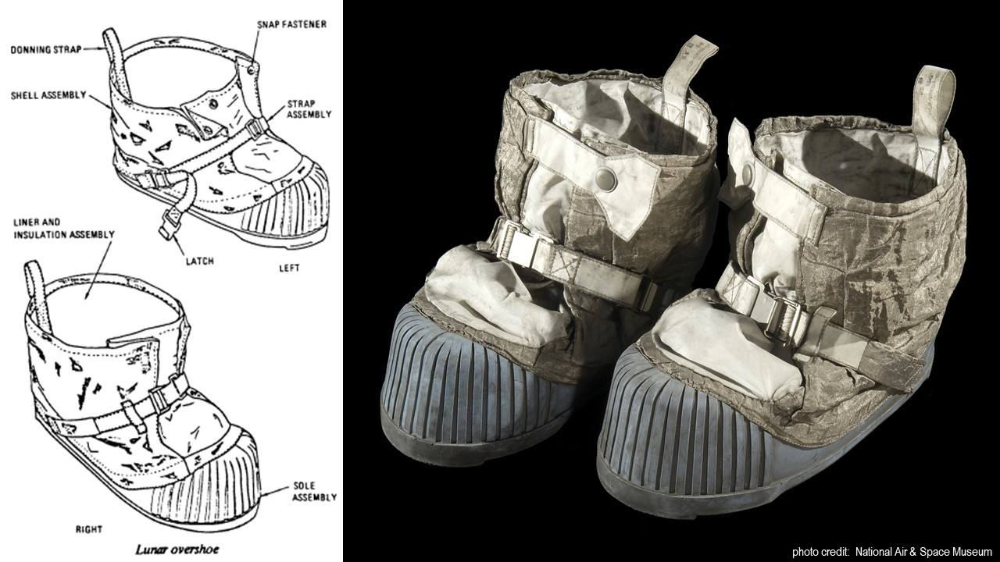
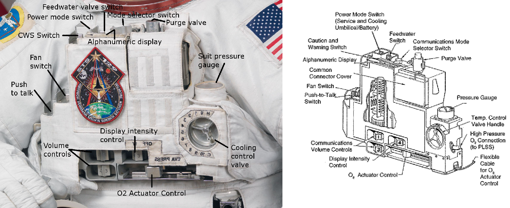
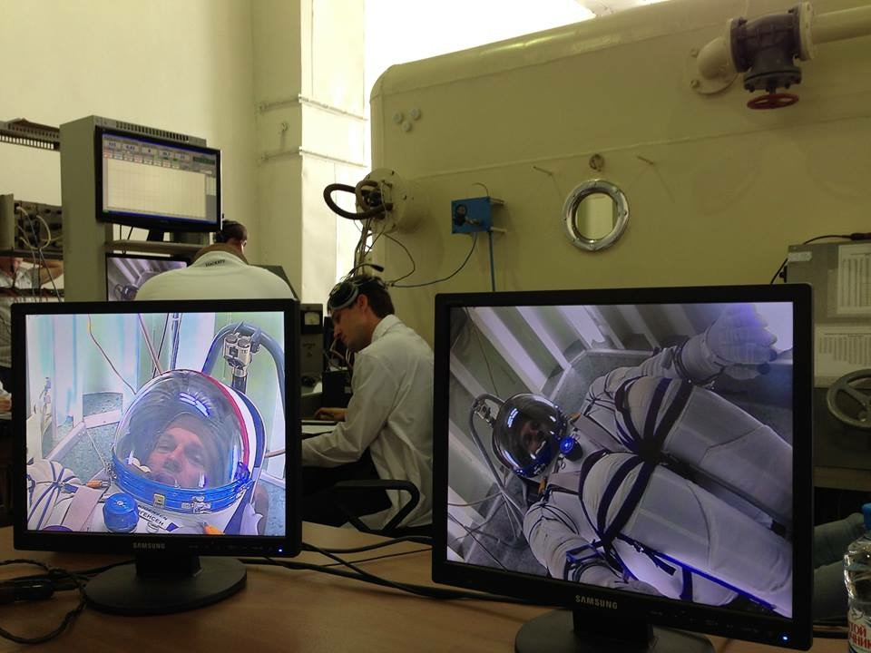
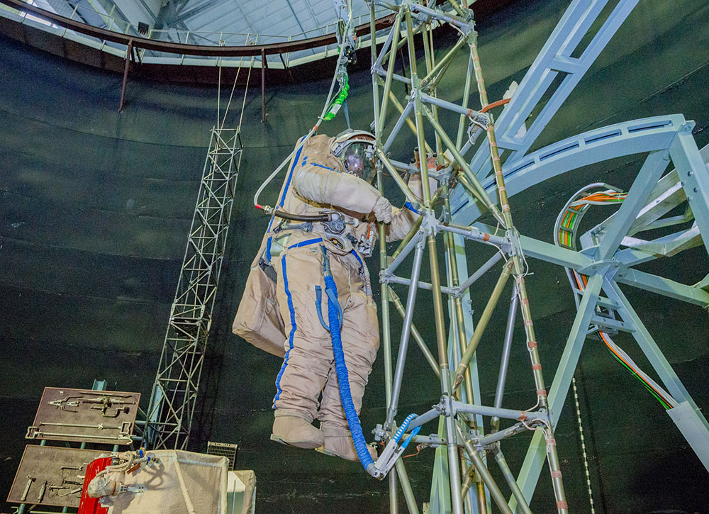

.. todo::
    - (TND-3482 Evaluation and comparison of three spacesuit assemblies) Parametry suita :cite:`Monchaux2011`
    - weight
    - Size
    - Mobility
    - Visibility
    - Temperature
    - Cones of vision
    - Mobility and exhaustion
    - Level of bruising
    - Interface (mechanical and spatial)
    - Stowable volume

.. todo::
    - Building 7, JSC, Spacesuit lab
    - Rosjanie mają jednoczęściowe stroje do których wchodzi się przez plecak
    - dla kobiet i mężczyzn skafander jest taki sam
    - Kobiety są zwykle słabsze
    - EVA jest wymagające siłowo
    - Manewrowanie suitami
    - Suity były projektowane dla wielkich gości
    - Jeżeli jesteś mała osobą, to musisz mocno nawet do 120 stopni się skręcić aby Suit się skręcił
    - Kiedyś (ostatni lot STS) był prototyp małego stroju ale już nie ma

.. todo::
    - narzędzia
    - Jaki jest wpływ interfejsów narzędzi na konstrukcje
    - Optymalizacja budowy stacji
    - Czy lepiej inaczej zaprojektować, czy mieć kilka EVA więcej
    - Stroje
    - Procedury
    - Szkolenia
    - Planowanie
    - Kontrola
    - Optymalizacja
    - Duże struktury ramię robotyczne, kable, człowiek
    - Komunikacja
    - Planning
    - Organizacja
    - Contingency EVA
    - Każdy crew member musi być przygotowany aby je przeprowadzić w dowolnym momencie
    - Szybkie EVA do awaryjnej naprawy narzędzi i urządzeń
    - Jak polecimy na Marsa to w czasie drogi też trzeba będzie coś naprawić na statku itp
    - Jak naprawić zepsuty spacesuit w kosmosie?
    - Wykorzystując tylko narzędzia na ISS
    - Stroje były zaprojektowane by były składane w laboratorium przez techników a nie w środowisku 0g
    - Przecieranie się rękawiczek
    - Może doprowadzić do rozszczelnienia
    - Stroje mają kompresor, który pompuje dużo powietrza jak zobaczy, że uchodzi
    - Muszą uważać na główki śrubek, ostre poręcze i krawędzie, niezabezpieczone końcówki stalowych linek, poprzecierane uszczelki na metalowych elementach, zatyczki zabezpieczające śruby przed odkręceniem
    - Mikrometeoryty porobiły w stacji przez 15 lat niewielkie wyłomki i ostre krawędzie
    - Metalowe poręcze przez haki, których używają do przymocowywania porobiły niewielkie metalowe odpryski, które mogą przedziurawić rękawicę
    - Mikrometeoryty
    - https://youtu.be/Z5Bz6L93Gwo

Strój wewnątrz skafandra
^^^^^^^^^^^^^^^^^^^^^^^^
.. todo::
    - Cotton Long Johns (zwykła off-the shelf bielizna bawełniana)
        - ma wsiąknąć w nią pot
        - aby ciało nie było śliskie
        - aby pot nie zbierał się i nie latał w kombinezonie
    - Liquid Cold Ventilation Garment
        - bielizna z długimi rękawami i naramiennikami poprzetykana rurkami z płynącą wodą
        - płynie w nim zimna woda
        - zmieniając prędkość płynięcia wody, można regulować temperaturę
        - rozmieszczenie rurek powoduje, że nie czujesz miejscowego chłodu, tylko rozprasza się po całym ciele
        - bielizna jest w drobną siateczkę przez którą przelatuje powietrze
    - Cotton gloves (które idą pod zwykłe rękawice) mają wsiąkać pot
    - Różne pads and shields aby chronić przed urażeniem ciała i odciskami skafandra plus guzami
    - pielucha dla dorosłych

Systemy biomedyczne skafandra
^^^^^^^^^^^^^^^^^^^^^^^^^^^^^
.. todo::
    - Astronauci podczas EVA na ISS nie korzystają z radiation decimeter bo boją się, że zostanie nagrane i następnym razem ich nie puszczą.
    - Astronauci nie zawsze chcą wszystko raportować, na wszelki wypadek, bo nie są pewni czy wszystko zrobili perfekt.
    - Promieniowanie
        - Radiation dosimeter
    - Układ krwionośny
        - ECG, 3 electrode
    - Układ oddechowy
        - Respiratory Coefficient
        - Respiratory trace
        - Oxygen Consumption
        - Oxygen Uptake
        - CO2 sensor
        - O2 sensor
        - O2 consumption (per astronaut)
        - anaerobic (na podstawie O2 i CO2)
        - metabolism
    - Biometryka
        - measuring chest
        - temperature sensor on your ear (wcześniej w rectal) [Russian Suit]
    - Systemy skafandra
        - Leak Check (every suit leaks)
        - Suit sensor
        - QRS complex
        - LCVG (Liquid Cooling and Ventilation Garment)

Hełm
^^^^
.. todo::
    - kamery na hełmie
    - oświetlenie nocne
    - cyrkulacja powietrza w masce
    - Communication Cap (Snoopy Cap)
        - wpina się do portu w skafandrze
        - pozwala na komunikację ze stacją i z ziemią
    - strój i materiały wewnątrz tłumią echo
    - hełm się nie rusza
    - Field of View jest limited
    - Situational Awareness również jest limited
    - hełm ma wbudowany Visor ze złota (gałka po prawej)
    - oraz daszek (shield) chroniący przed direct sun (gałka po lewej)
    - szyba jest zrobiona ze zwykłego polycarbonate lexan plastic

Tors
^^^^
.. todo::
    - Upper Torso i Lower Torso jest w trzech rozmiarach
        - Small
        - Medium
        - Large

Ramiona i Rękawice
^^^^^^^^^^^^^^^^^^
.. todo::
    - rękawice i obniżona zręczność
    - checklista naramienna
    - są customizable do pewnego stopnia, mają dużo różnych rozmiarów
    - trade-off pomiędzy dexterity a comfort
    - muszą lekko uwierać aby dexterity było największe
    - ważne są rękawiczki i przeguby
    - rękawice definiują to co możesz zrobić
    - każdy ma swoje rękawiczki

Nogi i Buty
^^^^^^^^^^^
Są jednym z najmniej wykorzystywanych elementów skafandrów dla wyjść w przestrzeń kosmiczną. Jednocześnie podczas EVA na innych ciałach niebieskich tj. księżyce, inne planety lub asteroidy stają się jednym z jego najważniejszych części.

    Buty astronauty stanowiące część skafandra *A7L* wykorzystywanego w programie Apollo podczas EVA na Księżycu. Źródło: NASA/JSC

Na :numref:`figure-spacesuit-a7l-boots` przedstawiono tzw. *Lunar Overshoe*, czyli część, która jest nakładana na skarpetę stanowiącą integralny element skafandra. Za wyjątkiem ożebrowanych elementów z gumy sylikonowej (ang. *ribbed silicone rubber sole*) zewnętrzna część buta była zrobiona z wzmacnianej metalem tkaniny *Chromel R* (ang. *metal-woven fabric*). Zastosowanie takiej technologi miało na celu ochronę przed przetarciem. Wewnętrzna część buta była stworzona z płótna pokrytej Teflonem warstwy włókna szklanego (ang. *Teflon-coated fiber-glass*). Zastosowanie składającego się z 25 przekładających się warstw Kaptonu oraz włókna szklanego materiału miało na celu zwiększenie wytrzymałości, zmniejszenie wagi oraz izolację termiczną. Buty były wyprodukowane przez General Electric i ILC Industries Inc.

W obecnych skafandrach *EMU* oraz *Orlan* buty nie są wzmacniane w taki sposób. Podczas spacerów kosmicznych w ramach budowy ISS astronauci nie korzystają z nóg i ta część skafandra jest mniej skomplikowana.

Plecak z systemem podtrzymywania życia
^^^^^^^^^^^^^^^^^^^^^^^^^^^^^^^^^^^^^^
.. todo::
    - Portable Life Support System

Zaczepy na narzędzia
^^^^^^^^^^^^^^^^^^^^
.. todo::
    - Mini workstation dołączany bezpośrednio do Hard Upper Torso
    - narzędzia są dobierane w zależności od zadań które trzeba wykonać przy EVA
    - narzędzia
        - ratchet wrench 3H drive, z pokrętłem z tyłu aby móc operować w małej przestrzeni, możliwość doczepienia cheater arm, aby przedłużyć uchwyt i podwoić moment torque (trzeba uważać aby nie ukręcić śruby)
        - kręcąc kluczem, klucz odpycha Ciebie więc zwykle korzysta się z niego jedną ręką a druga trzyma się stacji aby zyskać stabilność, chyba że używają foot restraint aby nie odlatywać
        - narzędzia nigdy nie mogą być bez przywiązania, są połączone ze skafandrem Equipment Tether (z karabińczykiem)
        - ze względu na różną wielkość gniazd i śrub są także przejściówki, które nakłada się na klucz, przejściówki również są podpięte do mniejszego Equipment Theater (socket catty) z zatyczką aby przy zakładaniu nie odleciały

Ciśnienie operacyjne
^^^^^^^^^^^^^^^^^^^^
.. todo::
    - 3.7 psi (Apollo),
    - 4.3 psi (EMU)
    - 5.8 psi(Orlan) of current spacesuits.
    - dlaczego obniżone ciśnienie? ze względu na wagę oraz flammability
    - nowe skafandry na księżyc oraz mars mają być 8 psi (bez pre-breathing) ten sam poziom co łazik
    - pre-breathing protocols
    - 100% pure oxygen (ze względu na masę azotu)
    - Every suit leaks
    - w strojach tylko i wyłącznie oddychają czystym tlenem
    - szczelność

Insygnia oraz naszywki
^^^^^^^^^^^^^^^^^^^^^^
.. todo::
    - That is the EVA insignia patch.  It is the symbol used by the team responsible for the suits.  It is a space age representation of Leonardo da Vinci's Vitruvian man.  The five stars represent the five NASA programs that have utilized EVA (Extravehicular Activity).

Utrzymywanie sprawności skafandra
---------------------------------
.. todo::
    - nie są przystosowane do naprawy w nieważkości
    - Suit "Surgery", fan, pump, water-gas separator failure
    - Day and a half procedure
    - Knots and bolts
    - Twizzers, vacuum cleaner with mash Net do zasysania śrubek i ręcznik z drugiej strony aby upewnić się czy śrubki nie wpadają do środka
    - Wszystkie rzeczy w rękawiczkach, wszystko nagrywane na kamerach i monitorowane z ziemi przez inżynierów, mają specjalne narzędzia do skafandrów które nie są nigdzie wykorzystywane, space suity działają w środowisku 100% oxygen

Krótka charakterystyka wybranych skafandrów kosmicznych
=======================================================

Charakterystyka skafandra Sokol
-------------------------------

Charakterystyka skafandra Orlan MKS
-----------------------------------
.. todo::
    - 5.7 PSI

Charakterystyka skafandra ACES i MACES
--------------------------------------
.. todo:: The Advanced Crew Escape Suit (ACES) or "pumpkin suit" :cite:`AstronautTrainingJournals2005`, was a full pressure suit that began to be worn by Space Shuttle crews after STS-65, for the ascent and entry portions of flight. The suit is a direct descendant of the U.S. Air Force high-altitude pressure suits worn by the two-man crews of the SR-71 Blackbird, pilots of the U-2 and X-15, and Gemini pilot-astronauts, and the Launch Entry Suits (LES) worn by NASA astronauts starting on the STS-26 flight, the first flight after the Challenger disaster. The suit is manufactured by the David Clark Company of Worcester, Massachusetts. Cosmetically the suit is very similar to the LES. ACES was first used in 1994.

.. todo:: Underneath the suits, astronauts wear "Maximum Absorbency Garment" (MAGs) urine-containment trunks (resembling "Depends" incontinence shorts) and blue-colored thermal underwear, which has plastic tubing woven into the garments allowing for liquid cooling and ventilation, the latter being handled by a connector located on the astronaut's left waist.

.. todo:: MACES (Modified Advanced Crew Escape Suit) is a work in progress. It is a suit intended for use in Orion. Because of mass and volume constraints, NASA wanted to be able to use ACES (the suit intended for ascent and entry during Space Shuttle missions) both for ascent/entry periods of Orion missions and also for EVA (space walks). MACES, therefore, is a hybrid of the orange Space Shuttle escape suit and the white ISS EVA suit.

.. todo:: The suit has a new cooling garment and new bearings in the joints. It also uses the gloves and boots from the ISS EVA suit (EMU). It looks like it will be suitable for EVAs up to about four hours. And, since that is a much longer period that the crew have to keep the visor closed while in the vehicle, a drink bag has also been added.

.. todo:: Initially, ACES was intended to be retired after the Space Shuttle Program and be replaced by the Constellation Space Suit :cite:`STSTransitionAndRetirement`. The Orion missions are now instead planned to use a modified ACES (MACES). This suit would have increased mobility in comparison to its Space Shuttle counterpart and would use a closed-loop system to preserve resources :cite:`Zero-Gravity-Suit-Tests`. NASA is also considering using it for contingency and possibly limited capacity EVAs, such as those carried out during the Gemini program :cite:`Gohmert2013`. Simulated microgravity testing has occurred on parabolic flights and in the Neutral Buoyancy Laboratory, in order to better characterise the suit's mobility :cite:`Gohmert2013` :cite:`Zero-Gravity-Suit-Tests`.

.. todo::
    - ACES Specifications
    - Name: Advanced Crew Escape Suit (S1035) :cite:`Thomas2006`
    - Derived from: USAF Model S1034 :cite:`Thomas2006`
    - Manufacturer: David Clark Company :cite:`Thomas2006`
    - Missions: STS-64 to STS-135
    - Function: Intra-vehicular activity (IVA) :cite:`Thomas2006`
    - Pressure Type: Full :cite:`Thomas2006`, :cite:`Barry1995`
    - Operating Pressure: 3.5 psi (24.1 kPa) :cite:`Thomas2006`
    - Suit Weight: 28 lb (12.7 kg) :cite:`Thomas2006`
    - Parachute and Survival Systems Weight: 64 lb (29 kg) :cite:`Thomas2006`
    - Total Weight: 92 lb (41.7 kg) :cite:`Thomas2006`
    - Useful Altitude: 30 km (100,000 ft):cite:`Coldiron2005`
    - Primary Life Support: Vehicle Provided :cite:`Thomas2006`
    - Backup Life Support: 10 minutes :cite:`Thomas2006`

Charakterystyka skafandra EMU
-----------------------------
.. todo::
    - total suit weighs about 275 lbs
    - 4.3 PSI
    - Extravehicular Mobility Unit
    - design z ery Apollo
    - Strój składa się z różnych materiałów i warstw kompozytów, tajemnica NASA
    - Ubieranie stroju
        - Lower Torso Assembly - spodnie
        - Upper Torso Assembly - góra
        - hard upper torso - sztywna skorupa, ze względu na konieczność podtrzymywania narzędzi, Life Support Systems
        - ubierają spodnie a później nakładają górę
        - mają metalową obręcz z haczykami która spina obie części
        - później nakładają rękawice
        - hełm
    - SAFER

    Moduł kontrolny z wyświetlaczem amerykańskiego skafandra EMU (ang. *EMU DCM - Display and Control Module*). Źródło: NASA/JSC

Systemy awaryjne skafandrów EVA
===============================
.. todo::
    - W przypadku Emergency case ludzie rzucają eksperymenty i skupiają się na pomocy EV na powrocie do bazy.
    - EMU trzyma ciśnienie przez 22 min

Awaryjny zbiornik z tlenem
--------------------------

Local Tether
------------

Safety Tether
-------------
26 metrów

SAFER
-----
.. todo::
    - starcza na raz
    - najpierw zatrzymać tumbling
    - później celować w ISS
    - odpalić
    - ćwiczą 20-30 razy (również w nocy) przed egzaminem
    - ćwiczą to tylko w VRLab
    - Augmented Reality i możliwość zdalnego aktualizowania procedur

Symulacje wykorzystujące komputery i wirtualną rzeczywistość
============================================================
Z uwagi na koszt, stopień skomplikowania i czasochłonność operacji w basenie neutralnej pływalności astronauci najpierw przechodzą szkolenie zapoznawcze w laboratorium wirtualnej rzeczywistości (ang. VR - Virtual Reality Lab) wykorzystując symulacje komputerowe tj. Oculus Rift czy HoloLens firmy Microsoft. W specjalnie napisanych w tym celu aplikacjach mają możliwość przećwiczenia manewrów, zapoznania się z segmentem stacji, której dotyczy praca czy praktykowaniem umiejętności poruszania się i odnajdywania na zewnątrz międzynarodowej stacji kosmicznej.

Augmentacja
-----------
.. todo::
    - mobiPV
    - Google Glass
    - Pozycjonowanie astronautów i obserwacja realtime gdzie są

        - GPS na Księżycu i Marsie
        - Nawigowanie alternatywne
        - Geografia terenu
        - Nachylenie terenu i podpowiedzi czy jest bezpiecznie zejść

Symulacja EVA w basenie doskonałej pływalności
==============================================
.. todo::
    - Ćwiczą 20 zanim wykonają to w kosmosie
        - Wejścia po 6 godzin
        - Później w kosmosie 8/9 godzin
        - Hadfield spędził 240h przed EVA z Canada Arm 2
        - mają misję do ukończenia
        - Generic Training, a później Flight Assignment, Repetition mode już bezpośrednio przed samym wylotem.
        - generic training - szkolenie generyczne z umiejętności, które się zawsze przydają
        - cross-training szkolą ludzi tak by każdy miał przynajmniej pojęcie jak to się robi
        - trenowanie napraw ISS
    - Komunikacja
        - W basenie trenują również kontakt z CAPCOM
        - O wszystkim informują CAPCOM
        - Comm-check pierwsza rzecz po wejściu pod wodę
    - Wykorzystywanie narzędzi
        - Korzystanie z narzędzi
        - rozszerzalność cieplna metali i zmiana siły na pokrętłach i wajchach
        - jeżeli jesteś w foot restraint to powinieneś przestać przykładać siłę w cokolwiek aby nie urwać
    - Zaznajomienie się ze skafandrem
        - sprawdzenie czy Portable Life System jest włączony
        - Wyrównywanie ciśnienia w środku skafandra
        - EVA szkolenie z trzymania się, podwójnego bezpieczeństwa i przenoszenia ładunku
        - Badanie ciśnieniowe skafandra
        - schodzenie do basenu po linie w dół aby Astronauta mógł reagować na zmiany ciśnienia w swoim tempie i aby nic się nie stało
        - urządzenie do przedmuchiwania ciśnienia w uszach (Valsalva maneuver - przedmuchiwanie uszu, gdy ciśnienie zapycha) Dolly Burton (ustnik do przedmuchiwania ciśnienia)
        - Siedzą pod wodą po 6 godzin i strasznie to wykańcza ręce
        - Why are space suits still bulky? While it's technically possible to create a tight suit that protects you from the vacuum of space and probably the extreme temperatures as well, one of the functions of the suit is to protect you from meteoroids -- grains of sand moving at tens of thousands of miles per hour. For this reason, the suit is made up of many layers of different fabrics that will stop a meteoroid from puncturing the suit -- and the astronaut. As you can see in this diagram, layers 6 through 14, 9 layers in total, are devoted to stopping meteoroids.
    - Procedury charakterystyczne dla basenu
        - weight out - nurkowie wyważają astronautę - dodają pianki i ciężarków abyś był neutralny w każdej pozycji: pionowo, do góry nogami, bokiem
        - puszczają muzyczkę (Bastille - Pompeii)
    - Obstawa
        - 2 safety divers
        - 1 floating diver (z kamerą)
        - 2 utility diver z narzędziami, monitorują i pomagają się rozstawić
        - NBL: dwóch nurków (EV1, EV2) na jednego astronautę Safety Diver + jeden (Float Diver) z kamerą i zmieniają się co dwie godziny, video jest do prezentacji i do analizowania szkoleń
        - Na dwie osoby trenujące EVA jest około 40 osób, które upewniają się, że wszystko jest bezpiecznie

Komory termiczne i ciśnieniowe
==============================
Test skafandrów w komorach ciśnieniowych

(ang. *vacuum chamber*)

    Astronauta ESA Andreas Mogensen podczas testów skafandra w komorze ciśnieniowej w Gwiezdnym Miasteczku. Źródło: ESA/EAC

Trening wykorzystujący systemy podwieszania
===========================================

    System podwieszania zastosowany do treningu astronautów w Centrum Przygotowania Kosmonautów w Gwiezdnym Miasteczku w Rosji. Źródło: NASA/JSC

Komunikacja i podział ról podczas symulacji oraz wyjścia w przestrzeń kosmiczną
===============================================================================

Role i obowiązki astronautów
----------------------------
.. todo::
    - Przynajmniej dwie osoby wychodzą na EVA i minimalnie jedna zostaje w bazie jako IVA.
    - EV1 jest bardziej prestiżowy. Astronauci o to konkurują.
    - EV1 jest przyznawany ze względu na ranking lub wyszkolenie.
    - communication relay protocol
    - common language
    - common alphabet

Role i obowiązki kontrolerów misji
----------------------------------

Charakterystyka komunikacji
---------------------------
.. todo::
    - Podczas EVA masz big loop i każdy może słuchać i włączać się do rozmów.
    - Ground Loop
    - Space to Ground Loop
    - EV Loop (for EVA)
    - Russian CapCom rozmawia z ruskim CAPCOM
    - jaki język jest podczas rozmowy?
    - Amerykański CapCom rozmawia z Amerykańskim
    - CapCom jest astronautą i przechodzi przez ten sam trening. Ci ludzie dobrze się znają.
    - Zwykle podczas EVA CapCom komunikuje się z zespołem.

Procedura przeprowadzenia spaceru kosmicznego
=============================================

Przygotowanie do wyjścia w przestrzeń kosmiczną
-----------------------------------------------
.. todo::
    1. obniżenie ciśnienia w airlock do 5 psi
        - check safety tether
    2. communication check and suit leak checks
    3. obniżenie ciśnienia do 0
    4. final suit leak check
    5. przełączenie skafandrów na zasilanie wewnętrzne (DCM power switch to internal)
        - check DCM power monitor
        - UAA (?) power to off
        - LEDs check to be power off
        - SC disconnect from DCM
        - on the crew lock pressure control valve is locked
        - DCM temperature control valve max heat
        - switch water on
        - DCM check blank and bite (byte) off
        - temperature control valve as desired
        - suit pressure gauge (psi 4.3 for EV1 and EV2)
        - check your visor as desired
        - read the configuration for the safety tether (open, close, lock, unlocked)
        - EV1 checks EV2, EV2 checks EV1
    6. wyjście w przestrzeń kosmiczną (egress)
        - buddy checks
        - HAPs - helmet absorption pads checks (wchłaniają wodę w przypadku przecieku, wprowadzone po incydencie Luca Parmitano)

    - podczas spaceru, Ground IV co jakiś czas przekazuje informacje o 'cautions' i 'warnings' czyli informacje na temat niebezpieczeństw, które mogą być w pobliżu EV
        - ostre krawędzie
        - urządzenia pod napięciem
        - informacje czego nie dotykać
        - informacje do czego się ne podpinać
    - Ground IV informuje o następnych krokach dla EV1 oraz EV2
    - instalacja portable foot restraint, przed przystąpieniem do dalszych czynności takich jak odkręcanie
    - Spacewalker Communicator - Ground IV - (flight choreographer) osoba w MCC, która czuwa nad tym czy eva przebiega zgodnie z planem i czy wszystko jest ok. (podczas EVA pierwszego w 2017 był nim Luca Parmitano)
    - Ingress i Regress
    - What medical examination you perform before and after EVA
    - Ruskie MO - medical assessment (5 or 6)
    - treadmill, hand ergometer,
    - ECG, cardiovascular, blood pressure, QRS complex
    - zdarzyło się raz aby ktoś był wykluczony
    - badają zdolność do EVA już nawet na kilka dni przed
    - What is the procedure for EVA preparation (oxygen intake) - pre-breath protocol
        - O2 environment makes pre-breath easier
        - Rosyjski strój pozwala szybciej wyjść, ale nie tak długo siedzieć
        - kiedyś, oddychają czystym O2 jadąc na rowerze z maską, a później wchodzą do stroju i obniżają ciśnienie
        - camp-out, śpią w śluzie z 10.2 PSI i to się zmienia z 21% do 28% tlenu
        - exercise protocol in the suit, połączenie starszych
        - możesz zrobić cały pre-breath przez 4 godziny w stroju (zrobili to dwukrotnie, awaryjnie)
        - Rosjanie mają 30-40 minut
        - jeżeli miałbyś strój z 8 PSI to nie musisz mieć żadnych pre-breath, ale nie dałoby się niczego robić

Wyjście i przykładowe zadania
-----------------------------
.. todo:: nauka otwierania airlock
.. todo:: systemy awaryjne airlock
.. todo:: sprawdzają właz
    - nominal procedures
    - repress takes 15 minutes
    - depress takes 30 minutes
    - cooling, oxygen supplies
    - amerykanom dwukrotnie zdarzyło się przytrzasnąć narzędzie
    - wyrównują do 5 PSI i robią leak check, jeżeli nie działa, to upuszczają powietrze i jeszcze raz

Procedury po powrocie
---------------------
.. todo::
    - Ruskie walą wódkę, jeszcze w śluzie zanim się wyrówna ciśnienie. nigdy się nic nie stało
    - amerykanom dwukrotnie zdarzyło się przytrzasnąć narzędzie
    - wyrównują do 5 PSI i robią leak check, jeżeli nie działa, to upuszczają powietrze i jeszcze raz

.. todo:: sprawdzają właz
    - nominal procedures
    - repress takes 15 minutes
    - depress takes 30 minutes
    - cooling, oxygen supplies

EVA na powierzchni innych ciał niebieskich
==========================================
.. todo::
    - temperatura
    - upadki i wstawanie
    - radzenie sobie z pyłem
    - fotografia
    - Pozycjonowanie astronautów i obserwacja realtime gdzie są
        - GPS na Księżycu i Marsie
        - Nawigowanie alternatywne
        - Geografia terenu
    - Tools
        - spectrometers
        - portable X-ray fluorescence analyzers
        - SCIO
        - Magnetotelluric analysis
        - Terrameter LS
        - Stratagem
        - Seismic discovery

EVA na powierzchni Księżyca
---------------------------
.. todo::
    - 3 ways of scrubbing CO2
    - Lithium-hydroxide
    - EMU ma wymienialne kartridże
    - EMU ma metal-oxide w wymienialnych kartridżach
    - swing-bads - molecular sieves (mass number of the element from the) sito działa na zasadzie wysysania w przestrzeń kosmiczną gazu ze specyficzną masą atomową
    - Wszystkie systemy muszą być przynajmniej potrójne

EVA na powierzchni planet
-------------------------

EVA na powierzchni asteroid i księżyców o niskim przyciąganiu grawitacyjnym
---------------------------------------------------------------------------
W chwili obecnej NASA prowadzi badania nad wykonywaniem EVA na powierzchni asteroid i księżyców o niskim przyciąganiu grawitacyjnym. Dwoma głównymi celami gdzie tego typu procedury miały by zastosowanie są ciała niebieskie w ramach anulowanego programu ARM (ang. *Asteroid Redirect Mission*) oraz powierzchnia Deimosa i Fobosa, księżyców planety Mars.

Lądowanie na powierzchni naturalnych satelitów Marsa ma swoje zalety w postaci ekstremalnie niskiej grawitacji. Astronauci po roku lotu z Ziemi mogliby przetestować systemy oraz procedury na tych niewielkich ciałach niebieskich, a jeden z konceptów mówi, aby w tym miejscu w pierwszej kolejności zbudować osadę przed lądowaniem na "czerwonej planecie". Ze względu na bardzo niskie przyciąganie grawitacyjne
NASA ewaluuje na chwilę obecną systemy harpunów oraz sieci po których mogliby poruszać się astronauci, ze względu na fakt, że mocniejszy skok potrafi "wystrzelić" astronautę na kilkadziesiąt minut w przestrzeń, zanim opadnie i będzie mógł kontynuować poruszanie się.

Wykorzystywanie pojazdów
========================
.. todo::
    - rovers
        - manned rovers
        - autonomous rovers
        - remote controlled rovers
        - Astronaut Personal Carriers
    - heavy duty and drilling
        - telescopic reconnaissance
        - watchtower
    - Drones (jet / blades)
        - jet drones
        - Submarines
        - Balloons
        - Moles
        - Hovercraft
    - Emergency
        - In field battery fix
        - Gripper or drill stuck
        - in-blind rover control

Sytuacje awaryjne podczas spacerów kosmicznych
==============================================

Systemy awaryjne skafandra
--------------------------
.. todo::
    - SAFER
    - trzymanie ciśnienia przez 22 min

Procedury bezpieczeństwa
------------------------
.. todo::
    - skażenie skafandra podczas EVA
        - procedury dla airlock
        - procedury powrotu aby nie ryzykować życia innych
        - pędzel do strzepania amoniaku
        - wyparowanie płatków śniegowych w słońcu
        - wyrównanie ciśnienia w airlock aby móc otworzyć i wrzucić mokre ręczniki by się wytarli oraz ściany i odpowietrzniki
    - Ammonia (NH3) Leak
    - Przećwiczenie ściągania osoby, która ma problemy podczas EVA.
    - Kiedy nie mogą widzieć przez visor.
    - Kiedy jakiś członek zespołu jest unieruchomiony.
    - Kiedy straci przytomność.
    - Kiedy są lekkie problemy ze strojem.
    - Kiedy są ciężkie problemy ze strojem.
    - Udostępnienie powietrza za pomocą przewodu (umbilical connection).
    - Na każdym suicie mają dwa radia. Kiedy jedno przestanie działać, muszą zmienić częstotliwość.
    - Używają języka znaków i gestów w przypadku braku możliwości komunikacji.
    - Mają nasłuch na dwóch częstotliwościach.
    - Ćwiczenie relay-com czyli przekazywanie wiadomości przez pośrednika gdy nie ma łączności bezpośredniej z członkiem EVA
    - TDRS - Space to Space communication system, predefined 8 milliseconds slots (Tracking and Data Relay Satellite System)
    - Trenują abnormal situations w NBL
    - Emergency: Jednemu astronaucie podczas EVA kończy się powietrze
    - Emergency: Pojawienie się wody w skafandrze
    - Emergency: Chłodzenie
    - Emergency: Ewakuacja habitatu
    - Emergency: Holowanie nieprzytomnego astronauty
    - Emergency: Komunikacja na wypadek braku łączności podczas EVA
    - Abort case

Przykładowe zadania wykonywane podczas spacerów kosmicznych
===========================================================

Poruszanie się po powierzchni Księżyca w trakcie EVA w ramach Apollo
-----------------------------------------------------------------------

Dekonstrukcja kamer i aparatu fotograficznego podczas misji Apollo
------------------------------------------------------------------

Demonstracja poruszania się w przestrzeni kosmicznej w programach Woschod, Gemini
---------------------------------------------------------------------------------

Instalacja systemów ISS
-----------------------

Konserwacja i naprawa systemów na ISS
-------------------------------------
