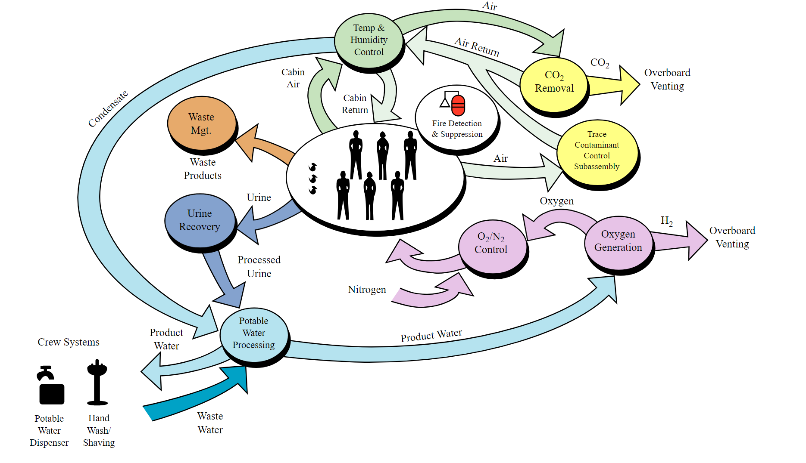

Systemy kontroli środowiskowej i podtrzymania życia
===================================================
Najistotniejszym elementem zarówno stacji kosmicznej jak i habitatu jest system kontroli środowiskowej i podtrzymania życia (ang. *ECLSS - Environmental Control and Life Support System*). W ramach elementów sterowanych przez system można wymienić:

- kontrola temperatury,
- kontrola wilgotności powietrza,
- kontrola parametrów i składu atmosfery,
- monitoring poziomu CO2,
- monitoring parametrów atmosfery z uwzględnieniem przesunięć czasowych,
- wizualizacja parametrów stanu habitatu,
- monitoring zużycia wody (szara, żółta, zielona, niebieska),
- zastosowanie algorytmów uczenia maszynowego w optymalizacji zużycia wody,
- zarządzanie odpadami ciekłymi,
- zarządzanie odpadami stałymi,
- kontrola oświetlenia.

System ECLSS jest podstawowym systemem każdego statku kosmicznego i stacji.

    System Systemy kontroli środowiskowej i podtrzymania życia na ISS. Źródło: Wikipedia

Polski wkład w szkolenie tego typu może mieć infrastruktura habitatu Lunares. Organizacja zarządzająca ośrodkiem prowadzi obecnie badania w celu stworzenia szczelnego ciśnieniowo budynku wraz z systemami wymienionymi powyżej. Rozwój kompetencji oraz urządzeń pozwoliłby na prowadzenie badań jak również na istotny wkład w uczestnictwo w przygotowaniu do przyszłych misji Księżycowych i Marsjańskich.
