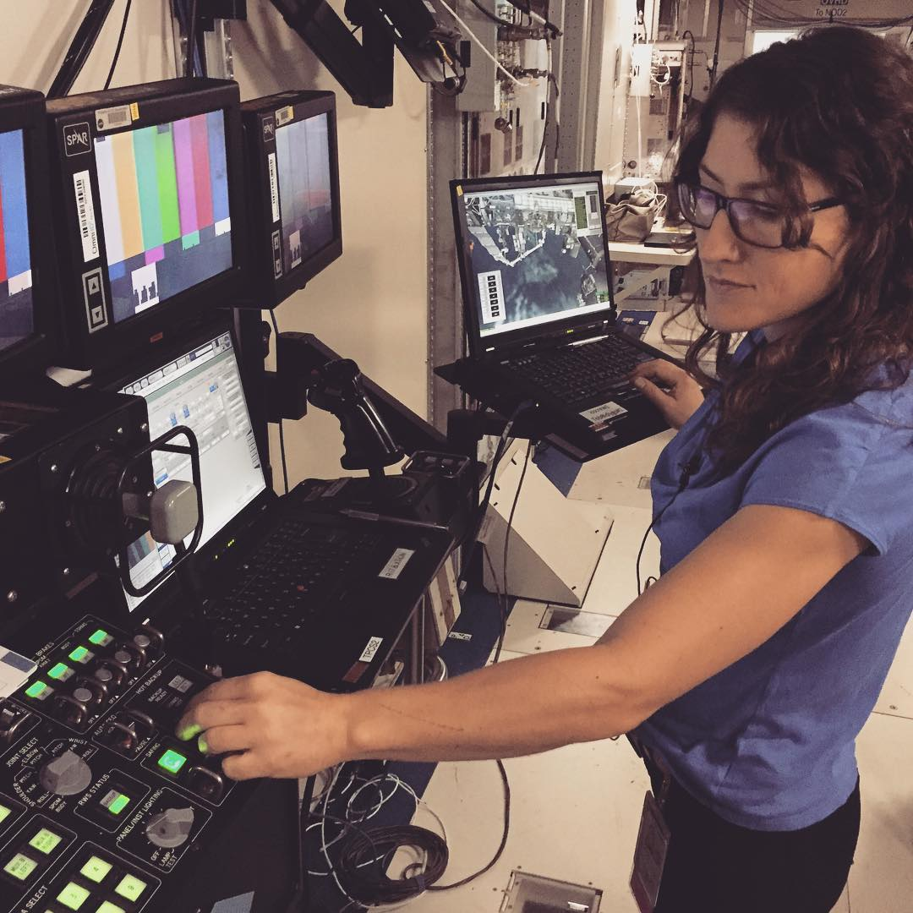

Systemy wsparcia robotycznego
=============================

Manipulator SSRMS Canadarm 2
----------------------------
Głównym urządzeniem użytym podczas konstrukcji stacji ISS jak również dla jej prawidłowego rozwoju był Manipulator SSRMS Canadarm 2. To ramię robotyczne o długości 15,25 m pozwala na manipulację siedmioma stawami (trzy w nadgarstku, trzy w barku i jedno w łokciu) ramienia i obrót o 360 stopni. Dzięki kontrolerowi wykorzystującemu technologię Force Feedback obsługujący go astronauta może zachować precyzję nawet podczas dokowania statku o masie 113,4 tony metrycznej. Ramię wyposażone jest w podstawowy system unikania kolizji (ang. *Basic Collision avoidance system*) oraz zaawansowany automatyczny system wizyjny (ang. *Advanced automatic vision system*).

    Astronautka NASA Christina M. Hammock podczas ćwiczeń systemów robotycznych. Źródło: NASA/JSC

Polska nie posiada tak zaawansowanego manipulatora. Jednakże w ramach uczelni politechnicznych w kraju znajdują się urządzenia mogące symulować część umiejętności ramienia robotycznego, a co za tym idzie możliwe jest stworzenie programu wprowadzającego to problematyki sterowania urządzeniami robotycznymi.

Łaziki oraz autonomiczne pojazdy
--------------------------------
Polska jest liderem na skalę światową w tematyce konstrukcji łazików księżycowych i marsjańskich oraz autonomicznych pojazdów. Świadczą o tym wysokie miejsca w klasyfikacji ogólnej odbywającego się co rok konkursu University Rover Challenge organizowanego przez Mars Society przy wsparciu NASA na amerykańskiej pustyni w stanie Utah. W Polsce jest również organizowany European Rover Challenge, który jest najbardziej prestiżowym konkursem w Europie. Podobnie jak w przypadku URC tak i podczas ERC konstrukcje z Polski są w czołówce, a nierzadko również wygrywają zawody.

Korzystając z unikalnych kompetencji możliwe jest stworzenie części szkolenia opierającego się o posiadane już zasoby w postaci łazików jak również planu szkolenia dla operatorów tych pojazdów.
