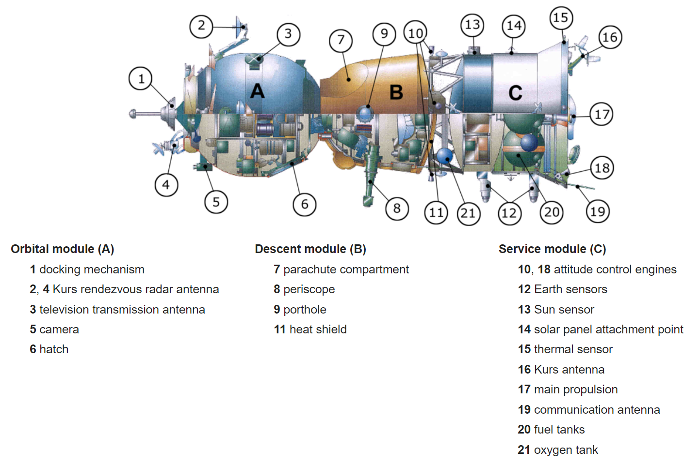

Pilotaż statku kosmicznego Sojuz
================================

Na chwilę obecną jednym z najważniejszych aspektów szkolenia astronautów przed lotem kosmicznym jest szkolenie z wykorzystywania systemów rosyjskiego statku kosmicznego Sojuz. Operacje wykonywane przez ten statek są w pełni zautomatyzowane, ale w sytuacjach awaryjnych istnieje możliwość przejścia na tzw. ręczny tryb i samodzielne przejęcie kontroli nad kapsułą. Z tego też powodu zarówno astronautów jak i kosmonautów poddaje się szkoleniu, które trwa około 790 godzin i obejmuje aspekty :cite:`Hadfield2013`:

Sytuacje normalne:

- przygotowanie do startu,
- start,
- zwiększanie orbity,
- podejście do ISS,
- manewr dokowania,
- manewr odejścia od ISS,
- obniżanie orbity,
- wejście w atmosferę,
- lądowanie.

Sytuacje awaryjne:

- rozszczelnienie,
- pożar,
- przerwanie startu,
- problemy na orbicie,
- przejście na manualne sterowanie,
- niedziałające systemy (elektryczny, podtrzymanie życia, nawigacja, sterowanie),
- kolizja,
- wejście wykorzystując profil balistyczny,
- problemy przy lądowaniu.

    Schemat statku Sojuz. Źródło: Roskosmos

Statek Sojuz wyposażony jest w system *KURS*, który pozwala na automatyczne naprowadzanie oraz dokowanie kapsuły do Międzynarodowej Stacji Kosmicznej. System ten był opracowany dla kapsuł dokujących do stacji Salut :cite:`Siddiqi2000` oraz dla stacji MIR. Obecnie system jest wypierany przez nowszy i dokładniejszy system, którego podzespoły w kapsule są znacznie lżejsze.

Ze względu na przesunięty środek ciężkości kapsuły Sojuz istnieje możliwość za pomocą niewielkich silniczków sterowania miejscem położenia tego punktu. Dzięki temu astronauci uzyskują możliwość sterowania kapsułą a zasięg korekty profilu lądowania może wynieść nawet do kilkunastu kilometrów.

Kapsuła Sojuz używa tzw. "systemu miękkiego lądowania". System ten składa się z niewielkich silniczków rakietowych z wektorem ciągu przeciwnie skierowanym do lotu kapsuły. System ten jest aktywowany na dwa metry przed uderzeniem w ziemię pozwalając na zminimalizowanie w znacznym stopniu siły uderzenia o grunt. Jego użycie powoduje charakterystyczny płomień i dym przy uderzeniu w ziemię co mylnie kojarzone jest z sytuacją niebezpieczną. Aktywacja tego systemu oraz miękkie lądowanie zostało uwiecznione na taśmach wideo [62], [26].
