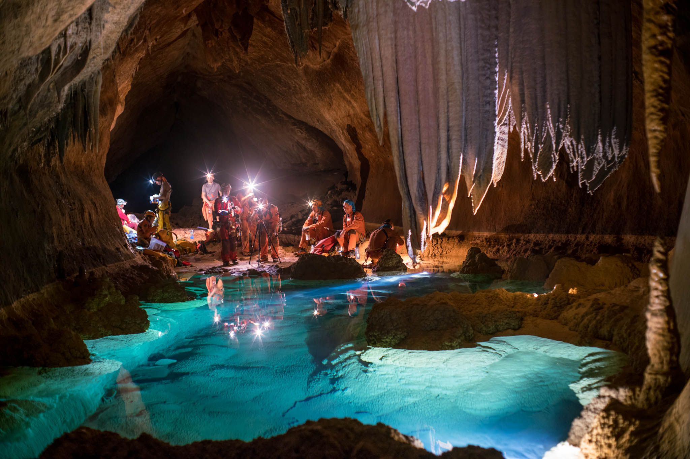

Wyprawy w ramach programu CAVES
-------------------------------
Misja CAVES (Cooperative Adventure for Valuing and Exercising human behaviour and performance Skills) jest tworem Europejskiej Agencji Kosmicznej i ma na celu zaznajomienie członków wyprawy z życiem w ekstremalnych warunkach tj. jaskinie. Podczas szkolenia astronauci różnych agencji biorą udział w mapowaniu korytarzy jaskini Sa Grutta na Sardynii we Włoszech. Ponadto uczą się dokumentowania i pobierania próbek skalnych oraz materiału mikrobiologicznego wraz z późniejszym jego zabezpieczaniem jak również identyfikowaniem minerałów.

    Astronauci Europejskiej Agencji kosmicznej podczas misji CAVES w 2016 roku do jaskini Sa Grutta na Sardynii we Włoszech. W wyprawie wzięli udział astronauci z CNSA (Ye Guangfu), Roskosmos (Sergei Vladimirovich), JAXA (Aki Hoshide), ESA (Pedro Duque) i NASA (Ricky Arnold, Jessica Muir). Źródło: ESA/V. Crobu
