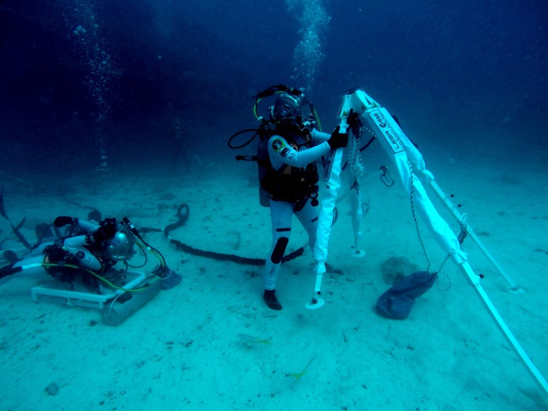

Misje NEEMO
-----------
Misje NASA Extreme Environment Mission Operations (NEEMO) organizowane są dla astronautów agencji ESA, NASA, CSA, Roskosmos i JAXA. Ośrodek Aquarius - podwodny habitat znajduje się 12 km na wschód od Key Largo na Florydzie w USA. Habitat jest położony 20 metrów pod wodą a misje w nim trwają zwykle 12 dni. W trakcie trwania misji astronauci przebywają w tzw. stanie nurkowania nasyconego (ang. *saturation diving*) i nie istnieje możliwość swobodnego wypłynięcia na powierzchnię oceanu bez konsekwencji poważnej choroby dekompresyjnej. Proces dekompresji trwa 18 godzin.

W trakcie misji używane są techniki neutralnej pływalności oraz zmniejszonej pływalności aby testować pojazdy i urządzenia przeznaczone do wykorzystywania na powierzchni innych ciał niebieskich. Przykładem takiego testu jest system Lunar Evacuation System Assembly (LESA) zaprojektowany przez Centrum Szkolenia Astronautów ESA.

.. figure:: img/survival-neemo-overview.jpg
    :name: figure-survival-neemo-overview
    :scale: 25%
    :align: center

    Astronauta NASA na tle habitatu Aquarius . Źródło: NASA/JSC

    Astronauta NASA Kjell Lindgren rozkłada Lunar Evacuation System Assembly. Źródło: ESA/EAC
