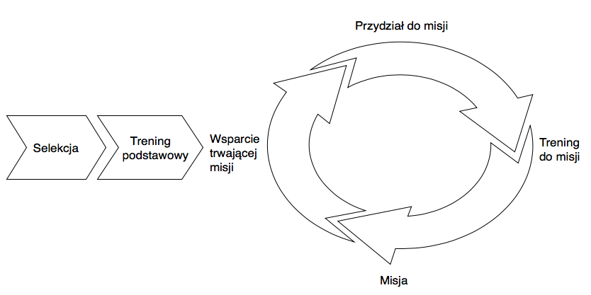

********************
Szkolenie podstawowe
********************

    I'm not a techie, I am an operator

    -- Astronaut Victor Glover :cite:`Glover2016`

Po selekcji osoba wybrana przez komisję ma za zadanie stawić się na tzw. szkolenie podstawowe. Podczas szkolenia kandydat na astronautę (ang. *ASCAN - Astronaut Candidate*) będzie przygotowany przez ekspertów oraz starszych stażem astronautów do pełnienia służby i docelowego lotu w kosmos. Szkolenie kandydackie trwa w zależności od agencji półtora do dwóch i pół roku. Po jego ukończeniu osoba ubiegająca się będzie mogła oczekiwać na przydział do misji :cite:`Gregersen2009`, a następnie szkolenie specyficzne trwające zwykle około 2 lat. Wyjątkiem jest CNSA, gdzie szkolenie podstawowe 3 lata, a szkolenie do przydzielonej misji 10 miesięcy.

Podczas szkolenia podstawowego kanadyjscy astronauci mają zajęcia z :cite:`CSAFlightTraining`, :cite:`CSAOngoingTraining`, :cite:`CSABasicTraining`:

- orientacja w strukturze organizacyjnej CSA i w działalności agencji,
- historia lotów kosmicznych,
- podstawy lotów kosmicznych,
- procedury operacyjne i kontrola lotów,
- systemy ISS,
- nauki przyrodnicze i o życiu,
- inżynieria materiałowa i dynamika płynów,
- obserwacja ziemi i wykorzystanie danych satelitarnych,
- kosmologia,
- robotyka,
- człowiek, jego zachowanie i możliwości,
- szkolenie lotnicze,
- skoki spadochronowe,
- ćwiczenia kondycyjne,
- pierwsza pomoc i pomoc krążeniowo-oddechowa,
- szkolenie językowe (głównie język rosyjski),
- korzystanie ze sprzętu fotograficznego,
- kontakt z mediami,
- szkolenie survivalowe i przetrwania.

Chociaż kanadyjscy astronauci odbywają większość szkolenia w JSC w Houston to powyższy program CSA jest reprezentacyjnym cyklem szkolenia astronautów we wszystkich agencjach. Szkolenie podstawowe astronautów we wszystkich analizowanych agencjach, dzieli się na 5 głównych części:

- przygotowanie teoretyczne i wiedza ogólna, w tym nauka języków obcych,
- szkolenie z systemów robotycznych i manipulatorów, tj. Canadarm 2,
- szkolenie z systemów Międzynarodowej Stacji Kosmicznej,
- nauka spacerów kosmicznych (ang. *EVA - ExtraVehicular Activity*),
- nauka pilotażu samolotów odrzutowych oraz statków kosmicznych.

:numref:`figure-astronaut-career-lifecycle` prezentuje cykl kariery astronauty od jego selekcji, treningu podstawowego, wsparcia obecnie trwających misji po szkolenie do przydzielonej misji (ang. *mission specific training*).

    Schemat prezentuje cykl kariery astronauty od jego selekcji, treningu podstawowego, wsparcia obecnie trwających misji po szkolenie do przydzielonej misji (ang. mission specific training).

W kolejnych rozdziałach szczegółowo omówione zostaną wszystkie z powyższych tematów.

Przygotowanie
=============
.. toctree::

    przygotowanie-wstep.rst
    przygotowanie-jezykowe.rst
    przygotowanie-naukowe.rst
    przygotowanie-inzynieryjne.rst
    przygotowanie-medyczne.rst
    przygotowanie-edukacyjne.rst
    przygotowanie-rutynowe.rst

Trening
=======
.. toctree::

    trening-wstep.rst
    trening-kondycyjny.rst
    trening-psychologiczny.rst

Survival
========
.. toctree::

    survival-wstep.rst
    survival-zimowy.rst
    survival-pustynny.rst
    survival-dzungla.rst
    survival-przywodztwo.rst
    survival-morski.rst

Misje Analogiczne
=================
.. toctree::

    analog-caves.rst
    analog-pangaea.rst
    analog-neemo.rst
    analog-mikrograwitacja.rst
