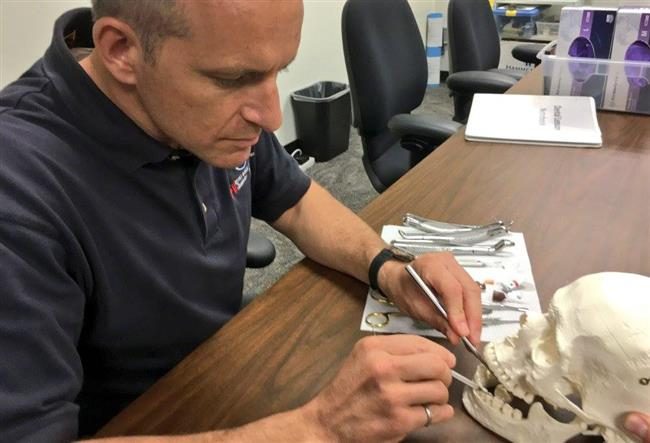

Przygotowanie medyczne i dentystyczne
-------------------------------------
Podczas pobytu na międzynarodowej stacji kosmicznej oraz w trakcie długotrwałego lotu astronauci są zdani wyłącznie na pomoc medyczną udzieloną w ramach zespołu :cite:`CSAOngoingTraining`. Operacje medyczne dotyczą nie tylko sytuacji awaryjnych tj. nagłe zatrzymanie krążenia, porażenie prądem, czy ostre stany zapalne, lecz również rutynowych zadań wykonywanych podczas badań naukowych. Do typowych czynności należą:

- pobieranie krwi (ang. *drawing blood*),
- pobieranie próbek śliny i płynów ustrojowych,
- badanie ultrasonograficzne (oczu, żył, mięśni, serca, tętnic),
- obrazowanie oczu (optyczna tomografia koherencji siatkówki) (urządzeniem ophthalmoscope),
- mierzenie ciśnienia płynu wewnątrz gałki ocznej (tonometria),
- nawilżenia skóry (kliometria),
- biopsja mięśni (przed, w trakcie i po misji),
- resuscytacja krążeniowo oddechowa (ang. *cardio-pulmonary resuscitation*),
- szycie (ang. *suture*).

Podczas lotu Jurija Romanenko w 1973 roku w ramach misji Salut 6 kosmonauta doznał bólu zęba. Ból był tak silny, że rzutował na jego sprawność podczas badań na orbicie. Kosmonauta był zmuszony czekać dwa tygodnie do czasu powrotu na Ziemię aby uzyskać pomoc dentystyczną. Od tamtego czasu wszyscy astronauci przechodzą podstawowy kurs stomatologiczny.

    Astronauta CSA David Saint-Jacques podczas kursu dentystycznego. Źródło: Canadian Space Agency
