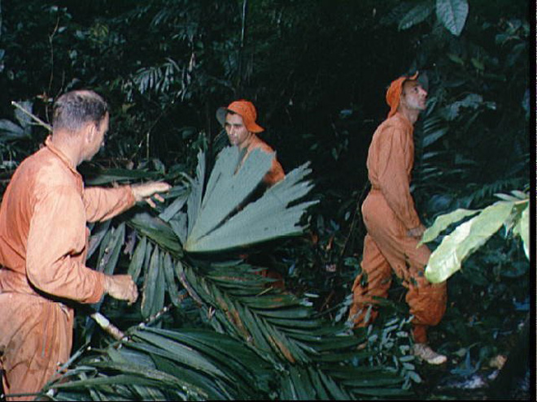

Przetrwanie w warunkach dżungli
-------------------------------
W trakcie programów Mercury, Gemini i Apollo astronauci byli transportowani do dżungli w Panamie i tam pozostawieni na kilka dni. Podczas tego okresu musieli wykorzystać umiejętności nabyte podczas wcześniejszych szkoleń, zbudować szałas oraz ochronić się przed insektami i zwierzętami. Istotnym elementem było również nawigowanie w terenie nieprzychylnym.

    Astronauci podczas szkolenia przetrwania w panamskiej dżungli. Źródło: NASA/JSC
