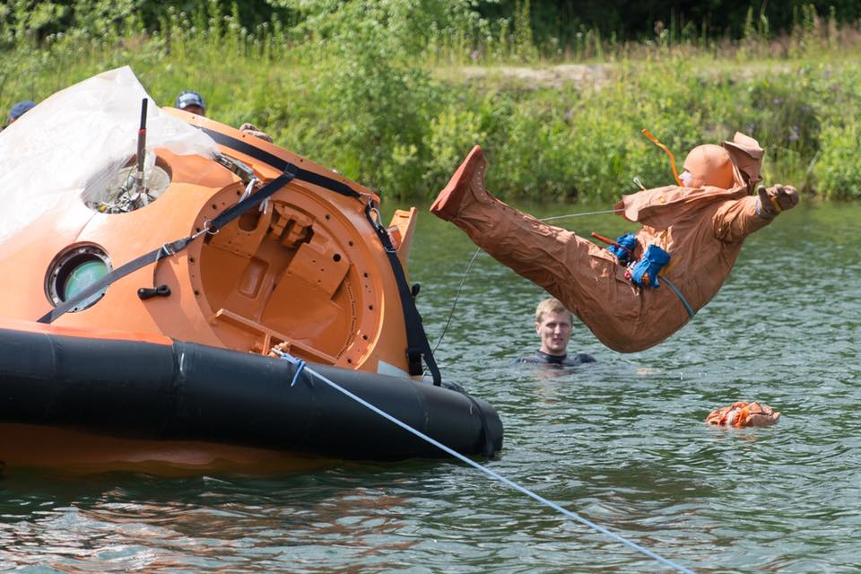

Przetrwanie w warunkach wodnych
-------------------------------
Jednym z istotniejszych elementów szkolenia przetrwania jest umiejętność przeżycia po lądowaniu na morzu. Ze względu na specyfikę lądowania, rosyjskie kapsuły lądują z założenia na lądzie, amerykańskie na wodzie, nacisk poszczególnych agencji jest różny.

Rosyjscy kosmonauci praktykują, krótkie jednodniowe szkolenie na jeziorze. W skład szkolenia wchodzi: skok ze śmigłowca (platformy imitującej wiszący śmigłowiec), procedury operacyjne po wodowaniu, umiejętność dobierania odpowiedniego stroju ochronnego w zależności od temperatury powietrza oraz wody, oraz formacje ratunkowe na powierzchni. Ponadto uczestnicy kursu uczą się rozstawiania tratwy i obsługi urządzenia do odsalania i produkcji wody pitnej. W trakcie pierwszych czterech dekad rosyjskiego programu kosmonautycznego szkolenie było przeprowadzane na morzu, a kapsuła wraz z kosmonautami była zrzucana ze statku "Apszeron" :cite:`Hermaszewski2013`.

Dla astronautów NASA szkolenie z przetrwania na morzu jest kluczowe. Ze względu na sposób lądowania kapsuły wyróżnia się lądowanie w pozycji stabilnej pierwszej lub drugiej (wyjście z kapsuły jest pod wodą). Astronauci praktykują powyższe sytuacje najpierw w basenie neutralnej pływalności a następnie na otwartym oceanie przy różnych warunkach atmosferycznych i różnym stanie morza tj. wielkość fal i siła wiatru.

    Rosyjski kosmonauta podczas szkolenia ratownictwa morskiego wykonuje skok do wody z kapsuł Soyuz. Kosmonauta jest ubrany w suchy skafander pozwalający na utrzymanie ciepła w zimnej wodzie. Źródło: Roskosmos/CPK
