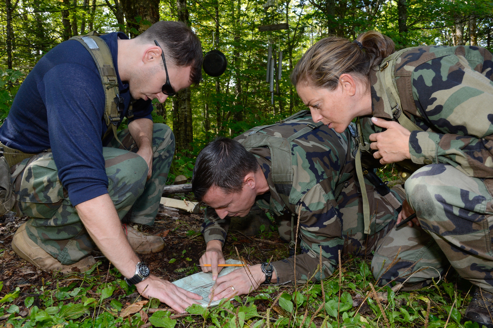

Obozy przywództwa i pracy zespołowej
------------------------------------
Obecnie program szkolenia nie przewiduje survivalu w dżungli. Podobnych umiejętności kandydaci nabywają podczas szkolenia w lesie na trzydniowym szkoleniu. Jest to jeden z pierwszych etapów szkolenia kandydackiego. Pozwala na zapoznanie członków grupy ze sobą oraz weryfikację cech kandydatów.

Istnieje również wariant łączący szkolenie przetrwania oraz obóz przywództwa i pracy zespołowej, który prowadzony jest w East Temple Peak, Wyoming, USA. Podczas szkolenia, które trwa 8 dni i 8 nocy astronauci są poddawani różnym testom, które mają zbudować ducha zespołu.

    Kandydaci na astronautów podczas szkolenia przetrwania w dziczy w Rangeley w stanie Maine, USA. Źródło: NASA/JSC
