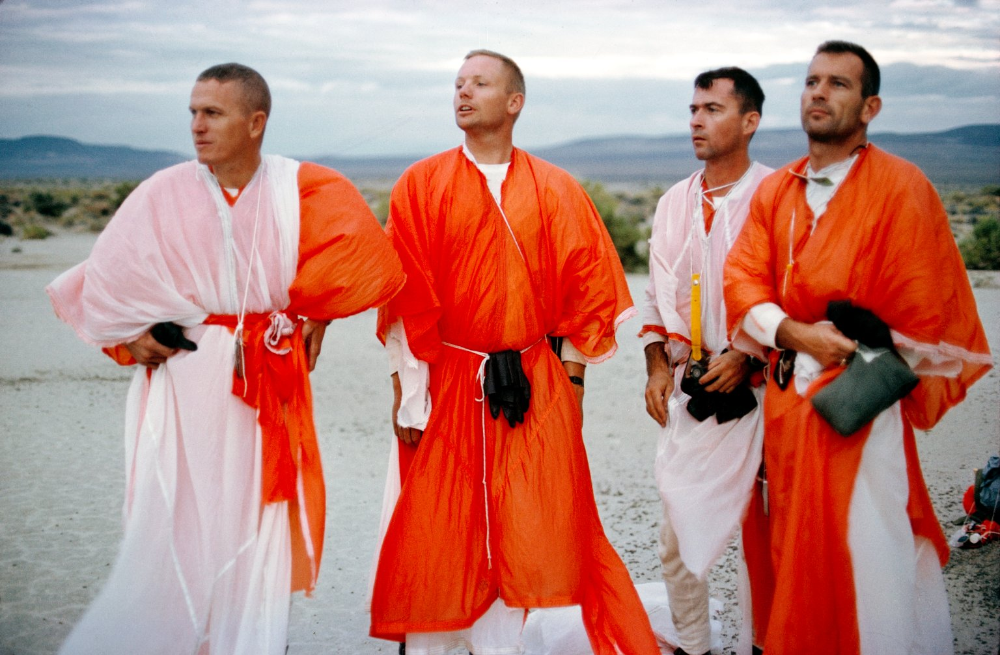

Przetrwanie w warunkach pustynnych
----------------------------------
Podczas nieprzewidzianych problemów na orbicie lub sytuacji awaryjnych lądownik po wejściu w atmosferę może wlecieć na teren pustynny i tam do czasu przybycia ekipy ratunkowej załoga statku kosmicznego musi również umieć przetrwać. Podczas szkoleń w ramach misji Mercury, Gemini, Apollo i dalszych astronauci byli po instruktarzu pozostawieni na terenach pustynnych. Podczas szkolenia musieli zaznajomić się w jaki sposób rozpalić ogień, jak złapać i przygotować węża oraz jak pozyskać wodę pitną w suchym środowisku.

.. todo:: Dopisać, że rosyjscy kosmonauci przechodzą szkolenie raz w karierze na stepach Bajkonuru

    Astronauci programu Apollo podczas szkolenia przetrwania na pustyni. Źródło: NASA/JSC
