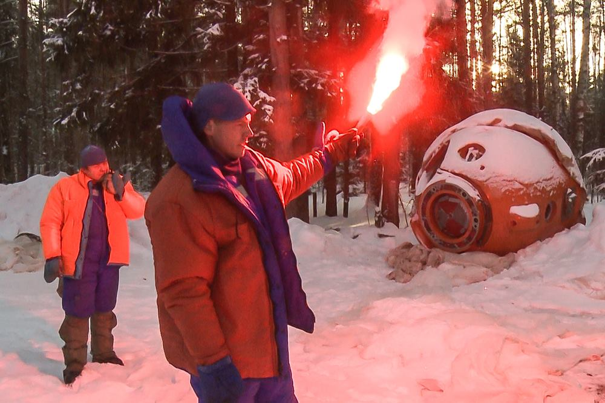

Przetrwanie w warunkach zimowych
--------------------------------
W trakcie programu kandydackiego NASA astronauci są wysyłani na dwutygodniową ekspedycję podczas, której w trudnych warunkach pogodowych wraz z realnym zagrożeniem mają przetrwać przez określony czas i dotrzeć do punktów kontrolnych. Najczęściej szkolenie zimowe odbywa się w regionach Alaski lub północnej Kanady. Do zadań astronautów należy nawigacja w zaśnieżonych górach z uwagą na lawiny, konstrukcja schronienia, organizacja pożywienia oraz wody. W zależności od szkolenia astronauci mogą być wyposażeni w narty biegowe oraz 75 kg ekwipunki, które ciągną pokonując niedostępne arktyczne tereny. Ponadto w trakcie ekspedycji członkowie zmieniają tury przywództwa dzięki czemu uczą się również komunikacji i różnych ról w zespole. Do zadań symulowanych podczas szkolenia należy również poszukiwanie ofiar lawin wykorzystując specjalny system nadajników (ang. *avalanche homing beacon and monitor*). Pierwsze dni szkolenia prowadzone są pod nadzorem instruktorów, którymi zwykle są żołnierze sił specjalnych lub przeszkoleni profesjonaliści. Po określonym czasie instruktor odłącza się od grupy a astronauci muszą przetrwać i wykorzystać nabytą wiedzę.

Każdy kosmonauta i astronauta, który za pośrednictwem statku Soyuz jest wynoszony na Międzynarodową Stację kosmiczną musi przejść szkolenie przetrwania w warunkach letnich (wodnych) oraz zimowych. Szkolenie zimowe jest przeprowadzane w lesie 15 km od Ośrodka Szkolenia Kosmonautów rosyjskiej agencji kosmicznej. Szkolenie odbywa się przy temperaturze około -20 stopni celsjusza i trwa dwa dni i dwie noce. Podczas nocy temperatura spada do -26 stopni, a kandydaci są zachęcani do budowania szałasów i rozpalania ognisk dla utrzymania ciepła. Przed szkoleniem kursanci otrzymują jednodniowe szkolenie teoretyczne i instrukcje niezbędne do przetrwania w ekstremalnych warunkach. Każdy przyszły uczestnik lotu kosmicznego bez względu na doświadczenie i liczbę odbytych dotychczasowych szkoleń survivalowych musi przejść to szkolenie. Podczas symulacji astronauci i kosmonauci uczą się jak przywdziewać w niewielkiej kabinie statku Soyuz odpowiedni zimowy strój, jak używać strzelby do odstraszania zwierząt, jak budować odpowiedni wigwam pozwalający na cyrkulację powietrza i odprowadzenie monotlenku węgla (CO). Rozpalają dwa ogniska, jedno sygnalizacyjne płonące szybko, dające dużo dymu i wysoko sięgającymi płomieniami oraz drugie w schronieniu do zapewnienia ciepła dla załogi - niewysokie, płonące wolno i niedymiące. Drugie musi być stale podtrzymywane, również w nocy. Uczestnicy szkolenia żywią się wojskowymi racjami żywnościowymi MRE (ang. *Meal Ready to Eat*), które dzięki reakcji egzotermicznej zawartych w opakowaniu substancji chemicznych podgrzewają się.

Ponadto podczas szkolenia astronauci odgrywają scenariusz pomocy osobie poszkodowanej. W tym celu jeden z astronautów pozoruje złamanie nogi a pozostali muszą udzielić pierwszej pomocy oraz przetransportować poszkodowanego do obozu a później do miejsca ewakuacji, gdzie za pomocą rac sygnalizacyjnych ściągają uwagę ekipy ratunkowej.

    Astronauci przywdziewają strój pozwalający na przetrwanie w niskich temperaturach podczas szkolenia survivalowego w zimowych warunkach w Centrum Przygotowania Kosmonautów w Gwiezdnym Miasteczku. Źródło: Roscosmos/CPK
